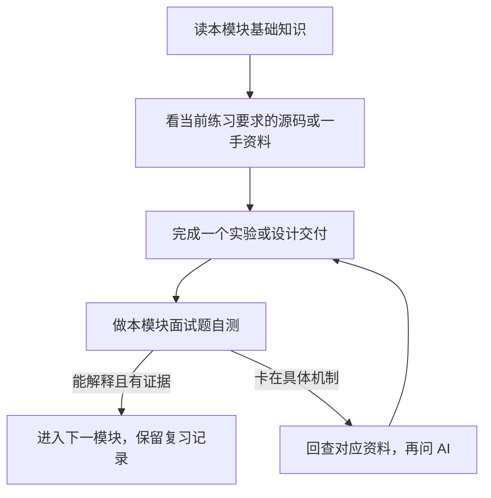

# Agent Sandbox 研发：课程与专家考核

围绕岗位的运行时、RL Rollout、Harness Engine、多 Agent 与工程研发，统一划分为 12 个模块。每个模块依次包含基础知识、资料与项目源码阅读、实验/设计练习、验收标准和面试题入口。以 Firecracker 为运行时主线，结合 E2B、OpenHands、verl 等项目学习完整执行平台。

## 从这里开始：学习教练

在 Codex 中输入：`使用 $firecracker-study-coach，告诉我现在该学哪一步。` 本地 [学习教练](/Users/zhongxuan_li/.codex/skills/firecracker-study-coach/SKILL.md) 会查看 [学习进度](learning-progress.md)，只给当前最重要的一个小任务、资料入口和完成标准。做完后回复成果；卡住时直接向 AI 问具体问题即可。

第一次从模块 01 的基础知识与边界图开始。已有经验可用源码、实验或口头推演快速验证，再跳到尚未掌握的模块。课程中的大量资料用于按需查阅，无须从头通读。

## 课程目录

| 模块 | 学习内容 | 项目阅读与实验 | 题数 | 面试与答案 |
| --- | --- | --- | --- | --- |
| [01 运行时基础与架构边界](modules/01-runtime-foundations.md) | 划分执行、控制和授权边界，检查服务器条件。 | Firecracker、containerd/runc；gVisor 架构对比 | 4 | [阅读](expert-assessment/by-module/01-runtime-foundations.md) |
| [02 镜像、启动与网络存储](modules/02-images-boot-and-io.md) | 理解镜像、启动与 I/O，逐层定位环境不可用。 | Firecracker、containerd/runc、E2B 模板与 envd | 6 | [阅读](expert-assessment/by-module/02-images-boot-and-io.md) |
| [03 生命周期、取消与长任务](modules/03-lifecycle-and-long-tasks.md) | 创建、执行、取消、恢复与回收的状态语义。 | E2B 生命周期；OpenHands 会话状态 | 4 | [阅读](expert-assessment/by-module/03-lifecycle-and-long-tasks.md) |
| [04 资源隔离、工具权限与安全](modules/04-isolation-and-capabilities.md) | 资源限制、可信授权和出站控制。 | runc、gVisor、E2B；OpenHands 工具执行边界 | 6 | [阅读](expert-assessment/by-module/04-isolation-and-capabilities.md) |
| [05 快照、恢复与 fork](modules/05-snapshots-and-fork.md) | 检查点、分支身份、兼容性与成本。 | Firecracker 快照、E2B 恢复与 fork | 6 | [阅读](expert-assessment/by-module/05-snapshots-and-fork.md) |
| [06 多 Agent、记忆、技能与产物](modules/06-agent-state-and-collaboration.md) | 协作、状态作用域、版本和产物管理。 | OpenHands SDK、Tools、Workspace、Agent Server | 6 | [阅读](expert-assessment/by-module/06-agent-state-and-collaboration.md) |
| [07 RL Rollout 与训练数据契约](modules/07-rl-rollout-contracts.md) | RL 闭环、环境接口和可追溯轨迹。 | verl Agent Loop、Gymnasium | 4 | [阅读](expert-assessment/by-module/07-rl-rollout-contracts.md) |
| [08 Harness、确定性与评测](modules/08-harness-and-evaluation.md) | 事件、回放与可信评测。 | OpenHands 事件、Harbor 任务与评测 | 5 | [阅读](expert-assessment/by-module/08-harness-and-evaluation.md) |
| [09 性能、容量与训练调度](modules/09-performance-and-scheduling.md) | 有效轨迹吞吐、排队、资源与成本。 | verl、E2B；agent-sandbox 预热池 | 5 | [阅读](expert-assessment/by-module/09-performance-and-scheduling.md) |
| [10 分布式控制面与副作用](modules/10-distributed-control-plane.md) | 节点对账、执行代次与外部副作用。 | E2B 控制面、Kubernetes agent-sandbox | 4 | [阅读](expert-assessment/by-module/10-distributed-control-plane.md) |
| [11 Go/Rust 研发与源码验证](modules/11-engineering-and-source.md) | 交付执行器，验证并发、协议和后端行为。 | Firecracker/Rust、E2B/Go；Python 框架适配 | 6 | [阅读](expert-assessment/by-module/11-engineering-and-source.md) |
| [12 技术选型、发布与生产演进](modules/12-production-and-evolution.md) | 同条件选型、版本发布、维护与演进。 | 运行时对比与整条执行链的版本管理 | 4 | [阅读](expert-assessment/by-module/12-production-and-evolution.md) |

模块 01 博客文章：[Agent-Sandbox：Firecracker 运行路径与安全边界](articles/agent-sandbox-firecracker-runtime-and-security-boundaries.md)。

项目选型博客：[Agent Sandbox 怎么选：Agent 放在哪里，底层用什么隔离？](articles/agent-sandbox-project-selection.md)。

架构与设备博客：[Firecracker 与 KVM：从 microVM 架构到 VirtIO、时钟与控制台](articles/firecracker-kvm-architecture-and-devices.md)。

共 60 道统一编号题目，另有 4 项实操与 1 道综合设计题。阅读资料中的 Firecracker 专题保留完整原理与实验细节，课程顺序和考核均以本目录为准。

## 学习顺序

1. 模块 01–04：先跑通 Firecracker 单机测试任务，用 containerd/runc 补齐容器基础，再阅读 E2B 如何管理实例。
2. 模块 05–06：用 Firecracker/E2B 学习恢复与分支，再用 OpenHands 追踪会话、工具和工作区。
3. 模块 07–08：用 verl 学习轨迹契约，用 OpenHands/Harbor 学习执行事件与评测，先做 mock 和小型本地任务。
4. 模块 09–10：验证端到端吞吐与成本，再阅读 agent-sandbox 的预热池和控制器；没有集群时先完成状态推演。
5. 模块 11–12：用 Go/Rust 交付实现，并完成选型、发布维护和综合设计。语言和测试训练贯穿前面各阶段。

## 阅读资料怎么选

课程里的外部文档和开源项目入口是参考资料库，不代表每个链接都要从头读完。每个模块按这个顺序推进：

**每个模块都要完成的主线：**读完本模块“基础知识”，按“项目源码阅读”完成它明确要求的路径或对比，做至少一项“实验与设计练习”，最后对照“验收”确认有成果。深入程度由模块目标决定；不能以浏览过链接代替完成实验或核验。

**按需阅读的资料：**“阅读资料”列表用于解释当前遇到的机制。先挑能回答当前任务的一手资料，例如 Firecracker 架构、API 或所选提交中的一个调用路径。列表里的其他资料、相邻项目和扩展源码可以先跳过；当实验遇到兼容、网络、恢复或安全问题时，再回来查对应内容。模块写明的项目对比或源码产出仍要完成，但不要求把每个项目的整套文档读完。

自测遇到不会的问题，先记下卡点，用自己的话向 AI 提问；理解后回到实验验证。进入专家自测阶段，再使用本模块完整面试题与深入追问逐项检查。

## 项目学习范围

| 项目与一手入口 | 学习深度 | 完成标志 |
| --- | --- | --- |
| [Firecracker](../../README.md) | 深入运行时与故障路径 | 真实启动、恢复和隔离实验，能追踪关键源码 |
| [E2B Runtime](https://github.com/e2b-dev/runtime)（原 infra） | 深入生命周期与快照链路 | 画出 API → 节点编排 → Firecracker → envd 的调用链，解释中断与清理 |
| [OpenHands Software Agent SDK](https://github.com/OpenHands/software-agent-sdk) | 深入会话、工具和事件 | 追踪一次工具执行，验证取消、持久状态及协作产物 |
| [verl Agent Loop](https://verl.readthedocs.io/en/latest/advance/agent_loop.html) | 深入 Rollout 接口，理解训练衔接 | 保留原始生成记录、工具观测、结束原因、版本与重试信息 |
| [containerd](https://github.com/containerd/containerd) / [runc](https://github.com/opencontainers/runc) | 基础机制与关键路径 | 解释镜像、文件系统快照、任务进程、OCI 配置与资源回收 |
| [gVisor](https://gvisor.dev/docs/architecture_guide/intro/) | 架构对比与小实验 | 按相同负载比较隔离边界、兼容性与开销 |
| [Harbor](https://github.com/harbor-framework/harbor) | 任务、评测和结果接口 | 本地运行小型自制用例，核查评分边界与失败口径 |
| [Kubernetes agent-sandbox](https://github.com/kubernetes-sigs/agent-sandbox) | 到集群阶段再深入 | 解释 Sandbox/Claim/Template/WarmPool 与控制器对账，验证重复领取和回收 |

每个模块均给出本次要读的组件、练习与交付证据。外部资料核对日期为 2026-09-24；开始实验时选择 tag/提交并记录，在线 main 与 latest 仅作导航。项目代码可能未实现课程要求的全部保证，阅读时要区分已有行为、限制和自己的扩展设计。

Go 或 Rust 选一门作为主要实现语言；Python 达到能阅读和修改 OpenHands/verl 适配层、处理异步取消、编写测试的程度。[Python 异步任务资料](https://docs.python.org/3/library/asyncio-task.html)可与模块 03、07、11 同步学习。

## 贯穿课程的实现

逐步实现一个最小任务/rollout 执行器。项目之间的连接是课程设计练习，需要核对各自版本与适配接口，不假定它们安装后自动互通。

| 阶段 | 在同一执行器上增加的能力 | 本地交付证据 |
| --- | --- | --- |
| 01–04 | 环境创建、命令执行、有界输出、取消与可信权限检查 | 调用链、状态机、失败与回收记录 |
| 05–06 | 检查点/分支契约、工作区版本与 Agent 会话关联 | 状态清单、分支隔离、取消与产物版本记录 |
| 07–08 | mock 推理与环境适配、轨迹、事件回放、小型评测 | token/观测对齐、结束分类、回放与评分测试 |
| 09–10 | 有界队列、背压、预热策略、节点对账 | 吞吐与资源账单、故障时序；真实/模拟环境标注 |
| 11–12 | Go/Rust 工程交付、跨语言协议、兼容与发布 | E04 实现、S01 设计、测试与未验证项 |

macOS 先完成源码阅读、Go/Rust worker 和轻量 mock；Linux 承担真实 KVM/容器实验。没有 GPU 时，用固定生成 fixture 验证轨迹与调度合同，将真实模型训练及收敛验证保留为后续阶段。没有 Kubernetes 时完成控制器伪代码与事件推演，不把模拟结果当作集群验证。

## 面试与考核入口

所有题目、答案、实操、综合设计与评分材料统一维护在 `expert-assessment/by-module/`。

- [面试文档总目录](expert-assessment/by-module/README.md)：12 份模块题目与答案，以及实操、综合设计和评分入口。

共 60 道主问题与 60 道带答案的深入追问，另有 4 项实操和 1 道综合设计题。统一总分为 100 分，具体权重与使用方法见目录内的考核说明。

## 环境与岗位范围

macOS 用于阅读、源码分析、设计和本地 mock；Linux 用于真实容器或 KVM/microVM 实验。服务器架构、权限、版本与资源条件仍需在实验前确认；本次没有连接服务器或发送文件。

岗位允许 MicroVM 或容器、Go 或 Rust。通用题接受适合场景的实现；额外声称精通 Firecracker 时，应提供相应源码和真实 microVM 证据。RL 部分重点是基础闭环、轨迹与环境语义，Harness 在这里指执行编排、事件、回放与评测，其接口仍需与具体团队约定。

学习项目贯穿全部模块：一个可取消、可记录与回放的任务/rollout 执行器，逐步加入权限、分支、协作、评测与资源调度。先使用可信任务与虚构工具服务，所有实验材料只保存在本地。

## 技术资料

本地 Firecracker 参考提交为 `30471852666564d980f330d0575115eda7d5ce8e`。运行实验按所选版本核对 [入门文档](../../docs/getting-started.md)、[API](../../src/firecracker/swagger/firecracker.yaml) 和 [内核策略](../../docs/kernel-policy.md)。训练接口可参考 [Gymnasium](https://gymnasium.farama.org/api/env/) 与 [verl Agent Loop](https://verl.readthedocs.io/en/latest/advance/agent_loop.html)，这些资料是机制依据，不代表必须采用某个框架。

深入阅读见 [专题资料索引](references/README.md)。
