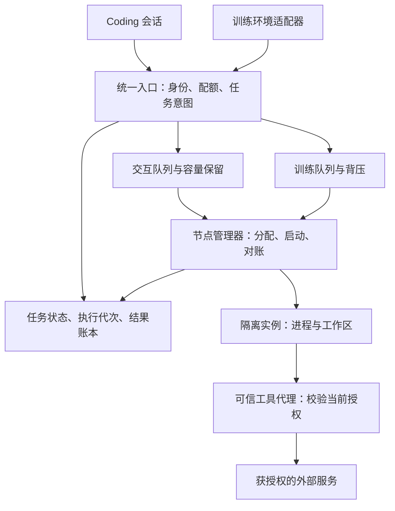
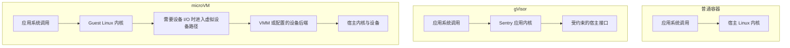
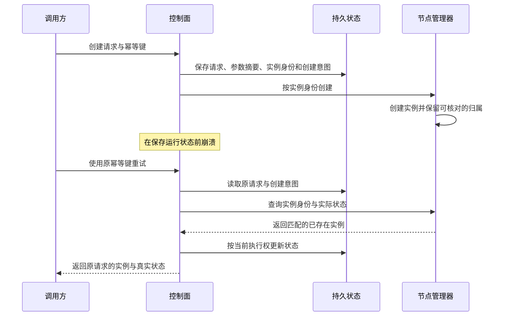
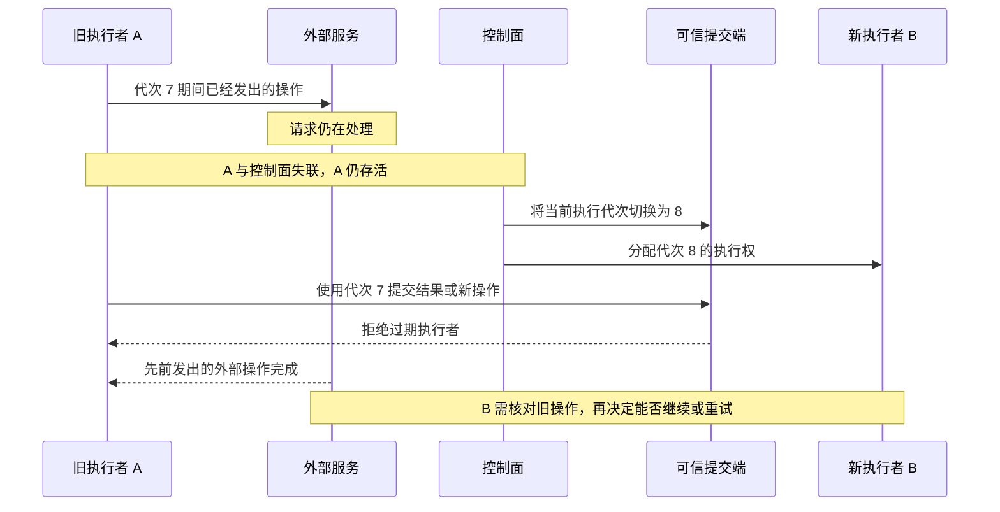
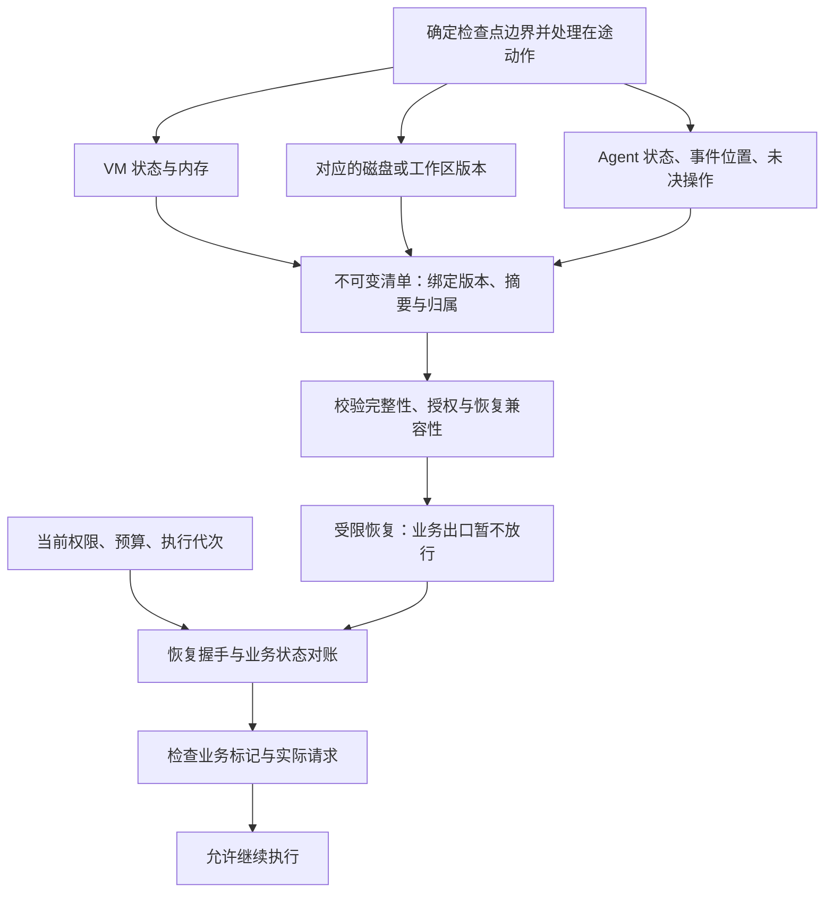

# Agent Sandbox 能力评审问答

围绕业务价值、可靠性与执行正确性、性能与成本，共 12 道主问题。答案按口述组织，追问继续补足机制、边界与取舍。架构是平台设计示例；实验是待执行的验证方案，不代表已有生产结论。真实项目经历与收益需使用自己的代码、记录和数据。

| 维度 | 问题 |
| --- | --- |
| 业务价值 | [01 业务瓶颈](#q01) · [02 两类负载](#q02) · [03 隔离选型](#q03) |
| 可靠性与执行正确性 | [04 创建结果未知](#q04) · [05 旧节点仍在执行](#q05) · [06 取消竞态](#q06) · [07 快照恢复](#q07) · [08 资源隔离](#q08) |
| 性能与成本 | [09 延迟口径](#q09) · [10 容量计算](#q10) · [11 瓶颈定位](#q11) · [12 预热收益](#q12) |

<a id="q01"></a>

## 01｜业务价值：最有价值的能力解决了什么瓶颈

**问题：**你做过最有业务价值的一项 Sandbox 能力是什么？具体解决了什么技术瓶颈？

**请指出关键代码或画出时序，并告诉我你用什么实验验证过。**

**口述回答：**

拿“长时间编程任务等待用户后继续”这个场景举例，业务需要保住工作区、已经完成的步骤和待处理动作，同时控制等待期间的资源成本。我会先确认原来的失败到底来自进程退出、文件丢失、会话状态缺失，还是权限过期，再选择对应机制。

我的设计会把任务记录、持久工作区和临时执行实例分开。恢复时重新建立执行权，核对检查点与已提交步骤，并按当前权限继续。收益用任务继续成功率、重跑比例、等待后的恢复时间和单位完成任务成本衡量。只有对照数据证明改善，我才把它记为业务收益。

**追问 01.1：**如果上线期间模型也升级了，怎么证明收益来自 Sandbox？

**请指出关键代码或画出时序，并告诉我你用什么实验验证过。**

**答：**我会分两层验证。先固定工具动作、输入、环境和预算，只比较平台执行链；再固定模型版本与采样设置，重复运行完整业务。后者仍有随机性，需要足够样本和分组结果。若模型、任务难度和平台同时变化，就不能把整体成功率提升全部归给平台。

**追问 01.2：**平台执行成功和 Agent 完成任务，有什么区别？

**请指出关键代码或画出时序，并告诉我你用什么实验验证过。**

**答：**平台执行成功指环境按约定运行了动作，并返回可信的结果；Agent 完成任务还取决于规划、生成代码和业务验收。测试命令返回非零退出码，可以是正确执行后的业务失败。我会同时保留完整任务结果与失败归因，不能把不利样本移出分母来抬高平台成功率。

**追问 01.3：**如果底层用的是开源项目，怎么说明自己的技术贡献？

**请指出关键代码或画出时序，并告诉我你用什么实验验证过。**

**答：**我会明确上游已经提供什么，以及业务还缺什么。例如上游提供 VM 快照，我补齐了检查点与工作区版本绑定、恢复时权限校验和未决操作对账。贡献要落到自己的改动、失败样例和验收结果；单纯接入也有价值，但要按实际复杂度和收益陈述。

**追问 01.4：**长任务一定需要内存快照吗？

**请指出关键代码或画出时序，并告诉我你用什么实验验证过。**

**答：**先看必须保留哪些状态。如果文件和步骤记录足以重建任务，持久工作区加冷启动可能更简单；如果依赖昂贵的进程初始化或难以重建的内存状态，才评估内存快照。快照还会增加一致性、兼容性、存储和权限恢复成本，要和重建方案一起比较。

**追问 01.5：**业务希望“永远不丢任务”，你怎么把它变成能实现的技术要求？

**请指出关键代码或画出时序，并告诉我你用什么实验验证过。**

**答：**我会拆成已受理请求是否持久保存、哪些步骤可以重试、最多允许丢失多少执行进度，以及故障后多久恢复。任务记录不丢，不等于进程内存不丢，也不等于外部操作能够无损重放。每项承诺都要绑定故障范围和验证方式。

**追问 01.6：**没有真实生产数据时，这题应该怎么回答？

**请指出关键代码或画出时序，并告诉我你用什么实验验证过。**

**答：**我会把结论说到证据支持的位置：设计完成、模拟验证、真实运行时验证或生产运行，分别讲清楚。可以展示固定负载下的对照实验和故障测试，但业务规模、稳定性与节省金额都保留为待验证，不把预计收益说成已经实现。

**代码与实验：**沿提交、创建、执行、保存结果、恢复五个入口查看改动；用同一组长任务分别运行旧方案与新方案，注入等待、断线和管理器重启，核对继续成功率、重跑与资源账单。平台状态划分可对照[执行平台设计](references/execution-platform-design.md)。

<a id="q02"></a>

## 02｜业务价值：长会话与训练任务如何共用平台

**问题：**同一个平台要支持长时间 Coding Agent 会话和大量短周期训练任务，你会怎样设计？

**请指出关键代码或画出时序，并告诉我你用什么实验验证过。**

**口述回答：**

我会共用身份、环境模板、执行接口、权限检查和资源计量，把差异放进明确的生命周期与调度策略。编程会话需要保留工作区和交互状态，关注用户操作的等待时间；训练任务强调环境重置、轨迹完整性和单位时间的有效产出。

调度上分别设置队列、并发预算与容量保留。训练任务可以使用适合回收的容量，但不能无界挤占交互资源。执行器统一返回动作结果和环境错误，业务适配层再解释会话或训练语义。共用平台不要求所有任务使用同一实例规格或同一个资源池。



**追问 02.1：**为什么不能所有任务放在一个 FIFO 队列里？

**请指出关键代码或画出时序，并告诉我你用什么实验验证过。**

**答：**大量训练请求会让后来的交互请求排很久，而仅提高交互优先级也无法立即收回已占用的资源。我会结合独立队列、并发上限和容量保留；对允许中断的任务定义检查点或重试规则。是否拆成独立池，要看资源争用和隔离收益是否覆盖闲置成本。

**追问 02.2：**Agent 大部分时间在等模型，为什么还会占用大量资源？

**请指出关键代码或画出时序，并告诉我你用什么实验验证过。**

**答：**等待通常减少 CPU 消耗，但进程内存、工作区、连接和后台服务可能仍然存在。仅暂停 vCPU 不代表释放宿主内存；平台级“暂停”是否释放资源，要看它是否保存状态并退出实例。我会按等待时长与恢复成本选择保留、应用重建或快照卸载。

**追问 02.3：**为了提高吞吐，一个实例能连续服务多个训练任务吗？

**请指出关键代码或画出时序，并告诉我你用什么实验验证过。**

**答：**可以评估，但必须明确重置保证。残留进程、文件、缓存、环境变量、凭证、网络状态和应用内存都可能影响下一次任务。删除工作目录只能清除其中一部分。对于互不信任的租户或无法可靠重置的环境，我会重新创建隔离实例；可复用的通用模板不包含租户秘密。

**追问 02.4：**训练环境超时、正常结束和基础设施故障，能统一返回零奖励吗？

**请指出关键代码或画出时序，并告诉我你用什么实验验证过。**

**答：**不能由执行平台擅自合并。正常结束、预算截断和环境故障表达不同事实，训练方要据此决定是否接纳样本及如何计算奖励。我会保存失败阶段、重试关系、策略与环境版本，让算法侧按约定处理，避免基础设施问题被误学成任务失败。

**追问 02.5：**训练请求突然翻倍，靠自动扩容能及时保护交互任务吗？

**请指出关键代码或画出时序，并告诉我你用什么实验验证过。**

**答：**扩容有启动和准备延迟，不能替代准入控制。我会先限制训练并发与排队长度，保住交互容量，再按等待时间、有效吞吐和资源压力扩容。扩容无效时明确拒绝或延后任务，不能无限接收后继续承诺低延迟。

**追问 02.6：**如果要从同一任务状态派生多个分支，平台还要增加什么？

**请指出关键代码或画出时序，并告诉我你用什么实验验证过。**

**答：**要定义检查点包含哪些状态，以及每个分支独立的身份、可写工作区、权限和预算。共享内容应当明确不可变；在途外部操作不能直接复制成多个独立事实。还要绑定对话前缀、环境与随机探索条件，才能说明这些分支具有可比较的起点。

**追问 02.7：**Agent 进程放在沙箱里，和只把工具执行放在沙箱里，会改变什么？

**请指出关键代码或画出时序，并告诉我你用什么实验验证过。**

**答：**前者把 Agent 进程、依赖和本地状态一起纳入运行环境，后者由外部服务保留控制循环。两者都可以支持长会话，区别在状态保存与故障恢复由谁负责。当前权限、配额和高权限工具检查都要在可信端落实，不能交给不可信任务自行决定。

**代码与实验：**核对任务协议、队列准入、实例重置和轨迹适配器；交替运行带有不同私有标记的任务检测残留，再用固定的交互与训练混合负载制造突发请求，观察排队、拒绝、资源争用和轨迹完整性。训练合同可对照[模块 07](modules/07-rl-rollout-contracts.md)。


<a id="q03"></a>

## 03｜业务价值：隔离方案为什么适合当前业务

**问题：**你为什么选择当前的隔离方案？换成其他方案，哪些业务能力和指标会受影响？

**请指出关键代码或画出时序，并告诉我你用什么实验验证过。**

**口述回答：**

我会先明确任务是否互不信任、需要哪些 Linux 行为、是否依赖特殊设备，以及长会话和恢复要求。普通容器的应用直接使用宿主内核；gVisor 由用户态应用内核处理系统调用；microVM 中的应用使用独立客户机内核，设备访问再经过虚拟化路径。它们的隔离边界与兼容成本不同。

选型要用同一组真实负载验证：依赖能否安装、构建和浏览器能否运行、I/O 与网络是否满足要求，以及启动、恢复和资源成本。Firecracker 提供 VMM 能力，集群调度、业务授权和工作区管理仍要由平台实现。我会把选择绑定到这些条件，并说明什么变化会促使重新评估。



图只突出系统调用和设备 I/O 的边界。CPU 虚拟化由 KVM 与硬件等机制参与；管理 API 不在每次应用系统调用的路径中。

**追问 03.1：**容器有 namespace、cgroup 和 seccomp，为什么还要考虑额外隔离？

**请指出关键代码或画出时序，并告诉我你用什么实验验证过。**

**答：**这些机制分别限制可见资源、资源用量和可用系统调用，但应用仍共享宿主内核。需要承载互不信任的任意代码时，我会进一步评估暴露的内核接口、宿主加固和故障影响范围。是否增加应用内核或 VM 边界，应由威胁模型与实际兼容、成本共同决定。

**追问 03.2：**microVM 里的每次系统调用都会退出到 Firecracker 吗？

**请指出关键代码或画出时序，并告诉我你用什么实验验证过。**

**答：**不会。应用进入 Guest 内核处理普通系统调用，只有特定虚拟化事件或设备交互才需要相应的退出与处理路径。文件写入可能先进入 Guest 页缓存，之后再通过块设备提交；不能把一次 write 简化成一次 Firecracker API 调用。

**追问 03.3：**gVisor 使用 KVM 时，它是不是就变成了普通虚拟机？

**请指出关键代码或画出时序，并告诉我你用什么实验验证过。**

**答：**不能按“使用 KVM”直接判断。gVisor 的核心仍是 Sentry 对 Linux 接口的实现；KVM 可以用于它的隔离与拦截机制，不意味着它运行了一套常规 Guest Linux。系统调用是否受支持，要看 Sentry 的实现与配置。[gVisor 架构说明](https://gvisor.dev/docs/architecture_guide/intro/)

**追问 03.4：**用了 Firecracker，为什么还需要 jailer 和宿主网络策略？

**请指出关键代码或画出时序，并告诉我你用什么实验验证过。**

**答：**VM 边界之外，VMM 本身也是宿主进程，需要降权和限制可访问资源。jailer、seccomp 等缩小这部分权限与攻击面；允许访问哪些网络目标，则要在宿主或可信网络代理中强制执行。VMM 的 I/O 限速与业务访问授权解决的是不同问题。[Firecracker 设计](../../docs/design.md)

**追问 03.5：**隔离已经很强，Agent 还可能读到另一个租户的数据吗？

**请指出关键代码或画出时序，并告诉我你用什么实验验证过。**

**答：**可能。如果可信代理拿着高权限凭证，却接受任务传来的任意租户 ID，就会在没有逃逸的情况下越权。代理必须把可信调用者与目标对象、参数、操作范围和当前授权绑定；缓存、日志和产物读取也要保留租户作用域。

**追问 03.6：**业务需要容器构建、浏览器或特殊硬件时，怎么判断兼容性？

**请指出关键代码或画出时序，并告诉我你用什么实验验证过。**

**答：**先列出实际依赖的系统调用、权限、文件系统、内核功能和设备接口，再在候选运行时中跑完整任务。发现不兼容时评估更换工具、受限远程能力或其他后端。不能为了跑通就给不可信任务开放宿主高权限；设备支持也不能从“它是 VM”推断出来。

**追问 03.7：**怎么做公平的运行时对比？

**请指出关键代码或画出时序，并告诉我你用什么实验验证过。**

**答：**先筛掉不满足业务与隔离要求的方案，再固定硬件、任务、依赖、网络策略和资源预算，分别测冷启动、热路径、I/O 与长会话。共享缓存、预热资源和辅助进程都纳入成本。不同方案可以采用各自合理优化，但必须公开配置并满足相同的验收条件。

**代码与实验：**本地 Firecracker 基准为提交 `30471852666564d980f330d0575115eda7d5ce8e`。可核对 [vCPU 执行循环](../../src/vmm/src/vstate/vcpu.rs)中的 run_emulation、[VMM 设计](../../docs/design.md)与 [jailer](../../docs/jailer.md)。选文件读写、依赖安装、网络请求和长任务做同条件实验，记录兼容失败和资源开销，避免用项目宣传数字代替自己的测量。

<a id="q04"></a>

## 04｜可靠性：实例启动了，运行状态却没保存

**问题：**Sandbox 已经启动，但管理器在写入“运行中”状态之前崩溃，客户端又重试了。你怎么处理？

**请指出关键代码或画出时序，并告诉我你用什么实验验证过。**

**口述回答：**

我会在产生创建副作用之前，先保存请求的稳定身份、参数、目标实例和创建意图。节点也要能按这个实例身份查询与重复处理创建。客户端重试先找到原请求，再核对实际资源，不能把超时当作没有执行。

恢复时，实例存在且身份匹配就继续接管；确认没有创建才补建；部分创建则继续或清理。无法确认时保留待核对状态，并限制后续动作。数据库记录、节点实际资源和执行权需要持续对账，因为进程启动与数据库提交不是一个原子操作。



**追问 04.1：**把创建操作放进数据库事务，能不能解决这个窗口？

**请指出关键代码或画出时序，并告诉我你用什么实验验证过。**

**答：**数据库事务只能原子提交它管理的记录，通常不能同时提交一个宿主进程、网络设备和外部存储对象。事务中持久保存意图有用，但仍需要资源身份、幂等操作和对账来处理事务外的副作用。长期持有数据库锁等待远程启动，还会放大阻塞。

**追问 04.2：**幂等键应该怎么设计？同一个键提交不同参数怎么办？

**请指出关键代码或画出时序，并告诉我你用什么实验验证过。**

**答：**键应绑定可信租户与具体操作，并保存规范化后的参数摘要和稳定结果。同键同参数返回原请求状态，同键不同参数返回冲突。参数默认值与协议版本要明确；保留期应覆盖允许重试的窗口，过期后的行为也必须约定，避免旧请求重新产生副作用。

**追问 04.3：**两个控制器同时处理同一个创建意图，怎么防止各自启动一台？

**请指出关键代码或画出时序，并告诉我你用什么实验验证过。**

**答：**状态存储用唯一约束与条件更新决定当前执行者，节点按稳定实例身份实现重复创建的查询与复用。控制器拿到旧任务也不能绕过节点执行权检查。仅在 API 入口加锁不够，因为锁释放或租约过期后，先前发出的请求仍可能在执行。

**追问 04.4：**记录中的 PID 还存在，能直接接管吗？

**请指出关键代码或画出时序，并告诉我你用什么实验验证过。**

**答：**PID 可能被复用。我会结合进程启动身份、实例专属目录、受控配置、cgroup 和节点启动代次确认归属；需要时使用能稳定引用进程的机制。不能证明属于该实例时，既不能接管，也不能为了清理而直接杀掉它。

**追问 04.5：**节点一直联系不上，是不是永远不能恢复任务？

**请指出关键代码或画出时序，并告诉我你用什么实验验证过。**

**答：**要按操作性质决定。如果能先隔离旧执行者，并阻止旧结果与新的外部写入，可以用新代次恢复；如果存在无法确认的不可幂等外部操作，就需要查询或保留结果不确定。可用性与重复副作用风险之间必须有明确合同，网络超时本身不能证明旧任务已经停止。

**追问 04.6：**任务写入数据库成功，但消息没有进入队列，怎么办？

**请指出关键代码或画出时序，并告诉我你用什么实验验证过。**

**答：**可以在同一数据库事务中保存任务和待投递事件，再由投递器重试入队，也就是事务 outbox 思路。消息可能重复，消费者仍要幂等处理。这样解决的是可靠投递，不会自动解决节点启动和外部 API 调用的原子性。

**追问 04.7：**什么时候可以把实例报告为 Ready？孤儿资源什么时候能删除？

**请指出关键代码或画出时序，并告诉我你用什么实验验证过。**

**答：**Ready 应对应承诺的使用条件，例如执行代理能处理请求、所需工作区已挂载，而不是仅看到进程存在。删除孤儿资源前要确认归属、当前任务意图和执行权；TTL 只是触发核对的条件。清理应可重试，并避免与迟到的创建请求或仍有效任务竞争。

**代码与实验：**在平台实现中定位创建入口、请求与实例记录、节点创建去重和对账器；分别在“保存意图后”“启动实例后”“结果保存后”中断管理器，并重复请求。检查实例数量、归属、最终状态与清理记录。这里的幂等与对账属于平台能力，不能从 Firecracker 的启动 API 推断出来。


<a id="q05"></a>

## 05｜可靠性：节点失联后，旧任务仍在执行

**问题：**节点 A 失联，平台把任务交给节点 B，但 A 实际还在执行。如何保证结果正确？

**请指出关键代码或画出时序，并告诉我你用什么实验验证过。**

**口述回答：**

失联只说明暂时不能通信，不能证明进程已经停止。我会给每次有效执行分配递增代次，状态更新、结果提交和可信工具代理都校验当前代次，让旧执行者不能继续提交新的有效结果或受理新的高权限操作。

已经发往外部系统的请求另有边界。如果下游支持幂等键或结果查询，就围绕同一个业务操作身份对账；如果不支持，可能出现“已执行但结果未知”，此时不能直接重试并承诺恰好一次。我会保存不确定状态，限制依赖它的后续步骤，再按业务约定核对或补偿。



图中的代次校验保护可信端；它不能撤销已经被外部服务受理的操作。

**追问 05.1：**有分布式锁和租约，为什么还需要执行代次？

**请指出关键代码或画出时序，并告诉我你用什么实验验证过。**

**答：**锁和租约决定谁现在有权执行，但旧执行者可能因暂停或网络分区没有及时感知失效。执行代次要传到真正接收写入的一方，由对方拒绝旧请求。若接收方完全不检查执行权，控制器里的锁无法约束已经发出的工作。

**追问 05.2：**执行代次应该在哪里检查？在调度器检查一次够吗？

**请指出关键代码或画出时序，并告诉我你用什么实验验证过。**

**答：**不够。我会在状态条件更新、结果提交以及实际工具受理点检查，并让检查与受保护的写入有明确原子顺序，例如在同一事务里比较当前代次并提交。校验端要能观察到已生效的代次切换，不能依赖过期缓存；所有受保护操作都必须经过这些检查，存在直连旁路时保证就不成立。

**追问 05.3：**工具代理先记“即将执行”，然后调用外部 API，就能保证恰好一次吗？

**请指出关键代码或画出时序，并告诉我你用什么实验验证过。**

**答：**仍不能。代理可能在外部操作成功后、保存结果前崩溃，恢复时只看到执行意图。意图记录帮助发现未决操作，却不能证明外部效果有没有发生。要加强保证，需要下游幂等、可靠查询或双方可协调的事务；否则必须保留不确定结果。

**追问 05.4：**下游支持幂等键时，重试要不要生成新键？

**请指出关键代码或画出时序，并告诉我你用什么实验验证过。**

**答：**同一个逻辑业务操作的重试应复用原键，并绑定相同目标与参数。执行 attempt 可以变化，业务操作身份不应因此变化。还要核对下游键的作用域、有效期、并发行为和不同参数的冲突处理，超过其保证窗口后不能继续假定重复调用安全。

**追问 05.5：**用户撤权发生在代理检查之后、请求发出之前，怎么定义结果？

**请指出关键代码或画出时序，并告诉我你用什么实验验证过。**

**答：**我会明确授权与执行受理的排序点，在可信端依据当前权限登记本次派发。撤权对之后受理的操作生效；已经受理的在途操作能否终止，要看执行协议和下游能力。反复读取权限布尔值只能缩小窗口，不能凭空让跨系统操作原子化。

**追问 05.6：**旧节点重新连上后，你会直接杀掉上面的所有实例吗？

**请指出关键代码或画出时序，并告诉我你用什么实验验证过。**

**答：**先按实例身份和代次对账。仍有效的实例可以接管，已经被替代的执行者需要停止并回收，结果按当前提交规则处理。清理只能针对确认归属的资源，还要避免旧记录中的 PID 或路径指向后来创建的新实例。

**追问 05.7：**结果未知应该怎么展示？是不是整个任务都必须永久卡住？

**请指出关键代码或画出时序，并告诉我你用什么实验验证过。**

**答：**我会展示具体哪次操作未知、已确认的事实和允许的下一步。只阻止依赖这个未决结果、可能造成重复副作用的步骤；独立且安全的步骤可以按合同继续。核对、超时处置和补偿都保留记录，不能把未知自动改成成功或失败。

**代码与实验：**核对执行权更新事务、结果提交条件和工具代理的受理点；用两个执行者与虚构外部服务模拟分区，在“外部受理后、结果落库前”中断代理。分别验证旧结果被拒绝、下游幂等去重，以及不支持幂等时确实进入未知状态。本地模拟只能证明协议推演，真实分区与节点接管仍需独立验证。

<a id="q06"></a>

## 06｜可靠性：取消、完成与清理同时发生

**问题：**用户取消任务时，命令已经完成，但结果还没返回。最终应该显示什么？

**请指出关键代码或画出时序，并告诉我你用什么实验验证过。**

**口述回答：**

我会先约定完成与取消的竞争规则。例如，完成先成功提交就保持完成；取消先被持久受理，就禁止新增步骤，进入停止流程，之后到达的结果作为执行事实保留，不覆盖取消意图。这是可选的一种合同，关键是顺序明确、所有入口一致。

取消受理、进程停止和资源回收是不同状态。我会处理整组任务进程，确认停止后再报告相应结果；清理失败单独记录和重试。已经发生的外部操作仍然有效，用户可以看到“后续执行已取消，已有操作已经生效”。

| 事件顺序 | 这份示例合同的处理 |
| --- | --- |
| 完成提交先成功，取消随后到达 | 保持完成，取消返回已终止状态 |
| 取消先被受理，执行结果随后到达 | 停止后续执行，保存迟到结果与已有影响 |
| 任务已停止，资源清理失败 | 保留执行终态，另记清理待完成 |
| 节点失联，尚不能确认停止 | 保持停止待确认，不能报告进程已经退出 |

**追问 06.1：**任务还在队列里，取消是不是只需要删掉消息？

**请指出关键代码或画出时序，并告诉我你用什么实验验证过。**

**答：**不够，因为消息可能已经被领取或稍后重复投递。我会先持久化取消意图，调度与执行入口都检查当前任务状态。删除队列消息可以减少无效工作，但可信状态与执行检查才决定任务是否仍可启动。

**追问 06.2：**为什么 kill 掉 shell，后台命令可能还在运行？

**请指出关键代码或画出时序，并告诉我你用什么实验验证过。**

**答：**shell 的子进程可能继续存活，甚至建立新会话。我会在执行时建立受控的进程归属，用客户机内的监督器或任务 cgroup 管理整个任务范围。对于独占实例，可以在无法清理时终止实例；共享会话中不能误杀其他任务。

**追问 06.3：**控制服务里的异步任务已经取消，为什么远端任务还没停止？

**请指出关键代码或画出时序，并告诉我你用什么实验验证过。**

**答：**取消本地协程通常只改变本地等待过程，远端进程未必收到停止请求。我会显式发送可重试的取消指令，并通过任务身份查询停止结果。即使调用方断线，持久取消意图和后台对账也应该继续推动清理。

**追问 06.4：**发出强制终止信号后，能立即把资源归还调度器吗？

**请指出关键代码或画出时序，并告诉我你用什么实验验证过。**

**答：**不能只凭信号发送成功。进程可能还在退出，资源也可能没有释放；需要核对进程和相应资源状态。若超过停止时限，标记待确认并隔离相关容量，避免同一份尚未释放的资源再次被承诺给新任务。

**追问 06.5：**进程已经停止，但删除磁盘或网络资源时再次崩溃，怎么办？

**请指出关键代码或画出时序，并告诉我你用什么实验验证过。**

**答：**执行结果和清理进度分开持久化。恢复后按实例归属继续删除，已删除的对象按幂等结果处理；失败对象保留重试与告警。不能因为清理失败把已经完成的任务改成执行失败，也不能提前把残留存储当成已经释放。

**追问 06.6：**取消前外部写入已经成功，但成功响应在取消后才到，应该丢弃吗？

**请指出关键代码或画出时序，并告诉我你用什么实验验证过。**

**答：**不能丢掉这个事实。任务可以停止后续执行，但已发生的写入需要保留操作身份、结果和时间关系。是否补偿由业务规则决定，补偿本身也是一次可能失败的操作，需要授权与记录，不能把它当成天然回滚。

**追问 06.7：**一个 Agent 派生了多个子 Agent，如何让取消和预算一致？

**请指出关键代码或画出时序，并告诉我你用什么实验验证过。**

**答：**父子关系、共享总预算和取消意图都要持久保存。父任务取消后，可信入口拒绝新的子任务与新工具操作，并逐一确认已存在子任务的停止。子任务可用权限不应超过父级允许范围；仅依靠父进程给孩子发一条消息，无法覆盖断线和重启。

**代码与实验：**核对终态条件更新、远端取消协议、进程归属和清理器。用屏障控制“完成提交”“取消提交”“外部响应”的先后顺序，逐一检查用户可见状态；再运行会派生后台进程的自制测试命令，确认取消后没有任务进程残留。只清除本地协程不算完成这项验证。


<a id="q07"></a>

## 07｜可靠性：快照加载成功，业务是否真的恢复

**问题：**快照成功加载、进程也还活着，你怎么证明业务任务可以正确继续？

**请指出关键代码或画出时序，并告诉我你用什么实验验证过。**

**口述回答：**

我会先确认这份检查点承诺保存哪些状态。VM 的内存、CPU 和设备状态，工作区磁盘，Agent 会话与步骤记录，必须对应同一个可恢复位置；外部数据库和已经发出的工具操作则要单独对账。

恢复前检查快照来源、租户归属、版本兼容和文件组合。恢复时先限制业务出口，再建立当前实例身份、执行权和权限，核对事件位置与未决操作，最后才允许继续任务。验收要检查内存标记、文件版本、步骤结果和实际工具请求，不能只看加载 API 返回成功。



**追问 07.1：**暂停 vCPU 后直接复制内存和磁盘，为什么还可能不一致？

**请指出关键代码或画出时序，并告诉我你用什么实验验证过。**

**答：**暂停 vCPU 不代表所有后端 I/O 已经结束，也不代表应用完成了自己的检查点。我要核对设备队列、在途 I/O 和存储持久化边界，并按要求协调磁盘版本。本地 Firecracker 的 save_state 先保存设备状态，再保存 KVM 等状态，因为设备保存过程中可能产生需要保留的中断。[对应代码](../../src/vmm/src/lib.rs)

**追问 07.2：**几个文件的校验和都正确，为什么组合起来仍可能有问题？

**请指出关键代码或画出时序，并告诉我你用什么实验验证过。**

**答：**校验和只能证明内容与某个摘要匹配，不能证明这些文件属于同一次检查点，更不能证明来源可信。我会用不可变清单绑定内存、状态、磁盘、配置和租户，材料齐全后才发布可用状态。恢复端还要验证清单的可信来源与使用授权。

**追问 07.3：**磁盘回到第 10 步，会话日志已经提交第 12 步，怎么继续？

**请指出关键代码或画出时序，并告诉我你用什么实验验证过。**

**答：**先识别不一致，不能直接用最新日志覆盖步骤号就继续跑。若系统支持从第 10 步重建并回放已确认的观测，就按原动作、版本和结果恢复内部状态，同时禁止重复产生外部副作用；不支持这种重建时，要选一致检查点或明确终止，不能假装状态已经对齐。

**追问 07.4：**恢复旧快照能撤销已经成功的外部数据库写入吗？

**请指出关键代码或画出时序，并告诉我你用什么实验验证过。**

**答：**不能。外部系统没有随 VM 回到过去。我会保留向前推进的操作账本，恢复后查询或复用已确认结果；对未决操作使用下游幂等或核对机制。补偿如果需要，应作为新操作执行，并记录其授权、结果与失败情况。

**追问 07.5：**快照里保留着旧令牌、旧权限和剩余预算，能继续使用吗？

**请指出关键代码或画出时序，并告诉我你用什么实验验证过。**

**答：**当前授权与已消费预算以可信外部记录为准，不能随快照回退。我会在业务动作放行前重建身份和执行代次，刷新合适的凭证，并核对最新权限与预算。旧令牌能否继续调用下游也要有实际约束，不能只修改进程里的一个变量。

**追问 07.6：**内存里保留了 TCP 或 vsock 连接，为什么恢复后还要重连？

**请指出关键代码或画出时序，并告诉我你用什么实验验证过。**

**答：**连接还依赖对端、宿主网络和后端状态，这些不一定被快照保存。Firecracker 文档明确说明网络连接不保证延续，已打开的 vsock 连接会重置。应用需要恢复握手、重新鉴权，并处理断线前请求是否已执行的问题。[快照连接语义](../../docs/snapshotting/snapshot-support.md)

**追问 07.7：**把同一快照克隆给多个分支，如何避免它们串状态？

**请指出关键代码或画出时序，并告诉我你用什么实验验证过。**

**答：**只共享明确不可变的基础内容，每个分支建立独立身份、可写存储、预算和受限权限。通用模板不能包含租户登录态与秘密。可复现实验的随机流按分支派生；安全凭证与唯一身份使用可信的独立来源，不能直接继承相同用户态随机状态。[克隆随机状态](../../docs/snapshotting/random-for-clones.md)

**追问 07.8：**换一台 CPU 或升级 VMM 后，为什么旧快照可能恢复不了？

**请指出关键代码或画出时序，并告诉我你用什么实验验证过。**

**答：**恢复依赖 CPU 可见能力、KVM 与宿主内核、VMM 快照格式、设备和配置等条件。CPU 模板只约束其中部分能力。我会建立实际来源与目标组合的兼容验证；失败后选择兼容节点、应用级重建或明确终止。冷启动会丢失仅在内存中的状态，不能默认称为无损回退。

**追问 07.9：**快照恢复成功后，原快照文件可以立即删除吗？

**请指出关键代码或画出时序，并告诉我你用什么实验验证过。**

**答：**要看后端如何引用它。Firecracker 从快照恢复的内存可以按需加载，后续缺页仍可能需要原文件；增量状态还可能依赖基础对象。我会把运行实例和后续检查点的引用一起管理，确认没有依赖后才回收，不能用一次 API 返回作为删除依据。[快照文件管理](../../docs/snapshotting/snapshot-support.md)

**代码与实验：**核对 [create_snapshot 与 restore_from_snapshot](../../src/vmm/src/persist.rs)、[save_state](../../src/vmm/src/lib.rs)及块设备的 [prepare_save](../../src/vmm/src/devices/virtio/block/virtio/device.rs)。实验同时保存内存计数、文件版本、事件位置与虚构外部操作记录，制造磁盘错配、权限撤销、断线及恢复中断，验证系统能拒绝错误组合并保留已发生的操作。已有底层用例可从[快照功能测试](../../tests/integration_tests/functional/test_snapshot_basic.py)定位；平台状态保证需另行实现和验证。

<a id="q08"></a>

## 08｜可靠性：CPU 与内存有限额，宿主机仍被拖慢

**问题：**CPU 和内存都有限额，一个租户仍通过大量日志、文件或连接拖慢了整台宿主机，为什么？

**请指出关键代码或画出时序，并告诉我你用什么实验验证过。**

**口述回答：**

因为资源消耗发生在整条执行链上。任务可以耗尽磁盘空间、inode、I/O、连接、日志队列或可信代理的处理能力，其中一些成本还可能落在实例 cgroup 之外。我会按请求、任务、租户和整机建立预算，并把辅助进程的工作量关联回可信调用者。

超限行为也要明确：有界队列产生背压，允许截断的输出带上截断标记，必须完整的结果则返回相应错误或停止任务。资源限制的验收是邻居负载下的服务表现，而不是只看几个配置项已经写入。

**追问 08.1：**Guest 配置 512 MiB，宿主也限制 512 MiB，为什么可能不够？

**请指出关键代码或画出时序，并告诉我你用什么实验验证过。**

**答：**Guest 内存配置不是全部宿主成本。还要考虑 VMM、页表、设备缓冲及相关内存记账，实际驻留也会随负载变化。我会分别查看 Guest OOM、实例 cgroup OOM、宿主整体 OOM 和 VMM 异常退出，并用事件与时间线定位，不能看到进程消失就直接归为 Guest 内存不足。

**追问 08.2：**提高实例的资源限额后仍然被限制，下一步查什么？

**请指出关键代码或画出时序，并告诉我你用什么实验验证过。**

**答：**检查父 cgroup、宿主压力与实际进程归属。子组有剩余额度，祖先额度耗尽时仍可能受限；辅助进程也可能处于另一层级。以 cgroup v2 为例，可以结合 cpu.stat、memory.events、memory.events.local 等区分本层与层级事件，具体字段按运行内核核对。[cgroup v2 文档](https://docs.kernel.org/admin-guide/cgroup-v2.html)

**追问 08.3：**宿主限制了 VMM 的进程数，是不是也限制了 Guest 里的进程数？

**请指出关键代码或画出时序，并告诉我你用什么实验验证过。**

**答：**不能直接等同。宿主看到的是 VMM 与它的线程，Guest 内的进程由 Guest 内核管理。外层 CPU、内存限制约束整体资源，细粒度任务管理还需可信的 Guest 监督器或其他隔离单元；如果不可信任务能修改 Guest 限制，就不能把该限制当成强保证。

**追问 08.4：**每条日志最多 1 MiB，为什么日志代理仍然会被打爆？

**请指出关键代码或画出时序，并告诉我你用什么实验验证过。**

**答：**还可能有海量小日志和高并发请求。我会同时限制累计字节、条数、速率、队列深度和保存时长，并在流式读取过程中落实限制。先把全部输出读进内存再截断，控制不了峰值内存。截断必须进入结果协议，避免 Agent 把不完整观测当完整结果。

**追问 08.5：**限制磁盘 I/O 带宽，能同时防止磁盘写满吗？

**请指出关键代码或画出时序，并告诉我你用什么实验验证过。**

**答：**不能，速率限制只控制写得多快。空间、inode、快照数量和保留时间需要独立配额；大量小文件、目录操作或共享存储元数据也可能先成为瓶颈。我会分别制造空间耗尽、inode 耗尽和 I/O 争用，检查错误是否清楚以及其他租户是否仍满足目标。

**追问 08.6：**所有外部调用都经过共享工具代理，代理怎么避免成为放大器？

**请指出关键代码或画出时序，并告诉我你用什么实验验证过。**

**答：**代理先用可信身份归属请求，再限制每租户并发、队列、调用频率、响应体大小和总预算。连接池与下游调用设置合理超时，慢租户不能占满公共队列。宿主代理自身还要有资源上限；仅给 Guest 限额不能约束代理替它完成的工作。

**追问 08.7：**有网络带宽限制，为什么仍要单独限制连接并控制访问目标？

**请指出关键代码或画出时序，并告诉我你用什么实验验证过。**

**答：**低带宽请求也能消耗大量连接、文件描述符和下游并发。带宽、连接数量、建连速率与访问授权分别治理。目标策略要在不可绕过的路径生效，并覆盖实际连接目标和协议；允许某个域名并不意味着允许任意账号、对象或转发行为。

**追问 08.8：**做完这些限制，就能承诺租户之间完全没有性能影响吗？

**请指出关键代码或画出时序，并告诉我你用什么实验验证过。**

**答：**共享硬件仍可能争用缓存、内存带宽、存储和网络。我会承诺可测量的影响范围，并通过邻居负载测试验证。若业务需要更强保证，再评估资源预留、CPU 绑定或独立节点等措施，同时计入利用率损失。不能从“各有 cgroup”直接推导零干扰。

**代码与实验：**检查 cgroup 归属、日志读取循环、代理队列、存储配额与网络策略。让一个自制租户依次产生有界的日志洪峰、小文件和连接压力，另一租户持续运行固定探针，核对延迟、错误、内存和清理行为。底层限速可以参考 [Firecracker I/O 设计](../../docs/design.md)，它不替代空间配额、连接预算或业务授权。


<a id="q09"></a>

## 09｜性能与成本：启动 P95 到底量了什么

**问题：**你说启动 P95 优化了，具体从哪个时刻量到哪个时刻？

**请指出关键代码或画出时序，并告诉我你用什么实验验证过。**

**口述回答：**

我会先定义用户实际等待的完成点，例如从请求进入服务，到固定的第一条有效工具调用成功。创建 API 返回、VM 启动、执行代理就绪和业务可用分别记录为阶段，不能混用。用户视角的端到端指标与内部阶段指标一起看，才能知道优化是否真正改善体验。[用户视角的服务指标](https://sre.google/sre-book/service-level-objectives/)

报告里同时保留冷启动、缓存命中、恢复等分组，以及 P95、P99、成功、超时、取消和拒绝的数量。比较时固定负载与统计窗口；不能删除慢请求，或通过更早返回一个“已接受”就声称任务启动更快。


每段记录自己的耗时，端到端耗时直接测量；并行阶段不能机械相加。

**追问 09.1：**96% 请求很快、4% 很慢，全局 P95 能发现慢路径吗？

**请指出关键代码或画出时序，并告诉我你用什么实验验证过。**

**答：**如果两组延迟明显分离，P95 仍落在快的那组，慢路径可能被掩盖。我会看 P99、超过业务时限的比例，以及命中和未命中的各自分布。总体改善和某个分组恶化可能同时存在，所以还要看每组请求量与失败情况。

**追问 09.2：**超时请求没有完成耗时，P99 里该怎么处理？

**请指出关键代码或画出时序，并告诉我你用什么实验验证过。**

**答：**成功请求的 P99 可以单独计算，但必须同时报告所有请求的超时率和其他结果。对超时请求，只知道到截止时仍未完成，不能把它记为零，也不能假装截止时间就是真实完成耗时。如果目标是某个时限内完成，就直接统计全部合格请求中按时成功的比例。

**追问 09.3：**各阶段 P95 相加，或者把各节点 P95 平均，能得到全局 P95 吗？

**请指出关键代码或画出时序，并告诉我你用什么实验验证过。**

**答：**都不能。每段最慢的请求可能不同，各节点样本量也不同。我会从同一请求的完整时间线计算端到端耗时，再汇总样本或可合并的直方图。平均分位数会丢掉分布信息，直方图自身的桶精度也要说明。

**追问 09.4：**压测客户端每完成一个请求才发下一个，会有什么影响？

**请指出关键代码或画出时序，并告诉我你用什么实验验证过。**

**答：**服务变慢时客户端自动降低到达率，可能测不到固定外部流量下的排队压力。我会按业务选择负载模型：人机交互可以有等待行为，批量到达则需要独立控制发起速率。比较时保留计划到达、实际发起、准入和完成的数量，避免把发不出去的请求藏起来。

**追问 09.5：**跨机器的时间戳直接相减，能精确定位耗时吗？

**请指出关键代码或画出时序，并告诉我你用什么实验验证过。**

**答：**机器间可能存在时钟偏差，墙上时间也可能调整。同进程阶段用单调时钟，跨服务通过关联 ID、调用边界和端到端测量建立时间线；需要直接比较绝对时间时要核对时钟误差。看到负耗时或阶段错序，先排除测量问题。

**追问 09.6：**P95 降了，但拒绝率升了，算不算优化成功？

**请指出关键代码或画出时序，并告诉我你用什么实验验证过。**

**答：**要看既定服务目标与相同到达负载。限流可能是保护系统的正确措施，但不能只展示被接受请求的延迟。我会同时报告完成比例、拒绝原因、排队和成本，判断是否满足业务约定；如果只是丢掉慢任务，不能把它说成执行性能提升。

**追问 09.7：**线上统计启动很快，用户仍觉得慢，接下来查什么？

**请指出关键代码或画出时序，并告诉我你用什么实验验证过。**

**答：**先对齐起止点，检查是否遗漏客户端网络、排队、依赖安装、工作区挂载或首个真实命令。再按用户与任务类型看长尾。固定探针适合比较平台开销，但还需要代表性业务动作，避免优化了探针却没有改善实际流程。

**代码与实验：**检查入口、准入、排队、运行时就绪和首条命令的埋点及请求关联方式；构造快慢两组、超时和拒绝样本，核对仪表盘分母与分位数。恢复性能的底层测量可参考[快照性能测试](../../tests/integration_tests/performance/test_snapshot.py)，业务就绪时间需在平台侧另测。

<a id="q10"></a>

## 10｜性能与成本：根据负载计算容量

**问题：**每秒新建 30 个会话，平均存活 20 秒；每会话的宿主总内存预算为 384 MiB，总 CPU 消耗为 0.4 核秒。每台节点 32 核、128 GiB，预留 16 GiB 内存，CPU 目标利用率不超过 70%。至少需要多少台节点？

**请指出关键代码或画出时序，并告诉我你用什么实验验证过。**

**口述回答：**

我先按稳定到达、无无限积压、每个存活会话占用题设预算来算平均下界。平均并发是 30 乘 20，得到 600 个会话；内存共 225 GiB，每台可用 112 GiB，两台只有 224 GiB，所以至少三台。

CPU 平均需求是每秒 30 个会话乘每会话 0.4 核秒，得到 12 核；单台按 70% 规划有 22.4 核，所以这组假设里内存约束更强。三台只是平均资源下界，还没有证明高峰延迟或故障恢复能力。

| 项目 | 计算 | 结果 |
| --- | --- | --- |
| 平均并发 | 30 个/秒 × 20 秒 | 600 个 |
| 平均内存预算 | 600 × 384 MiB ÷ 1024 | 225 GiB |
| 每节点可规划内存 | 128 − 16 | 112 GiB |
| 内存节点下界 | 向上取整 225 ÷ 112 | 3 台 |
| 平均 CPU 需求 | 30 个/秒 × 0.4 核秒/个 | 12 核 |
| 每节点可规划 CPU | 32 × 70% | 22.4 核 |
| CPU 节点下界 | 向上取整 12 ÷ 22.4 | 1 台 |

**追问 10.1：**为什么会话活了 20 秒，CPU 却只用了 0.4 核秒？

**请指出关键代码或画出时序，并告诉我你用什么实验验证过。**

**答：**存活时间包含等待模型、网络、用户或 I/O；核秒只累计实际 CPU 工作量。一个会话可以存在很久但很少占用 CPU，同时一直保留内存。会话时长与 CPU 用量是不同量纲，不能把存活时间直接当成计算时间。

**追问 10.2：**既然内存只比两台多 1 GiB，为什么不能直接上两台？

**请指出关键代码或画出时序，并告诉我你用什么实验验证过。**

**答：**题设已经规定每会话预算，两台按当前模型不满足它。共享页、降低规格或回收等待状态可能改变预算，但需要重新实测，不能悄悄挪用系统预留或假定所有峰值不会重叠。容量结论可以被新证据改变，计算口径必须保持一致。

**追问 10.3：**如果要求任意一台节点故障后仍有同等容量，下界是多少？

**请指出关键代码或画出时序，并告诉我你用什么实验验证过。**

**答：**至少四台，因为损失一台后仍需三台存活节点。这个结论只涉及题设平均资源容量；故障中的任务状态能否恢复、剩余节点能否及时接管、恢复 I/O 是否够用，还要单独验证。容量冗余不能自动变成无损故障恢复。

**追问 10.4：**请求量短时翻倍，按平均值规划为什么可能出问题？

**请指出关键代码或画出时序，并告诉我你用什么实验验证过。**

**答：**增加的请求可能先排队，也可能同时占用更多运行资源。我要看突发持续多久、执行和等待时长的分布，以及准入和扩容延迟。短峰可以用有界队列和余量吸收，持续超载则需要扩容或拒绝；不能让队列无限增长后仍承诺原来的等待时间。

**追问 10.5：**如果每会话 CPU 不变，但平均存活时间变成 60 秒，会怎样？

**请指出关键代码或画出时序，并告诉我你用什么实验验证过。**

**答：**平均并发变成 1800，内存预算变成 675 GiB，按每台 112 GiB 至少需要七台；平均 CPU 仍是 12 核。这个例子说明等待时间本身就可能主导资源成本。是否能降低等待期间内存，要看保留、重建和快照卸载的真实代价。

**追问 10.6：**题目的 384 MiB 如果其实是 Guest 配置值，还能直接这样算吗？

**请指出关键代码或画出时序，并告诉我你用什么实验验证过。**

**答：**不能。这里成立的前提是它已经代表每会话的宿主总预算。如果只是 Guest 配置，还要量测 VMM、页表、缓存与其他开销。共享页的物理占用和 cgroup 计费也可能不同；我会分别核对物理容量与限额触发条件，避免直接相加 RSS 造成误判。

**追问 10.7：**不同会话的内存和时长差异很大，平均内存乘平均时长够吗？

**请指出关键代码或画出时序，并告诉我你用什么实验验证过。**

**答：**如果二者相关，就不够。更稳妥的平均模型是：到达率乘每个会话在整个生命周期里的“内存随时间积分”的平均值，得到平均占用内存。大内存长会话会自然获得更高权重。然后再按负载分布补峰值、碎片和故障余量。

**追问 10.8：**给等待会话做快照卸载，能直接按 CPU 节省量判断收益吗？

**请指出关键代码或画出时序，并告诉我你用什么实验验证过。**

**答：**不能，等待会话原本就可能很少用 CPU，主要收益可能是释放驻留内存。我要减去保存与恢复成本、快照保留费、缺页与重连开销，并观察恢复时的集中压力。预期等待越短，快照成本越可能抵消收益。

**代码与实验：**核对会话创建与回收时间、实际宿主内存、CPU 核秒、调度预算与系统预留。用固定到达率重放含等待阶段的任务，比较模型预测与观测；再注入突发和单节点故障，确认排队与接管行为。数字计算可在本地复核，真实容量必须由对应硬件与运行时测量。


<a id="q11"></a>

## 11｜性能与成本：CPU 和磁盘看起来都不忙，为什么还慢

**问题：**并发恢复时 P99 明显恶化，但平均 CPU 只有 40%，磁盘吞吐也不高，增加 vCPU 没效果。你怎么排查？

**请指出关键代码或画出时序，并告诉我你用什么实验验证过。**

**口述回答：**

我会先把恢复拆成准入排队、元数据与文件准备、运行时恢复、内存缺页、应用初始化和首次请求，找出长尾停在哪一段。整机平均 CPU 和带宽只能说明总体用量，不能排除单线程热点、局部限流、锁等待或小 I/O 的高延迟。

之后对每个假设找能区分原因的证据，再做小范围、单变量对照。例如看逐线程栈与运行时间、cgroup 节流、I/O 延迟、缺页及队列等待。优化后重新验证端到端收益、错误率和成本，避免只是把阻塞从一个阶段移到另一个阶段。

| 假设 | 优先观察 | 可区分原因的实验 |
| --- | --- | --- |
| 单线程或串行路径饱和 | 逐线程 CPU、栈、对应阶段排队 | 固定总请求，调整该阶段并行方式或消除一段已确认的串行工作 |
| 实例或父 cgroup 被限流 | 配额、节流次数与时长、祖先配置 | 在受控环境只调整相关配额，比较同一负载 |
| 锁或同步日志阻塞 | 等锁与离开 CPU 时的栈、锁持有时间 | 缩小已定位的临界区，或使用等价的有界异步日志路径对照 |
| 按需加载与慢 I/O | 缺页耗时、实际后端请求、I/O 延迟和队列 | 对同一工作集分别测冷缓存与受控预取 |
| 内存压力或放置不合适 | 工作集、回收、PSI、NUMA 放置 | 固定其他条件，降低驻留压力或调整放置后复测 |
| 共享远程服务排队 | DNS、对象读取、连接池与后端等待 | 用固定本地数据或受控服务替换该依赖，核对变化 |

**追问 11.1：**平均 CPU 只有 40%，为什么还可能有 CPU 瓶颈？

**请指出关键代码或画出时序，并告诉我你用什么实验验证过。**

**答：**一个关键线程可能已经跑满，但其他核仍空闲；也可能只有某个 cgroup 用完配额，或者短时峰值被平均值抹平。我要看具体线程、运行队列和限流事件。给 Guest 增加 vCPU，也不一定能加速宿主控制器、单线程设备处理或共享代理。

**追问 11.2：**磁盘带宽不高，怎么还会被 I/O 卡住？

**请指出关键代码或画出时序，并告诉我你用什么实验验证过。**

**答：**少量同步小读、元数据访问或随机缺页，也可能让关键路径持续等待，而总字节数很少。我会看单次 I/O 延迟、请求数量、队列、同步等待和实际后端。带宽描述传了多少数据，延迟描述关键请求等了多久，两者不能互相替代。

**追问 11.3：**怎么确认是快照按需加载导致长尾，而不是其他初始化工作？

**请指出关键代码或画出时序，并告诉我你用什么实验验证过。**

**答：**把首次访问的页、缺页处理时间、后端读取和应用阶段关联起来，再比较相同工作集的冷缓存、热缓存与有限预取。缺页次数本身不足以证明物理磁盘慢；如果使用自定义分页后端，还要观测处理器自己的队列和读取。预取的额外内存与带宽也要计入。

**追问 11.4：**实例 CPU 配额看起来足够，为什么仍可能被节流？

**请指出关键代码或画出时序，并告诉我你用什么实验验证过。**

**答：**可能在一个配额周期内提前用完额度，也可能父级额度已耗尽。我要检查层级与时间窗口，而不是只比较长时间平均值。在受控测试中改变相关配额，观察节流事件与长尾是否同步变化，才能支持这个判断。[CPU 带宽控制](https://docs.kernel.org/scheduler/sched-bwc.html)

**追问 11.5：**CPU 火焰图看不到明显热点，下一步怎么看锁和等待？

**请指出关键代码或画出时序，并告诉我你用什么实验验证过。**

**答：**CPU 采样主要反映运行中的工作，阻塞时间需要结合等待栈、调度与阶段时序。我要区分等锁、等 I/O、等连接和等待调度，再定位持有资源的一方。仅看到某个等待函数很频繁，仍不足以知道谁造成等待。

**追问 11.6：**PSI 很高是不是就能直接定位根因？

**请指出关键代码或画出时序，并告诉我你用什么实验验证过。**

**答：**PSI 能说明 CPU、内存或 I/O 压力让任务停顿，适合发现资源争用和观察变化，但不会直接指出是哪段业务代码。还需要结合任务归属、时间线和资源事件。降低压力后延迟改善是有用证据，最终仍要解释压力从哪里来。[PSI 文档](https://docs.kernel.org/accounting/psi.html)

**追问 11.7：**怎么避免性能分析工具本身把系统测慢？

**请指出关键代码或画出时序，并告诉我你用什么实验验证过。**

**答：**先用低开销的阶段指标缩小范围，再短时、定向采样；比较开启与关闭采样时的负载表现。同步写大量日志、全量记录高频事件或无限堆积采样数据，都可能改变原问题。实验需要保留采样设置和误差，不能把观测引入的开销当成业务瓶颈。

**追问 11.8：**某个阶段快了十倍，为什么整体只快了一点，吞吐甚至没变？

**请指出关键代码或画出时序，并告诉我你用什么实验验证过。**

**答：**如果它原本只占串行总耗时的 20%，降到十分之一，其他部分不变时总耗时只下降约 18%。并行流水线的吞吐还受最紧张的资源与背压限制，不能按这个比例直接推算。我会重新检查端到端时间线和各队列，确认新的瓶颈以及优化的真实价值。

**代码与实验：**从恢复入口、排队、快照读取、缺页处理和首个工具响应关联日志与指标；本地运行时入口可查看 [restore_from_snapshot](../../src/vmm/src/persist.rs)，但调度与业务初始化要追到平台自己的实现。每次改变一个可解释因素，保留负载、缓存状态、内核与运行时版本，再复测长尾、失败与成本。

<a id="q12"></a>

## 12｜性能与成本：预热更快了，是否值得上线

**问题：**预热池让启动更快，但内存成本翻倍，单位时间完成的任务数没有增加。这项优化该不该上线？

**请指出关键代码或画出时序，并告诉我你用什么实验验证过。**

**口述回答：**

我会先看业务目标。交互业务可能愿意为明显更好的等待体验支付成本，即使吞吐没有增加；训练业务则更关注满足质量要求的轨迹吞吐和单位产出成本。要把收益与目标放在一起，不能只凭启动变快或内存翻倍就决定。

我会在固定任务分布、正确性和隔离要求下，比较延迟达标率、有效完成比例、吞吐和完整资源成本。预热闲置、池补充、失败重试和快照保留都要计入。再判断应该保留哪些模板的预热、缩小哪些池，或者改为应用重建和快照卸载。

单位有效任务成本可以按统一核算窗口表达为：

```text
单位有效任务成本
=（归属该负载的计算费用 + 存储费用 + 网络费用 + 共享服务分摊）
  ÷ 符合既定验收条件的完成任务数
```

预热、空闲和失败重试属于上述费用的组成部分，拆解归因时不能再重复加一次。没有价格数据时先报告资源量，费用换算使用明确且一致的单价。

**追问 12.1：**怎样比较预热与不预热，才不会预设结论？

**请指出关键代码或画出时序，并告诉我你用什么实验验证过。**

**答：**我会做两种对照：固定总资源预算，看各自能交付的延迟与有效吞吐；固定业务服务目标，看各自需要多少成本。任务分布、隔离、版本和观测窗口一致，启动、补池和回收都包含在内。预热命中率可以不同，但它带来的常驻成本必须公开。

**追问 12.2：**预热池大小应该怎么定？

**请指出关键代码或画出时序，并告诉我你用什么实验验证过。**

**答：**按模板和规格分别估计到达分布、实例领取速度、补充时间及允许的缺货概率，再用重放实验调整。到达率乘补充时间可以帮助理解补货期间的消耗，但只是初步估计，不能直接保证长尾。冷门模板长期保留大量实例，可能只有成本没有命中收益。

**追问 12.3：**快照卸载等待任务，什么时候比一直保留实例划算？

**请指出关键代码或画出时序，并告诉我你用什么实验验证过。**

**答：**先估计等待时间、再次恢复的概率和状态保留期。保留成本大致是等待期间的运行资源成本；卸载成本包括保存、可能的恢复、整个保留期的存储和额外失败处理。只有在恢复延迟符合要求、资源确实释放且总成本更低时，才有优势。短等待通常更难摊薄保存与恢复开销。

**追问 12.4：**为什么平时预热命中很好，一次模板升级后平台就变慢了？

**请指出关键代码或画出时序，并告诉我你用什么实验验证过。**

**答：**旧池可能不能服务新模板，新池补充、镜像读取和快照恢复同时争用资源，形成集中冷启动。我会按版本控制切换节奏，为补池设置预算与并发上限，并提前验证新模板。还要统计切换期间的真实成本和失败，不能只保留稳定期数据。

**追问 12.5：**很多分支共享快照，能一直按很小的增量内存估算吗？

**请指出关键代码或画出时序，并告诉我你用什么实验验证过。**

**答：**不能。共享基础页可以降低初始占用，但分支写入后会产生私有页，工作集和脏页比例会随执行变化。我要测整个生命周期的私有增长、存储写入与回收，同时考虑文件引用和缓存成本。刚恢复时的内存截图不足以预测高峰容量。

**追问 12.6：**内存占用降低了，为什么账单可能没有下降？

**请指出关键代码或画出时序，并告诉我你用什么实验验证过。**

**答：**如果仍然租用相同数量的整机或固定规格资源，释放内存可能只是增加了可用容量。只有减少实际购买的资源、承载更多有效任务或避免扩容，才会转化成相应经济收益。我会分别报告资源占用改善、容量提升和实际费用变化，避免把三者混为一个数字。

**追问 12.7：**训练侧有效轨迹变多了，怎样排除只是丢掉了慢任务或困难任务？

**请指出关键代码或画出时序，并告诉我你用什么实验验证过。**

**答：**固定任务分布与接纳规则，按任务、难度、结束原因和策略版本保留完成、截断、重试与失败。再检查变更是否改变了样本分布。基础设施错误与低奖励轨迹不能随意消失；“有效”应按预先约定的数据质量条件判断，不等于只保留高分结果。

**追问 12.8：**实验显示优化有效，怎样确认收益能够稳定保留？

**请指出关键代码或画出时序，并告诉我你用什么实验验证过。**

**答：**我会覆盖冷缓存、池耗尽、模板切换、资源紧张和典型突发，保留足够的重复样本，并检查延迟、正确性和成本是否一起满足目标。上线采用可比较的小范围验证，保留旧策略与兼容路径。出现回退时重新归因，不能只拿最好的一轮结果作为长期收益。

**代码与实验：**核对池领取与补充、版本匹配、空闲回收、快照引用和用量记账。固定同一任务序列，分别运行冷启动、不同池大小和适用的快照策略，统计全部请求、有效完成数、资源时间与存储保留；额外加入池耗尽与模板升级。成本比较方法可对照[性能与调度模块](modules/09-performance-and-scheduling.md)，最终结论依赖实际负载测量。
