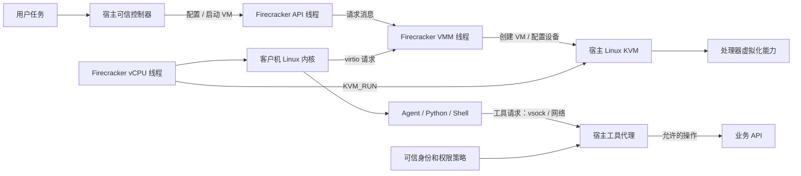
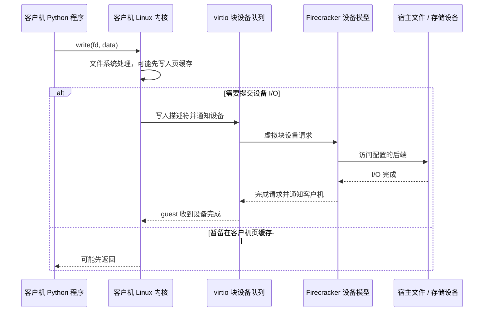

# Agent-Sandbox：Firecracker 运行路径与安全边界

Agent Sandbox 要安全地运行 Agent 生成的代码，必须回答三个问题：代码在哪里执行、它能通过什么通道访问外部资源、谁批准它产生副作用。Firecracker 帮助我们理解第一个问题，但它不是整个 Sandbox 平台。

本文跟着一个任务走：控制器启动 microVM，guest 中的 Agent 写入文件，再通过工具代理请求业务操作。沿着这条路径，可以分清 **VM 控制、客户机执行与 I/O、业务授权** 三件容易混在一起的事。

## 为什么从 Firecracker 开始？

Firecracker 是 Linux/KVM 上的 microVM 运行时。每个 Firecracker 进程承载一台 microVM；guest 使用自己的 Linux 内核，vCPU 通过 KVM 使用宿主的硬件虚拟化能力。Firecracker 提供精简的虚拟机模型和 API，平台可以配置 vCPU、内存、磁盘、网络设备，并管理启动、停止和快照恢复。

学习 Firecracker 的价值不在于所有 Agent Sandbox 都必须采用它，而在于它让运行时边界具体可见：可以沿着源码和文档追踪控制器、API、VMM、KVM、vCPU 与虚拟设备的职责，再把这套分析方法用于容器、gVisor 或托管沙箱。它适合作为理解 microVM 的案例，也让我们能明确区分运行时能保证什么、平台还欠缺什么。

Firecracker 给 Sandbox 提供独立 guest 内核和可编排的 VM 生命周期；精简设备模型则有助于控制实例开销。但启动速度、并发密度和成本都取决于目标宿主、内核、镜像和工作负载，必须实测。工具授权、任务记忆、网络出口策略、产物治理和分布式对账仍由平台负责。

## 先看组件与职责



图中要区分三件事：**KVM 不是 Firecracker，Firecracker 也不是整个 Agent 平台。**Firecracker 进程承载一台 microVM；API 线程接收主机管理请求，VMM 线程驱动设备模型和事件循环，vCPU 线程通过 KVM 的 `KVM_RUN` 循环执行客户机。API 线程不在客户机每条指令的快速路径上。平台仍负责任务、镜像、网络、权限、资源、日志和恢复。

| 组件 | 主要职责 | 常见误解 |
| --- | --- | --- |
| KVM | 提供创建 VM、配置 vCPU 和运行客户机的内核接口 | 把 KVM 当作 VM 管理器或业务权限系统 |
| Firecracker | 管理一台 microVM 的资源、状态和虚拟设备 | 以为它自动提供完整多租户控制面 |
| 客户机内核 | 管理 guest 中的进程、系统调用和文件系统 | 以为 guest syscall 会逐条发给宿主 VMM |
| 控制器 | 管理任务和 VM 生命周期 | 让不可信 guest 自己决定身份或配额 |
| 工具代理 | 在可信一侧验证主体、动作和参数并处理业务副作用 | 以为代码被放进 VM 后，代理调用就天然安全 |

## 从创建 VM 到 guest 执行代码

任务开始时，宿主控制器通过 Firecracker API 配置 VM、挂载磁盘、设置网络并请求启动。API 线程把管理请求交给 VMM；VMM 构建机器模型并启动 vCPU 线程。vCPU 通过 KVM 执行 guest。这个启动过程属于**控制路径**。

```text
控制器
  -> Firecracker API 解析 InstanceStart
  -> API 线程把动作发给 VMM
  -> VMM 检查状态、构建并启动 microVM
  -> vCPU 线程通过 KVM_RUN 执行客户机
```

当前仓库可按固定提交追踪这条路径：[请求解析](https://github.com/firecracker-microvm/firecracker/blob/30471852666564d980f330d0575115eda7d5ce8e/src/firecracker/src/api_server/request/actions.rs)、[API 与 VMM 消息](https://github.com/firecracker-microvm/firecracker/blob/30471852666564d980f330d0575115eda7d5ce8e/src/firecracker/src/api_server/mod.rs)、[VMM 动作分派](https://github.com/firecracker-microvm/firecracker/blob/30471852666564d980f330d0575115eda7d5ce8e/src/vmm/src/rpc_interface.rs)、[VM 构建](https://github.com/firecracker-microvm/firecracker/blob/30471852666564d980f330d0575115eda7d5ce8e/src/vmm/src/builder.rs)和 [vCPU 执行](https://github.com/firecracker-microvm/firecracker/blob/30471852666564d980f330d0575115eda7d5ce8e/src/vmm/src/vstate/vcpu.rs)。这是一条具体版本的阅读路线；其他版本应按实际代码重新确认。

客户机启动后，计算和设备 I/O 不会在每一步都经过 Firecracker API。下面看一个 guest 程序写文件的例子，它属于**执行与 I/O 路径**。

### Python 写文件经过什么路径？

Python 调用 `write()` 后，CPU 正在客户机 vCPU 上执行。系统调用首先进入**客户机 Linux 内核**，由它检查文件描述符与权限，并处理文件系统操作。若数据暂存在客户机页缓存，`write()` 可以先返回；之后需要写入虚拟块设备时，客户机驱动才会构造 virtio 请求。



因此，**客户机的普通系统调用不是一次 Firecracker API 请求，也不等于宿主系统调用**。访问虚拟设备时，才会进入设备处理路径。KVM 在内核中处理一部分虚拟化事件，另一些需要 VMM 用户态处理；具体路径依设备、配置和后端而异。

“写成功”也不总等于“断电后数据仍在”。应用返回、客户机文件系统提交、virtio I/O 完成、宿主缓存刷新和底层介质持久化，是不同确认点。需要持久性保证时，要验证客户机、虚拟块设备与宿主存储的 flush/cache 合同。

## 隔离不等于授权

Firecracker/KVM 为客户机代码提供虚拟化隔离，但这不自动限制 guest 通过已开放的网络、文件或工具通道产生什么影响。比如，工具代理替 guest 调用“创建云资源”API；即使没有 VM 逃逸，如果代理信任 guest 自报的租户身份或任意参数，仍可能发生越权。

可以把安全责任分成三层：

1. **KVM 与 microVM 边界**：限制 guest 直接接触宿主 CPU、内存和设备的方式。
2. **VMM 进程防护**：Firecracker 使用 seccomp 限制系统调用；生产部署还应依据官方建议配置 jailer、降权、namespace 和 cgroup。
3. **平台权限控制**：宿主控制器与工具代理建立可信身份，限制资源、动作、参数、网络出口和预算，并处理撤权与审计。

信任模型也要写清楚：宿主 Linux、KVM、Firecracker、启动配置和控制器属于平台的信任基础；guest 中的 Agent、模型输出、工具参数、依赖和产物都按不可信处理。虚拟化边界依赖硬件、内核、VMM 和宿主配置正确工作，不是没有逃逸风险的数学保证。Firecracker 不负责过滤客户机的全部网络流量；管理 API socket、文件描述符、镜像来源、MMDS 数据和宿主凭证都需要单独保护。后文会逐一讨论这些通道。

## 容器、gVisor、Firecracker 不是同一层的名字

| 路径 | 内核边界 | 需要验证的重点 |
| --- | --- | --- |
| containerd + runc | 普通 Linux 容器共享宿主内核；namespace、cgroup、seccomp 提供不同约束 | OCI 配置如何创建进程，所需系统调用、文件和网络权限是否可用 |
| gVisor | 应用系统调用经过用户态应用内核路径 | 系统调用兼容性、文件与网络行为、实际负载开销 |
| Firecracker | guest 使用自己的客户机内核，通过 KVM 运行在 microVM 中 | KVM 与架构条件、镜像启动、虚拟设备、宿主进程约束和平台运维成本 |

containerd 负责较高层的镜像和任务管理，runc 根据 OCI 配置创建容器进程。gVisor 改变应用与宿主内核之间的处理路径。Firecracker 则在主机上运行 VMM 并管理 microVM。比较时要按相同工作负载、资源、权限和成本口径做 POC；只看启动速度或项目名称无法得出适用结论。

## 对 Agent Sandbox 设计的启发

Firecracker 提供执行边界；Sandbox 平台还要定义任务能做什么、何时收回权限，以及恢复时如何处理外部副作用。前文已经明确哪些组件可信、哪些输入不可信。下面把这个信任模型落实到授权、通道、生命周期和恢复设计中。

### 把工具调用设计成受限能力

不要把云账号密钥、长期服务令牌或宿主凭证放进 guest。Agent 需要调用业务功能时，应把请求送到宿主侧网关；网关依据控制面创建的任务身份，取得当前策略，再逐项核验主体、资源、操作、参数、有效期和预算。授权粒度应尽量具体，例如“读取任务 `T` 拥有的对象 `A`”，而不是“可以访问对象存储”。

一次工具请求可以包含操作名、资源标识和参数，但身份应由网关从已认证的连接或控制面映射得出，不能由请求体决定。网关还应检查资源归属、参数范围、调用频率和任务剩余预算，并记录任务 ID、VM 实例代次、请求 ID、策略版本和结果。日志需能用于审计，同时避免记录令牌、私密提示词或完整敏感数据。

重试语义也属于权限设计。网关收到请求后若在业务 API 已执行、但响应尚未返回时超时，guest 无法判断操作是否成功。对创建、扣费、发送等有副作用的操作，应使用绑定操作与参数的幂等键，或提供查询与对账流程；不能把超时简单当成“没执行”，也不能承诺跨 VM、代理和业务系统的天然“恰好一次”。取消任务可以阻止新的调用，但已经被业务系统接受的操作可能需要补偿或人工核对。

### 按通道逐项设计边界

“VM 已隔离”不是通道策略。每一条 guest 到宿主或外部系统的路径，都要明确谁能发起、身份如何识别、允许传什么、失败如何处理。

**Firecracker API socket。**能访问 socket 的进程可以管理 VM，因此只应交给可信控制器。按实例管理 socket、配置和文件描述符，并限制目录权限；不要把管理 API 暴露给 guest 或普通业务进程。

**guest 网络出口。**guest 可能访问云元数据、宿主或内网服务，也可能利用 DNS、重定向或 SSRF 绕过域名规则。应在宿主侧用防火墙或出口代理实施策略，明确允许的目标与端口，并对解析后的 IP 和重定向继续检查。元数据与内部地址应默认受限，例外单独授权。

**vsock 与工具代理。**能连上通道不代表已经获准调用业务功能。由宿主把连接绑定到任务和 VM 代次；协议还要定义版本、消息大小、截止时间、并发与背压、请求 ID、幂等和错误语义。

**MMDS。**只放 guest 必需的任务级数据，限制令牌的范围和有效期，并支持轮换与撤销；不要注入共享服务凭证。MMDS 访问控制不能替代工具网关对每次操作的授权。

**磁盘与产物。**guest 可能构造路径穿越、符号链接、硬链接、超大文件或恶意归档。每个任务使用隔离的可写层；宿主通过受控对象 ID 与目录句柄访问文件，不信任 guest 路径；下游处理前校验类型、大小、配额和归属。

为每条通道写一份明确的接口约定：谁发起、如何识别任务、允许哪些操作和数据、消息大小与超时是多少、失败或重试怎样处理、日志用什么 ID 关联。数据、控制、凭证和可观测性通道都应有这样的约定。

### 把取消、超时和清理当作安全路径

一个任务的生命周期至少要区分排队、启动、执行、取消中、结果待核对、终止和清理完成。调用方超时不代表 VM 已停止；控制器崩溃也不代表 guest 不再运行。平台应以控制面状态为准，给每个 VM 分配实例代次或 fencing token，让工具网关拒绝已经取消或过期代次发出的请求。

取消时，先撤销该任务发起新工具调用和网络请求的能力，再停止或终止 VM，关闭对应通道，处理仍在途的业务请求，最后回收磁盘、快照、临时文件和资源配额。外部 API 若可能已完成，就把结果标成“待核对”，通过幂等键或查询接口对账。这样即使取消与工具调用同时发生，旧 VM 也不能继续拿旧身份产生新副作用。

清理必须可重试且可观测。控制器重启后能否发现孤儿 VM？某个磁盘删除失败时是否会持续占用租户配额？旧网络接口或代理身份会不会留给新任务复用？这些都是隔离设计的一部分，不是后台运维的边角工作。

### 把快照看成状态与凭证的边界

Firecracker 快照保存 guest 内存和虚拟机设备状态；相关磁盘文件由调用方另行管理。它不会把已提交到外部 API 的操作撤销，也不保证网络或 vsock 上的外部连接恢复成原样。恢复后，外部连接可能已经关闭，guest 中的 Agent 却仍保留着调用前的内存状态，因此可能重新连接并重试刚才的操作。

设计上要同时处理两类状态：VM 快照中的进程和内存状态，以及控制面、工具系统、磁盘和外部服务中的状态。快照前应定义一致的检查点，明确在途工具调用如何完成或标记；恢复后再读取当前权限策略，重新建立任务级网络、vsock、日志和指标配置，并为新实例分配身份。不能把旧快照里的批准状态当作当前批准，也不能默认旧 token 仍应有效。

快照文件本身也需要按敏感数据保护。guest 内存可能包含提示词、文件内容、环境变量或短期凭证；磁盘 backing file 还必须作为快照状态的一部分管理。应对快照及其磁盘文件做访问控制、完整性校验、必要的加密和保留期管理，并记录格式版本、CPU 特性、设备配置和来源。复制快照启动多个 worker 时，每个实例必须得到独立的任务身份、网络配置、通道和写时隔离磁盘。

Firecracker 的 MMDS 配置与数据存储也要区分：快照支持会保存配置，但 MMDS 的数据存储不会随快照保存。因此恢复流程需要明确重新配置或重新注入哪些任务数据，不能把这件事交给“内存恢复”来推断。

### 用可重复的场景证明设计有效

架构文档应把每个安全声明写成可验证的预期结果：谁发起什么请求，在何种任务状态下应被允许或拒绝，日志和指标要留下什么证据。至少可以验证这些场景：

1. guest 伪造租户 ID 或审批标记请求读取其他租户资源，网关仍根据可信任务身份拒绝。
2. guest 对同一幂等键发送相同和不同参数的请求；相同请求不会重复产生副作用，不同参数会被拒绝或使用新键显式处理。
3. 任务取消后，旧 VM 或超时后恢复的旧实例继续调用工具，网关根据撤权状态或实例代次拒绝。
4. guest 通过域名解析、重定向或直接 IP 尝试访问不允许的目标，宿主出口策略仍能阻止。
5. guest 输出包含路径穿越、链接或超过配额的文件，产物服务拒绝越界读取和写入。
6. 从快照恢复时权限已经撤销，或快照点存在未确认的外部操作；恢复使用当前策略，并能对外部结果对账。

验证要分层进行：协议与策略测试检查拒绝逻辑，Linux/KVM 集成测试检查真实 Firecracker、设备与宿主网络边界，故障注入检查控制器重启、代理超时和清理重试。Mock 能证明代码分支被执行，不能证明宿主防火墙规则、KVM 隔离或真实恢复行为生效。线上还应能按任务 ID 和 VM 代次串起启动耗时、资源使用、出口拒绝、工具授权结果、取消到清理完成的时长和快照恢复失败原因。

## 核心问题自测与参考解答

本节围绕 Firecracker 与 Agent Sandbox 的关键知识，整理运行时、安全、生命周期、RL Rollout 和 Harness Engine 相关问题。可以先独立作答，再对照参考解答检查：是否能讲清路径、信任边界、失败状态、设计取舍和验证证据。

分析系统设计问题时，可以按这个顺序组织：**先澄清负载和安全目标，再画信任边界与组件，然后说明状态和失败恢复，最后给出取舍、指标和验证方法。**不要只报项目名或背功能列表。

### 1. Agent 在 microVM 中执行 `write()` 并调用工具，完整路径是什么？

本题检查是否能区分 guest 系统调用、虚拟设备 I/O 和业务授权，而不是把所有事情都归到 Firecracker。

**参考解答：**

> VM 启动属于控制路径：宿主控制器调用 Firecracker API，VMM 配置机器并启动 vCPU，vCPU 通过 KVM 执行 guest。Python 的 `write()` 先进入 guest Linux 内核；只有文件系统需要访问虚拟块设备时，才会经 virtio 到 Firecracker 的设备模型和宿主后端。API 线程不会处理每个 guest syscall。工具调用是另一条路径：guest 发出不可信请求，宿主网关根据控制面绑定的任务身份和当前策略授权后，才调用业务 API。KVM/microVM 负责执行隔离，网关负责业务权限。

关键检查点是：`write()` 返回不等于宿主介质已持久化；工具请求超时也不等于业务操作没有发生。两者分别涉及存储确认点和外部副作用的失败语义。

### 2. 如何安全运行模型生成的任意代码？

完整回答应先说明威胁主体和资产，再讲纵深防护以及 microVM 无法替平台解决的风险。

**参考解答：**

> 模型输出、用户文件、第三方依赖、网络响应和 guest 产物都应视为不可信。执行层用 microVM 隔离 guest 内核，再限制 Firecracker 进程的系统调用、身份、文件描述符和资源；平台层按任务隔离磁盘与网络，在宿主控制出口，并通过工具网关按主体、资源、操作、参数和预算授权。长期宿主凭证不进入 guest。验证场景应覆盖越权工具请求、元数据访问、路径穿越、资源耗尽和 VM 逃逸后的影响范围。残余风险包括宿主内核或 VMM 漏洞、错误配置和供应链问题，因此还需要升级、镜像治理、审计与应急处置。

自测追问：Firecracker 会拦住 guest 的任意出站流量吗？答案应明确说明网络过滤由宿主策略负责，并指出如何验证规则确实生效。

### 3. 什么场景选择 Firecracker、容器或 gVisor？

关键不是宣布某一种技术“最安全”或“最快”，而是给出决策条件和可比较的实验。

**参考解答：**

> 如果主要风险是多租户运行不可信代码，就重点评估独立 guest 内核带来的隔离收益，以及 KVM、镜像、启动、网络和宿主运维成本。容器启动与生态通常更轻便，但共享宿主内核；gVisor 增加应用内核边界，需要验证系统调用兼容性和负载表现。最终按同一任务、资源限额和权限策略对比冷启动与恢复时延、P95、兼容率、单位任务成本、密度和故障恢复，再根据威胁模型选择；也可以按任务风险提供不同后端。

启动速度也要拆成“Firecracker 进程启动”“guest 启动”和“Agent 已可接任务”分别计时。快照可以缩短某些启动路径，但要一并测量内存占用、恢复失败、写时复制 I/O 和安全重置成本。

### 4. 如何用快照和 fork 扩展 RL Rollout？

解答需要覆盖 VM 状态、磁盘、外部副作用和身份隔离，不能只描述如何调用快照 API。

**参考解答：**

> 先定义可 fork 的一致性检查点：等待或记录在途工具操作，固定任务代码、镜像和策略版本，再生成 guest 内存与 VM 状态快照，并单独管理磁盘 backing file。每个 fork 使用独立的写时复制磁盘、网络身份、任务凭证和工具会话。恢复时重新读取当前策略，不继承旧审批；快照文件按敏感数据保护。快照不会回滚外部 API 副作用，网络和 vsock 连接也不能当作恢复后仍有效，因此工具要支持幂等或对账。并行 Rollout 前还要限制内存、磁盘和宿主并发，防止 fork 放大资源争用。

关键边界：如果快照包含“请求已发出、响应未收到”的 Agent 状态，恢复后可能重试。必须把它作为业务一致性问题处理，不能假设 VM 恢复等于整个外部世界回滚。

### 5. RL Rollout 怎样做到可复现或确定？

先澄清“确定性”有不同强度。固定随机种子并不能让模型服务、网络服务、调度、时钟和外部工具自动变得确定。

**参考解答：**

> 应区分回放和重跑。回放可以重用记录的模型输出、工具请求与响应，验证 Harness 和策略逻辑；重跑则重新执行模型和环境，只能在依赖、版本、种子、资源和外部条件都受控时提高可复现性，不能笼统承诺逐位一致。每条轨迹记录 Agent 与模型版本、采样参数、提示词或其安全引用、工具 schema、镜像与内核版本、快照标识、随机种子、资源限制、事件顺序及外部响应。副作用工具需要隔离、幂等或使用测试替身，避免重放造成重复写入。

因此，“轨迹可审计”“结果可回放”和“真实世界重跑完全确定”是三种不同的保证。

### 6. 长任务被取消、控制器崩溃或宿主重启时怎么处理？

重点是生命周期和分布式状态，而不仅是调用 `kill`。

**参考解答：**

> 任务状态应持久化在控制面，并定义创建、启动、就绪、运行、取消中、结果待核对、终止和清理完成等状态。启动、取消和清理接口要可重试；控制器重启后通过宿主实际 VM、网络和磁盘状态做 reconcile。每次 VM 启动分配新的实例代次，工具网关拒绝旧代次请求。取消时先撤销新调用权限，再停止 VM、关闭网络与代理通道、核对已接受的外部操作，最后回收资源。清理失败要能重试并告警。用启动到 Agent 就绪的 P95、取消到权限撤销时延、孤儿资源数和清理成功率衡量结果。

如果有长任务检查点或恢复机制，还要说清楚哪些状态由 guest 快照承载，哪些状态由控制面和业务系统承载。

### 7. Harness Engine 怎样支撑确定、可观测、可评估的执行？

不要把 Harness 简化成日志收集器。它需要给每次执行一份明确、可追踪的运行合同。

**参考解答：**

> 一次运行应由版本化的任务定义、Agent/模型配置、运行时镜像、权限集合、资源预算、超时和评估规则组成，并分配全局 run ID。Harness 记录有序事件：启动、模型请求、工具授权与结果、文件产物、checkpoint、取消和退出；每个事件关联 task ID、VM 代次和请求 ID。评估同时覆盖任务成功率、工具越权、恢复正确性、时延、资源成本和轨迹完整性。离线基准用固定输入和工具响应保证可比，线上观测则保留真实分布；失败要能定位到 Agent、工具、guest、VMM 还是宿主层。

可用一个失败例子检验设计：能否从 trace 找到事件记录、定位故障层，再按记录复现；只说“接入 OpenTelemetry”还不足以说明评估链路完整。

### 8. 如果让你实现一个高并发 Sandbox 控制器或工具代理，会先保证什么？

控制器与代理的设计还要能落到代码实现，特别是并发、错误处理和边界意识。

**参考解答：**

> 先写出不变量：同一个 run ID 不能被两个活跃 VM 同时执行；fork 必须创建独立子 run ID；取消或过期代次不能再调用工具；重试不能重复创建资源；任何启动成功的 VM 都必须可追踪和可回收。控制器用持久化状态机和幂等操作协调 Firecracker API，外部调用设截止时间并限制并发；工具代理做身份映射、参数校验、配额和幂等去重。事件循环不承担可能阻塞的磁盘或网络操作，清理由可重试队列和周期性 reconcile 兜底。测试覆盖并发创建、重复请求、超时、进程重启和部分清理失败。

不论使用 Go 还是 Rust，都要说明资源所有权、取消传播、超时、重试和状态持久化；只覆盖 happy path 不足以验证基础设施行为。

### 9. 如何在基础设施研发中使用 AI Coding？

AI Coding 可以加快重复工作，但生成内容仍需经过正常工程验证。

**参考解答：**

> AI 适用于代码导航、调用链梳理、接口样板、测试用例草拟、日志分析和文档维护，让工程师把精力放在威胁建模、状态机不变量和架构取舍上。生成代码仍按普通变更审查：先写清接口与安全不变量，再把改动控制在小范围，用单元测试、静态检查、真实 Linux/KVM 集成测试和故障注入验证；高风险路径需要人工逐行审查。敏感代码和凭证只在获准的环境中处理。可跟踪交付周期、审查返工率和线上缺陷，而不是只统计生成代码量。

关键原则是：AI 可以加快探索与重复劳动，但安全保证来自清晰约束、审查和可重复验证，不能把代码生成结果当成正确性证明。

### 怎样自测掌握程度？

- **停留在概念记忆：**能说出 KVM、jailer、快照或 vsock 的名字，却讲不清请求经过哪些组件、谁拥有什么权限。
- **能够解释架构：**能画出路径和信任边界，说明正常流程、失败状态、责任归属，以及容器、gVisor、Firecracker 的适用条件。
- **深入掌握：**能主动分析威胁模型和一致性目标，推演取消竞态、外部副作用、快照重放、旧身份撤销和资源争用，并给出量化指标、故障注入方案和取舍依据。

判断是否真正掌握，关键不是能列出多少组件，而是能否说明**保证由哪层提供、失败时状态是什么、如何拿证据验证**。

## 结语：三条路径，三层边界

回看一次 Agent Sandbox 任务，可以用三条路径归纳运行过程：

1. **控制路径：**控制器 → Firecracker API → VMM → vCPU/KVM。控制器负责生命周期；要确认管理 socket 只对可信主体开放，状态和失败结果可核对。
2. **客户机执行与 I/O 路径：**Agent → 客户机内核 →（需要设备 I/O 时）virtio → VMM 设备模型 → 宿主后端。guest 内核处理普通系统调用；写入返回不必然代表数据已持久化。
3. **业务授权路径：**guest 的不可信请求 → 宿主工具代理 → 业务 API。可信身份服务与策略负责核验主体、资源、动作、参数、预算和撤权。

与三条路径对应，平台要守住三层边界：**KVM/microVM 隔离 guest 与 host**，**jailer、seccomp、namespace 和 cgroup 限制 VMM 进程及资源**，**控制器与工具代理决定任务身份和业务权限**。文件、网络、API socket、vsock 和 MMDS 都是边界通道，应明确访问主体、数据范围、失败行为和审计方式。

评审一个 Sandbox 方案时，先问：代码实际在哪里执行？它能通过哪些通道影响宿主或外部系统？哪一侧依据什么身份批准这些操作？最后再用真实 Linux/KVM 环境中的测试和观测证明答案成立。

Firecracker 的价值，是提供一个可检查、可编排的 microVM 执行基础；Sandbox 平台仍须负责可信授权、网络与数据策略、任务生命周期、恢复和观测。把运行路径与这些上层责任分开，才能判断系统的安全保证究竟来自哪一层。

## 参考资料

本文基于 Firecracker 仓库提交 [`30471852666564d980f330d0575115eda7d5ce8e`](https://github.com/firecracker-microvm/firecracker/tree/30471852666564d980f330d0575115eda7d5ce8e)：

- [架构设计：线程、设备、威胁遏制和沙箱](https://github.com/firecracker-microvm/firecracker/blob/30471852666564d980f330d0575115eda7d5ce8e/docs/design.md)
- [Getting Started：运行前提](https://github.com/firecracker-microvm/firecracker/blob/30471852666564d980f330d0575115eda7d5ce8e/docs/getting-started.md)
- [Jailer：进程隔离](https://github.com/firecracker-microvm/firecracker/blob/30471852666564d980f330d0575115eda7d5ce8e/docs/jailer.md)
- [快照支持：保存内容与恢复行为](https://github.com/firecracker-microvm/firecracker/blob/30471852666564d980f330d0575115eda7d5ce8e/docs/snapshotting/snapshot-support.md)
- [快照版本与兼容性](https://github.com/firecracker-microvm/firecracker/blob/30471852666564d980f330d0575115eda7d5ce8e/docs/snapshotting/versioning.md)
- [MMDS 用户指南](https://github.com/firecracker-microvm/firecracker/blob/30471852666564d980f330d0575115eda7d5ce8e/docs/mmds/mmds-user-guide.md)
- [vsock 设备](https://github.com/firecracker-microvm/firecracker/blob/30471852666564d980f330d0575115eda7d5ce8e/docs/vsock.md)
- [KVM API：Linux 内核接口](https://docs.kernel.org/virt/kvm/api.html)
- [gVisor 架构导读](https://gvisor.dev/docs/architecture_guide/intro/)

---

本地课程入口：[模块 01：运行时基础与架构边界](../modules/01-runtime-foundations.md)。
