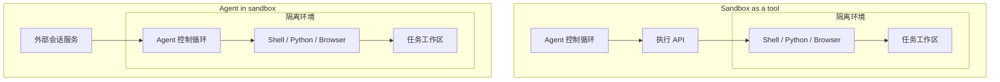
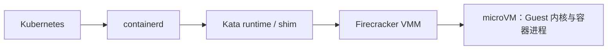

# Agent Sandbox 怎么选

一个编程 Agent 收到“修复这个项目”的请求后，可能会安装依赖、修改文件、运行测试，再启动浏览器检查页面。模型负责提出下一步动作，真正执行动作的是进程、文件系统和网络。

这时需要解决三个问题：谁来运行这些代码，代码能访问哪些资源，以及下次继续任务时能恢复什么状态。Sandbox 的作用也由此展开：它提供受约束的执行环境，让多个任务能够独立运行，并为环境复用、恢复和回收建立明确的规则。

选择方案时，最容易混淆的是三个层次：**Agent 与执行环境的关系、底层隔离机制、上层产品与管理平台。**本文沿着这三层比较容器、gVisor、Kata、Firecracker，以及 E2B、Vercel、Deno、Modal、Daytona、Cloudflare、AIO Sandbox 和 OpenSandbox。


## 一、基础概念：Agent 与 Sandbox 的关系

### 1.1 Sandbox as a tool：Agent 调用隔离环境

Agent 的控制循环——请求模型、选择工具、处理结果、继续执行——运行在应用服务中。需要执行代码时，它通过 API 把命令交给沙箱，再接收结果。

例如，Agent 决定运行 `pytest`，执行服务把它送进某个任务的沙箱，返回退出码和测试输出。Agent 可以连续调用同一个沙箱，因此文件、后台服务和工作区能够跨多次工具调用保留。**这种方式同样可以支持长任务和持久工作区。**

它适合已经有 Agent 服务、希望增加隔离执行能力的应用。身份和权限检查可以集中在执行服务中，但 Agent 产生的命令与参数仍需按不可信输入处理；运行在沙箱外并不会使模型输出自动可信。

### 1.2 Agent in sandbox：Agent 进程也在隔离环境里

把 Agent 程序、命令行工具和工作区一起放入沙箱。外部系统创建会话、传入任务，Agent 在内部读取文件、调用工具、执行命令。

这适合运行完整的编程 Agent、第三方 Agent 程序，或者需要依赖本地进程和工具配置的工作流。Agent 可以调用外部模型 API，并不要求把模型权重也放进沙箱。平台仍要在沙箱外保留管理接口、权限策略和凭证代理。

### 1.3 两种部署关系的边界对比



图中方框表示执行环境的隔离范围。两种布局都可以采用容器或 microVM，也都需要外部授权与生命周期管理。区别主要在于：**Agent 进程本身是否进入隔离范围。**

### 1.4 Agent Sandbox：覆盖两种布局的执行平台

Agent Sandbox 通常泛指为 Agent 提供隔离执行环境的系统，可以承载上面两种布局。这些说法并不是一套严格统一的行业分类，讨论时最好同时画出实际部署关系。

还要区分通用概念和具体项目。[Kubernetes SIG Apps 下的 agent-sandbox](https://github.com/kubernetes-sigs/agent-sandbox)提供 Sandbox 自定义资源与控制器，管理有状态的单实例工作负载；底层隔离通过 `RuntimeClass` 交给 gVisor、Kata 等运行时。它解决的是沙箱如何被创建、分配和管理。


## 二、底层隔离：容器、gVisor、Kata 与 Firecracker

### 2.1 从系统调用看运行路径

同一段 Python 程序调用 `write()`，放进不同运行时后，首先接住系统调用的组件不同：

```text
普通容器：Python → 宿主 Linux 内核

gVisor：  Python → Sentry 应用内核
                     └→ 按需使用受约束的宿主接口

microVM： Python → Guest Linux 内核
                     └→ 需要设备 I/O 时，经虚拟设备路径访问宿主后端
```

这张图只突出系统调用与设备访问的边界。microVM 中的普通系统调用由 Guest 内核处理；Guest 需要访问虚拟设备时，才进入相应的虚拟化和 I/O 路径。它不会把每个 `write()` 都变成一次 Firecracker 管理 API 请求。[Firecracker 设计文档](https://github.com/firecracker-microvm/firecracker/blob/30471852666564d980f330d0575115eda7d5ce8e/docs/design.md)

### 2.2 普通容器：共享内核，约束进程的视图和权限

这里的普通容器指以 `runc` 为代表的 Linux 容器。namespace 划分进程、挂载和网络等资源的可见范围；cgroup 管理资源用量；capabilities、seccomp 等机制限制权限和可用接口。应用仍然使用宿主 Linux 内核。[runc 项目说明](https://github.com/opencontainers/runc)

它适合来源可控的内部任务、常规服务和开发环境，能够沿用成熟的镜像与调度流程。若平台要接收互不信任用户的任意代码，共享内核就是必须纳入评估的攻击面。单独设置 CPU、内存限额，解决不了内核隔离和业务越权问题。

### 2.3 gVisor：在应用与宿主之间放入应用内核

gVisor 的 Sentry 在用户态实现 Linux 系统调用接口。应用请求先由 Sentry 处理，Sentry 再按需要使用宿主资源；这并非把应用的系统调用原样转发给宿主。它因此减少了应用直接接触宿主内核接口的机会，同时带来接口兼容性和不同负载下的性能取舍。[gVisor 架构说明](https://gvisor.dev/docs/architecture_guide/intro/)

如果需要保留容器工作流，并且应用依赖的系统调用、文件和网络行为都能通过验证，gVisor 是值得评估的隔离方案。是否采用，应由实际负载决定；不能笼统认为它一定比 microVM 快，或者只是“多加了一层 syscall 过滤”。

### 2.4 Kata：通过容器接口使用虚拟机隔离

Kata 把容器工作负载运行在轻量 VM 内，并接入容器管理器。在 Kubernetes 中，VM 隔离通常对应 Pod Sandbox；同一个 Pod 内的多个容器可能共享一台 VM 和 Guest 内核。因此，把两个租户放在同一个 Pod 里，并不会自动获得两个独立的 VM 边界。[Kata 架构](https://github.com/kata-containers/kata-containers/blob/main/docs/design/architecture/README.md)

### 2.5 Firecracker：提供 microVM 的虚拟机监控器

Firecracker 是运行在 Linux/KVM 上的虚拟机监控器，也就是 VMM。它提供精简的虚拟设备模型和 VM 管理接口。独立 Guest 内核与硬件虚拟化构成执行边界，宿主上的 VMM 进程还需要降权、seccomp、jailer 等约束。[Firecracker 设计文档](https://github.com/firecracker-microvm/firecracker/blob/30471852666564d980f330d0575115eda7d5ce8e/docs/design.md)

### 2.6 Kata 与 Firecracker 如何组合

Kata 可以使用不同 VMM，Firecracker 是一种可选后端。以支持该组合的配置为例，控制路径可以是：



OpenSandbox 的安全运行时指南就提供了通过 `kata-fc` RuntimeClass 使用 Kata + Firecracker 的配置。采用这条路径前，需要确认所用发行版本的设备、存储和运行时支持；Firecracker 提供的底层能力，也不意味着上层 API 已经暴露同样的快照与恢复功能。[配置示例](https://github.com/opensandbox-group/OpenSandbox/blob/main/docs/guides/secure-container.md)

### 2.7 按实际需求选择隔离路径

| 实际需求 | 优先评估的路径 | 选择依据 |
| --- | --- | --- |
| 运行来源可控的内部任务，已有容器平台 | 普通容器 | 沿用现有镜像、调度和资源管理，重点收紧进程权限与挂载范围 |
| 执行不可信代码，希望保留容器工作流 | gVisor | 增加应用内核边界，同时验证系统调用兼容性与负载开销 |
| Kubernetes 工作负载明确需要独立 Guest 内核 | Kata + 合适的 VMM | 保留容器接口，再按设备、存储和运维要求选择 VMM |
| 自建专门的 microVM 执行平台，需要控制启动、恢复与实例管理 | Firecracker | 直接掌握 VM 生命周期，也承担镜像、网络、状态和控制面的实现责任 |

这些选择可以并存，但应由可信平台按任务策略分配运行时。需要 VM 隔离的任务，不能因为某个节点配置缺失就悄悄回退到普通容器。


## 三、项目对比：各个方案适合什么场景

底层运行时回答“代码如何隔离”，产品还要回答“如何创建环境、操作文件、暴露服务、限制外联、保存状态”。因此，同样采用 Firecracker 的服务，使用体验和状态语义仍可能不同。

以下推荐是基于功能和架构的场景判断，具体运行时信息来自对应官方资料。

### 3.1 托管产品：直接接入沙箱能力

| 项目 | 官方描述的底层隔离 | 推荐场景与原因 |
| --- | --- | --- |
| [E2B](https://changelog.e2b.dev/security) | 每个 sandbox 使用独立 Firecracker microVM | 为 Agent 接入通用隔离执行环境，并需要暂停后恢复文件系统与内存状态时，可以优先评估 |
| [Vercel Sandbox](https://vercel.com/docs/sandbox) | Firecracker microVM | 应用已经使用 Vercel，希望把命令、文件、网络和身份集成放进现有平台工作流时，接入较顺畅 |
| [Deno Sandbox](https://deno.com/deploy/sandbox) | Firecracker microVM | 使用 Deno Deploy，或特别关注出站策略与凭证代理时，值得评估；可写 Volume 和 Snapshot 满足不同存储需求 |
| [Modal Sandboxes](https://modal.com/docs/guide/vm-sandboxes) | gVisor；另有完整 VM 运行时，当前标为 Beta | 已有 Modal 计算流程，或希望在其平台内按应用兼容性选择运行时；需要真实 Linux 内核功能时，再评估 VM 路径 |
| [Daytona](https://www.daytona.io/docs/sandboxes) | 按 Sandbox Class 区分容器、Linux VM 等 | 需要开发工作区、运行中状态分支或暂停恢复时，重点评估 VM 类别；容器类别的生命周期能力有所不同 |
| [Cloudflare Sandbox SDK](https://developers.cloudflare.com/sandbox/concepts/architecture/) | Container 接口，官方描述为每个 sandbox 独立 VM；所引资料未明确 VMM 名称 | 已有 Workers、Durable Objects 和 R2 的应用，可以复用这些组件管理实例、路由和目录备份 |

托管产品中，底层 VMM 通常由服务商选择。用户实际能控制的是实例类别、镜像、资源、网络策略和生命周期接口。即使两家都使用 Firecracker，也要分别确认实例最长运行时间、持久化范围、区域和恢复限制。

### 3.2 OpenSandbox：统一执行接口与后端适配

OpenSandbox 提供沙箱创建、命令执行、文件操作等接口，并适配 Docker、Kubernetes 等后端。需要自己部署、希望应用侧尽量复用同一套 SDK 时，可以从它开始评估。真实隔离方式取决于后端和安全运行时配置；选用 OpenSandbox 后仍要明确采用普通容器、gVisor 还是 VM 路径。[项目说明](https://github.com/opensandbox-group/OpenSandbox)

### 3.3 Kubernetes SIG Agent Sandbox：管理集群中的沙箱对象

如果已有 Kubernetes，希望用声明式资源管理独立会话、持久存储和预热池，Kubernetes SIG Agent Sandbox 的 Sandbox、Template、Claim 与 WarmPool 抽象更贴近这一需求。底层运行时通过 RuntimeClass 配置，稳定的沙箱身份和数据保存也需要相应配置。[项目说明](https://github.com/kubernetes-sigs/agent-sandbox)

两者有重叠，也各有侧重。选择时看主要集成入口：应用是否更需要统一 SDK，还是平台更需要 Kubernetes 资源与控制器。若要组合使用，应确认适配关系和生命周期由谁负责。

### 3.4 AIO Sandbox：让浏览器、Shell 与文件共享工作区

AIO Sandbox 把浏览器、Shell、文件操作、MCP、VSCode 等放进一个 Docker 容器。比如浏览器下载文件后，Shell 可以直接读取同一工作区，省去跨工具同步文件的处理。需要完整 Agent 工作环境时，它是合适的候选；具体隔离边界则由承载它的运行时决定。[项目说明](https://github.com/agent-infra/sandbox)

AIO Sandbox 也不必然对应 Agent in sandbox：Agent 完全可以运行在外部，通过 API 操作里面的浏览器和 Shell。**工具装在哪里，与 Agent 控制循环装在哪里，是两个独立决定。**


## 四、状态管理：文件、内存、快照与 Fork

假设 Agent 已经安装好依赖，启动了一个开发服务器，还在内存里维护一个 Python 对象。现在要暂停环境，过一小时再继续。不同状态保存方式，能恢复的东西并不一样。

### 4.1 四种状态能力分别保存什么

| 能力 | 保存或复用什么 | 恢复后要注意什么 |
| --- | --- | --- |
| 文件系统快照 / 目录备份 | 指定时刻的文件内容 | 依赖与代码可以还在，进程通常需要重新启动 |
| 持久 Volume | 跨实例生命周期保留的数据 | 能读到数据，不等于恢复了进程、连接或 Agent 对话上下文 |
| 内存检查点 / VM 状态快照 | 运行中的内存和相关执行状态 | 必须配套处理磁盘一致性、恢复兼容性和外部连接 |
| Fork | 从某个状态创建独立分支 | 要确认包含哪些状态，以及磁盘写入、身份和外部操作是否独立 |

### 4.2 产品之间的保存与恢复语义

产品命名并不统一，必须看具体接口保存的内容。Deno 的 Snapshot 是从 Volume 生成的只读镜像；Cloudflare 的备份接口保存指定目录到 R2；Vercel 的持久沙箱文档描述了停止时保存、恢复时加载文件系统的过程。这些能力都不能仅凭名字推导为“内存里的 Python 对象还在”。[Deno 存储语义](https://docs.deno.com/sandbox/volumes/) · [Cloudflare 备份](https://developers.cloudflare.com/sandbox/api/backups/) · [Vercel 持久化](https://vercel.com/docs/sandbox/concepts/persistent-sandboxes)

需要接着运行进程时，要明确检查内存状态支持。Daytona 的容器类别在 stop 后保留文件系统，但清空内存；VM 类别提供保留内存的暂停恢复与分支能力。Modal 则分别提供文件系统和内存快照，查阅时其内存快照仍标为 Alpha，并有额外限制。[Daytona 状态语义](https://www.daytona.io/docs/en/persistence/) · [Modal 快照](https://modal.com/docs/guide/sandbox-snapshots)

### 4.3 Firecracker 快照的恢复边界

即使直接使用 Firecracker，状态也需要平台协调。Firecracker 生成 Guest 内存和 VM 状态文件，磁盘文件由调用方另行管理；恢复后网络连接不保证存活，原有 vsock 连接会断开。可恢复的 VM 状态、可恢复的应用状态和可恢复的业务流程，是三个需要衔接的层次。[Firecracker 快照文档](https://github.com/firecracker-microvm/firecracker/blob/30471852666564d980f330d0575115eda7d5ce8e/docs/snapshotting/snapshot-support.md)

### 4.4 恢复与分支执行中的外部副作用

还有一个容易忽略的边界：**快照覆盖不到整个外部世界。**如果 Agent 在快照后已经创建了一个外部工单，恢复到旧状态不会撤销工单。重试仍需使用幂等键或查询已有结果，分支执行也要使用独立身份，避免两个分支重复产生同一业务副作用。


## 五、安全边界：凭证、权限与网络访问

回到开头的编程 Agent。它可能运行在独立 microVM 中，但如果平台把长期云密钥交给它，再允许任意外联，代码仍可以利用这些合法通道访问外部资源。VM 边界保护宿主，业务授权决定任务能对外做什么。

### 5.1 凭证管理：让真实密钥留在沙箱外

一个具体设计是把凭证留在沙箱外：沙箱发起受限请求，外部代理核验任务身份、目标服务和操作，再注入凭证。Deno Sandbox 的秘密替换机制就展示了这种路径：沙箱中看到占位符，访问获准目标时才由外部机制替换为真实秘密。[Deno 安全设计](https://docs.deno.com/sandbox/security/)

### 5.2 业务授权：把权限约束到资源与操作

但允许访问某个域名仍不足以表达业务权限。任务获准访问代码托管服务，不代表它可以删除任意仓库。工具代理还应检查资源归属、动作和参数，并在任务取消或身份过期后拒绝新的操作。Firecracker 自身也明确把网络流量过滤留给宿主层处理。[Firecracker 的网络安全边界](https://github.com/firecracker-microvm/firecracker/blob/30471852666564d980f330d0575115eda7d5ce8e/docs/design.md#threat-containment)

### 5.3 网络访问：分清执行 API、Ingress 与 Egress

网络能力也应拆开比较：执行 API 负责发命令，Ingress 负责让外部访问沙箱里的服务，Egress 策略负责控制沙箱向外连接。这三个方向的鉴权、端口和协议范围不同，一个“支持网络”的勾选项无法表达它们的差异。


## 六、方案落地：以多用户编程助手为例

### 6.1 确定 Agent 与执行环境的部署关系

以多用户编程助手为例：应用已有 Agent 服务，需要执行任意生成代码，并保存每次会话的工作区。可以先采用 sandbox as a tool，让每个会话获得独立执行环境；身份和业务授权由沙箱外的服务负责。

### 6.2 选择托管服务或自托管平台

如果希望使用托管服务，从 E2B、Vercel、Deno 等与现有应用栈匹配的产品中评估。若要在自己的 Kubernetes 集群运行，则可以选择 OpenSandbox 或 Kubernetes SIG Agent Sandbox 作为管理入口，再依据隔离要求配置运行时：能接受并验证应用内核边界时评估 gVisor，明确要求独立 Guest Linux 内核时评估 Kata 与相应 VMM。

### 6.3 确定 Firecracker 的接入方式与验证范围

Firecracker 适合需要 microVM 边界、且其设备能力能满足负载的方案。使用 Kata + Firecracker 可以保留容器管理接口；直接使用 Firecracker 则能更细地控制 VM 创建、恢复和宿主资源。两条路径都要验证从“请求创建”到“第一条有效命令完成”的延迟、完整实例内存成本，以及失败后的回收和恢复行为。

### 6.4 需要隔离 Agent 本身时如何调整

当需要运行第三方 Agent 程序、或希望把 Agent 自身的依赖与进程一并隔离时，可以改用 Agent in sandbox。工作区是否持久、进程是否恢复、是否能访问外部工具，都继续由明确的接口和策略决定。


## 七、总结：把部署、隔离与平台能力串起来

**Agent 的位置决定哪些进程进入隔离范围，运行时决定如何建立边界，平台决定这个环境如何被使用和管理。**按这三个问题逐层选择，就能解释每个项目带来的价值，也能看清仍需自行实现和验证的部分。
