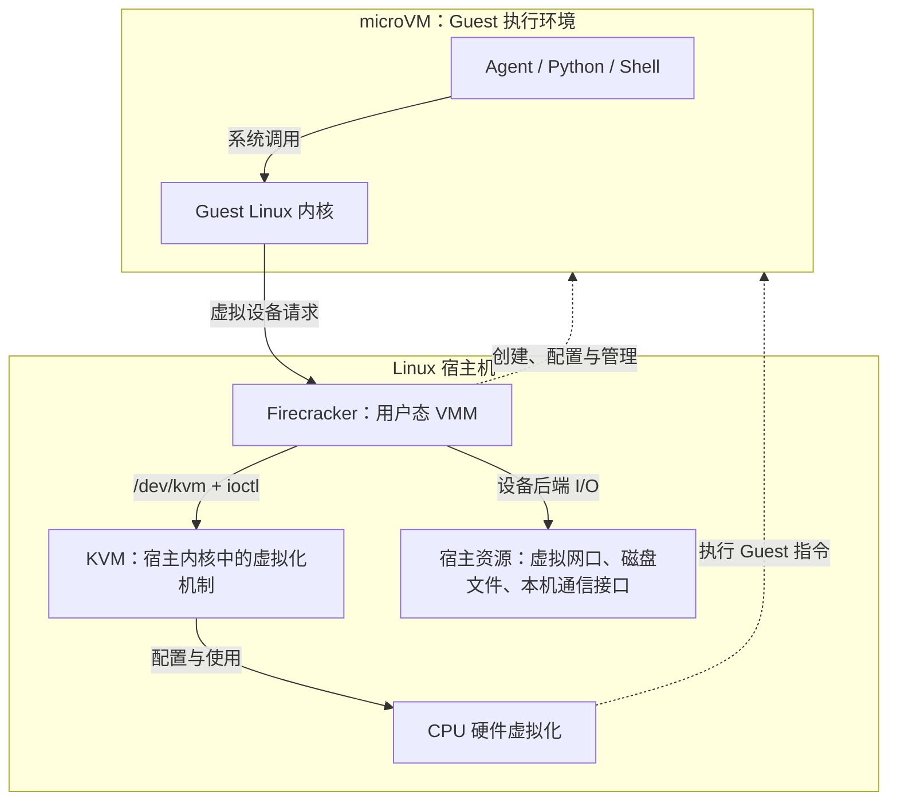
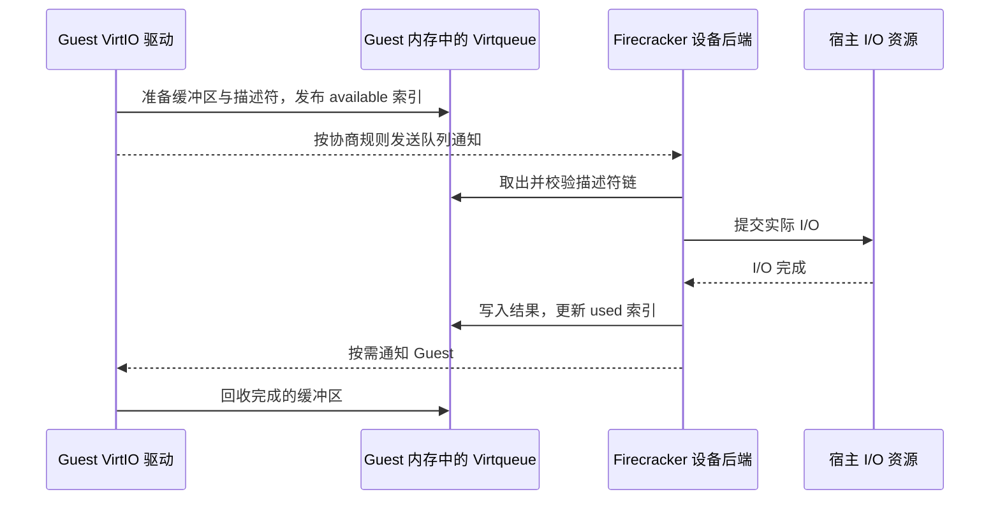
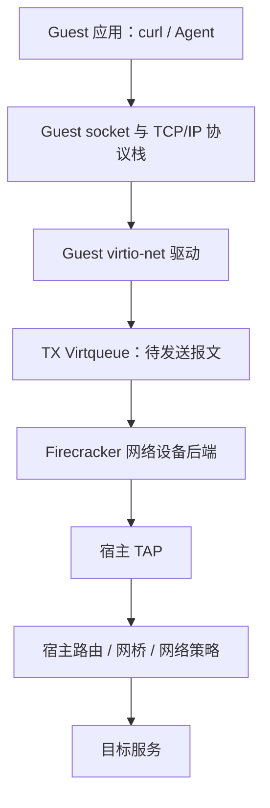
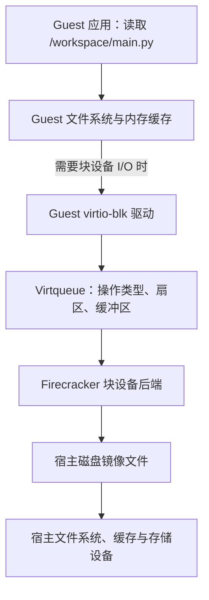
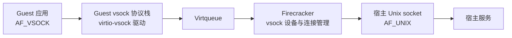
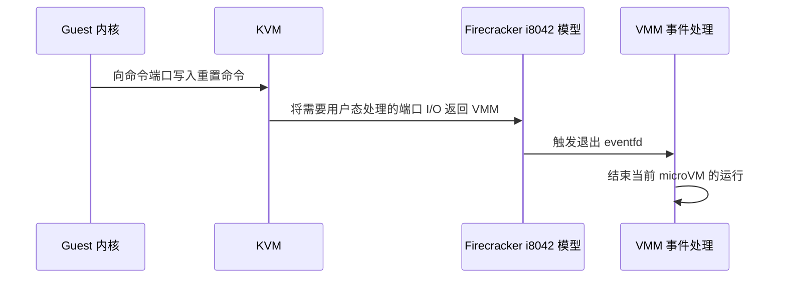

# Firecracker 与 KVM：从 microVM 架构到 VirtIO、时钟与控制台

microVM 可以先理解为一台设备配置精简的虚拟电脑。VM 是 Virtual Machine（虚拟机）的缩写，micro 强调它的轻量设计。在里面，Python 程序可以下载依赖、写入文件、等待超时，也可以通过终端输出日志。这些行为与普通 Linux 机器上很相似，但它背后并没有一套完整模拟出来的个人电脑硬件。

Firecracker 负责创建和管理这样的虚拟机，KVM 则是 Linux 内核提供的底层虚拟化机制。两者配合，让虚拟机里的程序使用真实机器的 CPU、内存和存储。理解这种分工，才能回答两个实际问题：**应用的每次操作经过哪里，以及这条路径的性能与安全边界在哪里。**

文中把运行 Firecracker 的系统叫作 **Host（宿主）**，把虚拟机内部的系统叫作 **Guest（客户机）**。例如，一台 Linux 服务器里启动了另一套虚拟的 Linux 系统：外面这套是 Host，里面那套是 Guest。

本文先建立架构关系，再分别拆解网络、磁盘、虚拟机通信、计时器、时钟、串口和键盘控制器。设备地址与传统计时器部分以 **x86_64 + KVM** 为主；x86_64 是常见 Intel、AMD 处理器使用的 64 位架构，ARM64 则是另一种 64 位处理器架构，它们的区别会在相关章节说明。

**文章目录**

1. [整体架构：Firecracker、KVM 与 microVM 各自负责什么](#chapter-1)
2. [VirtIO：驱动、设备后端与共享队列如何配合](#chapter-2)
3. [virtio-net：网络报文怎样离开 microVM](#chapter-3)
4. [virtio-blk：文件操作怎样变成宿主磁盘 I/O](#chapter-4)
5. [virtio-vsock：Guest 与宿主如何绕过 IP 网络通信](#chapter-5)
6. [PIT：谁负责在指定时刻触发中断](#chapter-6)
7. [KVM 时钟：Guest 怎样知道时间过去了多久](#chapter-7)
8. [串口控制台：没有图形设备，怎样观察和操作系统](#chapter-8)
9. [i8042：有限的键盘控制器怎样参与重置与退出](#chapter-9)
10. [设计取舍：这些机制对执行平台意味着什么](#chapter-10)

<a id="chapter-1"></a>

## 一、整体架构：Firecracker、KVM 与 microVM 各自负责什么

### 1.1 三者处于不同层次

先把 Host 与 Guest 放进一个具体例子：

```text
Linux 服务器上的系统：Host / 宿主
└─ Firecracker 创建的 microVM：一台虚拟机
   └─ 虚拟机里的 Linux：Guest / 客户机系统
      └─ Agent、Python、Shell 等应用
```

**Guest 描述的是“位于虚拟机里面”这个位置，不是一个软件名称，也不是登录用户。**因此，Guest 内核就是里面那套 Linux 的内核，Guest 应用就是在里面运行的程序。文中有时也用 Guest 泛指整台客户虚拟机。

内核是操作系统中管理 CPU、内存和设备的核心部分。Host 与 Guest 各有自己的内核；普通程序运行在**用户态**，内核运行在权限更高的**内核态**。这两种状态在 Host 和 Guest 中都存在，不能把 Guest 等同于用户态、Host 等同于内核态。

| 对象 | 所在位置或形态 | 核心职责 |
| --- | --- | --- |
| KVM（Kernel-based Virtual Machine） | 宿主 Linux 内核中的虚拟化子系统 | 提供虚拟 CPU、内存映射和中断等机制，配合 CPU 硬件虚拟化运行 Guest |
| Firecracker | 宿主机用户态的 VMM（虚拟机监控器）进程 | 创建和配置 VM、装载 Guest 内核、提供设备模型，并协调启动、暂停和状态保存 |
| microVM | 创建出来的轻量虚拟机实例 | 拥有自己的 Guest 内核、虚拟 CPU、内存和设备，运行应用 |

这里的 **vCPU 就是虚拟 CPU**；VMM 是 Virtual Machine Monitor（虚拟机监控器）的缩写，指创建和管理虚拟机的软件；**设备模型**则是用代码实现的设备行为，让 Guest 能像使用网卡、磁盘一样与它交互。

例如，要启动一台有 1 个 vCPU、512 MiB 内存的 microVM，Firecracker 负责准备内存、内核和设备，再通过 KVM 让虚拟 CPU 运行起来。MiB 是容量单位，1 MiB = 1024 × 1024 字节。**Firecracker 负责组织这台机器，KVM 提供底层运行能力，microVM 是最终运行的实例。**

它们之间的接口是 `/dev/kvm`，一个供程序访问 KVM 的设备文件。Firecracker 使用 `ioctl` 向 KVM 发出“创建 VM”“运行 vCPU”等请求。**系统调用**是程序向内核请求服务的入口，`ioctl` 是其中用于控制设备等对象的一种。[KVM API][kvm-api] · [Firecracker VM 实现][fc-vm]

下图中的 **I/O 是 Input/Output（输入/输出）**，本文主要指网络收发、磁盘读写等数据交换。



图中的 Guest 使用的仍是宿主 CPU 和内存。虚拟化让它拥有独立的执行环境，不需要为每台 microVM 配备一套物理硬件。

这也解释了运行条件：官方 Firecracker 的这条实现路径依赖 Linux 和可用的 KVM。macOS 不能原生提供该接口；在 Linux 虚拟机中运行时，还要确认上层平台开放了所需的**嵌套虚拟化**能力，也就是允许在虚拟机里面再运行虚拟机。仅有一个 Linux 用户空间或容器镜像并不足够。[运行要求][fc-getting-started] · [KVM 嵌套虚拟化][kvm-nested]

### 1.2 创建 VM 与运行应用是两条不同的路径

启动过程可以分成四件事，具体顺序还需满足架构和设备的要求：

1. **创建 VM**：打开 `/dev/kvm`，检查能力，调用 `KVM_CREATE_VM`。
2. **准备内存和内核**：告诉 KVM 哪些宿主内存用作 Guest 内存，再放入 Guest 内核和启动参数。
3. **准备 CPU 与设备**：创建 vCPU，设置启动状态，配置中断、磁盘和网卡等。中断是通知 CPU 有事件需要处理的机制，例如“磁盘读取完成了”。
4. **开始执行**：vCPU 线程调用 `KVM_RUN`，让 CPU 进入 Guest 执行。

`KVM_CREATE_VM` 本身不会自动带来完整的 Linux 系统；Guest 内核、内存布局、设备和启动状态都需要准备好。[VM 与内存登记][fc-vm] · [vCPU 执行循环][fc-vcpu]

运行后，可以用三个动作区分执行路径。表中的**驱动**是操作系统里与设备交互的代码；**设备寄存器**是设备接收命令、报告状态的位置，可以把它理解为设备的控制面板。

| Guest 中的动作 | 主要由谁处理 |
| --- | --- |
| 程序做加减运算 | CPU 在硬件虚拟化机制下执行 Guest 指令 |
| 程序调用 `write()` | 先进入 Guest 内核；如果只是写入缓存，暂时可以不访问虚拟磁盘 |
| 驱动访问需要宿主处理的设备寄存器 | 进入虚拟化处理路径，由 KVM 处理，必要时再交给 Firecracker |

**VM exit 指 CPU 暂时离开 Guest 执行，转去处理虚拟化事件，不表示虚拟机退出或关机。**有些事件由 KVM 处理后就能继续运行，有些需要返回 Firecracker。

需要返回 Firecracker 的事件包括部分 MMIO（内存映射 I/O）和 x86 端口 I/O。MMIO 通过特定内存地址访问设备寄存器，这些地址对应设备操作，而不是普通内存数据；端口 I/O 则通过专门的 I/O 端口访问设备。普通系统调用不等于 VM exit，VM exit 也不等于调用 Firecracker 管理 API；这里的 API 指供其他程序调用的接口。[通用 MMIO 处理][fc-vcpu] · [x86 端口 I/O 处理][fc-x86-vcpu]

### 1.3 Firecracker 进程内部也有分工

一个 Firecracker 进程封装一台 microVM，主要包含以下线程角色：

| 角色 | 处理什么 | 与应用执行的关系 |
| --- | --- | --- |
| API 线程 | 接收管理请求 | 配置和控制 VM，不是普通 I/O 的转发入口 |
| VMM 线程 | 事件循环、设备事件和控制操作 | 处理设备请求队列的通知、网络数据到达等事件 |
| vCPU 线程 | 每个 vCPU 对应一个线程，进入 `KVM_RUN` | 执行 Guest，并处理需要返回用户态的退出事件 |

可以把事件循环理解为“等待通知，再处理有事可做的设备”。表中列出的是主要角色；部分设备寄存器访问会直接在 vCPU 返回后的路径上处理，并非所有设备操作都只经过 VMM 线程。[内部架构][fc-design]

### 1.4 设备清单必须同时标明实现归属

Guest 能使用一项设备功能，不代表它全部由 Firecracker 实现。驱动可能在 Guest 内核中，设备后端可能在 Firecracker 中，部分机制则由 KVM 提供。**后端**指实际接收并处理请求的一侧；**VirtIO**是一套让虚拟机驱动与虚拟设备协作的标准接口，下一章会展开其工作方式。

| 能力 | Guest 中的使用者 | 主要实现位置 |
| --- | --- | --- |
| virtio-net（网络）、virtio-blk（磁盘）、virtio-vsock（虚拟机通信） | Guest 内核中的对应 VirtIO 驱动 | Firecracker 提供设备模型与后端连接；本文磁盘主线采用内置文件后端 |
| PIT，传统可编程间隔计时器 | Guest 的计时器相关代码 | x86 路径由 Firecracker 请求 KVM 创建内核态 PIT 模型 |
| kvm-clock | Guest 中与 KVM 协作读取时间的代码 | KVM 与 Guest 协作，Firecracker 配置并协调状态保存与恢复 |
| 串口控制台 | Guest 串口驱动、内核日志和终端程序 | Firecracker 的串口设备模型连接宿主输入输出 |
| 部分 i8042（传统键盘控制器）功能 | Guest 重置路径、键盘驱动 | Firecracker 实现有限命令与按键注入，用于重置通知等场景 |

本文分析的源码还包含提供随机数的熵设备、协助宿主回收 Guest 内存的 balloon 设备等；Firecracker 也有快照、限流、日志和进程隔离等能力。**快照**是保存虚拟机在某个时刻的状态，以便后续恢复，磁盘数据等外部资源还需配套管理。因此，上表是理解基础运行路径的主线，不能当作所有版本的完整功能清单。[VirtIO 模块列表][fc-virtio] · [传输实现][fc-transport] · [功能说明][fc-readme]

<a id="chapter-2"></a>

## 二、VirtIO：驱动、设备后端与共享队列如何配合

### 2.1 半虚拟化 I/O 的核心是双方约定接口

模拟真实网卡，需要模仿它的寄存器和各种硬件行为。VirtIO 换了一种合作方式：**Guest 驱动与设备后端约定好，直接用统一格式提交“发送这段数据”“读取这段磁盘”等请求。**

这里的“半虚拟化”，指驱动知道自己在使用这种专门为虚拟化设计的接口。应用不需要改变用法：Python 仍然读文件、发网络请求，由 Guest 内核中的驱动完成底层交互。[Linux VirtIO 文档][linux-virtio]

对 Firecracker 而言，准确的分工是：

- **Guest 前端驱动**：位于 Guest Linux 内核，提交和回收 I/O 请求。
- **设备模型与后端**：主要位于 Firecracker 用户态进程，处理队列，并访问宿主资源。
- **传输机制**：完成设备发现、配置、队列通知和中断，例如 MMIO 或 PCI。PCI 是一种设备总线标准，约定系统怎样发现和配置设备等行为；“采用哪种传输方式”与“提供网络还是磁盘功能”是不同维度。

因此，称 Firecracker“实现了 virtio-net 驱动”不够准确；Guest 驱动与 Firecracker 提供的设备端需要分别说明。[设备与传输接口][fc-transport]

### 2.2 Virtqueue：用待办清单交接 I/O 请求

可以先把 **Virtqueue（虚拟队列）**理解成一份双方共用的工作清单：Guest 填入任务，设备后端处理，再留下完成记录。本文实现使用 split virtqueue，即把描述符、待办信息和完成信息分开保存的队列：

| 结构 | 谁主要写入 | 内容 |
| --- | --- | --- |
| Descriptor table，描述符表 | Guest 驱动 | “任务材料在哪里”：缓冲区地址、长度、读写方向，以及链中下一项的编号 |
| Available ring，可用环 | Guest 驱动 | “哪些任务待处理”：已经准备好的描述符链编号 |
| Used ring，已用环 | 设备后端 | “哪些任务已完成”：处理完的编号与完成信息 |

这里的**缓冲区**就是暂时存放数据的一段内存；**描述符**记录数据在哪里、长度是多少，多个描述符按编号连接起来就形成描述符链。

例如，Guest 要写入 4 KiB（4096 字节）数据，准备好“请求头 → 数据 → 状态缓冲区”这条描述符链，假设链头编号为 7。它把 **7** 放入待处理列表；Firecracker 按编号找到请求和数据，处理完后把 **7** 记入完成列表。Guest 看到完成记录，就可以回收这次使用的缓冲区。

清单传递的是编号，数据仍在缓冲区里；所谓“环”，是指列表到末尾后可以回到开头继续使用。[队列与描述符实现][fc-queue] · [块请求解析][fc-block-request]



数据与通知在这里分开：**数据保存在缓冲区中，通知用于告诉对方该检查队列了。**一次通知可能对应多个请求；是否省略通知、如何批量处理，要遵守双方协商的特性与队列状态。

这份清单来自不可信的 Guest，后端必须检查编号、地址、长度和读写方向，不能照单全收。共享的是约定的 Guest 内存，不是任意宿主内存。

发布顺序也很重要：**先填好任务，再宣布“任务准备好了”。**否则后端可能读到半份内容。底层的内存屏障就是用来保证这类读写顺序的。[队列安全与顺序处理][fc-queue]

### 2.3 VirtIO 节省的到底是哪种切换

“VirtIO 减少用户态和内核态之间的切换，所以更快”只覆盖了部分可能发生的优化。虚拟化 I/O 至少涉及三种不同边界：

| 边界 | 例子 | VirtIO 带来的影响 |
| --- | --- | --- |
| Guest 用户态 ↔ Guest 内核态 | 应用调用 `write()`、`send()` | 普通系统调用仍然存在，VirtIO 不自动消除它们 |
| Guest 执行 ↔ 宿主虚拟化处理 | 设备通知或受拦截的寄存器访问 | 共享队列、批处理和通知抑制可减少部分交互成本 |
| 宿主用户态 ↔ 宿主内核态 | Firecracker 读写宿主虚拟网口、磁盘文件、本机通信接口 | 是否减少取决于后端、批处理、异步机制等实现 |

例如，驱动可以准备好多个请求，再按协商规则通知后端一起处理，减少逐个通知的开销。收益来自**更简单的设备交互、共享队列、批量处理与通知优化**；它不自动消除系统调用、数据拷贝或所有 VM exit，实际收益也取决于负载。

### 2.4 ioeventfd、irqfd 与事件循环如何衔接

如果 Virtqueue 是工作清单，通知机制就像门铃：清单里放任务，门铃只提醒对方来查看。Linux 的 `eventfd` 是可以被程序写入和监听的通知计数器。其中 fd 是文件描述符的缩写，指程序访问已打开文件等资源时使用的编号；它与上文 VirtIO 中描述缓冲区的描述符不是同一个概念。以 Firecracker 的 MMIO 路径为例：

```text
Guest 更新队列并写通知寄存器
    → KVM 的 ioeventfd 机制发出通知
    → Firecracker 事件循环处理对应队列
    → 后端完成请求，更新 used ring
    → 通过 irqfd 等中断机制通知 Guest
```

`ioeventfd` 主要用于“Guest 有请求了”：KVM 把匹配的设备通知转成 eventfd 事件，Firecracker 的事件循环收到后处理队列。`irqfd` 则把 eventfd 与 Guest 中断关联，用于通知 Guest 检查完成结果。

这省去了部分“vCPU 返回 Firecracker，只为了转交一个通知”的步骤。**硬件层面的 VM exit 仍可能发生，后端 I/O 也仍要执行。**门铃优化的是通知路径，数据继续通过队列和缓冲区传递。[MMIO 设备注册][fc-mmio] · [中断注册][fc-vm]

<a id="chapter-3"></a>

## 三、virtio-net：网络报文怎样离开 microVM

### 3.1 从一次 HTTP 请求追踪到宿主 TAP

应用执行 `curl` 这个网络请求工具时，Guest 应用和网络栈先把请求变成报文，virtio-net 再负责收发。**网络栈**是内核里处理 TCP/IP 等网络协议的代码；应用通过 **socket（套接字）**这个通信接口收发数据。图中的 TX 表示发送，后文的 RX 表示接收；TAP 是宿主上的虚拟网络接口。



TAP 可以看作接入宿主网络的一个虚拟网口，交换的是以太网帧，也就是带有链路层地址等信息的数据包。Firecracker 把发送队列中的报文交给 TAP，后续怎样路由、是否转换地址、允许访问哪里，由宿主网络配置决定。[网络设备实现][fc-net] · [TAP 实现][fc-tap] · [Linux TUN/TAP][linux-tap]

Firecracker 还可以处理特定的 MMDS 元数据请求。MMDS 是向 microVM 提供配置等元数据的服务，这条特殊路径不意味着 Firecracker 会代理所有 HTTP 请求。[网络后端中的 MMDS 分流][fc-net]

### 3.2 收包需要 Guest 提前提供缓冲区

接收时，Guest 驱动先预留内存，并通过 RX 队列告诉后端“收到的报文可以放这里”。TAP 有数据可读后，Firecracker 填入这些缓冲区，记录完成结果，再通知 Guest 处理。

如果没有可用接收缓冲区，后端不能凭空把报文塞入应用内存。队列容量、缓冲区供给、事件处理速度、宿主网络和 CPU 调度都会影响收发延迟。因此，发现网络慢时，仅测物理网卡带宽不足以定位问题。[接收与发送事件处理][fc-net]

### 3.3 网络设备、限流与授权各自解决什么

virtio-net 解决“让 Guest 收发报文”。Firecracker 的设备限流可约束带宽和操作速率，但不负责判断一次请求是否有业务权限，也不自动配置 DNS、网关或完整的出站策略。DNS 负责把域名解析成 IP 地址；网关帮助流量到达其他网络；出站策略决定允许向外访问哪些目标。

例如，允许一个 Agent 下载依赖，需要网络连通；禁止它访问宿主管理接口，则需要宿主防火墙或代理策略。Firecracker 官方设计把 Guest 出站流量视为不可信，并将流量过滤交给宿主层。[网络边界与限流][fc-design]

**给 Guest 一块网卡，只建立了通信能力；允许这块网卡连接哪里，仍是平台的决定。**

<a id="chapter-4"></a>

## 四、virtio-blk：文件操作怎样变成宿主磁盘 I/O

设备初始化、描述符队列与完整请求路径，见：[virtio-blk 原理：Guest 驱动如何与 Firecracker 完成磁盘 I/O](virtio-blk-driver-and-io-path.md)。

### 4.1 Guest 里的文件，怎样存进宿主磁盘镜像

Guest 可以把 `/dev/vda` 当作一块磁盘，并在上面使用 ext4 等文件系统。**文件系统**负责把磁盘上的数据组织成文件和目录，ext4 是 Linux 常用的一种。`/dev/vda` 则是 Guest 中的磁盘设备名称，并不是宿主磁盘的路径。

宿主侧，这块虚拟磁盘通常由一个镜像文件承载，例如 `rootfs.ext4`。可以把**磁盘镜像**理解为“用一个文件保存虚拟磁盘的内容”，这个承载文件也叫 **backing file**。rootfs 是根文件系统的简称，通常包含 Guest 启动和运行需要的系统文件；它不表示宿主的根目录。



例如，应用要读 `/workspace/main.py`，Guest 文件系统先查出文件数据位于虚拟磁盘的哪些位置，再发出块读取请求。Firecracker 据此读取 `rootfs.ext4` 的对应位置，**不用理解 `main.py` 的文件名和目录结构**。[块请求格式与解析][fc-block-request]

图中的内存缓存也会影响路径：如果 Guest 内存里已经有文件内容，读取可以不访问虚拟磁盘；写入则可能先进入缓存，稍后再向下提交。

### 4.2 一个块请求包含什么

**块设备**提供的是按位置读写数据的接口，不直接认识文件名。图中的扇区就是描述磁盘位置和范围时使用的单位。一个块请求要说清三件事：**读还是写、访问磁盘哪里、数据放在哪里。**Guest virtio-blk 驱动将它们组织成请求，Firecracker 校验后访问 backing file，再把完成状态写回 Guest。

读取时则由后端把数据写入 Guest 提供的可写缓冲区。读请求、写请求和状态区域的访问方向不同；设备不能仅因为地址落在 Guest 内存中，就忽略描述符的读写约定。[请求校验与完成处理][fc-block-request]

这条路径提供的是块存储，不是把任意宿主目录直接挂到 Guest。平台仍需决定镜像来自哪里、哪些磁盘只读、每个任务的写入保存在哪里，以及多个实例是否会错误地共用同一份可写镜像。

### 4.3 Sync、Async 与 vhost-user 是后端实现选择

Sync 指同步，Async 指异步。可以用“发起读取后是否在原处等待”来理解它们：同步 I/O 调用等结果返回；异步方式先提交请求，完成后再取结果，期间可以处理其他事件。异步增加了安排并发的空间，并不让每次物理读写都自动变快。

Guest 使用同一种 virtio-blk 接口，宿主可以采用不同后端：

| 后端路径 | 请求由谁执行 | 主要取舍 |
| --- | --- | --- |
| 内置 Sync | Firecracker 使用同步文件 I/O | 路径直接，但阻塞 I/O 可能影响处理延迟 |
| 内置 Async | Firecracker 使用 Linux 异步 I/O 接口 `io_uring` 提交并回收 I/O | 可以让多个请求处于等待完成的状态，收益取决于负载、存储与 CPU 资源 |
| vhost-user block | 外部用户态后端进程处理队列 | 可以接入不同存储实现，同时增加进程管理、共享内存与故障协调责任 |

在本文分析的源码版本中，Async 与 vhost-user block 文档仍标为 Developer Preview（开发者预览阶段）。它们也不是“开启就一定更快”的开关；初始化成本、小请求延迟、并发深度和实例密度都可能影响结果。[I/O 引擎说明][fc-block-engine] · [同步实现][fc-block-sync] · [异步实现][fc-block-async] · [vhost-user block][fc-vhost-block]

**Unix socket 用于同一个操作系统内的进程通信**，不依赖 IP 路由；在这里，两端进程都位于宿主。vhost-user block 使用它交换配置、内存区域和通知文件描述符等控制信息，实际块数据通过共享内存中的队列与缓冲区处理。它不能与后文“承载应用字节流的 vsock 到 Unix socket 桥接”混为一谈。[vhost-user block 架构][fc-vhost-block]

### 4.4 写成功与持久化成功需要分开判断

假设程序保存了 `result.json`，`write()` 也返回成功，随后宿主突然断电。文件仍可能丢失，因为数据可能只写进了某一层内存缓存。

缓存像临时存放区，持久存储才负责断电后保留数据。一次需要保证持久化的写入，要让数据经过 Guest 缓存、虚拟磁盘和宿主缓存，最终到达持久存储。`fsync` 是应用请求把文件修改同步到存储的系统调用；块设备 `flush` 是设备层的缓存刷新请求。两者处于不同层次，用于推动这条链路，具体效果取决于各层支持。

本文提交提供两种块设备缓存策略：

- `Unsafe`：默认策略，不向 Guest 宣告 VirtIO flush 功能，不能依赖这条刷新链获得持久化保证。
- `Writeback`：宣告 flush 功能；协商成功后，Guest 发出的块设备刷新请求会由内置后端转换为 backing file 的 `fsync`。

如果应用要求持久化，Guest 文件系统、驱动、设备配置和宿主存储必须共同满足相应语义。名称中的 “Writeback” 并不意味着每次写都同步落盘，它提供的是正确处理刷新请求的路径。[缓存策略][fc-block-cache] · [同步后端 flush 实现][fc-block-sync]

<a id="chapter-5"></a>

## 五、virtio-vsock：Guest 与宿主如何绕过 IP 网络通信

### 5.1 它解决的是本机宿主与 Guest 之间的通信

平台经常需要向 Guest 里的执行服务发送任务，并接收日志、退出码或健康状态。可以通过 TCP 实现，但这会涉及 IP 地址、路由和端口管理。

**vsock 是为虚拟机与宿主等端点通信设计的 socket 机制**。它使用 CID 与端口定位目标：**CID 可以理解为通信端点的编号，端口则标识这个端点上的服务**，类似“找哪台机器，再找其中哪个服务”。这里使用的是 vsock 自己的编号与端口，不是 IP 地址与 TCP 端口。

Guest 程序使用 `AF_VSOCK`，Firecracker 在宿主侧连接 `AF_UNIX`，也就是同一宿主机内使用的 Unix socket。`AF` 表示地址族，可以理解为程序创建 socket 时选择的通信类型；前者选择虚拟机通信，后者选择本机进程通信。这条路径不需要为 Guest 配置 IP 地址和路由。



这些箭头表示 Guest 发起数据传递的方向，建立连接后可以双向交换数据。Firecracker 实现连接管理、流量转换和队列处理，Guest 驱动与宿主服务分别使用自己一侧的 socket 接口。[vsock 设计][fc-vsock-doc] · [设备实现][fc-vsock-device] · [Unix socket 后端][fc-vsock-unix]

### 5.2 两个方向怎样建立连接

假设设备配置中的 `uds_path` 是 `/run/task/vsock.sock`，应用端口使用 `8000`。UDS 是 Unix Domain Socket 的缩写，因此 `uds_path` 指宿主侧 Unix socket 的路径：

| 连接发起方 | 建立过程 |
| --- | --- |
| 宿主 → Guest | Guest 服务监听 vsock 端口 `8000`；宿主连接 `/run/task/vsock.sock`，发送文本握手 `CONNECT 8000\n`，成功后收到 `OK <宿主侧端口>\n`，再交换应用数据 |
| Guest → 宿主 | 宿主服务监听 `/run/task/vsock.sock_8000`；Guest 连接 `CID=2`、端口 `8000`；Firecracker 将请求转接到对应 Unix socket |

这里的 `\n` 表示一个换行字节，`CID=2` 表示宿主端。实际路径应结合 jailer 和实例目录规划，不能让不同实例意外占用同一个 socket 名称。**jailer 是为 Firecracker 设置隔离环境并降低运行权限的启动程序**；它会影响进程能看见哪些路径。[双向连接协议][fc-vsock-doc] · [jailer 与进程隔离][fc-design]

例如，宿主通过连接发送 `{"cmd":"pytest"}`，Guest 里的执行服务读懂消息后运行测试，再返回结果。**vsock 负责送达消息，执行服务负责理解和执行消息。**Firecracker 管理 API 的 socket 则用于配置 VM，与这条应用通信通道分开。

### 5.3 vsock、VirtIO、vhost 与 vhost-user 的区别

vsock 通道传递的是命令文本、日志等应用数据。Firecracker 在用户态桥接两端 socket，这条实现路径会绕过宿主 vhost 内核代码，并不向宿主传送或安装内核代码。[Firecracker vsock 设计][fc-vsock-doc]

可以用下面的关系区分几个名称：

| 名称 | 表达的是什么 |
| --- | --- |
| VirtIO | 驱动与设备之间的标准接口与队列机制 |
| virtio-vsock | 基于 VirtIO 的一种设备类型，为 vsock 通信提供传输 |
| 内核 vhost，例如 vhost-net、vhost-vsock | 把相应 VirtIO 后端处理放在宿主内核中的实现方式 |
| vhost-user | 通过协议将后端队列处理交给另一个用户态进程 |

采用 VirtIO 不等于必须采用内核 vhost。Firecracker 内置 vsock 后端与可选 vhost-user block 路径，恰好展示了“设备接口”与“后端放在哪里”是两个独立决定。[vhost-user 协议][qemu-vhost] · [Firecracker vhost-user block][fc-vhost-block]

### 5.4 没有 IP 网络，仍然有信任边界

vsock 让通信不依赖 Guest 的 IP 配置，但不自动完成业务授权。宿主服务应根据可信的实例映射与任务身份决定权限，并校验消息、参数和资源范围。不能因为消息来自一个 vsock 通道，就允许执行任意宿主命令。

连接生命周期也需要处理：Firecracker 快照恢复不能保证旧 vsock 连接继续存在，Guest 已有监听 socket 可以保留并接受新连接，但已建立连接需要重新建立。任务协议要能处理重连、重复请求和结果确认。[快照中的 vsock 重置][fc-snapshot]

<a id="chapter-6"></a>

## 六、PIT：谁负责在指定时刻触发中断

### 6.1 计时器负责产生事件

可以先用手表和闹钟区分两种作用：**时钟告诉你现在到了什么时间，计时器负责到点提醒。**PIT 是 Programmable Interval Timer（可编程间隔计时器）的缩写，承担的主要是后者：Guest 设置好计数值和模式，到达条件后，它通过中断提醒 Guest 内核。[Linux 时间抽象][linux-time]

例如，要每隔约 10 毫秒触发一次事件，就选择相应周期模式并设置计数值。“可编程”指这些参数可以调整，不是把一段程序交给 PIT 执行。

底层按时钟脉冲计数：传统 i8254 PIT 的基准频率约为 1.193182 MHz，即每秒约 119 万次计数脉冲；周期计数值取约 11932，就对应约 10 毫秒。它有三个 16 位计数通道，通道 0 连接 IRQ 0。**IRQ 指中断请求，后面的数字用于标识中断线路。**理解日常运行路径时，先抓住“设置计数，到点触发事件”即可。[PIT 结构与模式][kvm-time]

### 6.2 Firecracker 请求 KVM 创建 PIT

在本文分析的 x86 源码中，`KvmVm::setup_irqchip()` 先创建内核中断控制器，再调用 `create_pit2()`。因此，PIT 的设备模型主要由 KVM 在宿主内核中提供，Firecracker 负责初始化和状态协调。

```text
Firecracker 初始化 VM
    → 请求 KVM 创建中断控制器与 PIT

Guest 编程 PIT 的计数值与模式
    → KVM 维护虚拟 PIT 状态
    → 到期后通过虚拟中断机制通知 Guest
    → Guest 内核处理定时事件
```

源码中的 `KVM_PIT_SPEAKER_DUMMY` 让 KVM 对旧式扬声器端口做最低限度的响应，避免仅为这类访问返回 Firecracker；它没有提供完整音频功能。[PIT 初始化源码][fc-x86-vm]

### 6.3 PIT 不是所有定时行为的唯一来源

现代 x86 Guest 还可能使用本地 APIC 定时器、TSC deadline 等机制。**本地 APIC 是 CPU 上的本地中断控制器**，其中也有定时功能；**TSC 是 CPU 的时间戳计数器**，TSC deadline 则允许设置一个目标计数值，到达时触发中断。

一次 `sleep()`（让程序暂时休眠）最终由哪种时钟事件设备唤醒，要看 Guest 内核、CPU 暴露能力与配置，不能直接等同为“Firecracker 的 PIT 每次唤醒应用”。ARM64 也有自己的体系结构定时器路径，不能套用这套传统 PC 设备图。[x86 时间虚拟化][kvm-time]

“到点提醒”也不等于“应用立刻执行”。宿主 CPU 繁忙时，vCPU 可能需要等待调度；Guest 内核收到提醒后，应用也可能继续排队。因此，定时 10 毫秒不保证应用恰好在第 10 毫秒继续运行。

<a id="chapter-7"></a>

## 七、KVM 时钟：Guest 怎样知道时间过去了多久

### 7.1 kvm-clock 解决高效读取时间的问题

`kvm-clock` 是 x86 KVM 提供的半虚拟化时钟。它的思路是：**KVM 给 Guest 一个时间基准和换算方法，Guest 再根据 CPU 计数器的增量推算时间，不必每次都向设备询问。**

假设某个基准时刻是 10 秒，之后计数器的增量换算成了 2 毫秒，当前时间就约为 10.002 秒。实际计算关系可以简写为：

```text
估算时间 ≈ 基准时间 + 换算（当前 TSC − 基准 TSC）
```

这里的 TSC 是 CPU 时间戳计数器，换算要使用 KVM 提供的乘数和移位参数。底层过程是：

1. Guest 通过 KVM 定义的 MSR 寄存器接口，登记用于存放时间信息的内存地址。MSR 是 x86 的一类特殊寄存器接口，可用于配置处理器或虚拟化相关功能。
2. KVM 写入时间基准、TSC 基准和换算参数。
3. Guest 读取当前计数，完成换算，并检查版本字段。

检查版本是为了防止混读新旧数据：如果 KVM 正在更新基准，Guest 不能拿“旧基准”配上“新换算参数”。[KVM 时间 MSR 与换算定义][kvm-msr]

### 7.2 kvm-clock、TSC 与 PIT 怎样区分

| 机制 | 主要作用 | 本文中的归属 |
| --- | --- | --- |
| kvm-clock | 以半虚拟化方式提供时间信息 | KVM 与 Guest 时钟代码协作 |
| TSC | x86 CPU 时间戳计数器，可作为时钟源基础 | 硬件与虚拟化机制支持，是否适用由 Guest 判断 |
| PIT / 其他时钟事件设备 | 在设定条件下产生定时事件 | 由相应硬件虚拟化或设备模型提供 |

Firecracker 在 x86_64 上暴露 `kvm-clock` 与 `tsc`。**时钟源**是内核用来读取计数、计算经过时间的来源。Guest 使用哪个时钟源取决于内核与稳定性判断，不能把“支持 kvm-clock”理解成“始终使用 kvm-clock”。其 ARM64 路径使用的是 `arch_sys_counter`，即 ARM 架构的系统计数器。[Firecracker 时钟源说明][fc-design]

应用还会区分“现在是几点”与“这次操作用了多久”：**墙上时间**表示日期和时刻，例如 10:30，可以因校时而调整；**单调时间**按自己的时间基准向前推进，不会因为修改日期而倒退，因此更适合计算耗时。Guest 内核在底层计数器之上维护这些时间，`date` 命令输出的并不是原始计数值。

### 7.3 暂停与恢复后，时间需要单独处理

例如，10:00 创建快照时，某个令牌还有 5 分钟有效期。10:10 恢复这份快照，内存里仍然存着令牌，但外部服务已经认为它过期。恢复 VM 状态不会延长外部授权。

本文提交的文档说明：在符合条件的 x86 `kvm-clock` 路径上，可以通过 `clock_realtime` 选项推进恢复后的时钟；它也可能带来 Guest 观察到的时间跳变。实际使用要核对时钟源、宿主支持和恢复参数。[时钟状态保存与恢复][fc-x86-vm] · [快照恢复说明][fc-snapshot]

恢复任务时，应重新检查令牌、任务取消状态和租约，不能只看快照中留下的旧状态。这里的**租约**指在一段时间内有效的资源使用权，例如“这个任务在接下来的 30 秒内可以继续占用某个资源”。

<a id="chapter-8"></a>

## 八、串口控制台：没有图形设备，怎样观察和操作系统

### 8.1 串口把 Guest 的字符输入输出接到宿主

串口可以看作一条不依赖 Guest 网络的文字通道。Firecracker 提供 UART（通用异步收发器）设备模型，也就是用代码实现串口收发功能。Guest 使用串口驱动，在典型 x86 配置中可以把 `ttyS0` 作为控制台，输出启动日志和错误信息。**控制台是系统收发管理信息的终端通道**；`ttyS0` 是 Linux 中第一个这类串口设备的名称，对应 Guest 中的 `/dev/ttyS0`。

```text
Guest 内核日志，或连接到串口的终端程序
    → Guest 串口驱动
    → 虚拟 UART 寄存器
    → Firecracker 串口模型
    → 宿主标准输出或配置的输出目标
```

x86 的 COM1，也就是传统 PC 上第一个串口，在本文实现中注册于 I/O 端口 `0x3f8`，串口中断使用 IRQ 4。`0x` 前缀表示十六进制数。相关端口访问由虚拟化路径交给 Firecracker 的设备模型处理；这些地址不能直接套用于 ARM64。[传统设备注册][fc-legacy] · [串口实现][fc-serial]

### 8.2 串口设备、内核控制台与登录服务是三件事

内核启动参数中的 `console=ttyS0` 用于选择串口控制台。想要在控制台看到交互式登录提示，还需要 Guest 用户空间启动相应的 getty 或其他终端服务。**getty 是负责准备终端、显示登录提示并接入登录流程的程序**。

例如，控制台已经能显示启动日志，却没有 `login:` 提示，可能只是 Guest 没有启动串口登录服务。应用日志是否显示在这里，则取决于标准输出和日志系统的配置。[启动参数示例][fc-getting-started] · [串口配置][fc-serial-config]

宿主侧的输入也可以进入虚拟 UART，再由 Guest 读取。本文提交支持配置串口输出目标与限流；具体如何接入日志收集，应结合进程启动方式和输出配置确定。[串口输入输出实现][fc-serial]

### 8.3 控制台应承担什么角色

启动失败时，网络服务和 Guest 执行服务可能尚未可用，串口却能提供更早期的线索。这是精简执行环境仍保留它的重要理由。

长期的结构化任务通信通常更适合走 vsock 或网络上的应用协议。串口输出是字符流，混合内核日志与命令输出后，不容易可靠地判断请求归属和完成状态；高频串口输出也会消耗设备处理与日志资源。

**串口负责让系统在早期和故障时仍可观察；任务协议负责可靠地表达一次操作的输入、输出与结果。**

<a id="chapter-9"></a>

## 九、i8042：有限的键盘控制器怎样参与重置与退出

### 9.1 为什么精简虚拟机还保留键盘控制器

传统 x86 的 i8042 控制器除键盘相关功能外，还提供可触发 CPU 重置的接口。Guest 内核可以使用这条传统路径表达重启请求。

Firecracker 的实现保留了必要的控制寄存器、缓冲区、重置命令和有限按键注入能力。它不是面向桌面交互的完整键盘设备，因此“仅包含关机键的键盘”容易掩盖其真正用途。[i8042 实现][fc-i8042]

### 9.2 Guest 发出重置命令后发生什么

在这条路径里，Guest 表达“我要重启”，Firecracker 的处理结果是结束当前 microVM。具体信号是：Guest 向 i8042 命令端口 `0x64` 写入重置命令 `0xFE`，设备模型再触发退出事件。



这也是官方入门示例在配置相应重启路径后，可以用 Guest 内的 `reboot` 结束 Firecracker 的原因。平台如果希望“重启后获得一台新的可用实例”，还需要自行安排再次启动；不能把 Guest 重置命令理解为 VMM 自动完成整套重建流程。[重置处理源码][fc-i8042] · [入门示例中的退出行为][fc-getting-started]

### 9.3 宿主发送 Ctrl+Alt+Del 是另一个方向

x86 上的 `SendCtrlAltDel` 管理操作，会通过 i8042 注入 Ctrl、Alt、Delete 的扫描码，并触发相应键盘中断，让 Guest 的驱动和用户空间处理。**扫描码是表示某个按键按下或释放的编码**；注入扫描码，就是让 Guest 收到类似真实按键的输入事件。

```text
宿主管理请求 SendCtrlAltDel
    → Firecracker 注入扫描码
    → Guest 键盘驱动接收
    → Guest 根据自身配置处理 Ctrl+Alt+Del
    → 如进入重启流程，再通过相应机制通知 VMM
```

这相当于向 Guest 发出“请处理这组按键”的请求，接下来做什么由 Guest 决定。如果 Guest 已经卡死、无法处理键盘事件，请求也可能不起作用。[按键注入实现][fc-i8042] · [管理操作定义][fc-rpc]

因此，正常退出、Guest 重置、强制终止宿主 VMM 进程应分别建模。正常退出可以给应用清理和刷盘的机会；强制终止需要接受未完成 I/O 与清理不完整的后果。平台应根据任务状态和超时策略决定采用哪条路径。

<a id="chapter-10"></a>

## 十、设计取舍：这些机制对执行平台意味着什么

### 10.1 Firecracker 与 QEMU + KVM 的差别在哪里

**QEMU 是支持多种机器类型和设备的虚拟机软件**，可以与 KVM 配合执行 Guest。它和 Firecracker 都可以使用 KVM 与 VirtIO，所以“使用了 KVM”或“使用了 VirtIO”本身并不能解释 Firecracker 的价值。差异在于提供多大的设备与机器模型范围，以及围绕什么负载组织实现。

| 比较维度 | Firecracker | QEMU + KVM |
| --- | --- | --- |
| 目标 | 面向轻量隔离执行环境的 microVM | 覆盖更广泛的虚拟机与硬件兼容需求 |
| 设备与机器模型 | 聚焦有限的设备集合，控制功能范围 | 提供丰富的机器类型、设备模型与后端配置 |
| I/O 基础 | 可以采用 VirtIO 与 KVM 通知机制 | 同样支持 VirtIO，并有多种后端与加速配置 |
| 使用前要确认 | 目标 Guest、设备能力与生命周期接口能否满足负载 | 所选机器类型、设备与配置是否符合负载及运维需求 |

精简设备模型有助于减少需要实现、维护和暴露给 Guest 的接口，降低部分资源与安全审计负担。但实际性能仍受 Guest 启动服务、镜像、网络、存储、调度及配置影响。不能由“功能更少”直接推导出所有场景的性能排名。[Firecracker 设计目标][fc-readme] · [QEMU 功能说明][qemu-intro]

### 10.2 从设备能力推导平台责任

回到一个需要下载依赖、修改项目、运行测试的 Agent：

| 应用需要做的事 | 底层主要机制 | 平台还需要完成的部分 |
| --- | --- | --- |
| 执行代码 | Guest 内核、vCPU、KVM 与硬件虚拟化 | 镜像准备、资源分配、身份与生命周期管理 |
| 访问外部服务 | virtio-net 与 TAP | 路由、DNS、出站策略与业务授权 |
| 保存项目文件 | Guest 文件系统、virtio-blk 与宿主存储 | 写入隔离、刷新策略、持久化与磁盘一致性 |
| 发送任务、返回结果 | virtio-vsock 与 Unix socket | Guest 执行服务、消息协议、鉴权、重连与去重 |
| 处理超时 | Guest 时间与定时事件机制 | 宿主侧截止时间、取消策略与恢复后状态核验 |
| 获取启动和故障线索 | 串口控制台 | 日志收集、限流、归属与访问控制 |
| 停止或重建环境 | Guest 退出路径、i8042 等通知与 VMM 生命周期 | 优雅退出期限、强制回收、存储清理与实例重建 |

这种分工也决定了安全设计：Firecracker 的设备后端会读取 Guest 提供的队列和数据，所以后端仍处在处理不可信输入的边界上。设备校验、宿主进程降权、seccomp 和 jailer 等约束需要共同工作。**seccomp 是 Linux 用来限制进程能使用哪些系统调用、如何使用它们的机制**；它与 jailer 设置的隔离环境配合，约束 Firecracker 进程能访问的宿主能力。减少设备数量只是其中一项措施。[队列校验][fc-queue] · [Firecracker 进程隔离][fc-design]

### 10.3 把整条路径连起来

理解 Firecracker 与 KVM，可以记住四组关系：

1. **运行关系**：KVM 配合硬件提供虚拟化机制，Firecracker 组织 VM 与设备，microVM 承载 Guest 内核和应用。
2. **I/O 关系**：Guest 驱动提交请求，VirtIO 队列描述缓冲区，设备后端完成宿主 I/O，通知机制让双方继续推进。
3. **时间与控制关系**：时钟提供时间信息，定时器产生事件，串口提供字符通道，i8042 保留有限的重置与按键通知功能。
4. **平台关系**：设备提供执行与通信能力，平台负责权限、持久化、恢复和任务语义。

沿着“应用接口 → Guest 内核 → 虚拟设备 → Firecracker / KVM → 宿主资源”追踪一次操作，就能判断问题发生在哪一层，也能说明某项优化改变了哪段路径、又保留了哪些边界。

继续阅读：[Agent-Sandbox：Firecracker 运行路径与安全边界](agent-sandbox-firecracker-runtime-and-security-boundaries.md) · [Agent Sandbox 怎么选：Agent 放在哪里，底层用什么隔离？](agent-sandbox-project-selection.md)。

资料核对日期：2026-09-26。本文依据官方资料与指定提交的源码分析，未对启动延迟、I/O 吞吐或恢复行为进行实机测量；部署时应核对所选发行版本、Guest 内核与宿主配置。

[fc-commit]: https://github.com/firecracker-microvm/firecracker/tree/30471852666564d980f330d0575115eda7d5ce8e
[fc-readme]: https://github.com/firecracker-microvm/firecracker/blob/30471852666564d980f330d0575115eda7d5ce8e/README.md
[fc-design]: https://github.com/firecracker-microvm/firecracker/blob/30471852666564d980f330d0575115eda7d5ce8e/docs/design.md
[fc-getting-started]: https://github.com/firecracker-microvm/firecracker/blob/30471852666564d980f330d0575115eda7d5ce8e/docs/getting-started.md
[fc-vm]: https://github.com/firecracker-microvm/firecracker/blob/30471852666564d980f330d0575115eda7d5ce8e/src/vmm/src/vstate/vm.rs
[fc-vcpu]: https://github.com/firecracker-microvm/firecracker/blob/30471852666564d980f330d0575115eda7d5ce8e/src/vmm/src/vstate/vcpu.rs
[fc-x86-vm]: https://github.com/firecracker-microvm/firecracker/blob/30471852666564d980f330d0575115eda7d5ce8e/src/vmm/src/arch/x86_64/vm.rs
[fc-x86-vcpu]: https://github.com/firecracker-microvm/firecracker/blob/30471852666564d980f330d0575115eda7d5ce8e/src/vmm/src/arch/x86_64/vcpu.rs
[fc-virtio]: https://github.com/firecracker-microvm/firecracker/blob/30471852666564d980f330d0575115eda7d5ce8e/src/vmm/src/devices/virtio/mod.rs
[fc-transport]: https://github.com/firecracker-microvm/firecracker/blob/30471852666564d980f330d0575115eda7d5ce8e/src/vmm/src/devices/virtio/transport/mod.rs
[fc-queue]: https://github.com/firecracker-microvm/firecracker/blob/30471852666564d980f330d0575115eda7d5ce8e/src/vmm/src/devices/virtio/queue.rs
[fc-mmio]: https://github.com/firecracker-microvm/firecracker/blob/30471852666564d980f330d0575115eda7d5ce8e/src/vmm/src/device_manager/mmio.rs
[fc-net]: https://github.com/firecracker-microvm/firecracker/blob/30471852666564d980f330d0575115eda7d5ce8e/src/vmm/src/devices/virtio/net/device.rs
[fc-tap]: https://github.com/firecracker-microvm/firecracker/blob/30471852666564d980f330d0575115eda7d5ce8e/src/vmm/src/devices/virtio/net/tap.rs
[fc-block-request]: https://github.com/firecracker-microvm/firecracker/blob/30471852666564d980f330d0575115eda7d5ce8e/src/vmm/src/devices/virtio/block/virtio/request.rs
[fc-block-sync]: https://github.com/firecracker-microvm/firecracker/blob/30471852666564d980f330d0575115eda7d5ce8e/src/vmm/src/devices/virtio/block/virtio/io/sync_io.rs
[fc-block-async]: https://github.com/firecracker-microvm/firecracker/blob/30471852666564d980f330d0575115eda7d5ce8e/src/vmm/src/devices/virtio/block/virtio/io/async_io.rs
[fc-block-cache]: https://github.com/firecracker-microvm/firecracker/blob/30471852666564d980f330d0575115eda7d5ce8e/docs/api_requests/block-caching.md
[fc-block-engine]: https://github.com/firecracker-microvm/firecracker/blob/30471852666564d980f330d0575115eda7d5ce8e/docs/api_requests/block-io-engine.md
[fc-vhost-block]: https://github.com/firecracker-microvm/firecracker/blob/30471852666564d980f330d0575115eda7d5ce8e/docs/api_requests/block-vhost-user.md
[fc-vsock-doc]: https://github.com/firecracker-microvm/firecracker/blob/30471852666564d980f330d0575115eda7d5ce8e/docs/vsock.md
[fc-vsock-device]: https://github.com/firecracker-microvm/firecracker/blob/30471852666564d980f330d0575115eda7d5ce8e/src/vmm/src/devices/virtio/vsock/device.rs
[fc-vsock-unix]: https://github.com/firecracker-microvm/firecracker/blob/30471852666564d980f330d0575115eda7d5ce8e/src/vmm/src/devices/virtio/vsock/unix/muxer.rs
[fc-snapshot]: https://github.com/firecracker-microvm/firecracker/blob/30471852666564d980f330d0575115eda7d5ce8e/docs/snapshotting/snapshot-support.md
[fc-legacy]: https://github.com/firecracker-microvm/firecracker/blob/30471852666564d980f330d0575115eda7d5ce8e/src/vmm/src/device_manager/legacy.rs
[fc-serial]: https://github.com/firecracker-microvm/firecracker/blob/30471852666564d980f330d0575115eda7d5ce8e/src/vmm/src/devices/legacy/serial.rs
[fc-serial-config]: https://github.com/firecracker-microvm/firecracker/blob/30471852666564d980f330d0575115eda7d5ce8e/src/vmm/src/vmm_config/serial.rs
[fc-i8042]: https://github.com/firecracker-microvm/firecracker/blob/30471852666564d980f330d0575115eda7d5ce8e/src/vmm/src/devices/legacy/i8042.rs
[fc-rpc]: https://github.com/firecracker-microvm/firecracker/blob/30471852666564d980f330d0575115eda7d5ce8e/src/vmm/src/rpc_interface.rs
[kvm-api]: https://docs.kernel.org/virt/kvm/api.html
[kvm-nested]: https://www.kernel.org/doc/html/latest/virt/kvm/x86/running-nested-guests.html
[kvm-msr]: https://docs.kernel.org/virt/kvm/x86/msr.html
[kvm-time]: https://docs.kernel.org/virt/kvm/x86/timekeeping.html
[linux-virtio]: https://docs.kernel.org/driver-api/virtio/virtio.html
[linux-time]: https://docs.kernel.org/timers/timekeeping.html
[linux-tap]: https://docs.kernel.org/networking/tuntap.html
[qemu-intro]: https://www.qemu.org/docs/master/system/introduction.html
[qemu-vhost]: https://www.qemu.org/docs/master/interop/vhost-user.html
