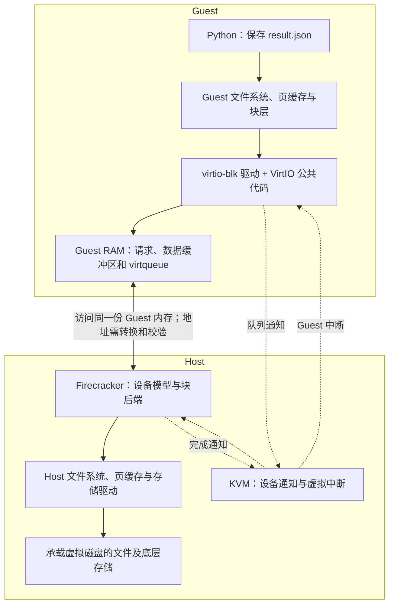
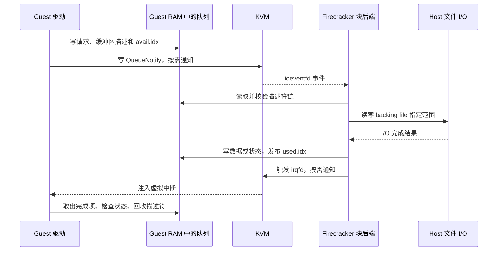
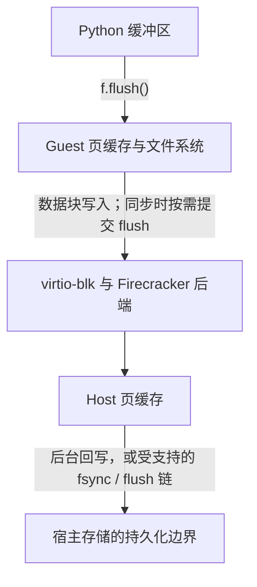
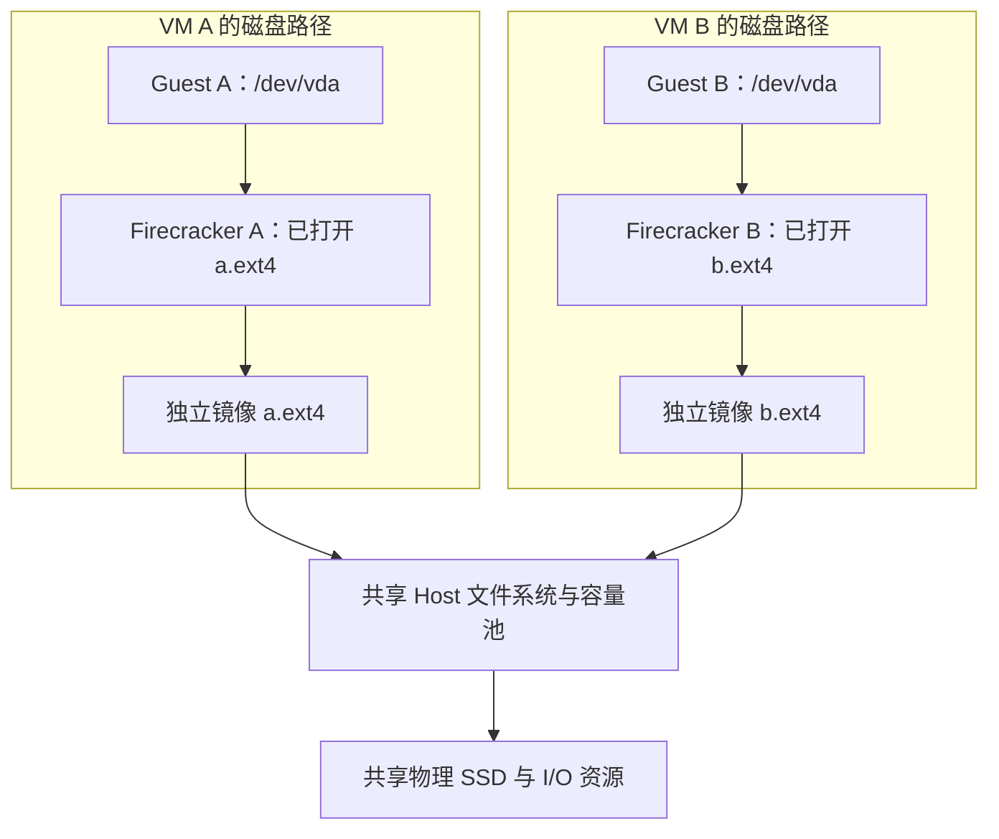

# virtio-blk 原理：Guest 驱动如何与 Firecracker 完成磁盘 I/O

**Guest 的 virtio-blk 驱动由 Guest Linux 内核调用；Firecracker 提供它所操作的虚拟块设备。两端按照 VirtIO 协议，通过设备寄存器、共享内存队列和中断交换请求与结果。**

例如，Python 保存一个文件时，Firecracker 不会去调用 Guest 中的某个驱动函数。Guest 内核先把文件操作转换成磁盘请求，驱动把请求放进约定的队列，Firecracker 再取出请求、访问宿主文件，并通知 Guest 完成。

virtio-blk 的价值就在这里：**应用继续使用 Linux 文件接口，Guest 使用标准驱动，VMM 则用相对精简的设备实现提供磁盘能力。**双方直接交换块请求，不必为了兼容某块实体磁盘控制器，完整模拟它的寄存器和工作模式。[Linux VirtIO 架构][linux-virtio]

下面沿 [Linux v6.12][linux-commit] 与 [Firecracker `3047185`][fc-commit] 的源码展开，主线是 **virtio-mmio、split virtqueue、Firecracker 内置文件后端**。PCI 传输和外部 vhost-user 后端是其他路径，不能把它们的细节混进这条调用链。

## 目录

1. [谁控制谁：先分清驱动、设备与 KVM](#chapter-1)
2. [设备从哪里来：从宿主配置到 Guest 的 /dev/vda](#chapter-2)
3. [启动握手：双方怎样约定能力和队列](#chapter-3)
4. [virtqueue 原理：请求如何通过共享内存传递](#chapter-4)
5. [一次 4 KiB 写入：从 Python 到队列通知](#chapter-5)
6. [后端执行与完成：数据怎样回来](#chapter-6)
7. [缓存与持久化：为什么写成功还不够](#chapter-7)
8. [控制与安全：Firecracker 能限制什么](#chapter-8)
9. [磁盘隔离级别：哪些隔开了，哪些仍会互相影响](#chapter-9)
10. [性能价值：优化究竟发生在哪里](#chapter-10)
11. [沿调用路径定位问题](#chapter-11)

<a id="chapter-1"></a>

## 一、谁控制谁：先分清驱动、设备与 KVM

**Guest** 是虚拟机内部的操作系统及应用；**Host** 是承载虚拟机的宿主系统。**VMM** 是虚拟机监控器，Firecracker 就是运行在宿主用户态的 VMM。

这条磁盘路径涉及四组职责：

| 组件 | 所在位置 | 负责什么 |
| --- | --- | --- |
| 文件系统与块层 | Guest Linux 内核 | 处理文件、目录、缓存；将文件数据映射成磁盘上的块请求 |
| virtio-blk 驱动及 VirtIO 公共代码 | Guest Linux 内核 | 编码请求、管理队列、通知设备、处理完成结果 |
| VirtIO 设备与块后端 | 宿主的 Firecracker 进程 | 提供设备配置，读取并校验队列，访问虚拟磁盘的承载文件 |
| KVM 与宿主 I/O 子系统 | Host Linux 内核 | KVM 支撑 Guest 执行、内存映射和通知；宿主 I/O 子系统实际读写承载文件 |

这里的**后端**，就是负责把虚拟设备请求落到实际资源上的实现。本文资源是宿主中的磁盘镜像文件，也叫 **backing file**。



图中实线表示请求或数据访问，虚线表示通知。**KVM 不负责解析 `result.json`，也不替 Firecracker 执行 virtio-blk 请求。**正常的 Guest 系统调用先进入 Guest 自己的内核；需要与虚拟设备交互时，才涉及相应的虚拟化机制。[Firecracker 设备接入][fc-device-manager] · [vCPU 退出处理][fc-vcpu]

“控制驱动”可以拆成三个不同的问题：

- **谁让驱动工作？**Guest Linux 的块层调用驱动提交函数，Guest 中断处理路径调用它的完成函数。
- **谁决定设备提供什么？**Firecracker 根据平台配置提供容量、只读标志、支持的功能和队列。
- **谁决定请求能不能执行？**Firecracker 校验请求并执行限流，宿主内核再按文件描述符权限和存储状态处理 I/O。

因此，Firecracker 控制的是**设备对外提供的能力与宿主侧的执行边界**。它不需要接管 Guest 的内核调度器，也不需要向 Guest 注入驱动代码。

<a id="chapter-2"></a>

## 二、设备从哪里来：从宿主配置到 Guest 的 /dev/vda

### 2.1 平台配置的是虚拟磁盘

启动前，可以向 Firecracker 的 `PUT /drives/rootfs` 提供类似配置。下面是说明字段用途的示例，路径不是实际环境记录：

```json
{
  "drive_id": "rootfs",
  "path_on_host": "/srv/sandboxes/vm-001/rootfs.ext4",
  "is_root_device": true,
  "is_read_only": false,
  "cache_type": "Writeback",
  "io_engine": "Sync"
}
```

| 配置 | 改变什么 | 如何影响 Guest |
| --- | --- | --- |
| `path_on_host` | Firecracker 打开的宿主文件 | 文件内容成为虚拟磁盘内容；容量由承载文件大小计算 |
| `is_root_device` | 是否作为根块设备参与启动配置 | 帮助 Guest 定位根文件系统 |
| `is_read_only` | 宿主文件的打开权限与设备的只读特性 | 正常 Guest 驱动将磁盘设为只读；宿主侧也没有可写文件描述符 |
| `cache_type` | 是否宣告支持块设备 flush | 影响 Guest 能否通过设备刷新链要求宿主持久化数据 |
| `io_engine` | 内置后端执行宿主 I/O 的方式 | Guest 仍使用相同的 virtio-blk 请求协议 |
| `rate_limiter`，示例中省略 | 后端处理 I/O 的操作数、字节数预算 | 预算耗尽时，请求需要等待后端继续处理 |

在源码中，`VirtioBlock::new()` 创建块设备，`DiskProperties::open_file()` 打开宿主文件，`file_size()` 读取容量。这里并没有“加载 Guest 驱动”的步骤。以上字段属于启动前设备配置，也不能据此推断它们都能在启动后任意修改。[设备配置类型][fc-drive-config] · [块设备创建][fc-block-device]

`rootfs.ext4` 这个名字表示镜像中通常装有 Guest 的 ext4 根文件系统。Firecracker 处理的是镜像中的字节偏移，不需要解析其中的目录、文件名和 inode。**Guest 的 `/workspace/result.json` 与 Host 的 `/srv/.../rootfs.ext4` 是两个层次的文件。**

### 2.2 Firecracker 告诉 Guest：这里有一块设备

**MMIO（Memory-Mapped I/O，内存映射 I/O）**把设备寄存器放进一段地址空间。访问这些地址是在操作设备；它们与保存普通数据的 Guest RAM 不同。

Firecracker 为设备分配 MMIO 地址范围和中断号，再把这些信息交给 Guest。本文提交的 x86_64 路径会添加 `virtio_mmio.device=...` 启动参数，并生成相应的 ACPI 描述；aarch64 路径在设备树中写入 `virtio,mmio` 节点。ACPI 表和设备树都用于向操作系统描述设备及资源，只是机制不同。[MMIO 设备注册][fc-device-manager] · [aarch64 设备树][fc-fdt]

Guest 不会扫描 Host 文件系统去寻找 `rootfs.ext4`。它只看到：某个地址范围内，有一块符合 VirtIO 约定的设备。

### 2.3 Linux 找到设备后，再匹配驱动

Guest 的简化初始化路径如下：

```text
Linux 根据平台提供的信息发现 MMIO 设备
  → virtio_mmio_probe() 读取设备标识
  → register_virtio_device() 注册到 VirtIO 总线
  → VirtIO 总线匹配块设备驱动
  → virtio_dev_probe() 协商功能，调用 virtblk_probe()
  → 初始化队列、读取容量、注册磁盘
  → Guest 可以看到 /dev/vda 等块设备
```

**probe** 可以理解为“驱动识别并初始化设备的入口”。**VirtIO 总线**在这里主要是一套 Linux 驱动匹配和管理机制，不表示必须存在一根实体总线。

Linux 的 `virtio_mmio` 传输驱动先确认设备身份，设备类型为块设备时，再由 `virtio_blk` 驱动处理。`virtblk_probe()` 最后通过 `device_add_disk()` 注册磁盘；`vda`、`vdb` 等名称由 Guest 的磁盘注册过程产生，不是 Host 文件名。[Linux MMIO 探测][linux-mmio] · [VirtIO 总线匹配][linux-core] · [块设备初始化][linux-blk]

Guest 内核需要具备相应驱动，例如 `CONFIG_VIRTIO_BLK` 和本路径的 `CONFIG_VIRTIO_MMIO`。如果根文件系统就在这块盘上，驱动必须在挂载根文件系统前可用：可以编进内核，也可以由 initramfs 提前提供。**不能把唯一的磁盘驱动放在尚未能读取的那块根磁盘里，再指望它自己加载。**Firecracker 的 Guest 示例配置使用内建的块驱动。[Guest 内核配置说明][fc-block-doc]

<a id="chapter-3"></a>

## 三、启动握手：双方怎样约定能力和队列

### 3.1 同一套协议，不表示支持全部功能

设备会提供一组 **feature bits（功能位）**，驱动从中选择自己能使用的功能。只有协商成功的能力，才能按对应规则使用。

例如，Firecracker 配置为 `Writeback` 时会宣告 `VIRTIO_BLK_F_FLUSH`。Guest 驱动接受该功能后，就能提交 flush 请求；配置为 `Unsafe` 时不会宣告它。这样，**一个宿主配置项，通过设备功能协商，改变了 Guest 内核的行为**。[Firecracker 功能位构造][fc-block-device] · [Linux 功能协商][linux-core]

本文内置块设备还有几个具体限制：

| 能力 | 本文 Firecracker 实现 |
| --- | --- |
| 请求队列 | 1 个 virtqueue |
| 队列最大尺寸 | 256 个描述符，不能直接理解成 256 个读写请求 |
| 通知抑制 | 提供 `VIRTIO_RING_F_EVENT_IDX` |
| 只读、flush | 按设备配置提供 |
| 多队列、间接描述符、packed ring | 这条内置块设备路径未宣告相应功能 |

VirtIO 规范、Linux 驱动、Firecracker 设备的支持范围是三个不同集合。**Linux 支持某个功能，不代表与当前设备协商后一定启用。**[Firecracker 块设备常量][fc-block-mod] · [功能位][fc-block-device] · [队列实现][fc-queue]

### 3.2 DRIVER_OK 是开始工作的约定

初始化时，Guest 驱动逐步更新设备状态：

```text
复位：状态为 0
  → ACKNOWLEDGE：发现设备
  → DRIVER：找到能够处理它的驱动
  → 读取并选择功能，设置 FEATURES_OK，再读回确认
  → 分配队列内存，把地址、大小和就绪状态写给设备
  → DRIVER_OK：驱动准备完毕，可以开始正常 I/O
```

这些状态位是逐步累加的，不是每一步只保留一个位。Linux 在 VirtIO 公共代码中协商功能，在 `virtblk_probe()` 中完成块设备初始化并调用 `virtio_device_ready()`；Firecracker 的 `set_device_status()` 看到正确的 `DRIVER_OK` 转换后，调用设备的 `activate()`。[Linux 初始化状态][linux-core] · [Linux 块设备就绪][linux-blk] · [Firecracker 状态机][fc-mmio]

`activate()` 会校验队列大小、地址和对齐，再启用后续事件处理。这个先后关系的作用很直接：**后端不能在队列还没配置好时，把某段内存误当成请求列表。**[块设备激活][fc-block-device] · [Queue::initialize][fc-queue]

### 3.3 驱动到底往哪里写

本路径使用现代 VirtIO MMIO 寄存器。下表中的数值是相对于设备 MMIO 基址的偏移：

| 寄存器 | 偏移 | 用途 |
| --- | --- | --- |
| `DeviceFeatures` / `DriverFeatures` | `0x10` / `0x20` | 读取设备能力、写入驱动选择的能力；配合选择寄存器分段访问 |
| `QueueSel` / `QueueNum` / `QueueReady` | `0x30` / `0x38` / `0x44` | 选择队列，设置尺寸和就绪状态 |
| `QueueDesc` / `QueueAvail` / `QueueUsed` | 从 `0x80` / `0x90` / `0xa0` 开始 | 写入三部分队列内存的 64 位地址，每个地址分低、高两次写入 |
| `QueueNotify` | `0x50` | 通知设备某个队列有新请求 |
| `InterruptStatus` / `InterruptACK` | `0x60` / `0x64` | 读取、确认中断原因 |
| `Status` | `0x70` | 推进初始化状态 |

Linux 的 `vm_setup_vq()` 配置队列地址。对于交给用户态模拟的配置寄存器访问，路径是：

```text
Guest 驱动读写设备 MMIO 地址
  → KVM 把这次访问交给 Firecracker
  → vCPU 线程从 KVM_RUN 返回，得到 MMIO 退出信息
  → handle_kvm_exit() 按地址分派到 MMIO 总线
  → MmioTransport::read() / write() 读取或修改设备状态
  → Guest 继续执行
```

这解释了为什么 Guest 写一个“地址”，能够改变 Host 中设备对象的状态：这个地址对应的是被模拟的设备寄存器。[vCPU MMIO 退出处理][fc-vcpu] · [Firecracker 寄存器处理][fc-mmio]

**`QueueNotify` 有专门的 KVM 通知路径，不能因为它也是 MMIO 寄存器，就认定每次都会进入这个 `write()` 函数。**这条区别会在第五章展开。[Linux 队列配置][linux-mmio]

<a id="chapter-4"></a>

## 四、virtqueue 原理：请求如何通过共享内存传递

### 4.1 双方访问的是同一份 Guest 内存

Firecracker 在 Host 中建立 Guest 内存映射，并向 KVM 注册 Guest 物理地址与宿主内存的对应关系。Guest 使用其中的内存，Firecracker 后端也能通过自己的地址映射访问它。[Guest 内存映射][fc-memory]

因此，Guest 写下请求后，Firecracker 不需要通过网络接收一份请求副本。它可以读取对应内存，但必须先校验 Guest 提供的地址和长度。

这里有三个地址概念：

| 地址 | 谁使用 | 能否直接交给另一侧 |
| --- | --- | --- |
| Guest 虚拟地址 | Python 或 Guest 内核代码 | 不能直接当作 Host 指针 |
| Guest 物理地址，GPA | 本文队列描述符记录的缓冲区位置 | 后端要通过 Guest 内存映射解析 |
| Host 虚拟地址，HVA | Firecracker 进程访问内存时使用 | Guest 不能用一个数值任意指定 Host 内存 |

“共享内存”描述的是队列和缓冲区的可见性，**不表示 Guest 与 Host 共用 Linux 内核，也不表示 Guest 能访问任意 Host 地址**。这里描述的是本文没有额外设备地址转换层的路径；不能把 GPA 的解释机械套到所有带 IOMMU 的 VirtIO 环境中。

### 4.2 split virtqueue 有三部分

**virtqueue** 是驱动与设备交换缓冲区的队列。本文的 **split** 布局把它拆成三部分：

| 结构 | 主要由谁写 | 保存什么 |
| --- | --- | --- |
| Descriptor Table，描述符表 | Guest 驱动 | 缓冲区在哪里、多长、设备能否写、下一个描述符是谁 |
| Available Ring，可用环 | Guest 驱动 | 已提交、可供设备处理的请求头描述符编号 |
| Used Ring，已用环 | Firecracker | 已完成请求的头描述符编号，以及设备写入缓冲区的字节数 |

这里描述的是主表项的写入职责。启用通知抑制后，布局中还包含双方各自维护的事件字段。

```text
Guest RAM
┌──────────────────────────────────────────────────────┐
│ Descriptor Table                                     │
│   desc[0] → 请求头：操作类型、磁盘扇区                 │
│   desc[1] → 数据缓冲区：例如 4096 字节                 │
│   desc[2] → 状态缓冲区：1 字节                        │
│                                                      │
│ Available Ring                                       │
│   ring[0] = 0   表示 desc[0] 开始的请求可以处理        │
│                                                      │
│ Used Ring                                            │
│   ring[0] = { id: 0, len: ... }   表示这个请求已完成    │
└──────────────────────────────────────────────────────┘
```

描述符表存放的是**缓冲区地址等元数据**；4 KiB 文件数据放在描述符指向的缓冲区中，不是塞进 `avail.ring`，也不是通过通知寄存器逐字节传送。[Linux 队列实现][linux-ring] · [Firecracker 队列实现][fc-queue]

### 4.3 描述符怎样表达读和写

一个描述符占 16 字节，包含四个字段：

| 字段 | 含义 |
| --- | --- |
| `addr`，64 位 | 缓冲区地址 |
| `len`，32 位 | 缓冲区长度 |
| `flags`，16 位 | 是否链接下一项、设备是否可以写入等标记 |
| `next`，16 位 | 下一项在描述符表中的编号 |

两个常见标志是 `NEXT` 和 `WRITE`。**`WRITE` 是站在设备一侧说的：Firecracker 能否往这块 Guest 内存写数据。**

假设有一个包含“请求头 → 一个数据缓冲区 → 状态字节”的读写请求：

| 缓冲区 | Guest 写磁盘，`OUT` | Guest 读磁盘，`IN` |
| --- | --- | --- |
| 请求头 | 设备读取 | 设备读取 |
| 数据 | 设备读取 Guest 数据，写入磁盘 | 设备读取磁盘，写入 Guest 数据缓冲区 |
| 完成状态 | 设备写入 | 设备写入 |

所以，**Guest 的读磁盘请求，数据描述符反而要带 `WRITE` 标志。**它表示设备向内存写回读取结果，不是向磁盘写入。[Linux 请求组装][linux-blk] · [Firecracker 请求方向校验][fc-block-request]

### 4.4 队列索引与内存屏障为什么重要

Guest 填好描述符后，将链头编号放进 `avail.ring`，再推进 `avail.idx`。Firecracker 根据这个索引判断有哪些新请求。完成时，后端填 `used.ring`，再推进 `used.idx`。

两个 `idx` 是持续递增、按 16 位回绕的计数；访问数组槽位时，才按队列大小取模。例如队列有 256 项，计数走到 256 时，使用的是数组第 0 个槽位，而不是把“完成总数”重新理解成 0。

关键问题是：CPU 和编译器可能调整内存访问顺序。假如索引先被另一侧看到，描述符内容却还没准备好，后端就可能读到旧数据。因此必须保证：

```text
提交：写好缓冲区、描述符和 avail 表项
        → 内存写屏障 → 发布新的 avail.idx

完成：写好读结果、状态和 used 表项
        → 内存写屏障 → 发布新的 used.idx
```

**内存屏障**用于约束这些内存访问的可见顺序。接收方也要按相应规则读取。Linux 的 `virtqueue_add_split()` 使用 `virtio_wmb()` 发布请求，Firecracker 的 `advance_used_ring_idx()` 在发布完成索引前执行 Release 屏障；Linux 回收完成项时还有读屏障。[Linux 发布与回收][linux-ring] · [Firecracker 索引更新][fc-queue]

屏障保证的是“先看见内容，再看见它已就绪”，与磁盘是否持久化是两件事。

<a id="chapter-5"></a>

## 五、一次 4 KiB 写入：从 Python 到队列通知

### 5.1 文件写入先经过 Guest 的缓存和文件系统

考虑 Guest 内的这段程序：

```python
import os

with open("result.bin", "wb") as f:
    f.write(b"A" * 4096)
    f.flush()
    os.fsync(f.fileno())
```

这是解释调用语义的示例，不是性能测试。`f.write()` 可能先写入 Python 缓冲区；`f.flush()` 把 Python 缓冲区交给操作系统；`os.fsync()` 则要求 Guest 操作系统同步这个文件。[Python fsync 文档][python-fsync]

Guest 内核中的文件系统把文件偏移映射到虚拟磁盘位置，块层再按设备限制整理请求。**一次 4 KiB 文件写入不一定对应一个 4 KiB 块请求**：还可能涉及元数据、文件系统日志、合并或拆分。

为专注 virtio-blk，下面取其中一个已经形成的请求：**向虚拟磁盘从扇区 8 开始的位置写入 4096 字节**。这里的磁盘位置是示意值，不是说 `result.bin` 必然存放在那里。

### 5.2 驱动把块请求编码成三段缓冲区

普通读写请求头包含操作类型、保留字段和起始扇区。本文实现使用 512 字节作为协议扇区单位：

```text
操作：VIRTIO_BLK_T_OUT，即 Guest 写磁盘
sector：8
数据长度：4096 字节

backing file 字节偏移 = 8 × 512 = 4096
本次访问范围 = [4096, 8192)
```

设备宣告的逻辑块大小即使不同，也不能把请求头 `sector` 的单位随意换掉。[请求头与偏移计算][fc-block-request]

以描述符编号 `0 → 1 → 2` 为例，下面地址都是为解释格式而设定的 Guest 地址：

| 描述符 | 指向内容 | `len` | `flags` | `next` |
| --- | --- | --- | --- | --- |
| `desc[0]` | `0x1000`：请求头 | 16 | `NEXT` | 1 |
| `desc[1]` | `0x2000`：4096 字节数据 | 4096 | `NEXT` | 2 |
| `desc[2]` | `0x4000`：完成状态 | 1 | `WRITE` | 不使用 |

驱动再发布 `avail.ring[0] = 0`。这一个编号就能让后端沿描述符链找到整个请求。

Linux v6.12 的关键提交路径是：

```text
Guest 块层 blk-mq
  → virtio_queue_rq()
  → virtblk_prep_rq() / virtblk_setup_cmd()：准备请求头与数据映射
  → virtblk_add_req()：组织设备可读、可写缓冲区
  → virtqueue_add_sgs()：调用队列实现发布请求
  → 需要通知时，virtqueue_notify()
```

**blk-mq** 是 Linux 块层管理和派发 I/O 请求的框架。名字中的多队列能力，不代表当前虚拟磁盘一定有多个 virtqueue。[Linux 提交实现][linux-blk]

这里还有一个与具体版本有关的细节：通用 VirtIO 可以用描述符链表达多个数据段，但本文 Firecracker 的普通读写解析路径采用“请求头、一个数据描述符、状态描述符”。它没有宣告 `VIRTIO_BLK_F_SEG_MAX`；Linux v6.12 在缺少该功能时将数据段数量限制为 1。**请求格式必须同时满足协议与已协商的设备限制。**[Linux 段数限制][linux-blk-limits] · [Firecracker 解析路径][fc-block-request]

### 5.3 通知寄存器只是“门铃”

发布队列内容后，Guest 的 `vm_notify()` 向 `QueueNotify` 写入队列编号。本设备只有一个队列，编号为 0。这个动作可以理解为按门铃：“队列里有工作，请查看。”

**写进去的不是 4096 字节数据，也不是请求头，而是队列编号。**队列地址早在初始化时已经告诉设备。[Linux vm_notify][linux-mmio]

Firecracker 在设备注册阶段调用 KVM 的 `register_ioevent()`，把“这个 MMIO 地址、这个队列编号”与一个 **eventfd** 关联。eventfd 是 Linux 提供的事件计数和通知机制，可以被事件循环监听。

正常通知路径是：

```text
Guest 写 QueueNotify
  → KVM 匹配已注册的 MMIO 地址和队列编号
  → KVM 触发对应 eventfd
  → Firecracker 事件循环收到队列事件
  → process_queue_event() 开始消费队列
```

**ioeventfd 省去的是：这次通知必须让 `KVM_RUN` 返回到 Firecracker 的 vCPU 用户态循环，再由它模拟这个 MMIO 写入的过程。**硬件层仍可能发生从 Guest 到 Host 的 VM exit；“不返回用户态处理这次通知”不能写成“没有任何 VM exit”。[Firecracker ioeventfd 注册][fc-device-manager] · [KVM_IOEVENTFD][kvm-ioeventfd]

此外，通知次数不等于请求数。驱动可以批量提交；协商 `EVENT_IDX` 后，双方还可以按队列进度减少不必要的通知。后端应根据队列索引取完可处理请求，不能把 eventfd 的计数当成待执行 I/O 的准确数量。[通知抑制与队列消费][fc-queue]

减少通知还要防止**丢失唤醒**：后端刚发现队列空了，新请求就进来了，如果双方都以为对方会主动检查，请求可能一直等不到处理。Firecracker 的 `try_enable_notification()` 会先设置下一次需要通知的位置，再经过内存屏障重新检查队列；发现新请求就继续处理。通知抑制的正确性，依赖这类“先设置通知条件，再复查”的配合。[通知恢复与复查][fc-queue]

<a id="chapter-6"></a>

## 六、后端执行与完成：数据怎样回来

### 6.1 Firecracker 取出请求，访问 backing file

事件到来后，本文内置块设备的主要处理路径是：

```text
事件处理器收到 PROCESS_QUEUE
  → VirtioBlock::process_queue_event()
  → process_virtio_queues() / process_queue(0)
  → Queue::pop_or_enable_notification()：取出描述符链头
  → Request::parse()：读取请求头并校验
  → Request::rate_limit()：判断预算是否足够
  → Request::process()：分派读、写或 flush
  → FileEngine：执行宿主文件 I/O
```

`Request::parse()` 会检查访问方向、数据长度和磁盘范围。例如前面的 4096 字节请求占 8 个协议扇区，需要确认 `8 + 8` 没有超过设备容量，并防止计算溢出。执行 I/O 时，还要通过 Guest 内存接口校验缓冲区范围。[后端事件分派][fc-block-event] · [请求校验][fc-block-request]

在 `Sync` 路径中，`SyncFileEngine::write()` 先定位到承载文件偏移，再从 Guest 内存切片写入文件；读取则从承载文件读入指定 Guest 内存。宿主内核继续处理 Host 文件系统、缓存和底层存储。[同步后端][fc-block-sync]

这里不是“Firecracker 把 Guest 的 `write()` 原样转发给 Host”。双方操作的对象不同：Guest 文件系统处理 `result.bin`，Firecracker 后端处理镜像文件的字节区间。

### 6.2 Sync 和 Async 改变的是 Host 侧执行方式

| 内置 I/O 引擎 | 提交请求后怎么做 | 代价与作用 |
| --- | --- | --- |
| `Sync` | 当前处理路径等待文件操作返回 | 实现直接；慢 I/O 可能占住 VMM 事件处理线程 |
| `Async` | 通过 `io_uring` 提交，稍后处理完成事件 | 可以容纳多个未完成 I/O；增加异步状态、完成队列和资源管理 |

**io_uring** 是 Host Linux 的异步 I/O 接口。它与 Guest 的 virtqueue 是两套不同的队列：前者连接 Firecracker 与宿主内核，后者连接 Guest 驱动与虚拟设备。

`Async` 中“已提交”还不是“已完成”。Firecracker 收到宿主完成结果后，才通过 `process_async_completion_queue()` 把结果写回 Guest。该提交的文档仍将 Async 标为 Developer Preview；这里解释其机制，不把它视为所有环境都应开启的性能选项。[异步后端][fc-block-async] · [完成处理][fc-block-device] · [I/O 引擎说明][fc-block-engine]

### 6.3 完成结果为什么既有状态字节，又有 used ring

两者职责不同：

- **状态字节**回答“这个块请求成功了吗”，例如 `OK`、`IOERR`、`UNSUPP`。
- **used ring**回答“哪条描述符链处理完了，驱动可以回收它了”。

正常完成时，`PendingRequest::finish()` 写入状态，后端把链头编号加入 used ring，然后发布新的 `used.idx`。

对于前面的成功写请求，设备向 Guest 内存只写了 1 字节状态，所以 used 项的 `len` 是 **1**。若是成功读取 4096 字节，设备写回数据加状态，`len` 则是 **4097**。**used.len 是设备写入缓冲区的字节数，不是本次访问磁盘的字节数。**[状态与完成长度][fc-block-request]

### 6.4 中断通知 Guest 回收结果

完整往返可以画成下面的时序：



**irqfd** 与 ioeventfd 方向相反：Firecracker 触发已经注册的 eventfd，由 KVM 注入 Guest 中断。Firecracker 还设置设备中断状态，使 Guest 能判断这是队列完成通知。[中断触发][fc-mmio] · [KVM_IRQFD][kvm-irqfd]

Guest 收到中断后，Linux v6.12 的路径是：

```text
virtio_mmio 的 vm_interrupt()
  → 读取并确认设备中断状态
  → vring_interrupt()
  → virtblk_done()
  → virtqueue_get_buf()：取出完成项并回收队列资源
  → blk_mq_complete_request()
  → virtblk_request_done()：读取块请求状态
  → blk_mq_end_request()：将完成结果交还块层
```

这里省略了块层可能进行的完成调度。驱动在回收前必须保留请求关联的缓冲区，不能提交后立刻重用；后端也必须在真正完成后才能交还它们。[Linux 中断与队列回收][linux-mmio] · [Linux 块请求完成][linux-blk]

一次中断可以对应多个已完成请求。并且，**块请求完成不等于此刻一定唤醒 Python**：缓冲写入时 Python 可能早已返回；等待读数据、同步 I/O 或 `fsync()` 的调用，则由相应的内核路径等待所需条件满足。

读取与写入的主要差别是数据方向：缓存未命中的读请求会预留可写缓冲区，后端把磁盘数据填进去，再发布完成。缓存命中时，Guest 可以直接从自己的页缓存读数据，整条设备 I/O 路径都不需要发生。

<a id="chapter-7"></a>

## 七、缓存与持久化：为什么写成功还不够

### 7.1 路径上有不止一层缓存

**页缓存**是操作系统用内存暂存文件数据的机制。普通缓冲 I/O 下，Guest 和 Host 各自可能有页缓存：



因此，要分别判断三件事：应用是否交出了数据、块请求是否完成、数据是否达到了所要求的持久化边界。

### 7.2 Writeback 提供刷新链，并非每次写入都同步落盘

配置为 `Writeback` 且协商成功时，Guest 可以发送 `VIRTIO_BLK_T_FLUSH`。该请求不需要普通读写的数据缓冲区，主要由请求头和状态缓冲区组成。

在内置 Sync 后端中，处理链是：

```text
Guest 应用 fsync()
  → Guest 文件系统推动数据、必要元数据与同步顺序
  → 块层在需要时发出 virtio-blk FLUSH
  → Firecracker RequestType::Flush
  → SyncFileEngine::flush()
  → 对 backing file 执行 sync_all() / fsync
  → 刷新完成后返回设备状态
```

这不是说一个 `fsync()` 必然只产生一个 FLUSH；文件系统会安排相关写入和顺序。这里强调的是：**当 Guest 需要设备刷新时，必须有一条能一直传到 Host 的实现路径。**Async 后端则提交对应的 io_uring Fsync 操作。[缓存策略][fc-block-cache] · [同步刷新][fc-block-sync] · [异步刷新][fc-block-async]

### 7.3 Unsafe 下，Guest fsync 成功为什么仍可能丢数据

`Unsafe` 是本文版本的默认缓存策略。它不宣告 `VIRTIO_BLK_F_FLUSH`，因此正常 Guest 驱动不会通过该功能发送刷新请求。

更容易忽略的是：Linux v6.12 的 `virtblk_get_cache_mode()` 在不能配置写缓存、又没有 FLUSH 功能时，会按“没有设备写回缓存”处理。但 Host 的文件写入实际上仍可能留在 Host 页缓存里。

结果就是：**Guest 可以认为同步已经完成，而 Host 的这层缓存没有被相应刷新。**这解释了为什么不能只看到 Guest 中 `fsync()` 返回成功，就断言 `Unsafe` 配置下数据已抵抗宿主断电。[Linux 缓存模式判断][linux-blk-cache] · [Firecracker 缓存策略][fc-block-cache]

| 操作或配置 | 能说明什么 | 不能直接说明什么 |
| --- | --- | --- |
| Python `f.flush()` | Python 缓冲区已交给操作系统 | Guest 或 Host 已持久化 |
| 普通块写请求返回 `OK` | 后端按当前缓存语义完成这次写入 | Host 所有缓存都已刷新 |
| `Writeback` 下成功完成设备 FLUSH | 对应宿主刷新操作完成 | 自动获得目录更新、跨文件事务或备份的一致性 |
| `Unsafe` 下 Guest `fsync()` 成功 | Guest 按设备提供的能力完成同步路径 | Host 页缓存已被这条链刷新 |

对于新建、重命名文件，目录项的持久化还需要按文件系统语义处理，通常包括对相关目录同步；底层存储也必须正确兑现刷新语义。设备 FLUSH 解决的是存储刷新这一层，不能包办整个应用的数据一致性。[Linux fsync 语义][linux-fsync]

<a id="chapter-8"></a>

## 八、控制与安全：Firecracker 能限制什么

### 8.1 只读标志必须有宿主侧约束

`is_read_only=true` 会产生两层效果：

1. Firecracker 提供 `VIRTIO_BLK_F_RO`，正常 Linux 驱动据此把磁盘标记为只读。
2. Firecracker 通过 `OpenOptions` 只以读权限打开 backing file。即使恶意 Guest 自行构造写请求，后端也不能通过这个文件描述符完成写入。

第二层才是不能依赖 Guest 自觉遵守的限制。本文普通写请求的后端约束依赖只读文件描述符，不能把源码描述成“每次 `Request::parse()` 都检查 `is_read_only`”；它没有做这件事。[只读文件打开与特性宣告][fc-block-device] · [Linux 只读磁盘设置][linux-blk]

相应地，Guest 中单纯的只读挂载，是 Guest 文件系统层的限制，不等价于 Host 将设备设为只读。

### 8.2 描述符是协议约定，也是不可信输入

描述符上的 `WRITE` 是协议标记，不是 CPU 页表权限。它不会自动阻止恶意 Guest 内核改写缓冲区，也不会替后端验证地址；实际访问边界仍要由实现保证。

Guest 提供的地址、长度、编号和操作码，都不能直接信任。校验分散在几个不同层次：

| 层次 | 本文实现检查的内容 | 保护目的 |
| --- | --- | --- |
| 队列初始化 | 队列已就绪，大小非零且为有效的 2 的幂，地址范围和对齐有效 | 避免把无效内存当成队列 |
| 描述符遍历 | 索引范围、链的遍历上限 | 避免错误索引和无限遍历 |
| 请求解析 | 缓冲区方向、状态区长度、读写长度、磁盘容量与溢出 | 避免错误解释请求或越过虚拟磁盘边界 |
| 内存访问 | Guest 地址及整个数据范围能否映射 | 避免把 Guest 提供的数字直接当成 Host 指针 |
| 宿主文件操作 | 文件描述符的权限、实际 I/O 错误 | 将访问限制在已打开的资源和允许的操作内 |

这些机制对应不同风险，不能仅凭“用了 Rust”或“地址属于 Guest”就省去其他检查。普通协议错误可能返回 I/O 错误；畸形请求也可能走其他失败路径，严重的可用环索引异常在本文运行路径中会终止 Firecracker，而不是全部转成同一种错误码。[队列检查][fc-queue] · [请求检查][fc-block-request] · [设备错误处理][fc-block-device]

### 8.3 限流控制的是后端处理进度

Firecracker 的块设备限流可以分别按操作数和字节数计算预算。可把**令牌桶**理解成定期补充的预算：请求需要消耗预算，预算不足就暂缓执行。

源码中，预算不足时 `process_queue()` 会撤回当前取出的请求位置，等待限流器事件后继续处理。这样影响的是请求完成速度，不是直接命令 Guest 内核里的某个线程休眠。[请求预算计算][fc-block-request] · [限流恢复路径][fc-block-device]

它也不能替代全部宿主资源治理：磁盘 I/O 预算不等于 Guest CPU、Host 内存、网络和所有文件系统元数据开销都已被精确限制。

### 8.4 virtio-blk 不认识文件级授权

Firecracker 不知道某个磁盘区间属于 `result.json` 还是 `/etc/passwd`。有权访问可写块设备的 Guest 内核，可以在允许的磁盘范围内修改数据。

因此，Agent Sandbox 中的存储边界应落在实际资源上：只读基础镜像、独立的可写磁盘，以及明确的产物导出权限。给 Guest 一块可写磁盘后，不能再指望 virtio-blk 根据文件名执行租户授权。

同样，共享内存队列和 microVM 隔离并不保证 Guest 数据对 Host 保密：本文后端本来就需要访问 Guest 缓冲区和磁盘内容。这是运行架构的信任方向。

<a id="chapter-9"></a>

## 九、磁盘隔离级别：哪些隔开了，哪些仍会互相影响

**每台 microVM 配置独立的磁盘镜像时，可以隔开磁盘内容和可访问的块地址范围；如果镜像仍放在同一套宿主存储上，容量、性能和故障就可能互相影响。**如果多台 VM 直接共用同一个可写镜像，连磁盘内容也没有隔开。

所以，“有独立的 `/dev/vda`”不足以判断隔离程度。要继续追到它对应的 Host 文件或块设备，以及更底层的容量池和物理盘。

### 9.1 隔离到哪一层，取决于实际分开的资源

这里的“级别”描述资源分开到哪一层，不是 Firecracker 提供的一组隔离等级开关：

| 资源如何分配 | 隔开的主要内容 | 仍然共享或需要另外约束的内容 |
| --- | --- | --- |
| 同一 Guest 内，不同用户或目录 | 由 Guest 文件权限控制访问 | 同一个 Guest 内核和文件系统；Guest root 通常能跨越这些权限 |
| 不同 VM 使用独立镜像文件 | 各自的逻辑磁盘内容、扇区范围与 Guest 文件系统 | Host 文件系统、可用空间、页缓存资源、I/O 通道和物理盘可能相同 |
| 不同 VM 使用独立分区或逻辑卷 | 块设备的地址范围 | 可能仍在同一物理盘上；精简置备的逻辑卷还会共享容量池 |
| 不同 VM 使用独立物理盘 | 进一步分开存储介质、介质容量和部分 I/O 竞争 | 宿主 CPU、内存、控制器、总线、内核和电源仍可能共享 |
| 放入不同存储故障域 | 减少同一次设备、主机或机架故障同时影响多份数据 | 取决于实际部署与冗余方式；不是创建 microVM 自动获得的能力 |

**逻辑卷**是存储管理层提供的块设备；**精简置备**允许先给它较大的逻辑容量，实际写入时再从共享池分配空间。**故障域**是可能被同一个故障同时影响的一组资源，例如同一块 SSD 上的所有镜像。

本文的典型方案属于第二行：**Host 以文件承载磁盘，Guest 获得块设备接口，Firecracker 将请求约束到分配给该设备的文件与容量范围。**它没有自动为每台 VM 分配一块物理盘。[Firecracker 存储架构][fc-design] · [承载文件与容量][fc-block-device] · [磁盘范围校验][fc-block-request]

以下讨论以平台正确分配资源、Guest 只能使用获准设备、隔离实现正常工作为前提。Host 管理员仍处于信任范围内，能够访问这些镜像。

### 9.2 两台 VM 写相同扇区，为什么不会覆盖对方

假设 VM A 使用独立的 `a.ext4`，VM B 使用独立的 `b.ext4`，两个文件都放在 Host 的同一块 SSD 上：



两台 VM 都向扇区 8 写入 4096 字节，实际落点分别是：

```text
VM A：a.ext4 的 [4096, 8192) 字节
VM B：b.ext4 的 [4096, 8192) 字节
```

偏移相同，但承载文件不同。Guest 请求只携带该设备中的操作、扇区和缓冲区等信息，不能夹带一个 Host 路径，让后端改为打开另一台 VM 的磁盘。后端使用的是平台预先配置、已经打开的文件描述符。[文件打开][fc-block-device] · [请求字段与执行][fc-block-request]

**独立指的是文件对象独立，而不是名字看起来不同。**例如，两个硬链接名称仍指向同一个文件；符号链接或错误的设备映射也可能让两台 VM 最终访问同一份可写数据。平台需要保证实际映射独立，不能只给路径加上不同的 VM 编号。[Linux 硬链接语义][linux-hardlink]

同一 Guest 中的两个进程也不会因为使用 virtio-blk 就各自获得磁盘边界：它们仍由同一个 Guest 文件系统执行用户、目录和文件权限检查。

### 9.3 共享基础镜像，可以；共享可写磁盘，要分清情况

| 配置方式 | 磁盘内容会互相影响吗 | 原因与适用边界 |
| --- | --- | --- |
| 每台 VM 使用独立完整副本 | 正常写入不会改到另一份副本 | 各自写自己的镜像；底层资源仍可能共享 |
| 每台 VM 使用独立的宿主 reflink 克隆文件 | 正常写入不会改到另一份克隆 | 宿主文件系统按写时复制维护独立文件内容；仍共享容量池和部分未修改数据块 |
| 多台 VM 只读使用同一份不可变基础镜像 | 共同读取同一份内容，不保存各自修改 | 所有 Guest 和 Host 访问路径都要保持基础镜像不变；私有数据另放独立磁盘 |
| A 可写、B 只读使用同一个镜像 | 会影响 B 读到的数据及文件系统一致性 | B 的只读权限只禁止 B 写入，不能阻止 A 改变共同的磁盘内容 |
| A、B 同时读写同一个普通 ext4 镜像 | 会互相覆盖，并可能损坏文件系统 | 两个 Guest 内核分别维护缓存、空闲块信息和日志，没有跨 Guest 的协调 |

**reflink** 是宿主文件系统提供的文件克隆机制：两份文件可以暂时引用同一批物理数据块，修改时为相应文件分配私有块，即 **CoW（Copy-on-Write，写时复制）**。它与“两个名字指向同一个文件”的硬链接不同。这里的 CoW 由支持它的宿主文件系统完成，不是 virtio-blk 自动给所有共享镜像增加写入层。[Linux FICLONE 语义][linux-reflink]

两个 Guest 同时挂载一个可写 ext4 镜像时，冲突不只发生在“恰好写同一个文件”上。例如，A、B 的文件系统都可能根据自己的缓存认定某个块空闲，随后分别分配给不同文件。Host 即使正常完成两次写入，也不知道两套 Guest 文件系统的分配决定相互冲突。各自调用 `fsync()` 也不会建立跨 Guest 的锁和缓存一致性。

这是根据前面的请求路径与 Guest 文件系统独立运行推导出的风险。要共享可写数据，需要额外的协调机制，例如文件服务，或带集群锁和缓存协调的共享磁盘文件系统；GFS2 就有专门的分布式锁与缓存管理机制。普通 ext4 加上两个 virtio-blk 设备，并不会自动获得这些能力。[GFS2 缓存与锁机制][linux-gfs2]

Firecracker 本文的文件打开路径也没有替不同 VM 建立独占写入协议。磁盘对象的分配和写入者管理属于平台责任。**从同一个 microVM 快照恢复多个实例，也不会自动得到多份独立可写磁盘**：磁盘文件仍需平台另行复制或克隆，并正确映射；克隆时还要与快照状态保持一致。[文件打开实现][fc-block-device] · [快照中的磁盘文件管理][fc-snapshot]

### 9.4 数据不串，性能仍然会互相影响

回到 `a.ext4`、`b.ext4` 共用 SSD 的例子。A 连续大量写入时，可以沿下面的路径影响 B：

```text
A 大量提交磁盘请求
  → 占用 Host 缓存、回写与底层存储处理能力
  → 与 B 的请求争用共享资源
  → B 的排队时间或读写延迟增加
```

这类影响不要求 A 读取或修改 B 的数据。即使两台 VM 的描述符、队列和文件完全独立，到了共享的 Host 文件系统、设备队列和 SSD，仍然会发生竞争。频繁 `fsync()` 的负载也可能消耗大量存储处理时间，不能只根据写入字节数判断干扰大小。

可以在两个位置控制流量：

- **Firecracker 块设备限流**：限制 Guest 经过这个设备提交的操作数和读写字节预算，尽早抑制过量请求。[设备限流实现][fc-block-request]
- **Host cgroup v2 I/O 控制**：将 VM 对应的进程放入相应 cgroup，通过 `io.max` 限制底层设备的 BPS 或 IOPS。缓冲写回是否正确归属，依赖宿主文件系统支持；多组进程同时写同一个 inode 时，归属也有局限。inode 是文件系统标识一个文件对象的结构。[cgroup I/O 与写回规则][linux-cgroup-io]

Guest 请求数与物理 I/O 数不必相等，Host 缓存、合并和文件系统元数据操作都会改变后面的负载。两层限流针对的统计位置不同。

**限制 A 的最高 IOPS，不等于保证 B 的最低 IOPS，也不等于保证 B 的延迟上限。**后两者还取决于总负载、可用容量、请求类型和调度策略；需要准入控制，即在资源不足时限制继续接入的新任务，而不能无限增加 VM 数量。

还要区分“同一 VM 内”和“跨 VM”：同一 Firecracker 进程中的多个内置设备共用 VMM 事件循环，一个 Sync 磁盘的慢 I/O 可能拖慢该 VM 的其他设备处理。不同 VM 有独立的 Firecracker 进程，不会因为这个线程被阻塞就直接阻塞另一台 VM 的事件循环，但仍可能经共享存储相互拖慢。[VMM 线程与事件循环][fc-design] · [Sync I/O 路径][fc-block-sync]

### 9.5 容量与故障也需要分开判断

**Guest 看到的磁盘容量，不等于 Host 已经为它预留了等量的实际空间。**本文 Firecracker 根据承载文件的逻辑大小报告容量；稀疏文件的部分区域可以尚未分配实际磁盘块，写入时才分配。[容量读取][fc-block-device]

例如，两台 VM 各有一份逻辑大小为 50 GiB 的稀疏镜像，Host 文件系统却只剩 10 GiB 可用空间。A 用完这 10 GiB 后，B 即使在 Guest 内还显示有空闲空间，后续需要分配 Host 空间的写入也可能失败。

Host 的空间不足若在后端 I/O 中报错，Firecracker 会将对应执行错误转换成块设备 `IOERR`；若采用缓冲写入，错误也可能延后到回写或同步时暴露。因此，B 看到的可能是 I/O 错误，不一定是 Guest 文件系统直接报告“自己的盘已满”。[I/O 错误转为设备状态][fc-block-request]

| 出问题的位置 | 在独立镜像配置下，通常影响哪里 |
| --- | --- |
| A 的 Guest 文件系统用满或被写坏 | 直接影响 A 的文件系统；但它之前消耗的 Host 空间仍属于共享容量问题 |
| A 的 Firecracker 进程退出 | A 的 microVM；进程退出本身不会让 B 的独立进程一起退出 |
| 共享 Host 文件系统用满、报错或变为只读 | 可能影响该文件系统上的多台 VM |
| 共享 SSD、存储控制器或宿主失效 | 可能影响整个对应故障域中的 VM |

容量配额用于限制一个实例最多消耗多少空间；空间预留用于确保需要写入时还有资源可分配，两者解决不同问题。平台可结合实际分配或预留、配额和总容量准入进行管理。`fallocate()` 在支持的文件系统上可以预分配空间，但使用 CoW、精简置备等层次时，还必须核对实际保证来自哪一层，不能只看镜像文件的 `ls -lh` 大小。[Linux 空间分配语义][linux-fallocate]

### 9.6 Agent Sandbox 中怎样组合这些边界

对互不信任的任务，一个明确的存储布局是：**公共、不可变的基础镜像只读使用；每个 sandbox 的工作数据进入自己的可写磁盘。**基础镜像应提前整理到可正常只读使用的状态，不能让其他 VM 或宿主后台任务修改它。

如果任务需要修改根文件系统，就为它提供独立的可写镜像副本，或使用宿主支持的独立 CoW 克隆。仅挂上一块私有工作盘，不会自动把根文件系统中的写入重定向过去。

在此基础上，再按需求增加每个实例的 I/O 预算、容量配额与预留、Host 资源控制，以及存储故障恢复方案。**独立镜像回答“会不会写到别人”，资源治理回答“会不会拖慢或挤满别人”，故障域设计回答“会不会一起失效”。**这三类保证需要分别成立。

<a id="chapter-10"></a>

## 十、性能价值：优化究竟发生在哪里

### 10.1 VirtIO 减少了哪些工作

**半虚拟化 I/O**表示 Guest 驱动知道自己在与一类面向虚拟化的设备协作，直接使用约定好的队列协议。应用仍通过文件系统工作，无需知道这个协议。

与仿真传统磁盘控制器相比，VirtIO 的主要价值是：设备模型专注于请求队列、配置和完成机制，Guest 驱动也能批量提交、减少通知。它并不要求 VMM 复刻一整套实体控制器行为。传统控制器同样可能支持 DMA 和队列，所以不能简单写成“传统设备逐字节传输，VirtIO 才有共享缓冲区”。[VirtIO 设计概念][linux-virtio]

| 机制 | 省去或改善什么 | 仍然存在什么 |
| --- | --- | --- |
| 共享内存中的请求与缓冲区 | 避免通过额外消息通道传输整份请求和数据 | 内存访问、地址校验、缓存一致性与存储 I/O |
| 批量处理与通知抑制 | 减少门铃、事件唤醒与中断频率 | 请求延迟和批量程度之间的取舍 |
| KVM ioeventfd | 避免每次队列通知都返回 vCPU 用户态循环模拟 | KVM 处理通知、后端调度和实际 I/O |
| irqfd | 将宿主事件接到 Guest 中断注入机制 | Guest 的中断和完成处理 |
| Async I/O 引擎 | 让多个宿主请求保持在途，减少同步等待的串行化 | I/O 延迟、CPU 开销与队列管理成本 |

因此，VirtIO 的收益可以追到具体机制，不能只概括为“减少用户态和内核态切换”。**Guest 用户态到 Guest 内核态、Guest 到 Host 的 VM exit、Host 内核到 Firecracker 用户态，是不同的边界。**

共享缓冲区也不等于端到端零拷贝。普通文件写入仍可能涉及 Python 缓冲、Guest 页缓存和 Host 页缓存；VirtIO 本身没有消除所有这些复制。

### 10.2 单队列也能有多个未完成请求

一个 virtqueue 可以同时保存多个请求，只是这些请求共用队列资源和处理路径。本文最多 256 个描述符；若全部都是前面那种占 3 个直接描述符的普通读写请求，且都尚未回收，那么描述符容量最多容纳 `floor(256 / 3) = 85` 个。

这只是**特定请求布局下的队列容量推导**，不是并发性能实测，也不等于 Linux 块层配置的请求深度。其他队列限制、正在执行的 I/O 和回收速度都会影响实际行为。[Firecracker 队列尺寸][fc-block-mod] · [Linux 请求深度初始化][linux-blk]

增加 vCPU 数量不会自动把这个单队列后端变成每核独立的多队列存储。排查性能时，需要同时看请求大小、队列深度、缓存命中、通知频率、后端引擎和宿主存储，而不是只看“使用了 VirtIO”。

### 10.3 virtio-blk、virtio-mmio、vhost 分别是哪一层

| 名称 | 所在层次 | 回答的问题 |
| --- | --- | --- |
| VirtIO | 驱动与设备之间的标准协议体系 | 双方怎样协商和交换缓冲区 |
| virtio-blk | 块设备协议及对应驱动/设备类型 | 请求是读、写还是刷新，磁盘位置与结果是什么 |
| virtio-mmio / virtio-pci | 传输方式 | 设备怎样发现、配置和通知 |
| Firecracker 内置块后端 | Host 用户态设备实现 | 谁解析队列、访问 backing file |
| vhost / vhost-user | 另一类后端组织方式 | 是否由宿主内核后端或外部用户态进程承担相应设备的数据处理 |

本文的内置文件后端由 Firecracker 处理队列，并不需要经过某个宿主 vhost 块设备驱动。选择 vhost-user block 时才转入外部后端路径；它与 `virtio-blk` 并不是互相替代的同层概念。[Firecracker vhost-user block][fc-vhost-block]

<a id="chapter-11"></a>

## 十一、沿调用路径定位问题

理解这条链路后，可以把“Guest 磁盘不好用”拆成具体阶段。

| 现象 | 优先定位哪一段 | 应寻找的证据 |
| --- | --- | --- |
| Guest 没有出现 `vda` 等磁盘 | 设备发现、驱动匹配和初始化 | Guest 内核配置、MMIO 设备描述、`dmesg` 中 probe/队列初始化错误；Host 是否成功创建设备 |
| 描述符已准备，却没有被后端处理 | 请求发布和通知 | `avail.idx` 是否推进、设备是否到 `DRIVER_OK`、队列编号与 ioeventfd 注册是否匹配、队列事件是否到达 |
| 后端收到请求但一直没有正常执行 | 请求校验、限流、I/O 引擎 | 请求方向和长度、磁盘范围、`execute_fails`、限流事件、宿主 I/O 提交或完成错误 |
| Host I/O 完成，Guest 仍在等 | 状态写回、used ring 和中断 | 状态是否写入、`used.idx` 是否发布、是否需要通知、irqfd 路由、Guest 完成回调是否运行 |
| 写入很快，但宿主故障后数据丢失 | 刷新链与缓存配置 | `cache_type`、是否协商 FLUSH、Guest 同步方式、Host backing file 刷新是否完成 |
| A 写入后 B 的文件内容异常 | 磁盘对象分配与共享写入 | 两台 VM 是否指向同一文件、硬链接或块设备，是否同时挂载同一个可写文件系统 |
| A 持续写入时，B 变慢或写入失败 | 共享资源与容量池 | Host 存储延迟、实际可用空间、配额、I/O 限流归属，以及 B 的后端错误 |
| 增加 vCPU 后 IOPS 不增长 | 共享队列与实际存储瓶颈 | 设备队列数、请求在途数量、VMM CPU、缓存命中和宿主磁盘延迟 |

这些是按机制推导的排查方向，不是某个环境已经出现的故障记录。尤其是“无中断”，要先检查是否启用了通知抑制；通知计数小于请求数可以是正常行为。

对应源码可以沿下面三个入口阅读，避免把不同线程、不同系统中的函数误连成同一条同步调用栈：

| 流程 | Guest Linux v6.12 | Firecracker `3047185` |
| --- | --- | --- |
| 初始化 | [`virtio_mmio_probe()`][linux-mmio] → [`virtio_dev_probe()`][linux-core] → [`virtblk_probe()`][linux-blk] | [`register_mmio_virtio()`][fc-device-manager]、[`set_device_status()`][fc-mmio]、[`activate()`][fc-block-device] |
| 提交与执行 | [`virtio_queue_rq()` / `virtblk_add_req()`][linux-blk] → [`virtqueue_add_split()`][linux-ring] → [`vm_notify()`][linux-mmio] | [`process_queue()`][fc-block-device] → [`Request::parse()` / `process()`][fc-block-request] → [`SyncFileEngine`][fc-block-sync] 或 [`AsyncFileEngine`][fc-block-async] |
| 完成与回收 | [`vm_interrupt()`][linux-mmio] → [`virtblk_done()`][linux-blk] → [`virtqueue_get_buf_ctx_split()`][linux-ring] | [`PendingRequest::finish()`][fc-block-request] → [`add_used()` / `advance_used_ring_idx()`][fc-queue] → [`IrqTrigger`][fc-mmio] |

回到最初的问题，Firecracker 与 Guest 驱动之间的合作可以提炼为：**设备配置约定能力，队列传递请求，通知提示进度，后端执行访问，完成项交还缓冲区。**理解这五件事，就能把驱动控制、磁盘 I/O、性能开销和安全限制放回各自实际生效的位置。

判断磁盘是否隔离，还要沿着设备继续向下看：**分配的文件或块设备是否独立，容量与性能是否受控，底层是否处于同一个故障域。**独立 virtqueue 只说明请求通道分开，不能代替这些存储保证。

协议层面的字段和规则可进一步对照 [VirtIO 1.2 的设备初始化、split virtqueue、MMIO 和块设备章节][virtio-spec]。

[linux-commit]: https://github.com/torvalds/linux/tree/adc218676eef25575469234709c2d87185ca223a
[linux-virtio]: https://docs.kernel.org/driver-api/virtio/virtio.html
[linux-core]: https://github.com/torvalds/linux/blob/adc218676eef25575469234709c2d87185ca223a/drivers/virtio/virtio.c
[linux-mmio]: https://github.com/torvalds/linux/blob/adc218676eef25575469234709c2d87185ca223a/drivers/virtio/virtio_mmio.c
[linux-ring]: https://github.com/torvalds/linux/blob/adc218676eef25575469234709c2d87185ca223a/drivers/virtio/virtio_ring.c
[linux-blk]: https://github.com/torvalds/linux/blob/adc218676eef25575469234709c2d87185ca223a/drivers/block/virtio_blk.c
[linux-blk-limits]: https://github.com/torvalds/linux/blob/adc218676eef25575469234709c2d87185ca223a/drivers/block/virtio_blk.c#L1245-L1270
[linux-blk-cache]: https://github.com/torvalds/linux/blob/adc218676eef25575469234709c2d87185ca223a/drivers/block/virtio_blk.c#L1069-L1087
[linux-fsync]: https://man7.org/linux/man-pages/man2/fsync.2.html
[python-fsync]: https://docs.python.org/3/library/os.html#os.fsync
[kvm-ioeventfd]: https://docs.kernel.org/virt/kvm/api.html#kvm-ioeventfd
[kvm-irqfd]: https://docs.kernel.org/virt/kvm/api.html#kvm-irqfd
[virtio-spec]: https://docs.oasis-open.org/virtio/virtio/v1.2/virtio-v1.2.html
[fc-commit]: https://github.com/firecracker-microvm/firecracker/tree/30471852666564d980f330d0575115eda7d5ce8e
[fc-block-doc]: https://github.com/firecracker-microvm/firecracker/blob/30471852666564d980f330d0575115eda7d5ce8e/docs/block.md
[fc-drive-config]: https://github.com/firecracker-microvm/firecracker/blob/30471852666564d980f330d0575115eda7d5ce8e/src/vmm/src/vmm_config/drive.rs
[fc-device-manager]: https://github.com/firecracker-microvm/firecracker/blob/30471852666564d980f330d0575115eda7d5ce8e/src/vmm/src/device_manager/mmio.rs
[fc-fdt]: https://github.com/firecracker-microvm/firecracker/blob/30471852666564d980f330d0575115eda7d5ce8e/src/vmm/src/arch/aarch64/fdt.rs
[fc-vcpu]: https://github.com/firecracker-microvm/firecracker/blob/30471852666564d980f330d0575115eda7d5ce8e/src/vmm/src/vstate/vcpu.rs
[fc-memory]: https://github.com/firecracker-microvm/firecracker/blob/30471852666564d980f330d0575115eda7d5ce8e/src/vmm/src/vstate/memory.rs
[fc-mmio]: https://github.com/firecracker-microvm/firecracker/blob/30471852666564d980f330d0575115eda7d5ce8e/src/vmm/src/devices/virtio/transport/mmio.rs
[fc-queue]: https://github.com/firecracker-microvm/firecracker/blob/30471852666564d980f330d0575115eda7d5ce8e/src/vmm/src/devices/virtio/queue.rs
[fc-block-mod]: https://github.com/firecracker-microvm/firecracker/blob/30471852666564d980f330d0575115eda7d5ce8e/src/vmm/src/devices/virtio/block/virtio/mod.rs
[fc-block-device]: https://github.com/firecracker-microvm/firecracker/blob/30471852666564d980f330d0575115eda7d5ce8e/src/vmm/src/devices/virtio/block/virtio/device.rs
[fc-block-event]: https://github.com/firecracker-microvm/firecracker/blob/30471852666564d980f330d0575115eda7d5ce8e/src/vmm/src/devices/virtio/block/virtio/event_handler.rs
[fc-block-request]: https://github.com/firecracker-microvm/firecracker/blob/30471852666564d980f330d0575115eda7d5ce8e/src/vmm/src/devices/virtio/block/virtio/request.rs
[fc-block-sync]: https://github.com/firecracker-microvm/firecracker/blob/30471852666564d980f330d0575115eda7d5ce8e/src/vmm/src/devices/virtio/block/virtio/io/sync_io.rs
[fc-block-async]: https://github.com/firecracker-microvm/firecracker/blob/30471852666564d980f330d0575115eda7d5ce8e/src/vmm/src/devices/virtio/block/virtio/io/async_io.rs
[fc-block-cache]: https://github.com/firecracker-microvm/firecracker/blob/30471852666564d980f330d0575115eda7d5ce8e/docs/api_requests/block-caching.md
[fc-block-engine]: https://github.com/firecracker-microvm/firecracker/blob/30471852666564d980f330d0575115eda7d5ce8e/docs/api_requests/block-io-engine.md
[fc-vhost-block]: https://github.com/firecracker-microvm/firecracker/blob/30471852666564d980f330d0575115eda7d5ce8e/docs/api_requests/block-vhost-user.md
[fc-design]: https://github.com/firecracker-microvm/firecracker/blob/30471852666564d980f330d0575115eda7d5ce8e/docs/design.md
[fc-snapshot]: https://github.com/firecracker-microvm/firecracker/blob/30471852666564d980f330d0575115eda7d5ce8e/docs/snapshotting/snapshot-support.md
[linux-hardlink]: https://man7.org/linux/man-pages/man2/link.2.html
[linux-reflink]: https://man7.org/linux/man-pages/man2/ioctl_ficlone.2.html
[linux-gfs2]: https://docs.kernel.org/filesystems/gfs2/glocks.html
[linux-cgroup-io]: https://docs.kernel.org/admin-guide/cgroup-v2.html#io
[linux-fallocate]: https://man7.org/linux/man-pages/man2/fallocate.2.html
