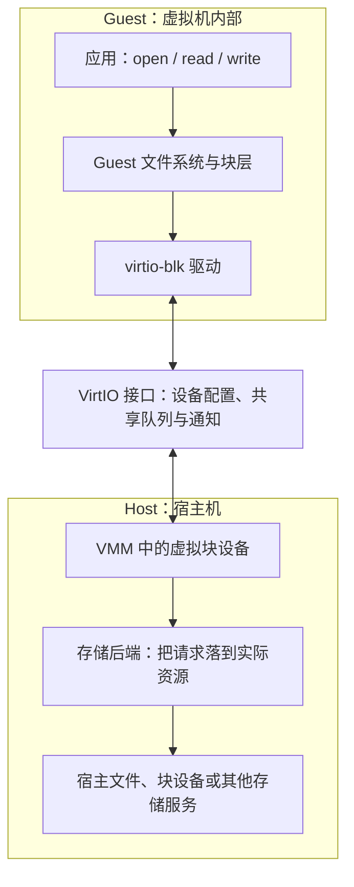
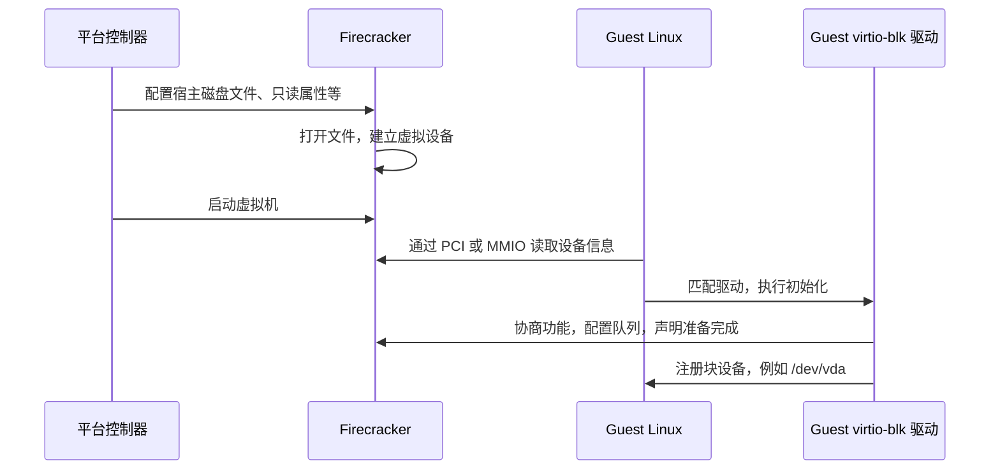
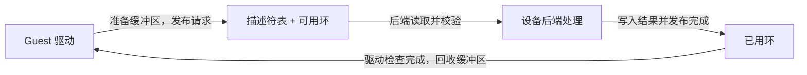
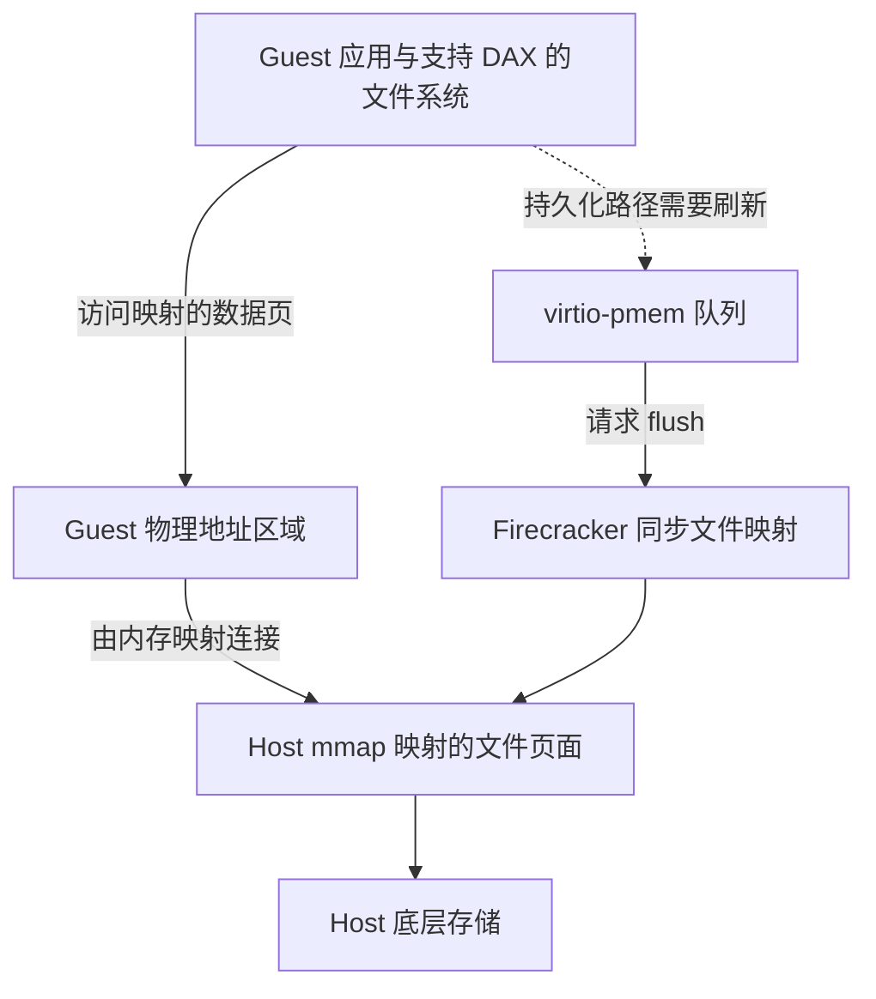
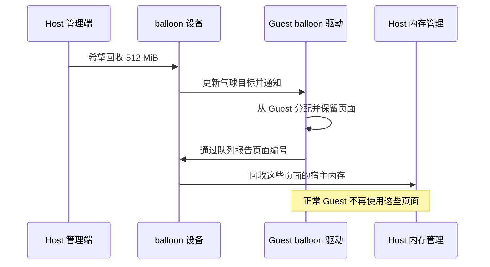

# VirtIO 设备科普：虚拟机的磁盘、网络与内存是怎样工作的

虚拟机能执行程序之后，还需要读写磁盘、连接网络、生成随机数，以及与宿主机交换数据。CPU 虚拟化解决了“代码在哪里运行”，这些设备则决定了“代码怎样使用外部资源”。

**VirtIO 是驱动与设备之间的一套开放通信标准。**它让虚拟机里的操作系统使用统一驱动，让虚拟机监控器按统一规则提供设备。磁盘、网卡、通信通道和内存管理设备可以共用基础机制，同时保留各自的功能。[Linux VirtIO 文档][linux-virtio]

下文把虚拟机内部的操作系统及应用称为 **Guest**，承载它的宿主系统称为 **Host**。**VMM** 是虚拟机监控器 (Firecracker、QEMU 都属于这一层)。

## 一、VirtIO 是怎么来的

**本章要点：**VirtIO 为虚拟设备统一了通信规则，既减少重复开发驱动的工作，也省去模拟传统硬件的一些开销。应用继续使用普通文件和网络接口，配合发生在驱动与设备之间。

### 1.1 最初的问题：既要兼容，又要高效

给虚拟机提供网卡，一种方法是模拟某款真实网卡：让虚拟机看到熟悉的设备标识、寄存器和中断行为，继续使用现成驱动。

这种方法的优势是兼容性。代价是软件需要重现物理设备的工作方式，其中一些步骤原本服务于硬件设计，放到虚拟环境中并不经济。例如，Guest 多次操作设备寄存器，VMM 就可能需要反复接手处理。

另一种方法是让驱动知道自己面对的是虚拟设备，直接约定：“待发送的数据在这里，长度是多少，处理完请通知我。”这就是**半虚拟化 I/O**：驱动与设备主动配合，使用为虚拟环境设计的接口。

半虚拟化 I/O 要求 Guest 使用配套驱动，应用仍调用普通的文件、网络接口，无需为此改写。配合发生在驱动和虚拟设备之间。

### 1.2 VirtIO 同时解决了驱动重复建设

在 2008 年的论文中，Rusty Russell 指出了另一个问题：不同虚拟化平台各自维护磁盘、网络、控制台驱动，功能相似，接口却不统一。

VirtIO 的思路是拆出可复用的驱动、缓冲区交换机制，以及设备发现与配置方式。该论文记载，相关 Linux 驱动框架已进入 Linux 2.6.24。之后，VirtIO 由 OASIS 持续标准化，形成多个设备类型共享基础设施的协议体系。[Rusty Russell 原始论文][virtio-paper] · [OASIS 规范][virtio-spec]

因此，它的价值有两部分：

- **减少不必要的模拟工作。**双方直接表达块请求、网络数据包等需求，不必完整重现某款传统硬件。
- **减少实现之间的重复适配。**同类设备遵循相同协议，驱动无需为每个 VMM 重新设计；新能力通过协商逐步加入。

三种常见路线可以这样比较：

| 路线 | Guest 使用什么驱动 | 主要收益 | 主要成本 |
| --- | --- | --- | --- |
| 模拟传统硬件 | 对应物理设备的驱动 | 容易兼容已有操作系统 | VMM 要模拟较复杂的设备行为 |
| VirtIO | 对应的 VirtIO 驱动 | 协议面向虚拟化设计，驱动与后端可以分别演进 | Guest 需要驱动，后端仍有请求处理成本 |
| 设备直通 | 被直通设备的驱动 | 让 Guest 直接使用分配给它的硬件资源，减少软件设备处理 | 依赖硬件与平台支持，资源切分、隔离和迁移更复杂 |

VirtIO 并不承诺任何负载下都最快。它提供了高效实现的基础，最终速度仍取决于队列、通知、后端和实际硬件。[QEMU 设备与虚拟化架构][qemu-intro]


## 二、先分清驱动、传输方式与设备后端

**本章要点：**设备类型决定“提供什么功能”，Guest 驱动负责使用它，PCI 或 MMIO 负责设备接入，后端负责操作实际资源。它们分工不同，可以组合在同一条请求路径中。

下面以磁盘为例：



图中的协议接口是一组通信约定，不是一个额外进程。设备模型与存储后端也可能实现在同一进程中，图上分开是为了说明职责。

以下几个名字描述的是不同层次：

| 名称 | 回答的问题 | 例子 |
| --- | --- | --- |
| **设备类型** | 提供什么能力？ | `virtio-blk` 提供块存储，`virtio-net` 提供网络 |
| **Guest 驱动** | Guest 内核怎样使用这种设备？ | Linux 的 `virtio_blk`、`virtio_net` 驱动 |
| **传输方式** | 怎样发现和配置设备、通知队列？ | `virtio-pci`、`virtio-mmio` |
| **设备后端** | 谁处理请求，资源来自哪里？ | Firecracker 文件后端、外部 vhost-user 存储进程 |

**PCI** 是一种设备总线机制；**MMIO** 是把设备寄存器映射到特定地址，通过访问这些地址操作设备。VirtIO 标准定义了相应的传输方式，同一种设备类型可以使用不同的传输方式。[Linux 设备发现与驱动匹配][linux-virtio]

所以，`virtio-blk` 与 `virtio-pci` 可以同时出现在一条路径中：前者表示“这是块设备”，后者表示“它通过 PCI 被发现和配置”。

后文重点介绍 Firecracker  实现的七类设备：**blk、net、vsock、rng、balloon、mem、pmem**，并对照介绍 fs、scsi、console 等常见类型。这个清单来自该提交的设备类型与启动接入代码；不能据此推断所有 Firecracker 版本都支持相同能力。[设备类型][fc-types] · [启动时接入设备][fc-builder]


## 三、共同原理：发现设备、协商功能、交换请求

**本章要点：**Guest 先发现设备、协商功能并建立队列，再通过共享内存交接请求，通过通知报告进度。批量处理可以减少交互开销，但不代表没有数据复制或内核参与。

### 3.1 一块虚拟磁盘怎样变成 `/dev/vda`

设备先由 Host 侧创建，再由 Guest 内核发现和初始化。以 Firecracker 的文件磁盘为例：



这里有三个必要条件：**VMM 提供设备、Guest 带有驱动、双方能协商出兼容配置。**只满足其中一项，设备就可能无法使用。

例如，根文件系统位于 virtio-blk 磁盘上，驱动就必须在挂载根文件系统之前可用：可以编进内核，也可以由早期启动内存文件系统 initramfs 提供。把唯一的驱动放在尚且读不到的根磁盘里，无法解决启动问题。

Firecracker 控制的是设备提供的容量、权限和功能。真正调用 Guest 驱动的，是 Guest 自己的内核。[块设备配置与实现][fc-block-device] · [Linux 块设备驱动][linux-blk]

### 3.2 功能协商：同一个名字，不代表同一组能力

设备先声明支持哪些 **feature bits，即功能位**，驱动从中选择自己支持且愿意使用的能力，双方确认后再工作。

例如，块设备可以协商是否支持 flush，网卡可以协商校验和卸载，队列也有不同格式和可选优化。

因此，“VirtIO 标准有这个功能”“Linux 驱动支持这个功能”“当前 VMM 启用了这个功能”是三件事。不能仅凭设备名字推断多队列、零拷贝或其他优化已经生效。[VirtIO 功能协商规范][virtio-spec] · [Firecracker 设备公共接口][fc-types]

### 3.3 Virtqueue：用共享的待办清单交换请求

**Virtqueue** 是驱动与设备交换缓冲区的队列。以常见的 **split virtqueue，即分离式队列**为例，它包含三部分：

| 部分 | 保存什么 | 谁主要写入 |
| --- | --- | --- |
| 描述符表 | 缓冲区地址、长度、设备可读或可写属性；描述符可以连成链 | Guest 驱动 |
| 可用环 | 哪些描述符链已交给设备处理 | Guest 驱动 |
| 已用环 | 哪些描述符链已经处理完成 | 设备后端 |

可以把描述符理解为一张工单：“请从这段内存取数据，处理结果写到另一段内存。”**工单记录的是数据在哪里，数据本身通常放在工单指向的缓冲区里。**



这些结构通常位于 Guest 内存中，后端通过受管理的映射访问。**共享这一份内存，不代表 Guest 可以任意访问 Host 内存。**后端需要转换并校验 Guest 提供的地址、长度和访问方向；缓冲区也必须遵守提交与完成之间的使用约定。[Firecracker 队列实现][fc-queue]

“写完数据再发布请求”还要求正确的内存顺序。否则另一端可能先看到“工单已提交”，却读到未准备好的内容。这由驱动和设备实现中的同步机制保证。

VirtIO 也定义了 packed virtqueue 等其他布局，不能把分离式队列的三部分结构当作所有实现的唯一形式。[Virtqueue 规范][virtio-spec]

### 3.4 队列与通知为什么能提高效率

队列负责保存工作，通知负责告诉另一端“有事要处理”。驱动可以一次提交多个请求再通知，设备也可以批量报告完成，减少反复进入通知处理路径的成本。

但收益不能简单概括为“应用不再切换到内核态”。应用的 `read()`、`write()`、`send()` 仍由 Guest 内核处理。主要优化发生在设备模拟、Guest 与 Host 的交互、通知和数据处理路径上。

同样，**共享队列不等于端到端零拷贝**。应用缓冲区、Guest 内核、Host 内核和物理设备之间是否复制数据，要逐段判断。协议允许优化，不会自动消除所有复制与 VM exit，也就是 CPU 从 Guest 执行状态退出到虚拟化处理路径的事件。[原始设计中的批处理与通知讨论][virtio-paper] · [Firecracker 网络数据路径][fc-net]


## 四、存储设备：blk、scsi、fs 与 pmem

**本章要点：**blk 提供磁盘，scsi 提供可连接多个设备的存储控制器，fs 共享目录，pmem 让存储内容通过内存映射被访问。选择时先看需要哪种接口，再考虑性能；写入完成也要与真正落盘区分。

### 4.1 virtio-blk：提供一块磁盘

**价值：让 Guest 使用自己的文件系统，以较简单的块请求接口访问存储。**

假设 Python 在虚拟机里保存 `/workspace/result.json`：

```text
Python 文件操作
  → Guest 文件系统与缓存
  → Guest 块层形成磁盘请求
  → virtio-blk 驱动提交：操作类型、磁盘位置、数据缓冲区
  → Firecracker 校验并执行请求
  → Host 文件系统与存储设备
```

Firecracker 内置文件后端可以用 `rootfs.ext4` 这样的宿主文件承载虚拟磁盘。Guest 看到的是 `/dev/vda` 等块设备，再在上面识别、挂载文件系统。

**Guest 负责理解文件名和目录，块后端主要理解磁盘位置与字节。**Guest 的 `result.json` 并不对应 Host 上另一个同名文件。[块请求解析][fc-block-request]

使用时，平台配置承载文件、容量所对应的文件大小、只读属性和限流等；应用继续用普通文件 API。Firecracker 的 `Sync` 与可选 `Async` 引擎改变宿主 I/O 的执行方式，Guest 仍然使用 virtio-blk 协议。本文提交中 `Async` 使用 io_uring，文档标注为开发者预览。[块 I/O 引擎][fc-block-engine]

两条边界尤其重要：

- **完成不一定等于落盘。**`write()` 可能先写进 Guest 缓存；设备完成也可能只到 Host 缓存。持久化需要文件系统、flush 支持与后端共同完成。
- **独立磁盘文件不等于独享物理磁盘。**不同 VM 可以拥有独立数据内容，但仍争抢同一块 SSD 的吞吐和队列。把同一可写镜像同时挂给多个普通 ext4 实例，还可能造成数据破坏，不能把它当作共享目录方案。

缓存和隔离的完整路径见 [virtio-blk 原理：Guest 驱动如何与 Firecracker 完成磁盘 I/O](virtio-blk-driver-and-io-path.md)。

### 4.2 virtio-scsi：提供一个 SCSI 存储控制器

**价值：需要较丰富的存储命令、很多磁盘，或光驱等设备时，使用完整的 SCSI 模型。**

SCSI 是一套存储设备命令体系。virtio-scsi 向 Guest 提供的是一个控制器，控制器后面可以连接多个逻辑设备。请求路径为：

```text
Guest 文件系统 / 存储工具
  → Guest SCSI 层形成命令
  → virtio-scsi 驱动通过队列提交
  → 后端处理对应逻辑设备的请求
```

virtio-blk 更直接地提供单块磁盘；virtio-scsi 提供更丰富的设备组织与命令语义。前者通常具有更薄的软件路径，后者适合确实需要 SCSI 能力的场景，不能只根据名字判断谁更快。[QEMU 对 blk 与 scsi 的比较][qemu-scsi]


### 4.3 virtio-fs：提供一个共享目录

**价值：让 Guest 直接使用 Host 导出的目录，而不必先把目录封装成整块磁盘镜像，也不必为共享文件另建 IP 网络。**

例如，Host 导出一个工作目录，Guest 通过标签 `workspace` 挂载：

```bash
mount -t virtiofs workspace /workspace
```

这是 Guest 侧的挂载示例，前提是 VMM 已连接文件后端、导出了对应标签，且 Guest 有 virtio-fs 驱动。仅执行挂载命令不会自动共享 Host 目录。

```text
Guest 读取 /workspace/main.py
  → Guest virtio-fs 文件系统
  → 通过队列发送文件操作请求
  → Host 文件后端，例如 virtiofsd
  → 访问导出目录中的文件
```

它使用 **FUSE 文件系统请求协议**，传递查找、读取、写入等操作。与 virtio-blk 相比，后端参与的是文件级操作，因此需要处理导出范围、权限和文件系统语义。[Linux virtio-fs 文档][linux-virtiofs]

两者的使用意图很不同：给 VM 一套独立文件系统，通常选择块设备；需要双方交换目录内容，可以考虑 virtio-fs。共享目录会引入并发修改、权限映射和访问范围的问题，平台必须明确哪些文件允许 Guest 接触。

Firecracker 本文提交没有实现 virtio-fs。Guest 内核支持它，并不会使 Firecracker 自动具备对应设备。

### 4.4 virtio-pmem：提供文件支撑的持久内存设备

**价值：让 Guest 通过内存映射访问存储内容，减少普通块 I/O 路径和重复缓存的部分开销。**

Firecracker 把 Host 文件通过 `mmap` 映射，再把这段区域注册进 Guest 物理地址空间。Guest 可以看到 `/dev/pmem0` 等设备。它不要求 Host 配备真正的物理持久内存。



**DAX（Direct Access，直接访问）**使支持它的文件系统可以绕过 Guest 页缓存访问设备映射。它不意味着没有 Host 缓存，也不意味着所有文件系统操作都没有软件开销。[Firecracker pmem 设计][fc-pmem]

这里有一个与 virtio-blk 很不同的地方：**普通数据访问主要通过映射完成，VirtIO 队列用于 flush 等协调工作。**所以不能说“所有 VirtIO 数据都必须装进队列”。应用要求数据持久化时，仍需要正确的同步链路；一次 CPU 写内存不等于承载文件已经落盘。[pmem 队列处理源码][fc-pmem-device]

选择 pmem，需要同时考虑 Guest 内核、文件系统、DAX 支持与持久化语义。它提供的是存储能力，不能拿来代替 virtio-mem 扩充普通运行内存。

## 五、通信设备：net 与 vsock

**本章要点：**net 提供虚拟网卡，让 Guest 使用普通网络；vsock 提供主客机通信通道，不需要配置 IP。两者都负责传输数据，执行命令和检查权限仍要由通信两端的软件完成。

### 5.1 virtio-net：让虚拟机拥有网卡

**价值：让 Guest 使用正常的 TCP/IP 网络能力访问其他机器和服务。**

应用发出一个 HTTP 请求时，Guest 网络栈先处理 TCP/IP，再将待发送的数据交给 virtio-net。驱动与设备之间主要交换网络帧及必要的控制信息；Firecracker 不需要执行应用的 HTTP 逻辑。


**TAP** 是 Host 上供用户态程序收发以太网帧的虚拟网络接口。Firecracker 内置网络后端通过它接入宿主网络。外部连通性还需要 Guest 地址、路由、DNS，以及 Host 侧相应网络配置。[Firecracker 网络配置][fc-network]

收包方向还有一个关键动作：**Guest 驱动先把可写缓冲区放进接收队列，后端才能把收到的数据填进去。**完成后，Guest 网络栈再将数据交给应用。没有可用接收缓冲区，收包就可能暂停或丢失。[Firecracker 网络设备实现][fc-net]

不同实现可以提供多队列、校验和卸载等能力。“卸载”是把原本由 Guest 完成的一部分工作交给后端或硬件，但具体支持需要功能协商；不能将 QEMU 的全部网络能力套用到 Firecracker。

虚拟网卡也不自动提供访问策略。允许访问哪些域名、网段或端口，需要由平台的网络策略和代理等组件约束。

### 5.2 virtio-vsock：在 Guest 与 Host 之间建立通信通道

**价值：主客机之间传命令、状态或数据时，可以不依赖 Guest 的 IP 网络配置。**

普通 TCP 使用 IP 地址和端口定位端点；vsock 使用 **CID（上下文标识）与端口**定位通信对象。具体后端支持的连接范围不同，这里讨论 Firecracker 的主客机通信。

```text
Guest 执行服务
  → AF_VSOCK 套接字
  → Guest virtio-vsock 驱动
  → Firecracker vsock 后端
  → Host AF_UNIX 套接字
  → Host 管理程序
```

**AF_VSOCK** 表示虚拟机通信这一类套接字；**AF_UNIX** 表示同一宿主机上的本地套接字。Firecracker 在这两端之间转发连接和数据，并不要求 Host 业务程序也使用 AF_VSOCK。[Firecracker vsock 设计][fc-vsock]

例如，Host 要让 Guest 执行 `python main.py`：平台在 Guest 中运行一个执行服务，服务监听 vsock 端口；Host 通过通道传入命令，服务创建进程，再返回输出和退出码。

**vsock 本身不会执行命令。**它只负责传输；执行协议、身份验证、取消和超时，需要两端服务实现。CID 也不能直接当作业务租户身份，更不能因为没有 IP 就默认对端可信。

| 需求 | 更贴近需求的接口 |
| --- | --- |
| 访问网站、数据库、远程 API | virtio-net 与正常网络协议 |
| Host 与 Guest 管理服务通信 | virtio-vsock |
| 运行现成的 HTTP 服务 | 仍可以使用 virtio-net；不必为了使用 vsock 重写整个协议栈 |

它们可以同时存在：vsock 负责管理通道，net 负责受控的业务网络。

<a id="chapter-6"></a>

## 六、随机数设备：rng

**本章要点：**rng 为 Guest 补充随机数来源，应用仍通过操作系统的随机数接口取值。它不会自动更新快照中已经生成的密钥或随机状态，克隆后的唯一性还需要单独处理。

虚拟环境中的设备活动和启动条件不同于实体机器，不能仅依赖“系统刚好积累了足够随机性”。

它的请求非常简单：

```text
Guest 驱动提交一段可写缓冲区
  → 后端生成随机字节并填入
  → 设备报告完成
  → Guest 内核将其作为随机数系统的一个输入来源
```

在本文 Firecracker 实现中，随机字节由 `aws-lc-rs` 使用的 AWS-LC 密码学库提供；VirtIO 协议本身不规定后端必须使用哪一款物理随机数硬件。[Firecracker entropy 设备][fc-rng]

应用通常仍通过操作系统的随机数接口取得数据，例如 Python 的 `os.urandom()`。这不表示每次调用都会立刻产生一次 virtio-rng 请求：中间还有 Guest 内核自身的随机数生成与管理机制。

Guest 驱动也可暴露 `/dev/hwrng`。设备名字中的 “hw” 不能据此推断 Host 一定有独立硬件随机数芯片。

快照克隆是另一个层次的问题。克隆可能复制应用已经生成的密钥或随机状态；即使接入了 rng，也不会自动使这些既有状态变得唯一。恢复时仍需结合 VM 身份变化、内核与应用的重新初始化机制处理。[Firecracker 快照安全与唯一性][fc-snapshot]

<a id="chapter-7"></a>

## 七、内存管理设备：balloon 与 mem

**本章要点：**balloon 让 Guest 交回部分已有内存页面，mem 通过热插拔调整预设区域中的可用内存。两者都需要 Guest 配合，设置回收目标不等于内存已经回收成功。

它们管理的是运行内存；virtio-pmem 则属于前面介绍的存储路径。

### 7.1 virtio-balloon：让 Guest 交回暂时不用的页面

**价值：在多个 VM 的内存需求不同时，回收部分已分配给 Guest 的宿主内存，改善资源利用率。**

balloon 可以理解为 Guest 内核中的“气球”：气球膨胀，会占住一些页面，使普通应用不能继续使用它们；Host 得知这些页面的位置后，可以回收对应的宿主内存。



例如，VM 配置了 2 GiB 内存，气球成功膨胀到 512 MiB 后，约有 512 MiB 被气球占住，不再供 Guest 正常分配。实际可用内存还要扣除内核等开销，Host 的内存占用变化也不能直接按这个数字一比一推算。

需要归还时，气球收缩，驱动将页面重新交还 Guest 内存分配器。Host 在后续访问中为它们提供所需的内存支撑。

**它依赖 Guest 合作。**恶意或故障 Guest 可以不按预期回收、上报或停止使用页面，因此 balloon 不能代替宿主侧的硬性内存限制。Firecracker 官方文档明确要求为这种情况保留资源保障与监控。[balloon 原理与信任边界][fc-balloon]

回收过多还可能引发 Guest 缓存下降、换页或内存不足。提高部署密度的代价，需要通过负载与内存压力衡量。

### 7.2 virtio-mem：按块增减可用内存

**价值：在预设范围内调整 VM 的内存容量，避免为了修改容量每次都重新创建 VM。**

virtio-mem 管理一个划分成固定大小块的内存区域。Host 调整目标大小，Guest 驱动据此与设备协调，将内存块接入或移出 Guest 内存管理体系。

Firecracker 中，这个区域与启动内存分开配置。例如：

```text
启动内存：512 MiB
可热插拔区域上限：2 GiB

初始热插拔量为 0：Guest 主要使用 512 MiB 启动内存
目标热插拔量设为 1 GiB：完成接入后，总内存约为 1.5 GiB
```

上限表示可以动态接入的范围，不代表一开始就把整块区域交给 Guest 使用。内核本身的管理开销也会占用部分内存。[Firecracker 内存热插拔][fc-mem]

热移除比热添加更难：Guest 必须先搬走或释放相关页面，才能把块交回。遇到不能迁移的页面或 Guest 不配合，操作就可能无法立即完成。**设置目标值只是在提出请求，是否完成还要看实际状态。**[Linux 内存热插拔机制][linux-hotplug]

Firecracker 还使用 KVM 内存槽管理宿主侧访问权限。完全撤下一个槽可以移除相应映射，但块与槽的粒度可能不同，不能把每个小块的逻辑拔出都理解成相同粒度的硬件访问撤销。[内存热插拔保护边界][fc-mem]

| 对比 | virtio-balloon | virtio-mem |
| --- | --- | --- |
| 核心动作 | Guest 驱动占住或释放已有页面 | 对指定区域中的块执行接入与移出 |
| 主要用途 | 回收可让出的页面，调节宿主实际占用 | 调节指定范围内的 VM 内存容量 |
| 是否需要 Guest 配合 | 需要 | 需要，尤其是移除已使用内存 |
| Firecracker 中的范围 | 既有 Guest 内存中的页面 | 启动前单独配置的热插拔区域 |
| 是否能保证立即回收 | 不能 | 不能 |

<a id="chapter-8"></a>

## 八、控制台、图形、声音与其他设备

**本章要点：**VirtIO 的通信机制也能承载控制台、图形、输入和声音等能力。设备名称说明用途，实际能用哪些功能，还要看 Guest 驱动、VMM 与后端是否共同支持。

### 8.1 virtio-console：传输字符与端口数据

virtio-console 可以提供控制台与多个通信端口。输入、输出通过队列交换，Guest 可以把端口用作终端或专门的数据通道。

Linux 中的控制台端口常见为 `/dev/hvc0`，多端口设备还可能出现 `/dev/vport...`。设备提供字节通道，登录服务和业务协议仍由 Guest 软件实现。[Linux virtio-console 驱动][linux-console]

Firecracker 本文提交没有实现这类 VirtIO 设备。它的传统串口控制台，例如 x86_64 下的 `/dev/ttyS0`，属于另一种设备接口，不能因为都能显示日志就把两者混为一谈。

### 8.2 virtio-gpu、virtio-input 与 virtio-snd

| 设备 | 交换什么 | Guest 怎样使用 | 主要价值与边界 |
| --- | --- | --- | --- |
| **virtio-gpu** | 显示资源、绘图命令等 | 图形栈通过虚拟 GPU 使用后端 | 提供显示与可选图形加速；不自动提供 CUDA 等计算环境 |
| **virtio-input** | 键盘、鼠标、触摸等输入事件 | Guest 输入子系统把事件交给应用 | 统一虚拟输入接口；事件来源与访问权限由平台控制 |
| **virtio-snd** | 音频控制信息与采样数据 | Guest 声音子系统播放或录音 | 对接 Host 音频后端；需要相应驱动与配置 |

以 virtio-gpu 为例，Guest 可以把图形命令交给 Host 的渲染实现。使用软件渲染、哪种 3D 加速和哪些图形 API，取决于驱动、VMM、后端库与硬件的组合，不能只看见设备名就判断它具有某种 GPU 能力。[QEMU virtio-gpu][qemu-gpu] · [VirtIO 输入设备规范][virtio-spec] · [QEMU virtio-snd][qemu-snd]

### 8.3 其他设备解决更专门的问题

| 设备或类型 | 主要用途 | 容易误解的地方 |
| --- | --- | --- |
| **virtio-crypto** | 把加密等密码学操作交给后端处理 | 后端可能是软件或硬件；不能因此假定密钥对 Host 保密 |
| **virtio-iommu** | 让 Guest 管理设备访问内存时所使用的地址映射 | IOMMU 管理的是设备侧地址转换；宿主安全还依赖 VMM 与宿主实际执行隔离 |
| **virtio-9p** | 用 9P 文件协议共享文件 | 与 virtio-fs 是不同协议，不是同一设备的不同名字 |
| **I2C、GPIO 等接口设备** | 在嵌入式等场景中访问外设总线或通用输入输出引脚 | 访问哪些实际外设，仍由后端配置与权限决定 |

VirtIO 规范及设备编号表会持续扩展。**分配了编号、写入了规范、Linux 有驱动、某个 VMM 实现了设备，是不同的成熟度与支持范围。**对于较新的或较专门的类型，需要分别核对，不能只看一张设备列表。[VirtIO 设备类型与编号][virtio-spec]

这些扩展类型不在本文 Firecracker 提交的七类设备清单中。

<a id="chapter-9"></a>

## 九、VirtIO、KVM、vhost 与 vhost-user 的关系

**本章要点：**VirtIO 规定驱动与设备怎样通信，KVM 支撑虚拟机运行；vhost 把队列处理交给宿主内核，vhost-user 则交给外部用户态进程。VirtIO 协议不绑定 KVM，但 Firecracker 当前实现依赖 KVM。

### 9.1 VirtIO 不绑定 KVM，Firecracker 的实现依赖 KVM

KVM 提供运行虚拟 CPU、配置 Guest 内存映射、注入中断等机制；VirtIO 规定驱动与设备之间如何协作。

一个直接的例子是：QEMU 可以使用 KVM 执行 Guest，也可以使用 TCG 软件模拟 CPU；在受支持的机器配置中，两条路径都可以提供 VirtIO 设备。因此，VirtIO 不要求底层必须是 KVM。[QEMU 加速器与设备模型][qemu-intro]

但 Firecracker 当前把设备接入与 KVM 结合起来。以 MMIO 队列通知为例：

```text
Guest 驱动写入设备通知地址
  → KVM 的 ioeventfd 机制触发 Host eventfd
  → Firecracker 事件循环处理队列
  → 需要完成中断时，通过 irqfd 请求 KVM 通知 Guest
```

**eventfd** 是 Linux 通用的事件通知机制；**ioeventfd、irqfd** 是 KVM 把它连接到 Guest 设备访问和中断的接口。这样可以减少部分通知反复返回 VMM 用户态处理的开销，但不等于所有硬件 VM exit 都消失。[KVM API][kvm-api] · [Firecracker MMIO 设备注册][fc-mmio]

所以，“VirtIO 协议能够跨平台使用”和“Firecracker 源码无需修改就能换掉 KVM”是两回事。换虚拟化后端，需要重新接好内存映射、设备访问与中断等机制。[Firecracker 设备接入][fc-device-manager]

### 9.2 vhost 与 vhost-user 改变的是后端在哪里工作

| 方式 | 谁处理队列 | 为什么采用 | 需要承担什么 |
| --- | --- | --- | --- |
| VMM 内置后端 | Firecracker、QEMU 等进程中的设备实现 | 部署直接，容易整合设备状态 | 设备处理消耗 VMM 侧的执行资源 |
| 内核 vhost，例如 vhost-net | 宿主内核中的后端 | 缩短部分数据路径，减少用户态介入 | 后端成为宿主内核攻击面的一部分 |
| vhost-user | 外部宿主用户态进程 | 独立实现、调优或隔离复杂后端 | 需要共享 Guest 内存，管理额外进程及其权限、生命周期 |

Guest 仍然可以使用原来的 VirtIO 驱动。变化主要发生在 Host：VMM 把队列与内存等信息交给哪个后端处理。[QEMU VirtIO 后端架构][qemu-virtio]

vhost-user 使用 Unix socket 交换配置和文件描述符。在常见的共享内存队列路径中，大块 I/O 数据由后端访问共享缓冲区，不是把每个磁盘数据块都序列化进这个控制 socket。[vhost-user 协议][vhost-user]

Firecracker 本文提交提供可选的 vhost-user 块设备前端，文档标注为开发者预览；外部后端需要另外提供。它的原生 vsock 则由 Firecracker 自己连接 Guest AF_VSOCK 与 Host AF_UNIX，绕过宿主内核的 vhost 路径。这是两种不同的后端安排。[Firecracker vhost-user 块设备][fc-vhost-block] · [Firecracker vsock][fc-vsock]

<a id="chapter-10"></a>

## 十、怎样把设备组合成一个可用的执行环境

**本章要点：**先按存文件、联网、主客机通信等实际需求选择设备，再配好驱动、后端和权限。设备可用只是其中一环，性能、持久化和隔离还要沿整条请求路径判断。

### 10.1 从应用动作选择设备

假设要运行一个能执行 Python、下载依赖、保存产物的虚拟机，可以根据应用动作选择接口：

| 应用或平台的动作 | 可以使用的设备 | 还需要什么配合 |
| --- | --- | --- |
| 启动 Linux，保存独立工作区 | virtio-blk | 内核驱动、文件系统、磁盘镜像与持久化策略 |
| 下载依赖、访问远程 API | virtio-net | 地址、路由、DNS、出站访问策略 |
| Host 下发任务，收集日志和退出码 | virtio-vsock | Guest 执行服务、通信协议与授权 |
| 提供随机数来源 | virtio-rng | Guest 随机数子系统及恢复时的状态处理 |
| 回收部分闲置内存 | virtio-balloon | Guest 配合、内存压力监测与宿主资源保障 |
| 在预设范围内调整内存容量 | virtio-mem | 可热插拔区域、驱动与页面迁移能力 |
| 用映射方式访问文件支撑的存储 | virtio-pmem | 兼容内核与文件系统，按需使用 DAX，处理持久化 |
| 让 Host 与 Guest 共享目录 | virtio-fs | 支持该设备的 VMM、文件后端与明确的导出权限 |

最后一行需要支持 virtio-fs 的实现，不能直接套入本文 Firecracker 版本。设备选择首先要满足接口需求，再判断运行时是否实现、后端是否适合负载。

### 10.2 区分“提供了设备”和“环境已经可用”

几种常见现象能说明这层区别：

| 现象 | 优先检查什么 |
| --- | --- |
| 配置了磁盘，Guest 看不到 `/dev/vda` | 设备是否成功创建、传输方式是否支持、Guest 驱动是否匹配并完成初始化 |
| Guest 有网卡，但无法下载依赖 | 链路、地址、路由、DNS、Host 转发与防火墙，而非仅查看 VirtIO 队列 |
| vsock 已连接，却不能执行命令 | 对端是否运行执行服务、协议是否一致、请求是否被授权 |
| 设置了内存回收目标，Host 占用没有立即下降 | Guest 是否配合、实际完成量、页面状态以及宿主统计口径 |

这些检查顺序来自前面的职责划分：设备只承担其中一层，完整能力由多层共同构成。

### 10.3 性能和安全都要沿完整路径判断

VirtIO 对性能的贡献，来自更适合虚拟化的设备接口、共享队列与可批量处理的通知。**物理存储变慢、Host CPU 繁忙、网络策略复杂，仍然会影响 Guest；增加队列也不能凭空增加底层资源。**

隔离也需要逐层看：Guest 内核检查应用权限，设备后端检查请求与内存范围，宿主限制后端可接触的资源，平台再定义租户、工作区和外部服务的授权。VirtIO 协议帮助组织交互，但不会自动替平台完成这些策略。

例如，两台 VM 使用不同磁盘文件，可以拥有独立的数据视图，却仍共享 SSD 的故障和性能影响；通过 vsock 暴露一个宿主服务，可以省去 IP 配置，却仍需限制它能执行的操作。

理解一个 VirtIO 设备，最终需要回答四件事：**Guest 看见什么接口，请求如何传递，Host 实际操作什么资源，以及哪些限制必须由其他层负责。**这四件事决定了它为什么有用，也决定了应该在哪里配置、优化和排查。

[linux-virtio]: https://docs.kernel.org/driver-api/virtio/virtio.html
[virtio-paper]: https://www.cs.columbia.edu/~cdall/candidacy/pdf/Russell2008.pdf
[virtio-spec]: https://docs.oasis-open.org/virtio/virtio/v1.2/cs01/virtio-v1.2-cs01.html
[qemu-intro]: https://www.qemu.org/docs/master/system/introduction.html
[qemu-scsi]: https://www.qemu.org/2021/01/19/virtio-blk-scsi-configuration/
[qemu-gpu]: https://www.qemu.org/docs/master/system/devices/virtio/virtio-gpu.html
[qemu-snd]: https://www.qemu.org/docs/master/system/devices/virtio/virtio-snd.html
[qemu-virtio]: https://www.qemu.org/docs/master/system/devices/virtio/index.html
[linux-virtiofs]: https://docs.kernel.org/filesystems/virtiofs.html
[linux-hotplug]: https://docs.kernel.org/admin-guide/mm/memory-hotplug.html
[linux-blk]: https://github.com/torvalds/linux/blob/adc218676eef25575469234709c2d87185ca223a/drivers/block/virtio_blk.c
[linux-console]: https://github.com/torvalds/linux/blob/adc218676eef25575469234709c2d87185ca223a/drivers/char/virtio_console.c
[kvm-api]: https://docs.kernel.org/virt/kvm/api.html
[vhost-user]: https://www.qemu.org/docs/master/interop/vhost-user.html
[fc-types]: https://github.com/firecracker-microvm/firecracker/blob/30471852666564d980f330d0575115eda7d5ce8e/src/vmm/src/devices/virtio/device.rs
[fc-builder]: https://github.com/firecracker-microvm/firecracker/blob/30471852666564d980f330d0575115eda7d5ce8e/src/vmm/src/builder.rs
[fc-queue]: https://github.com/firecracker-microvm/firecracker/blob/30471852666564d980f330d0575115eda7d5ce8e/src/vmm/src/devices/virtio/queue.rs
[fc-block-device]: https://github.com/firecracker-microvm/firecracker/blob/30471852666564d980f330d0575115eda7d5ce8e/src/vmm/src/devices/virtio/block/virtio/device.rs
[fc-block-request]: https://github.com/firecracker-microvm/firecracker/blob/30471852666564d980f330d0575115eda7d5ce8e/src/vmm/src/devices/virtio/block/virtio/request.rs
[fc-block-engine]: https://github.com/firecracker-microvm/firecracker/blob/30471852666564d980f330d0575115eda7d5ce8e/docs/api_requests/block-io-engine.md
[fc-network]: https://github.com/firecracker-microvm/firecracker/blob/30471852666564d980f330d0575115eda7d5ce8e/docs/network-setup.md
[fc-net]: https://github.com/firecracker-microvm/firecracker/blob/30471852666564d980f330d0575115eda7d5ce8e/src/vmm/src/devices/virtio/net/device.rs
[fc-vsock]: https://github.com/firecracker-microvm/firecracker/blob/30471852666564d980f330d0575115eda7d5ce8e/docs/vsock.md
[fc-rng]: https://github.com/firecracker-microvm/firecracker/blob/30471852666564d980f330d0575115eda7d5ce8e/docs/entropy.md
[fc-balloon]: https://github.com/firecracker-microvm/firecracker/blob/30471852666564d980f330d0575115eda7d5ce8e/docs/ballooning.md
[fc-mem]: https://github.com/firecracker-microvm/firecracker/blob/30471852666564d980f330d0575115eda7d5ce8e/docs/memory-hotplug.md
[fc-pmem]: https://github.com/firecracker-microvm/firecracker/blob/30471852666564d980f330d0575115eda7d5ce8e/docs/pmem.md
[fc-pmem-device]: https://github.com/firecracker-microvm/firecracker/blob/30471852666564d980f330d0575115eda7d5ce8e/src/vmm/src/devices/virtio/pmem/device.rs
[fc-mmio]: https://github.com/firecracker-microvm/firecracker/blob/30471852666564d980f330d0575115eda7d5ce8e/src/vmm/src/device_manager/mmio.rs
[fc-device-manager]: https://github.com/firecracker-microvm/firecracker/blob/30471852666564d980f330d0575115eda7d5ce8e/src/vmm/src/device_manager/mod.rs
[fc-vhost-block]: https://github.com/firecracker-microvm/firecracker/blob/30471852666564d980f330d0575115eda7d5ce8e/docs/api_requests/block-vhost-user.md
[fc-snapshot]: https://github.com/firecracker-microvm/firecracker/blob/30471852666564d980f330d0575115eda7d5ce8e/docs/snapshotting/snapshot-support.md#snapshot-security-and-uniqueness
