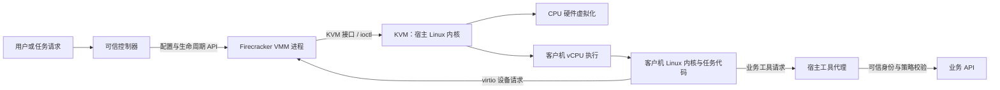
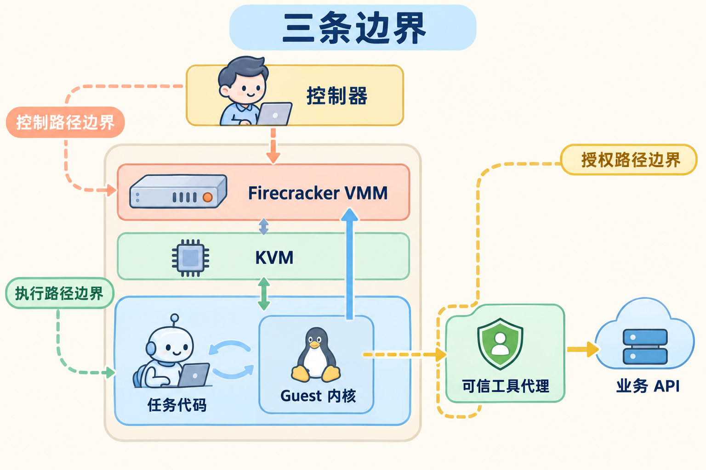
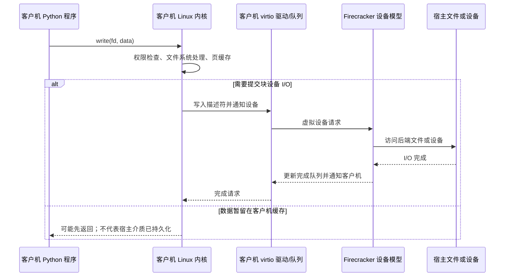
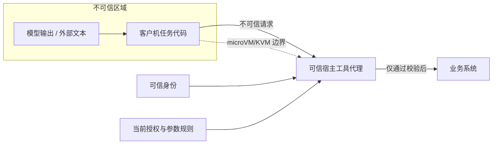
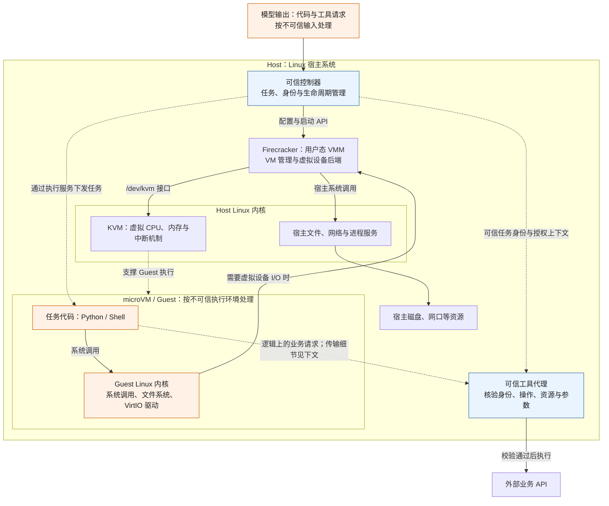
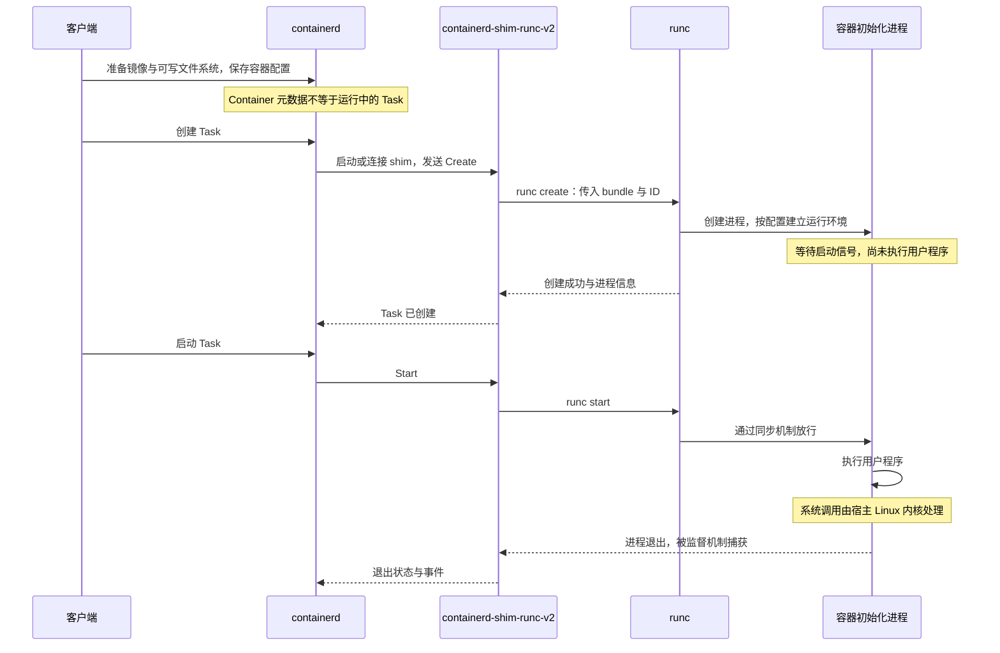
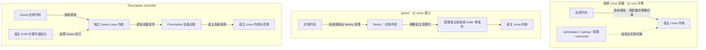
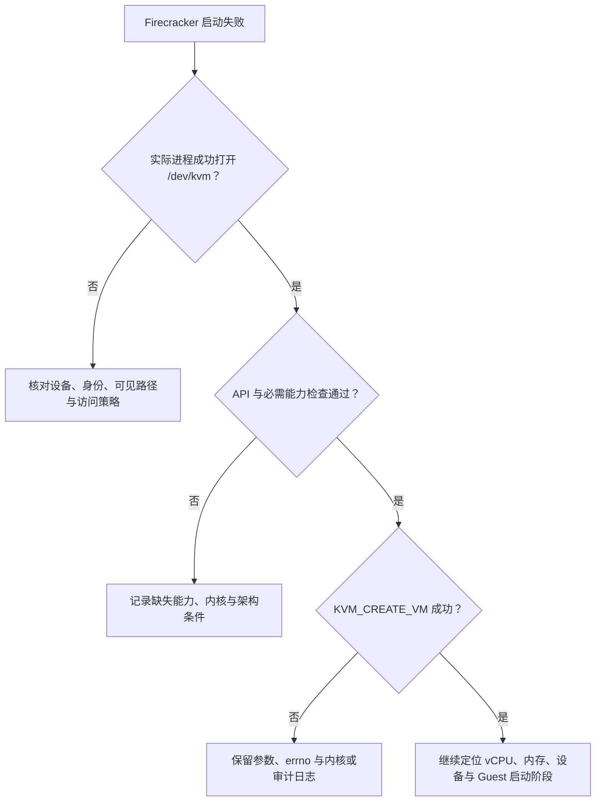

# Firecracker 运行时基础：从 Guest 执行到安全边界

当平台要运行一段不可信代码时，真正要回答的不是“怎样启动一个进程”，而是三件事：代码在哪个内核上运行、它怎样访问宿主资源、它凭什么调用外部业务。Firecracker 把第一件事放进带独立 Guest 内核的 microVM，但它不会自动替平台完成授权、资源治理或业务协议。

本文沿一条任务路径展开：控制器创建 microVM，Guest 中的程序执行系统调用并访问虚拟设备，需要外部能力时再经过宿主代理。先看清这几条边界，再比较容器、gVisor 与 Firecracker，最后用源码路径和故障证据验证结论。文中的“隔离”指执行环境的边界，“授权”指对外部业务动作的许可，二者不能互相替代。

## 一次任务经过哪些边界

Firecracker 是运行在 Linux 宿主机上的用户态虚拟机监控器（VMM）。它通过 KVM 使用处理器的硬件虚拟化能力，组织一个轻量虚拟机所需的 CPU、内存和虚拟设备。microVM 内有自己的客户机 Linux 内核和用户程序。



这张图把两个不同方向的路径放在了一起。控制器使用 Firecracker API 配置或启动 VM；客户机里的程序通过虚拟设备处理 I/O，或向宿主工具代理发起业务请求。Firecracker API 是 VM 管理接口，不能替代业务授权服务。

| 组件 | 做什么 | 不负责什么 |
| --- | --- | --- |
| Linux 宿主机 | 运行 VMM，提供 KVM、文件、网络和调度资源 | 不应默认信任客户机发来的数据 |
| KVM | 向 VMM 提供创建 VM、vCPU 和运行客户机的内核接口 | 不负责 Agent 的工具权限或业务规则 |
| Firecracker VMM | 管理一台 microVM 的生命周期、vCPU 运行和虚拟设备模型 | 不负责替平台管理多租户任务、恢复策略或业务审批 |
| 客户机（guest） | 提供客户机内核和运行任务的用户空间 | 不能凭自己声称的 tenant ID 或审批字段获取授权 |
| 控制器 / 工具代理 | 控制器管理任务；代理依据可信主体和策略执行获准的业务操作 | 二者不可把模型输出直接当成可信授权 |



图中最容易混淆的地方有三个：控制器通过 Firecracker 管理 VM；Guest 任务首先在 Guest 内核中执行系统调用；需要访问外部业务时，才经过单独的可信工具代理。Firecracker/KVM 提供执行与隔离基础，工具代理才负责业务授权。

## 从系统调用到设备 I/O：两条路径

**客户机系统调用不是 Firecracker API。**例如 Python 调用 `write()` 时，CPU 正在 KVM 管理的客户机 vCPU 上执行；系统调用首先进入客户机 Linux 内核。客户机内核可以先把数据放入自己的页缓存，此时一次 `write()` 可能已经返回，并未发生磁盘设备 I/O。



图中略去了具体的中断、事件循环和设备配置差异。客户机系统调用不会逐条变成宿主系统调用或 VMM 用户态退出；当访问虚拟设备时，才按所用设备和后端进入对应 I/O 路径。KVM 可以在内核中处理一部分虚拟化事件，另一部分需要 VMM 处理。启动时 API 请求、运行时 vCPU 执行和设备 I/O 也属于不同路径。

文件写入还要区分“应用收到成功”“客户机文件系统提交”“虚拟块设备完成”和“宿主存储持久化”。如果任务关心断电后的数据保证，需另外核对 flush、缓存和存储后端语义；不能只凭 `write()` 成功推断数据已落到物理介质。

## 隔离解决“能碰到什么”，授权解决“能做什么”

把不可信代码放入 microVM，可以缩小它直接访问宿主资源的边界。它不能自动限制经由一个被允许的工具代理产生的业务副作用：如果代理持有高权限凭证、接受客户机自报身份或不检查参数，代码即使没有逃出 VM，仍可能对外部系统越权。



Firecracker 项目本身还通过多层宿主防护约束 VMM 进程。当前本地架构文档说明：Firecracker 默认使用 seccomp 限制宿主系统调用；生产环境应结合 jailer、权限降级、namespace 与 cgroup 做进程隔离和资源治理。客户机出站流量也需要宿主网络策略控制，Firecracker 不替平台过滤业务网络流量。

**核心记忆点：**microVM/KVM 限制任务如何接触宿主；jailer、seccomp、namespace 和 cgroup 进一步约束 VMM 进程及资源；控制器和工具代理决定哪些外部业务操作可以发生。不同层的防护不能相互替代。

## 什么时候要用 microVM：与容器、gVisor 对比

| 方案 | 隔离思路 | 需要重点验证 | 常见职责 |
| --- | --- | --- | --- |
| containerd + runc | 容器任务通常共享宿主 Linux 内核；namespace、cgroup、seccomp 等提供不同约束 | 所需系统调用、文件与网络权限、配额是否按预期生效 | containerd 管理镜像和任务生命周期；runc 按 OCI 配置创建容器进程 |
| gVisor | 使用应用内核路径处理应用系统调用，减少应用直接依赖宿主内核的范围 | 系统调用兼容性、文件/网络路径与性能开销 | 容器工作流中的另一种隔离运行时路径 |
| Firecracker | 每个 VMM 进程承载一台使用客户机内核的 microVM，依托 KVM 执行 | KVM/架构条件、guest 启动与 I/O、VMM 限制和平台管理成本 | 为任务提供 microVM 执行边界；平台还需另做管理和授权 |

这些方案处于不同层，名称不能替代威胁模型。选型时先问代码是否可信、是否多租户、依赖哪些系统调用和设备、要访问哪些网络与文件，再用同一工作负载比较兼容性、隔离要求、启动和运行成本、调试与维护方式。

## 源码与证据

逐项解析：[源码分析：从容器启动到 microVM 执行](../references/01-runtime-source-walkthrough.md)。

下面的阅读路径只追踪能回答本文问题的入口：谁创建进程或 VM，哪一层实施隔离，失败时应从哪里取证。无需通读整个仓库。

1. **containerd/runc：**从 containerd 文档了解镜像和任务生命周期边界；选定提交后，沿 runc 的 create/start 路径追踪 OCI 配置怎样形成容器进程。记录入口、主要配置和一个失败点，不要阅读所有包。
2. **进程限制：**在所选实现中定位 namespace、cgroup 和 seccomp 的配置生效位置，说明它们各限制什么，以及未覆盖的部分。文件名和默认值按提交核对。
3. **gVisor：**阅读架构导读，把普通容器、gVisor 与 Firecracker 的应用系统调用路径画在一张对比图上；标出内核边界、兼容性问题和信任组件。无需深入阅读未涉及的组件。
4. **Firecracker：**先读本仓库 [架构文档](https://github.com/firecracker-microvm/firecracker/blob/30471852666564d980f330d0575115eda7d5ce8e/docs/design.md) 的 Host Integration、Internal Architecture 和 Sandboxing 部分。追踪控制器、API、VMM、KVM 和客户机各自所在层；需要真实函数名时再查源码，不要凭图猜调用细节。

记录仓库、版本或提交、入口和观察到的机制，并明确区分“项目当前已实现”与“平台还需设计”的保证。不能把本文的架构建议自动说成这些开源项目已经提供的功能。

## 验证与排障

下面五个问题既可以作为文章的验证清单，也可以作为排障时的证据模板。每个答案都先给结论，再展开机制和可观察证据。

<a id="answer-boundaries"></a>

### 1. 如何画出 Host、Guest、VMM、KVM 与工具代理的边界

#### 解析

可以从**代码执行、虚拟机管理、业务授权**三个层次解释这张图。

首先，Host 是运行 Firecracker 的 Linux 宿主系统，Guest 是 microVM 内部的 Linux 系统，两边各有自己的内核。Agent 生成的 Python 或 Shell 代码在 Guest 中执行，普通系统调用首先由 Guest 内核处理。

其次，Firecracker 是宿主用户态的 VMM，也就是创建和管理虚拟机的程序；KVM 位于宿主内核，提供创建 VM、运行虚拟 CPU 和管理虚拟化状态的能力。Firecracker 通过 KVM 组织 microVM，并提供磁盘、网络等虚拟设备的后端。**KVM 提供底层执行机制，Firecracker 把这些机制组织成可运行的虚拟机。**

最后，microVM 隔离的是代码执行环境。代码要调用外部业务系统时，工具代理仍要根据可信身份和策略检查权限。即使代码没有逃出虚拟机，如果代理替它执行了越权请求，业务数据仍会受到影响。

#### 边界图

以下选择一种具体部署：控制器在沙箱外，生成的任务代码在沙箱内，宿主工具代理连接外部业务 API。**工具代理是平台需要实现的组件，不是 Firecracker 自带的业务授权功能。**



图中的嵌套表示这台虚拟机由同一宿主承载，不表示 Guest 与宿主共享同一个内核。虚线表示管理、执行支撑或逻辑请求关系；不能把所有箭头连成“每条指令都依次经过这些组件”的调用链。[Firecracker 架构与信任边界](https://github.com/firecracker-microvm/firecracker/blob/30471852666564d980f330d0575115eda7d5ce8e/docs/design.md#internal-architecture)

#### 用两个动作把图讲清楚

**动作一：写入 Guest 中的 `result.json`。**

```text
Guest Python
  → Guest Linux 内核：检查文件权限，处理文件系统和缓存
  → 需要磁盘 I/O 时，由 Guest virtio-blk 驱动提交请求
  → Firecracker 块设备后端
  → 宿主内核 → 承载虚拟磁盘的宿主文件
```

这里的 VirtIO 是 Guest 驱动与虚拟设备之间的标准接口；`virtio-blk` 是其中的磁盘设备接口。Firecracker 不需要理解 `result.json` 这个文件名，只需处理虚拟磁盘位置与数据缓冲区。数据也可能先留在 Guest 缓存里，所以 `write()` 成功不必然等于宿主存储已经持久化。[块请求解析](https://github.com/firecracker-microvm/firecracker/blob/30471852666564d980f330d0575115eda7d5ce8e/src/vmm/src/devices/virtio/block/virtio/request.rs) · [块设备缓存策略](https://github.com/firecracker-microvm/firecracker/blob/30471852666564d980f330d0575115eda7d5ce8e/docs/api_requests/block-caching.md)

深入解析：[virtio-blk 原理：Guest 驱动如何与 Firecracker 完成磁盘 I/O](../articles/virtio-blk-driver-and-io-path.md)，包含设备初始化、共享队列、一次读写的源码路径、完成通知与持久化边界。

各类设备的用途与区别见 [VirtIO 设备科普：虚拟机的磁盘、网络与内存是怎样工作的](../articles/virtio-devices-explained.md)。

**动作二：请求删除某个云端文件。**

```text
Guest 任务发出删除请求
  → 经 vsock 或受控网络到达工具代理
  → 代理核验调用方的可信身份、租户、操作、目标资源与参数
  → 使用受约束的凭证调用业务 API
```

vsock 是虚拟机与宿主通信的一种机制。在 Firecracker 中，其传输路径仍涉及 Guest 驱动、Firecracker 后端和宿主本地通信接口；上图省略这些细节，是为了突出**业务请求在哪里获得授权**。[vsock 传输实现说明](https://github.com/firecracker-microvm/firecracker/blob/30471852666564d980f330d0575115eda7d5ce8e/docs/vsock.md#firecracker-virtio-vsock-design)

例如，任务 A 在请求里填入 `tenant_id=B`，不能因此获得租户 B 的权限。平台应把连接或任务绑定到自己确认的身份，再核验目标资源归属。若 Guest 能绕过代理直接访问业务 API，还必须限制它持有的凭证和网络访问，否则代理上的检查无法覆盖那条路径。这是根据前述边界得到的平台设计要求。

**这张图要表达的核心：Guest 内核处理应用系统调用，Firecracker/KVM 支撑虚拟机运行，可信平台组件决定外部业务权限。**

<a id="answer-environment"></a>

### 2. 如何记录 Linux 环境，并区分已验证与未验证

#### 解析

把“能运行 Firecracker”拆成四层检查：**系统与架构匹配、设备访问权限、KVM 实际能力、目标 Guest 启动结果**。

第一层确认机器是适配版本的 Linux，CPU 架构与 Firecracker、Guest 内核和用户程序相匹配。如果服务器本身是虚拟机，还要确认外层平台支持所需的嵌套虚拟化，也就是允许在虚拟机里继续运行虚拟机。

第二层用实际启动 Firecracker 的身份检查 `/dev/kvm`；设备存在、权限位看起来可读写、进程实际打开设备成功，是不同强度的证据。第三层检查 KVM API 和必需能力，再验证能否创建 VM 和 vCPU。第四层才是启动指定 Guest、运行一个简单任务并正常回收。

因此，只有 `/dev/kvm` 的检查结果时，只能说“权限预检通过”，不能表述为“服务器已经验证可用”。即使一次启动成功，也不能据此推断高并发、恢复和安全策略都已验证。[运行前提](https://github.com/firecracker-microvm/firecracker/blob/30471852666564d980f330d0575115eda7d5ce8e/docs/getting-started.md#prerequisites) · [版本对应的内核支持范围](https://github.com/firecracker-microvm/firecracker/blob/30471852666564d980f330d0575115eda7d5ce8e/docs/kernel-policy.md) · [KVM API 与能力检查][kvm-api]

#### 当前可以如实填写的环境记录

下面只根据当前环境中已有的信息填写，**没有连接或检测你的 Linux 服务器**。

| 记录项 | 当前记录 | 证据与状态 |
| --- | --- | --- |
| 本地工作机 | macOS，用于阅读、画图和本地开发 | 已知工作环境；不是 Linux KVM 验证环境 |
| 实验服务器 | 有一台 Linux 服务器 | 用户提供的信息；未在服务器终端核验 |
| 服务器架构、发行版、内核与页大小 | 待填写 | 未验证 |
| 裸机或虚拟机、所需嵌套虚拟化能力 | 待填写 | 未验证 |
| Firecracker 二进制版本、架构与来源 | 待填写 | 本地源码提交不能代替服务器二进制版本 |
| 启动身份、用户组、`/dev/kvm` 访问结果 | 待填写 | 未验证；需要包含实际服务进程的运行身份 |
| KVM API、必需能力、VM/vCPU 创建结果 | 待填写 | 未验证 |
| 可用内存、磁盘、进程配额与 cgroup 配置 | 待填写 | 未验证 |
| Guest 内核、磁盘镜像及其版本或哈希 | 待填写 | 未验证 |
| Guest 启动日志、任务结果、退出与回收 | 待填写 | 未验证 |

目前可以得出的结论是：**具备一台候选 Linux 实验服务器，但尚不能确定它满足实际启动条件；阻塞项也需要检查后才能判断。**

#### 先做信息采集，再做功能验证

以下只读命令供你稍后在 **Linux 服务器**执行；不要在 Mac 上执行后把结果当作服务器记录。

```bash
uname -srm
cat /etc/os-release
lscpu
getconf PAGESIZE
id
ls -l /dev/kvm
if test -r /dev/kvm && test -w /dev/kvm; then
    echo 'KVM permission precheck: PASS'
else
    echo 'KVM permission precheck: FAIL'
fi
free -h
df -h .
stat -fc %T /sys/fs/cgroup
cat /proc/self/cgroup
ulimit -n
```

有 `systemd-detect-virt` 时再运行它，辅助识别虚拟化环境。命令缺失、日志无权读取，都应原样记录；它们本身不证明 KVM 不可用。cgroup 是 Linux 的资源管理机制，用于限制或统计一组进程的资源使用。即使宿主总内存足够，服务所属 cgroup 的配额仍可能更小。

后续功能验证按证据逐级推进：

```text
设备文件存在、权限预检通过
  → 实际运行身份能够打开 /dev/kvm
  → API 版本与所需能力检查通过
  → VM、vCPU 等资源创建和配置成功
  → 指定 Guest 启动，任务返回结果
  → 退出后完成资源回收
```

`KVM_CREATE_VM` 成功只得到一个 VM 句柄，此时还没有自动获得可运行的 Guest。这里的句柄表现为文件描述符，是程序后续操作这项内核资源时使用的编号。vCPU、内存和启动状态仍要配置。[KVM 创建接口][kvm-api]

实际记录还要补上**检查时间、执行身份、命令与原始输出、结论、未验证项**。如果 Firecracker 由系统服务、jailer 或外层容器启动，要核对那个环境里的权限和限制，不能只看交互终端用户的结果。jailer 是为 Firecracker 设置隔离环境并降低权限的启动程序。[jailer 说明](https://github.com/firecracker-microvm/firecracker/blob/30471852666564d980f330d0575115eda7d5ce8e/docs/jailer.md)

<a id="answer-container-start"></a>

### 3. containerd/runc 怎样把配置变成运行中的进程

#### 解析

这条链可以分成**准备文件系统、创建容器环境、启动用户程序、管理退出**四步。

containerd 负责镜像内容、文件系统快照和任务管理；通过 `containerd-shim-runc-v2` 对接 runc。shim 是连接 containerd 与底层运行时的常驻管理进程，负责接收任务操作、管理输入输出和报告退出。runc 则读取 OCI 配置，调用 Linux 内核机制建立容器的运行环境。

`runc create` 会准备容器进程及其隔离环境，但此时还不执行用户指定的程序；`runc start` 才放行该程序运行。运行起来以后，普通容器内的系统调用直接进入宿主 Linux 内核，并不会逐条经过 containerd 或 runc。

所以，**containerd 负责管理，shim 负责衔接与进程监督，runc 负责按配置建立环境，宿主内核负责实际执行和约束进程。**[Runtime v2 架构][containerd-runtime] · [OCI 生命周期定义][oci-lifecycle]

#### 先解释几个名称

| 名称 | 通俗解释 |
| --- | --- |
| OCI | 开放容器倡议；这里使用的是它规定容器配置和生命周期的 Runtime Specification |
| bundle | 交给运行时的目录，包含 `config.json`，以及配置指向的根文件系统 |
| rootfs | 容器看到的根文件系统，其中包含程序、依赖和目录；它不是一个独立内核 |
| snapshotter | containerd 管理文件系统快照的组件；这里的快照不是保存 VM 内存和 CPU 状态 |
| shim | 承接上层管理请求、调用底层运行时并监督容器进程的适配层 |
| namespace | 隔离进程能看见的资源视图，例如进程编号、挂载点和网络接口 |
| cgroup | 管理进程组的 CPU、内存、进程数等资源使用 |
| seccomp | 根据策略限制进程可以发起的系统调用 |

这些约束由配置决定。不能因为使用了 runc，就默认每种 namespace 都独立、资源都有上限、seccomp 策略也已经设置。[OCI Linux 配置][oci-linux]

#### 一条完整启动路径

以下描述 Linux 上选择 `io.containerd.runc.v2` 的一种常见路径，省略网络插件、终端和生命周期钩子的细节。



**第一步，准备运行材料。**镜像内容准备好后，snapshotter 提供根文件系统的挂载来源，运行时获得 `config.json` 和 rootfs。配置说明运行哪个程序、挂载哪些目录、使用什么身份以及有哪些资源限制。创建 containerd 的 Container 元数据对象，不等于已经创建了运行中的 Task；Task 才对应运行时的进程生命周期。[Runtime v2 的 Flow 与 Root Filesystems][containerd-runtime]

**第二步，执行 `create`。**shim 调用 runc，runc 的 `libcontainer` 按配置协调 namespace、根文件系统、身份、cgroup 和安全策略。`libcontainer` 是 runc 内部实现容器操作的库。此时容器初始化进程已经存在，但在同步点等待，用户指定的程序尚未执行。[runc create 入口][runc-create] · [初始化进程实现][runc-init]

**第三步，执行 `start`。**在所读 runc 版本中，`start.go` 调用 `Container.Exec()`，通过 `exec.fifo` 放行等待的初始化进程。FIFO 是进程间通信的命名管道，这里充当“可以继续启动”的同步点。随后执行必要的启动钩子并进入用户程序。这里的 `Container.Exec()` 是内部方法，不能与 CLI 中“给已有容器增加一个进程”的 `runc exec` 命令混为一谈。[runc start 入口][runc-start] · [FIFO 同步实现][runc-container] · [等待与执行位置][runc-init]

**第四步，监督与回收。**runc 命令完成后可以退出，容器任务仍继续运行；shim 保留输入输出和生命周期管理能力，把退出结果报告给 containerd。任务退出后还需要清理任务对象、挂载和不再使用的资源。主进程退出、Task 删除、镜像内容删除是不同操作。[shim 生命周期与退出处理][containerd-shim-service]

#### 顺着源码验证，不需要通读仓库

| 路径节点 | 固定版本源码入口 | 在这里确认什么 |
| --- | --- | --- |
| shim 接收创建请求 | [task/service.go][containerd-shim-service]：`service.Create()` | 调用 `runc.NewContainer()` |
| 组装容器和初始进程 | [runc/container.go][containerd-shim-container]：`NewContainer()` | 创建初始进程对象，再调用 `p.Create()` |
| 调用底层运行时 | [process/init.go][containerd-shim-init]：`Init.Create()`、`Init.start()` | 调用运行时的 `Create()`、`Start()` |
| 从 Go 方法到命令行 | [go-runc/runc.go][containerd-go-runc]：`Runc.Create()`、`Runc.Start()` | 最终构造 `runc create --bundle …` 和 `runc start …` |
| runc 创建路径 | [create.go][runc-create] → [utils_linux.go][runc-utils] → [container_linux.go][runc-container] | `CT_ACT_CREATE` 进入内部 `Container.Start()`；方法名不等于用户程序已经启动 |
| 隔离和限制的设置 | [nsenter/nsexec.c][runc-nsexec]、[process_linux.go][runc-process]、[standard_init_linux.go][runc-init] | namespace、父子进程同步、cgroup、rootfs、权限与 seccomp 在各阶段生效 |
| 用户程序放行 | [start.go][runc-start] → [container_linux.go][runc-container] → [standard_init_linux.go][runc-init] | 从 `Container.Exec()` 到 FIFO 同步，再执行用户程序 |

例如，配置要求使用某个 cgroup，但运行身份无法创建或写入它，创建阶段就可能失败。此时应查 runc 错误、OCI 配置和 cgroup 权限；不能把它当作 Python 程序运行失败。这也是区分各阶段的实际价值。

<a id="answer-runtime-comparison"></a>

### 4. 普通容器、gVisor、Firecracker 怎样比较

#### 解析

先问三个问题：**谁处理应用的系统调用，应用能直接触及多大的宿主接口，代价体现在哪里。**

普通容器里的程序由宿主 Linux 内核处理系统调用，namespace、cgroup、权限和 seccomp 等机制约束它。它容易融入容器工作流，但不可信程序仍会触及允许范围内的宿主内核接口。

gVisor 增加了一个叫 Sentry 的应用内核，由它实现应用需要的 Linux 接口，再通过受约束的宿主操作获取资源。这样可以减少应用直接触及宿主内核的接口，但需要验证系统调用兼容性以及文件、网络等路径的成本。

Firecracker 则给任务提供一套独立的 Guest Linux 内核，通过 KVM 和虚拟设备与宿主交互。它适合需要这种虚拟机边界的执行环境，同时要求可用的 KVM，并增加 Guest 内核、镜像和虚拟机生命周期的管理工作。

我的选型会先满足隔离要求和功能兼容性，再用同一负载比较成本；不会只按项目名称排列“安全程度”或“性能高低”。[OCI Linux 约束][oci-linux] · [gVisor 安全架构][gvisor-intro] · [Firecracker 架构](https://github.com/firecracker-microvm/firecracker/blob/30471852666564d980f330d0575115eda7d5ce8e/docs/design.md)

#### 把系统调用路径画在一起



**runsc** 是 gVisor 提供的 OCI 运行时命令，作用类似容器工作流中的 runc 入口；**Sentry** 是处理应用系统调用的核心；**Gofer** 是协助访问宿主文件等资源的组件，具体文件路径受配置影响。gVisor 不把应用的每次系统调用简单原样转发给宿主，应用调用与宿主调用不必一一对应。[Sentry 与 Gofer 的分工][gvisor-intro]

Firecracker 图里的 KVM 箭头表示执行支撑。应用做计算或 Guest 内核处理一次缓存命中时，不需要先走完 Firecracker 设备后端那条 I/O 路径。

#### 隔离边界与兼容性对照

| 比较点 | 普通容器 / runc | gVisor / runsc | Firecracker |
| --- | --- | --- | --- |
| 应用系统调用主要由谁处理 | 宿主 Linux 内核 | Sentry 应用内核 | Guest Linux 内核 |
| 主要边界 | 宿主内核实施的进程隔离与权限限制 | 应用与宿主之间增加独立接口实现，约束 Sentry 等组件访问宿主 | Guest 与宿主之间的硬件虚拟化边界，以及 KVM/VMM 设备接口 |
| 兼容性首先检查什么 | 宿主内核特性、权限、挂载和安全配置 | 所需系统调用及行为是否被实现，应用是否有可用替代路径 | Guest 内核与驱动、CPU 架构、所需虚拟设备及宿主支持条件 |
| 成本主要来自哪里 | 容器管理、文件系统、网络与资源策略 | 系统调用拦截与实现、文件/网络路径，以及 Sentry 等资源消耗 | Guest 内核和内存、启动或恢复过程、设备 I/O 与 VM 管理 |
| 是否必须有 KVM | 常规 runc 容器不需要 | 取决于所选平台；例如 systrap 不需要，KVM 平台需要 | 本文讨论的 Linux/KVM 路径需要 |
| 不能由它自动解决什么 | 外部业务授权、过宽凭证、错误挂载和出站策略 | 同左；应用内核隔离不替代业务权限检查 | 同左；独立 Guest 内核不替代业务权限检查 |

需要特别分清：**gVisor 也可以使用 KVM，但不因此变成 Firecracker 那种“启动一套通用 Guest Linux 内核和设备模型”的方案。**gVisor 的 KVM 平台借助虚拟化机制实现执行和地址空间隔离，对应用提供接口的仍是 Sentry。systrap 则是利用 Linux 系统调用拦截机制把请求交给 Sentry 的另一种平台。[gVisor Platform Guide][gvisor-platforms]

上表中的成本是机制分析，不是实测排名。gVisor 的官方性能文档也区分了计算密集与系统调用密集负载的成本，不能拿单个跑分推广到所有任务。[gVisor 性能说明][gvisor-performance]

#### 放进具体任务里选择

| 已知前提 | 可以优先验证的方案 | 为什么，以及什么情况需要重新考虑 |
| --- | --- | --- |
| 内部受控任务，现有容器设施成熟，对共享宿主内核的风险可以接受 | 普通容器 / runc | 接入和运行管理直接；如果任务开始接收任意用户代码或需高权限访问，应重新评估边界 |
| 执行不可信脚本，希望沿用容器镜像和管理接口，所需功能在 gVisor 中可用 | gVisor | 减少应用直接触及宿主接口的范围；若关键系统调用、调试或 I/O 行为不兼容，需要更换配置或方案 |
| 多租户代码执行需要独立 Guest Linux 内核，宿主可提供 KVM，平台能够管理 VM | Firecracker | 提供明确的虚拟机执行边界；若缺少 KVM、必要设备不支持或容量成本不合适，则不满足前提 |

这是根据隔离机制提出的验证顺序。验证时固定应用与依赖版本、CPU/内存配额、输入数据和网络条件，再比较功能结果、任务就绪时间、稳定运行延迟、内存和失败行为。**统一测到“应用真正能接任务”为止**，才能避免一方只统计创建进程，另一方却把初始化和依赖下载也算进去。

若测试失败，先分清是不支持某个接口、被策略拒绝、缺少依赖，还是资源不足。gVisor 的官方兼容性说明强调应运行实际应用验证；仅比较“支持多少个系统调用”不足以判断某个任务能否工作。[应用兼容性说明][gvisor-compatibility]

<a id="answer-failure"></a>

### 5. `/dev/kvm` 可访问，但 VM 创建失败，怎样分析

#### 解析

先确认“可访问”和“创建失败”分别指哪一步。设备存在或权限预检通过，不代表实际进程能够打开它；实际打开成功，也不代表 `KVM_CREATE_VM` 一定成功。

接着保留原始日志，把错误定位到打开设备、API/能力检查、创建 VM、创建 vCPU、配置内存或启动 Guest 中的具体阶段。如果已经确认 `KVM_CREATE_VM` 返回错误，记录系统调用参数和 errno，再结合运行身份、外层安全策略、资源状态和对应内核实现判断原因。

最后只根据证据调整配置或进行有限重试。比如 `EINTR` 表示调用被中断，可能适合重试；权限、参数和能力问题则需要先修正条件。**排障的关键是找到失败的那一层，而不是把所有启动失败都归成 `/dev/kvm` 权限问题。**[KVM API][kvm-api] · [Firecracker KVM 初始化](https://github.com/firecracker-microvm/firecracker/blob/30471852666564d980f330d0575115eda7d5ce8e/src/vmm/src/vstate/kvm.rs) · [VM 创建实现](https://github.com/firecracker-microvm/firecracker/blob/30471852666564d980f330d0575115eda7d5ce8e/src/vmm/src/vstate/vm.rs)

#### 先按阶段分流



这是排查分层图，不是 Firecracker 所有初始化函数的严格执行顺序。例如，本地启动实现会在创建 KVM 对象前准备 Guest 内存，内存分配也可能更早失败。[启动构建顺序](https://github.com/firecracker-microvm/firecracker/blob/30471852666564d980f330d0575115eda7d5ce8e/src/vmm/src/builder.rs)

#### 一个可以完整解释的失败分支

下面是**教学用的模拟调用记录**，不是你的服务器实测结果；中间的能力查询已经省略：

```text
openat(..., "/dev/kvm", O_RDWR | O_CLOEXEC) = 7
ioctl(7, KVM_GET_API_VERSION, 0)           = 12
ioctl(7, KVM_CREATE_VM, 0)                 = -1 EINTR
```

`ioctl` 是向内核设备接口等对象发送控制请求的系统调用。这里的 `7` 是打开设备后得到的文件描述符，`12` 是 KVM API 版本号，不是 Linux 内核版本；errno 是系统调用失败时的错误编号，`EINTR` 是其中表示“调用被中断”的符号名称。[API 版本与创建接口][kvm-api]

这份记录能够支持三个结论：

1. 这次实际进程已经成功打开设备，继续修改设备文件权限不是首先应做的事。
2. 失败发生在 VM 创建阶段，还不能把原因归给 Guest 文件系统、Python 依赖或网络配置。
3. `EINTR` 支持“检查中断与重试行为”这一方向，但不能仅凭它确定是谁发了信号，或断言宿主负载过高。

在本地 Firecracker 提交中，`KvmVm::create_common()` 对 `KVM_CREATE_VM` 的 `EINTR` 已经做了退避处理，**总共最多尝试 5 次**；其他错误会返回。也就是说，看到一次 `EINTR` 不一定意味着启动最终失败，还要检查后续是否成功、是否耗尽尝试次数。[`create_common()` 的重试逻辑](https://github.com/firecracker-microvm/firecracker/blob/30471852666564d980f330d0575115eda7d5ce8e/src/vmm/src/vstate/vm.rs)

对这条分支，下一步收集的证据应是：同一实例完整的尝试与最终错误日志、确切 Firecracker 版本、失败时段的进程信号或宿主事件、重复实验是否稳定复现。只有出现对应证据后，才把原因归到具体的信号来源、环境或内核行为。

#### 错误不同，证据方向也不同

| 已定位的现象 | 可以提出的假设 | 下一步找什么证据 |
| --- | --- | --- |
| `open("/dev/kvm")` 失败 | 设备不可见、身份权限或外层设备访问策略不允许 | 实际服务身份、设备节点与 ACL、外层容器设备配置及审计日志；ACL 是文件访问控制规则 |
| API 或必需能力检查失败 | 内核、架构或嵌套虚拟化环境没有提供所需接口 | Firecracker 报告的具体能力编号、所用版本要求、内核配置与外层虚拟化支持条件 |
| `KVM_CREATE_VM` 返回 `EINTR` | 调用被中断，可能是暂时性失败 | 有限重试是否成功、信号与宿主事件、是否持续复现 |
| 返回 `EPERM` 等拒绝类错误 | 某层权限或安全策略拒绝，也可能有架构相关限制 | 原始 errno、调用参数、外层 seccomp 或 Linux 安全模块审计，再核对该内核的失败路径；不能单凭错误名定因 |
| 返回 `EINVAL` | 参数或请求的 VM 类型不适用于当前接口与架构 | `KVM_CREATE_VM` 的实际参数、CPU 架构、对应能力查询及内核实现 |
| 返回 `ENOMEM` | 内核为创建过程分配资源失败 | 当时的内存与配额、内核日志、并发数量；不能只看宿主还有多少空闲内存 |
| VM 已创建，后续 vCPU、内存配置或 Guest 启动失败 | 故障属于更后的初始化阶段 | 具体失败接口、配置值、串口日志与 Guest 内核/镜像；不要继续将其称作 `KVM_CREATE_VM` 失败 |

表中的原因都是**待验证假设，不是错误码与根因的一一对应表**。KVM 文档明确区分不同文件描述符上的操作；Firecracker 也分别保留 KVM 对象、能力检查与 VM 创建的错误路径。排查时应沿着这些边界缩小范围。[KVM 接口分类][kvm-api] · [KVM 错误分类](https://github.com/firecracker-microvm/firecracker/blob/30471852666564d980f330d0575115eda7d5ce8e/src/vmm/src/vstate/kvm.rs) · [VM 错误与创建路径](https://github.com/firecracker-microvm/firecracker/blob/30471852666564d980f330d0575115eda7d5ce8e/src/vmm/src/vstate/vm.rs)

交付时，把结论写成“**观察到什么 → 定位到哪一步 → 哪些原因尚未证实 → 下一条证据是什么**”。例如：“设备打开成功，失败点为 VM 创建；出现 `EINTR`，尚未确定来源；下一步核对本版本重试后的最终结果及同时间段宿主事件。”这比“可能是 KVM 没配置好”更容易验证和继续排查。

## 进一步阅读

本节按本地 Firecracker 仓库与所选项目版本核对。先查架构和实验相关章节；查具体系统调用或兼容问题时，再进入完整 API 文档。

- **核心资料：**[Firecracker Design](https://github.com/firecracker-microvm/firecracker/blob/30471852666564d980f330d0575115eda7d5ce8e/docs/design.md)（Host Integration、Internal Architecture、Sandboxing）
- **真实启动前提：**[Firecracker Getting Started](https://github.com/firecracker-microvm/firecracker/blob/30471852666564d980f330d0575115eda7d5ce8e/docs/getting-started.md)、[内核支持策略](https://github.com/firecracker-microvm/firecracker/blob/30471852666564d980f330d0575115eda7d5ce8e/docs/kernel-policy.md)
- **服务器安全边界：**[Jailer](https://github.com/firecracker-microvm/firecracker/blob/30471852666564d980f330d0575115eda7d5ce8e/docs/jailer.md)、[生产宿主机建议](https://github.com/firecracker-microvm/firecracker/blob/30471852666564d980f330d0575115eda7d5ce8e/docs/prod-host-setup.md)
- **遇到接口问题再查：**[Linux KVM API](https://docs.kernel.org/virt/kvm/api.html)
- **对比项目：**[containerd](https://github.com/containerd/containerd)、[runc](https://github.com/opencontainers/runc)、[gVisor 架构导读](https://gvisor.dev/docs/architecture_guide/intro/)

这些资料描述不同版本和实现。实验前记下所用 tag/提交；遇到默认值、兼容性和安全保证时，以该版本的源码和官方文档为准。

[kvm-api]: https://docs.kernel.org/virt/kvm/api.html
[containerd-runtime]: https://github.com/containerd/containerd/blob/v2.0.0/core/runtime/v2/README.md
[containerd-shim-service]: https://github.com/containerd/containerd/blob/v2.0.0/cmd/containerd-shim-runc-v2/task/service.go
[containerd-shim-container]: https://github.com/containerd/containerd/blob/v2.0.0/cmd/containerd-shim-runc-v2/runc/container.go
[containerd-shim-init]: https://github.com/containerd/containerd/blob/v2.0.0/cmd/containerd-shim-runc-v2/process/init.go
[containerd-go-runc]: https://github.com/containerd/containerd/blob/v2.0.0/vendor/github.com/containerd/go-runc/runc.go
[oci-lifecycle]: https://github.com/opencontainers/runtime-spec/blob/v1.2.0/runtime.md
[oci-linux]: https://github.com/opencontainers/runtime-spec/blob/v1.2.0/config-linux.md
[runc-create]: https://github.com/opencontainers/runc/blob/v1.2.0/create.go
[runc-start]: https://github.com/opencontainers/runc/blob/v1.2.0/start.go
[runc-utils]: https://github.com/opencontainers/runc/blob/v1.2.0/utils_linux.go
[runc-container]: https://github.com/opencontainers/runc/blob/v1.2.0/libcontainer/container_linux.go
[runc-init]: https://github.com/opencontainers/runc/blob/v1.2.0/libcontainer/standard_init_linux.go
[runc-nsexec]: https://github.com/opencontainers/runc/blob/v1.2.0/libcontainer/nsenter/nsexec.c
[runc-process]: https://github.com/opencontainers/runc/blob/v1.2.0/libcontainer/process_linux.go
[gvisor-intro]: https://gvisor.dev/docs/architecture_guide/intro/
[gvisor-platforms]: https://gvisor.dev/docs/architecture_guide/platforms/
[gvisor-performance]: https://gvisor.dev/docs/architecture_guide/performance/
[gvisor-compatibility]: https://gvisor.dev/docs/user_guide/compatibility/
