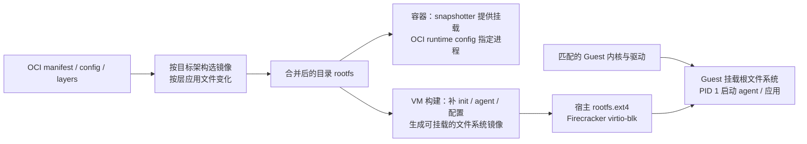
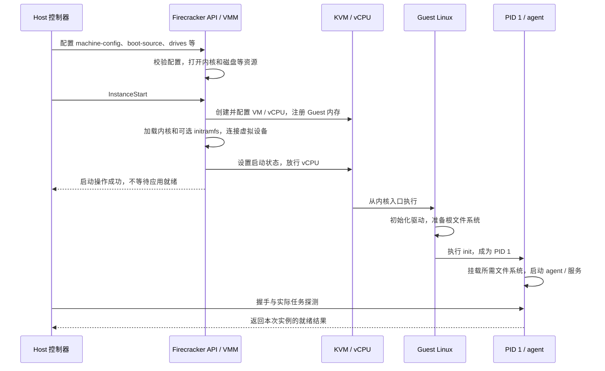
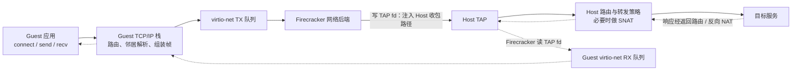
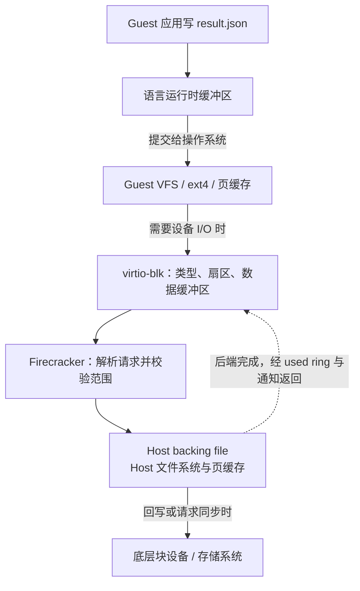
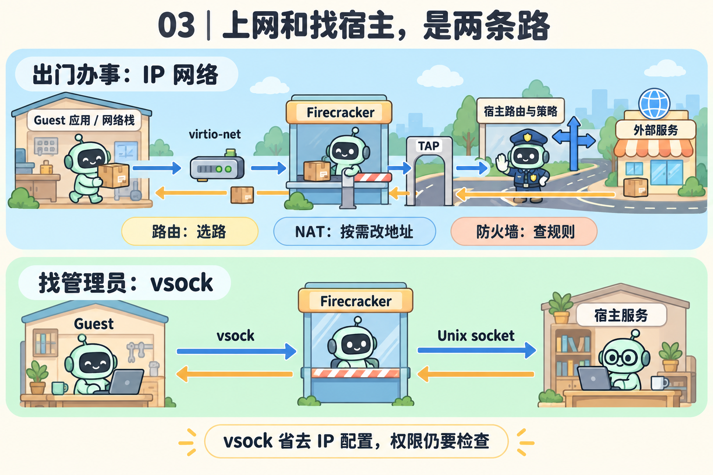
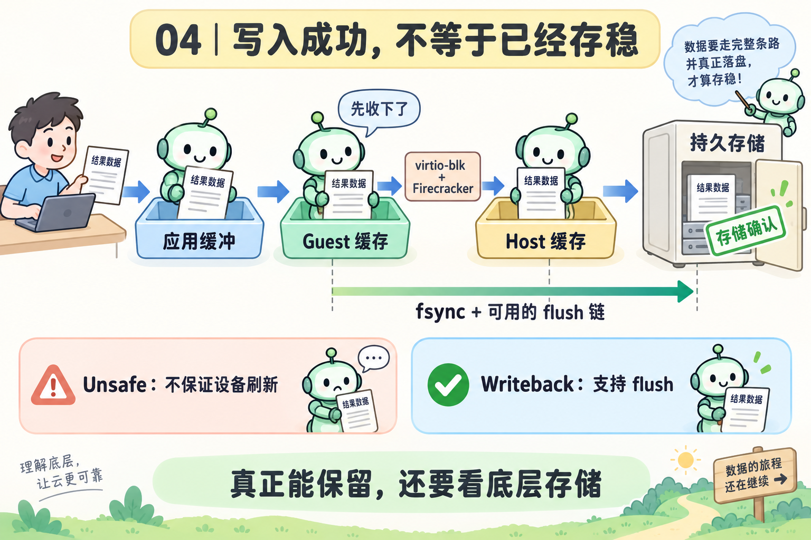
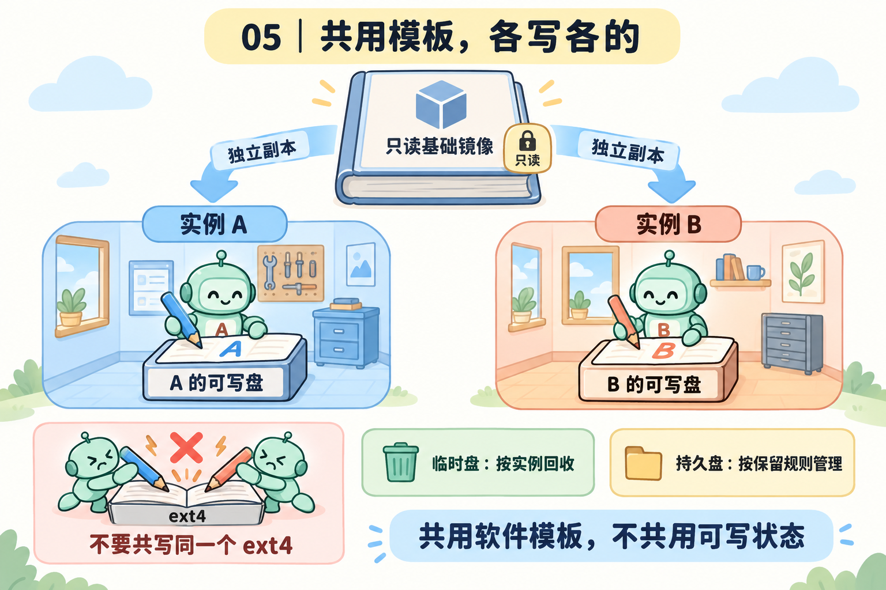
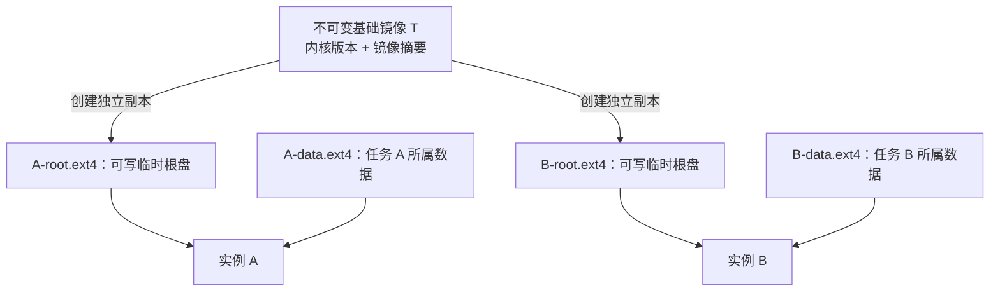
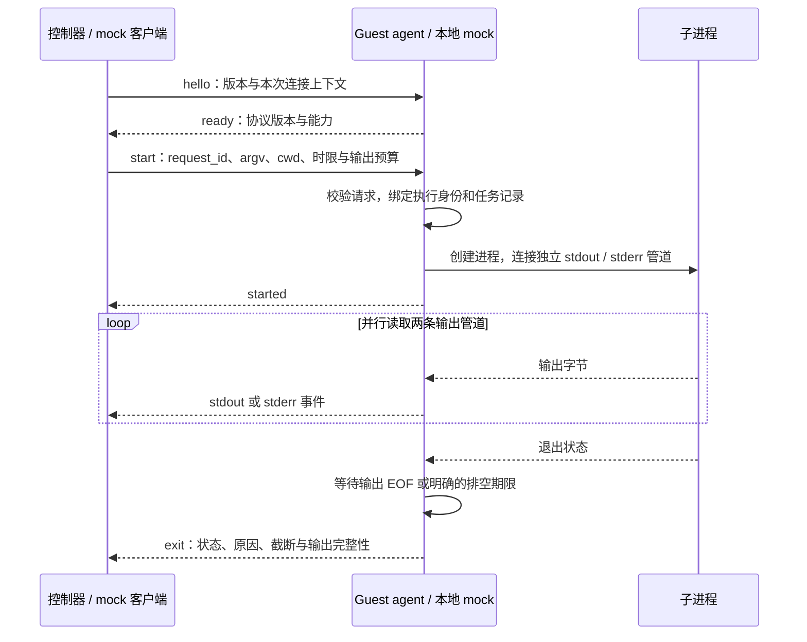

# Firecracker 镜像、启动与 I/O：把一个任务真正跑起来

假设平台收到一个任务：运行 `analyze.py`，读取数据，计算后写入 `/workspace/result.json`，再告诉调用方任务是否成功。在自己的电脑上，你可能只需要运行 `python3 analyze.py`，因为操作系统、Python 和磁盘都已经准备好了。在一台新建的虚拟机里，这些条件需要由平台准备。**本文要解决的就是：怎样把软件包变成可启动、可通信、可写入且可回收的一台 microVM。**

这里先分清“外面”和“里面”：运行 Firecracker 的 Linux 系统叫 **Host（宿主）**；它创建的虚拟机里运行的 Linux 系统叫 **Guest（客户机）**。**microVM 就是这种设备和功能经过精简的小型虚拟机**，有自己的内核和进程，使用宿主提供的计算、内存和存储资源。本文中的“实例”，指一台具体创建出来的 microVM。全文沿着同一个任务看五个问题：镜像如何变成 rootfs，Guest 如何启动，控制器怎样判断“真的能接任务”，网络与 vsock 如何传输，写入怎样获得明确的持久化和隔离语义。

## 从镜像到可接任务：一条完整主线

### 1. 内核、rootfs 与 PID 1 分别解决什么问题

一份 Python 文件不能直接交给 Firecracker 执行。Firecracker 要先启动 Guest Linux 内核，由内核建立进程、内存和设备环境，再从根文件系统找到用户程序。**内核提供运行机制，rootfs 提供程序与依赖，PID 1 把用户空间组织起来。**把三者拆开后，才能分清失败是在加载内核、挂载磁盘，还是执行应用。

| 对象 | 包含什么、由谁使用 | 缺失或不匹配时会怎样 |
| --- | --- | --- |
| Firecracker 二进制 | 在 Host 运行的 VMM，通过 KVM 管理 Guest | 宿主架构、权限或 KVM 条件不满足，VM 无法创建 |
| Guest 内核镜像 | Linux 内核及编入的驱动；由 Firecracker 加载到 Guest 内存 | 格式错误可能在加载阶段失败；缺驱动可能到挂载根盘时才失败 |
| 根文件系统 rootfs | Guest 的 `/`，包含 init、shell、运行时、库和配置 | 内核可能已经运行，但找不到可执行的 init 或应用依赖 |
| initramfs | 早期用户空间的 cpio 归档，通常通过 API 的 `initrd_path` 提供 | 可用于加载模块、组装根文件系统；不是普通 ext4 磁盘镜像 |
| PID 1 / init | 内核启动的第一个用户态进程；可由 systemd、其他 init 或专门程序承担 | 用户空间服务无法拉起，子进程无人回收，或 init 退出使系统崩溃 |
| Guest agent | 接收任务并管理进程、文件和结果的用户态服务 | VM 可以正常启动，但控制器仍无法下发任务 |

这里的 rootfs 泛指“充当 Guest 根目录的文件系统”；本文示例中的 `rootfs.ext4` 是其块设备镜像形式。它不等于 Linux 启动早期名为 rootfs 的内存文件系统，也不意味着所有根文件系统都必须是 ext4。[Linux early userspace][linux-initramfs] · [Firecracker 镜像构建][fc-image-setup]

兼容性需要同时看三层：Host 与 Firecracker 的架构、Guest 内核的架构和装载格式、rootfs 中二进制的架构与 ABI。ABI 是程序与内核、动态加载器和库之间的二进制约定。以本地 Firecracker 提交为例，x86_64 加载器支持 ELF `vmlinux`，也支持 `bzImage`；aarch64 使用对应的 `Image`。这不提供跨 CPU 架构仿真。`bzImage` 的解压还会增加 Guest 启动工作和内存需求。[x86_64 加载实现][fc-x86-loader] · [aarch64 加载实现][fc-arm-loader] · [格式说明][fc-image-setup]

### 2. 从 OCI 镜像到 microVM 根盘，中间缺了什么

复用容器镜像能复用已有的软件和依赖，但 **OCI 镜像描述的是文件变化和运行默认值，Firecracker 的块设备后端处理的是磁盘偏移与字节**。两者需要转换，不能把镜像 tar 包改名为 `.ext4` 就启动。



**第一步是正确还原文件系统。**OCI 层除了添加文件，也能删除旧文件。whiteout 是表达删除的标记：例如下层有 `/opt/old.conf`，上层用 `/opt/.wh.old.conf` 表示删除；合并结果应当两者都不出现。逐个普通 `tar -xf` 可能留下旧文件或标记。解包还要保留属主、执行位、符号链接等元数据。[OCI layer 规范][oci-layer]

**第二步是转换启动语义。**OCI image config 中的 `Entrypoint`、`Cmd`、`Env`、`User`、`WorkingDir` 是容器启动的默认配置，不会因文件被复制进 ext4 就自动生效。VM 构建器需要把最终命令、环境、用户和工作目录转成 init 服务配置或 agent 的执行参数。Firecracker 不读取 Dockerfile，也不替用户运行 OCI entrypoint。[OCI image config][oci-image-config]

**第三步是补上 VM 的启动环境。**普通容器常复用宿主内核，镜像里可以没有 init 系统；microVM 需要自己的内核和用户空间启动链。若直接从 ext4 根盘启动且没有 initramfs，发现根盘所需的 VirtIO 传输、`virtio-blk` 和 ext4 支持必须在挂载根盘前可用。把驱动仅作为模块放在尚未挂载的根盘里，会形成“先读盘才能加载读盘驱动”的循环依赖。最直接的做法是把这条启动路径所需的驱动编入内核；采用 initramfs 时也可以由早期用户空间加载所需模块。[Guest 配置示例][fc-guest-configs] · [根文件系统构建][fc-image-setup]

containerd 的 content store 保存镜像内容，snapshotter 在解包后提供可挂载的文件系统及实例可写层；这不自动生成 Firecracker 可用的根块设备。文件系统 snapshot 只保存文件系统状态，VM snapshot 还涉及内存、vCPU 和设备状态，二者不能互换。[containerd content flow][containerd-content]

镜像构建本身也处于信任边界内：解包器处理归档路径，文件系统工具解析镜像元数据，安装脚本还可能执行代码。因此，平台应在受限构建环境中转换不可信镜像，并限制目录访问、执行权限和资源；不能因为最终任务会进入 microVM，就把前面的构建过程视为已隔离。这是根据数据处理路径得到的平台设计要求。

### 3. 冷启动如何把文件变成正在运行的系统

Firecracker 常用直接加载内核的启动路径，省去通用 PC 固件和完整设备发现环境的部分工作；代价是构建者必须事先提供匹配的内核、驱动、根盘与启动参数。下面描述 API 启动路径，设备的 MMIO 或 PCI 传输按所用配置确定。[启动构建实现][fc-builder]



图中 Guest 执行与 API 响应可以并发发生，不能把箭头顺序当作精确日志时间顺序。源码中 `build_microvm_for_boot()` 创建 vCPU 线程时先保持 `Paused`，`build_and_boot_microvm()` 再调用 `resume_vm()`。`InstanceStart` 成功表明这条启动操作完成，Guest 仍可能随后因根盘或 init 问题 panic。[API action 解析][fc-actions] · [启动控制器][fc-rpc] · [VMM 构建与启动][fc-builder]

几个启动参数控制的是不同环节：

| 参数或配置 | 谁使用、作用在哪一步 | 容易混淆的地方 |
| --- | --- | --- |
| `kernel_image_path` | Firecracker 从其可见的宿主文件系统打开内核文件 | 不是 Guest 内的路径；使用 jailer 时要按 jail 内视图检查 |
| `is_root_device`、`partuuid` | Firecracker 据此补充内核根设备参数 | `drive_id` 是管理标识，不会变成 Guest 设备路径 |
| `root=/dev/vda` | Guest 内核寻找整个虚拟盘上的根文件系统 | 若镜像含分区表，根文件系统可能在分区内，不能照搬整盘路径 |
| `root=PARTUUID=...` | 根据磁盘分区标识定位根分区 | PARTUUID 是分区标识，不是 ext4 文件系统 UUID |
| `console=...` | 把内核控制台输出送到所选设备 | 没有串口输出也可能是控制台配置错误，不能直接判定内核未运行 |
| `init=/sbin/init` | 指定普通根文件系统上的初始用户程序 | 不是 Python 应用参数，也不会自动应用 OCI entrypoint |
| `rdinit=/init` | 指定 initramfs 中的早期 init | 由它决定继续使用内存根，还是准备磁盘根后交接 |

本地源码的 `append_root_device_cmdline()` 在根盘配置存在时追加 `root=PARTUUID=...` 或 `root=/dev/vda`，并根据只读属性追加 `ro` / `rw`。因此，诊断时应核对**最终传给 Guest 的命令行**，不要只看手写 `boot_args`；混入重复的 `root=` 会让故障实验偏离预期。[启动参数拼接][fc-boot-config]

不使用 initramfs 时，Guest 初始化块设备、挂载磁盘根，再执行 init。使用 initramfs 时，内核先展开归档并运行其中的 `/init`；它可以加载模块、准备磁盘或 OverlayFS，再交给最终的 init。整个根放在内存中适合很小、可丢弃的环境，但会占用 Guest 内存，写入也不会自动落到根盘。[Linux init 路径][linux-init] · [initramfs 原理][linux-initramfs] · [Firecracker initrd 接口][fc-initrd]

PID 1 不应只是“启动 Python 后退出”的脚本。它需要管理服务和信号、回收被其接管的子进程，并维持系统生命周期；否则任务反复创建进程可能积累僵尸进程，停止请求也未必传到正确进程。通常让现有 init 监督 agent，再让 agent 管理任务进程；若让 agent 直接担任 PID 1，就需要实现这些职责。[Linux init 与孤儿进程接管][linux-pid-namespaces]

### 4. 就绪是一组证据，不是一个布尔值

把 API 成功直接当成可接任务，会把根盘挂载、agent 初始化和应用依赖失败都表现成“偶发执行超时”。控制器应分别观察下面这些检查点，再按实际服务合同决定何时分配任务。

| 检查点 | 足够说明什么的证据 | 仍不能推出什么 |
| --- | --- | --- |
| VMM 进程存在 | 进程存活，启动身份和实例对应正确 | API 已监听、VM 已创建 |
| API 可用 | 本实例 Unix socket 能返回有效 API 响应 | Guest 已启动 |
| vCPU 已放行 | `InstanceStart` 成功，VMM 状态进入运行 | 根盘已挂载、init 已成功执行 |
| Guest 用户空间可用 | 串口或受控探针确认 init 和服务启动 | agent 协议可用、应用依赖齐备 |
| agent 可用 | 通过本实例连接完成版本和能力握手 | 任意应用都可运行、出站网络可用 |
| 任务环境可用 | 用规定身份、工作目录和依赖完成最小任务 | 持续可用、高并发与异常恢复已验证 |

例如 agent 能回答健康请求，但 Python 不存在，说明“agent 就绪、Python 任务环境未就绪”。HTTP 端口接受连接但模型还没加载，也不能算模型服务可用。探针应触及服务承诺的最小能力，并把失败归到具体阶段；不是每次健康检查都要下载依赖或做昂贵业务操作。这是平台的就绪协议设计，不是 Firecracker 自带的健康语义。

测启动延迟时，使用同一观察者的单调时钟记录阶段时间。不要直接用 Guest 时间戳减 Host 时间戳；两个时钟未必对齐。还应分别记录镜像是否已在本地、页缓存冷热、agent 和应用初始化耗时，避免把缓存命中或省略检查点误认为启动优化。

### 5. 文件存在，为什么 `execve()` 仍然失败

`execve()` 是 Linux 把当前进程切换为指定程序的系统调用。对动态链接 ELF 文件，内核还需要找到 ELF 中 `PT_INTERP` 指定的加载器，再由加载器定位共享库；对脚本，还需要找到 `#!` 指定的解释器。**可执行文件只是依赖链的起点。**[Linux execve][linux-execve]

```text
执行 /usr/local/bin/worker
  → Guest 内核检查路径、权限与文件格式
  → 若是动态 ELF：打开 PT_INTERP 指定的加载器
  → 加载器解析所需共享库和符号
  → 程序初始化，读取配置、证书和运行时资源
  → 开始处理任务
```

| 现象 | 可以提出的假设 | 有用的证据 |
| --- | --- | --- |
| 文件可见，执行报告 `ENOENT` | 路径某环节、符号链接目标、脚本解释器或 ELF 加载器不存在 | 实际 `execve` 参数，`file`、`readelf -l`，Guest 中对应路径 |
| `ENOEXEC` / Exec format error | 架构或文件格式不受支持，脚本缺有效解释器声明等 | ELF 头、架构、脚本首行与原始字节 |
| `EACCES` / Permission denied | 文件或目录权限、`noexec` 挂载或安全策略拒绝 | 实际 UID/GID、目录搜索权限、挂载选项和审计信息 |
| 加载器报告缺少 `.so` 或符号版本 | 加载器已运行，但库集合或 ABI 不匹配 | `readelf -d` 的依赖、库搜索路径、所需符号版本 |
| 进程启动后立刻退出 | 配置、工作目录、环境、证书或应用初始化失败 | stderr、退出状态、启动参数与应用日志 |

例如在 x86_64 glibc 环境构建的程序要求 `/lib64/ld-linux-x86-64.so.2`，而目标 rootfs 只提供 musl 的加载器，程序本身即使存在且有执行位，也可能得到 `ENOENT`。创建一个随意的软链接不能使不同 libc 的 ABI 自动兼容。静态链接能减少动态库依赖，但仍要检查架构、内核接口和运行时数据文件。

对不可信二进制，先用 `file`、`readelf` 等静态检查工具，不以执行它或直接运行 `ldd` 作为第一步。检查工具也应运行在适当受限环境；不要为了查依赖给构建过程额外的宿主权限。[execve 错误条件][linux-execve] · [ldd 使用限制][linux-ldd]

### 6. 一次网络请求如何经过 Guest、VirtIO 和 TAP

TAP 把用户态 VMM 与宿主网络栈连接起来，避免 Firecracker 自己实现完整的路由、NAT 和防火墙。但**连接了 TAP 只获得收发以太网帧的入口**，地址、路由和访问策略仍需要配置。[Firecracker 网络指南][fc-network]

| 组件 | 工作层次与作用 | 不提供的保证 |
| --- | --- | --- |
| Guest `eth0` 等网卡 | Guest 内的网络接口，由 virtio-net 驱动操作 | 不会因 Host 创建 TAP 就自动获得可用 IP 和默认路由 |
| Host TAP | 向 VMM 提供以太网帧读写接口；TUN 则面向 IP 包 | 不是 DHCP、DNS 或互联网出口 |
| Linux bridge | 把多个接口连接到同一二层网络，按 MAC 转发 | 不是创建每个网络都必须经过的一层 |
| IP 路由与转发 | 根据目标地址选择下一跳，允许跨接口转发 | 不会自动改写源地址，也不等于访问已获授权 |
| NAT | 按规则改写源或目的地址、端口 | 不替代租户隔离和出站访问控制 |
| 防火墙 / 访问策略 | 对指定方向、连接和目标执行允许或拒绝规则 | 不负责让应用监听正确地址 |
| DNS | 把名称解析为地址 | 解析成功不代表路由、端口、TLS 或应用成功 |

以“Guest 经 Host 路由访问外部 HTTP 服务”为例，省略 DNS 查询、TLS 和可选 MMDS 分流：



1. Guest 应用发起 socket 操作，Guest 内核根据路由选择下一跳；目的 IP 通常仍是远端服务，二层目的 MAC 则可能是网关的 MAC。
2. virtio-net 把待发送缓冲区放进 TX 队列并通知设备。Firecracker 读取描述符，处理网络头与限流，通过 TAP 文件描述符向宿主注入帧。
3. Host 网络栈决定本地接收还是转发。只有转发到其他接口的流量才属于这里讨论的转发路径；若上游没有 Guest 网段的返回路由，常用 SNAT/MASQUERADE 把源地址改成 Host 出口地址。
4. 返回流量经过路由、策略和需要的反向 NAT 后到达 TAP。Firecracker 从 TAP 读取帧，放入 Guest 提供的 RX 缓冲区，完成队列并通知 Guest；Guest TCP/IP 栈最终交给应用。

TX / RX 都以 Guest 为视角。`write(TAP)` 是 VMM 向 Host 注入 Guest 发出的帧，`read(TAP)` 是 VMM 取得准备发给 Guest 的帧，方向不要记反。源码入口是 `Net::process_tx()`、`process_rx()`，TAP 后端用 `writev` / `readv` 操作分散缓冲区。[网络设备实现][fc-net-device] · [TAP 实现][fc-tap]

Host 访问同网段 Guest 服务通常不需要 NAT，也不需要打开“到外网”的转发规则。Guest 访问外网才要结合路由、转发和返回路径判断是否需要 NAT。Firecracker 的 `iface_id` 是管理 ID，不保证 Guest 网卡也叫这个名字；Guest 网卡命名、IP、DNS 和服务监听应在 Guest 内核实。[网络配置职责][fc-network]

### 7. vsock 省去了 IP 配置，但没有替你定义任务协议

若只需 Host 与 Guest 之间传任务、健康信号和结果，vsock 可以减少对 TAP、IP 地址、路由和 NAT 的依赖。它使用 CID（通信端点标识）与端口寻址；在 Firecracker 中，Guest 使用 `AF_VSOCK`，Host 通过 Firecracker 的 Unix socket 后端衔接。它不让 Guest 自动获得互联网访问能力。[vsock 设计][fc-vsock]

假设设备的 `uds_path` 是 `/run/fc-lab/a.vsock`：

| 谁发起连接 | 准备与连接步骤 | 数据送到哪里 |
| --- | --- | --- |
| Host → Guest | Guest 监听 vsock 端口 `9000`；Host 连接 `a.vsock`，发送 `CONNECT 9000\n` | Firecracker 转接到 Guest 端口；建立成功后回复 `OK <host_port>\n`，其中端口是分配给 Host 端的端口 |
| Guest → Host | Host 服务监听 `a.vsock_9000`；Guest 连接 Host CID `2`、端口 `9000` | Firecracker 按目标端口选择带 `_9000` 后缀的 Unix socket |

`a.api.sock` 一类的 Firecracker 管理 socket 与上面的 vsock socket 是两种接口。向管理 socket 发 `InstanceStart`，不会在 Guest 执行 shell；向 vsock 后端发 JSON 前，也必须先完成其所需的连接握手。[vsock 两种连接方向][fc-vsock] · [Unix 后端路由实现][fc-vsock-muxer]

应用还需要规定消息边界、版本、最大长度、超时和错误格式。流式 socket 的一次 `read()` 可能只读到半条消息，也可能包含多条消息。CID 和 Guest 自报的 `tenant_id` 不能代替业务授权：可信控制器应把连接绑定到它创建的实例和当前任务，再校验操作；Host Unix socket 的目录与访问权限也属于边界的一部分。这些是 agent / 平台需要实现的协议和权限设计。

### 8. 一次文件写入如何变成块 I/O

Guest 看到 `/dev/vda`，不意味着独占了一块物理磁盘。Firecracker 可以用 Host 上的普通文件承载这块虚拟盘；Guest ext4 管理的是盘内的文件系统，Host 文件系统管理的是承载镜像的那个文件。



Guest 文件系统把文件偏移转换成一个或多个数据块和元数据操作；virtio-blk 请求描述磁盘位置与缓冲区。Firecracker 不解析 `result.json` 的业务内容，也不需要知道它的路径。在本地实现中，请求的扇区地址按 512 字节单位转换为后端偏移；例如扇区 `8` 对应字节偏移 `4096`，并不意味着“文件的第 4096 个字节”。[块请求 `offset()` 与 `process()`][fc-block-request]

VirtIO 队列位于双方可访问的 Guest 内存中：驱动发布缓冲区描述符，设备后端读取并执行，完成后更新 used ring，再按通知机制让驱动回收请求。共享队列减少了对复杂传统硬件的模拟，但不是“所有 I/O 都没有复制”或“每个系统调用只产生一次退出”。缓存、批处理和通知抑制都会改变请求数量与通知次数。

更完整的队列布局、内存屏障和一次读写路径见 [virtio-blk 原理与源码解析](../articles/virtio-blk-driver-and-io-path.md)。理解本节的关键，是把**文件语义、块请求、Host 后端和持久化**串起来。

#### `Sync` / `Async` 与 `Unsafe` / `Writeback` 是两个维度

| 配置维度 | 取值与机制 | 能回答的问题 |
| --- | --- | --- |
| `io_engine` | `Sync` 使用阻塞文件操作；`Async` 使用 io_uring 提交并接收完成 | Host I/O 是否会阻塞当前处理路径、能否利用并发 I/O |
| `cache_type` | `Unsafe` 不宣告 VirtIO flush；`Writeback` 宣告并支持协商后的 flush 请求 | Guest 的刷新要求能否沿设备接口传到 Host 存储 |

本地提交中默认是 `Sync` + `Unsafe`。**同步 I/O 的“同步”，表示等待这次 Host 文件操作完成，不表示每次写入都已可靠落盘。**配置为 `Writeback` 也不会把所有普通写入改成同步持久化写入。[缓存策略][fc-block-cache] · [I/O 引擎][fc-block-io]

`Async` 能让多个请求在途，在支持并行 I/O 的存储上可能提高吞吐；代价包括队列和 worker 资源、初始化成本，以及更复杂的完成处理。这里引用的固定版本文档仍将其标为 developer preview；比较时应固定内核、存储、负载与队列深度，不能把它当作所有场景都更快的默认选择。[I/O 引擎条件与状态][fc-block-io]

#### 持久化需要一条完整的刷新链

以普通缓冲文件 I/O 为例：

```text
应用 flush：把语言运行时缓冲交给 Guest 内核
  → Guest fsync：请求同步文件数据及相关元数据，并等待结果
  → Guest 文件系统 / 块层按需提交写入、排序和设备 flush
  → 已协商的 virtio-blk flush 到达 Firecracker
  → Sync 后端 sync_all，或 Async 后端提交 io_uring fsync
  → Host 文件系统与底层存储兑现其持久化语义
  → 完成沿路径返回，应用检查 fsync 的结果
```

这不是一次 `fsync()` 必然对应一次设备 flush 的数量关系；具体请求由 Guest 文件系统、设备能力和 I/O 状态决定。关键是刷新要求能走通，并且每层都正确传播失败。[同步后端][fc-block-sync] · [异步 flush][fc-block-async] · [Linux fsync][linux-fsync]

`Unsafe` 下没有这条已协商的设备 flush 保证；即使 Guest 的 `fsync()` 返回成功，也不能据此推断 Host 页缓存已经同步到持久介质。`Writeback` 把这一要求传给后端，但最终保证仍依赖 Host 文件系统、存储设备和它们报告完成的语义。[Firecracker 缓存说明][fc-block-cache]

对于“写临时文件后替换结果文件”的提交方式，还要考虑目录项：把临时文件放在目标同一目录，先同步临时文件，再 rename，最后同步该目录，并检查各步错误。文件内容持久化、名称更新持久化、业务操作完成，是不同的承诺。[文件与目录的 fsync 语义][linux-fsync]

可重算且允许宿主故障时丢失的临时数据，可以评估 `Unsafe` 省去刷新工作的收益；需要保留的结果应使用完整刷新链。后端同步的对象是承载虚拟磁盘的 Host 文件，不是 Guest 的某个业务文件，高频 `fsync` 会增加同步与等待成本。性能测试必须注明缓存冷热、随机或顺序 I/O、`cache_type` 与同步频率，不能用省略持久化步骤的写入吞吐代表可靠提交性能。[缓存取舍][fc-block-cache] · [后端 flush][fc-block-sync]

### 9. 多实例如何共享基础镜像，又不共享写入

共享不可变基础镜像可以减少复制与容量成本，但每个实例的可写状态必须有明确归属。两台 Guest 同时读写同一个普通 ext4 镜像时，各自的内核缓存和元数据分配不知道对方做了什么，可能互相覆盖并损坏文件系统；给它们不同的 `drive_id` 不会解决这个问题。

| 方案 | 写入隔离在哪里实现 | 收益、代价与前提 |
| --- | --- | --- |
| 每实例完整磁盘副本 | 不同的 Host 文件及底层数据 | 最容易解释和排查；复制时间与实际空间成本较高 |
| Host reflink / 存储快照 | 存储层共享未修改数据，首次写入分离 | 创建较快；依赖底层支持，仍有写放大、空间耗尽和快照回收成本 |
| 共享只读根盘 + 独立数据盘 | 根盘禁止写入，应用数据写到每实例磁盘 | 适合能约束写入目录的环境；必须安排 `/tmp`、日志、运行目录等位置 |
| Guest OverlayFS | Guest 合并只读 lower 与实例独立的 upper | 可提供完整可写根视图；增加早期挂载、copy-up 和容量管理工作 |

reflink 是不同文件在文件系统层共享数据区并按写入分离；**硬链接仍指向同一个文件，不能作为独立写盘副本**。Guest OverlayFS 则在 Guest 的文件层组合目录：修改 lower 中的文件可能触发 copy-up，删除要记录遮蔽标记；upper / work 的布局与后端能力需要满足内核要求。把 upper 放在 tmpfs 会消耗 Guest 内存，重启后也不保留。[OverlayFS 原理与约束][linux-overlay]

共享只读根盘时，应通过 `is_read_only=true` 限制设备后端，并禁止 Host 上其他写入者原地修改基础文件。仅在 Guest 中执行只读挂载，不能作为阻止不可信 Guest 写盘的边界；基础文件也应来自已静止、状态一致的文件系统。[Firecracker 只读块设备][fc-block]

Firecracker 的普通块设备配置不会自动创建 OCI 可写层或 qcow2 式的后端链；上述复制、存储快照和 OverlayFS 需要构建器、Guest 启动程序或平台负责。数据盘保留与 VM 删除也应分开定义：停止 VM 是释放执行资源，是否删除磁盘取决于盘的所有权、保留策略和引用关系。[块设备后端配置][fc-block]

### 10. 用五张图串起一次任务

回到开头的例子：运行 `analyze.py`，读取数据，写出 `/workspace/result.json`，然后返回任务结果。下面把一台 microVM 比作一间独立的小工坊，按任务发生的顺序看图。工坊、材料包和仓库帮助理解分工，真实组件仍以图中的名称和正文的实现路径为准。

### 图一：Python 运行前，工坊里要准备什么？

先看上半部分的“材料包”，再看下半部分的“内核 + rootfs”。这里的镜像是打包的软件内容，图中画的是这些内容怎样变成可启动的环境。


1. **材料包：容器镜像。**图中的 OCI 是常见的容器镜像标准。镜像可以提供 Python 和依赖，但通常依靠容器所在机器的内核，不一定带有虚拟机启动所需的 init 等程序。
2. **整理好的工具柜：rootfs。**按镜像层的规则还原文件、补上 init 和 agent，再制作适合挂载的文件系统镜像。Guest 启动后，才能从中找到 Python 和其他程序。
3. **让工具运转的机制：Guest 内核。**内核管理进程、内存和设备，rootfs 提供文件。Firecracker 把它们接到同一台虚拟机中，二者职责不同。

对应这个任务，只有 `analyze.py` 文件还不够：系统必须能启动，并且能找到兼容的 Python 解释器和依赖。把容器镜像改个文件名，不会自动完成这些准备。

### 图二：灯亮了，为什么还不能立刻交任务？

沿着图从左往右看：管理台能响应、系统开始运行、任务服务可以接单，是先后需要确认的不同状态。


1. **管理台能响应。**宿主上的控制器能调用 Firecracker API，表示可以配置和管理虚拟机。此时 Guest 可能还没启动。
2. **工坊开机。**启动请求让 Guest 内核开始运行，内核准备根文件系统并启动 PID 1，PID 1 再拉起 agent 等服务。`InstanceStart` 成功本身不会等到这些服务都就绪。
3. **接单员就位。**控制器与 agent 握手，并通过一个实际执行探测确认它能启动进程、返回结果，然后再下发 `analyze.py`。

图下方的 `stdout` 是程序的标准输出，`stderr` 是单独的诊断输出，退出状态表示进程怎样结束。看到一行输出不代表任务已经完成；看到 `stderr` 也不一定代表失败。写出的 `result.json` 是另一个产物，需要按约定保存或取回。

### 图三：下载输入数据和接收任务，分别走哪条路？

假设 `analyze.py` 要从一个网络服务读取数据，同时平台通过宿主给它下发任务。图中的上下两条路线，分别展示这两类通信的一种常见安排。



1. **上方是网络通道。**从 Guest 的网络协议栈出发，经过 `virtio-net`（虚拟网卡）、Firecracker 和 TAP（宿主侧接收、交付以太网帧的虚拟接口），再由宿主网络决定怎样到达目标服务。地址、路由、放行规则和返回路径都要配合。
2. **下方是宿主与 Guest 的专用通信通道。**`vsock` 让双方不用先配置一套 IP 地址就能交换数据；Firecracker 在宿主侧通过 Unix socket，也就是本机进程间的通信接口，连接控制服务。
3. **通道之外还需要消息约定。**agent 必须知道哪条消息表示“运行 Python”，哪条表示输出，哪条表示退出。vsock 提供传输能力，身份检查、权限和任务协议仍由服务负责。

在这个安排中，“能给 agent 下发任务”和“Python 能访问网络服务”是两项独立检查。TAP 本身也不会自动替 Guest 配好上网所需的路由或地址转换。

### 图四：写了 result.json，为什么还要关心缓存？

把缓存理解成“先临时放一下，稍后再送往下一站”的区域。沿着图中的箭头，看数据从 Python 一层层走向存储。



1. **程序先交出数据。**Python 的文件缓冲可能暂存内容；写入操作系统后，数据还可能停在 Guest 的内存缓存里。
2. **虚拟磁盘把写入交给宿主。**`virtio-blk` 是 Guest 使用的虚拟块设备，Firecracker 将其请求转成对宿主后端文件的操作。宿主也可能先把数据放进缓存，因此写入完成不能单独证明已经持久保存。
3. **需要可靠保存时，要打通刷新链。**`fsync` 用于请求同步文件数据等必要状态，磁盘的 flush 请求用于推动缓存落盘。Firecracker 的 `Writeback` 配置支持 Guest 发出的设备刷新请求；`Unsafe` 不提供这条保证。最终能承受什么故障，还取决于底层存储。

对 `result.json` 而言，普通写入、Python 的 `flush()` 和要求持久化的 `fsync` 并不是同一件事。`Writeback` 也不意味着每次写入都会自动存稳；如果采用“写临时文件再改名”的结果发布方式，还要处理文件和目录的同步，具体过程见正文。

### 图五：两个人同时交任务，怎样各写各的？

现在同时创建实例 A 和 B，各运行一份 Python 任务。它们都需要相同的 Python 和库，却不能把各自的结果混在一起。先看共用的模板，再看分开的写入区域。



1. **共用准备好的模板。**把相同的程序和依赖制作成不可变基础镜像，用它创建多个实例，避免每次重新安装环境。
2. **每个实例有自己的写入空间。**可以为每个实例复制独立磁盘，或者由平台构建共享只读基础内容、分离可写层的方案。图中的分叉表示隔离目标，不表示 Firecracker 会自动创建写时复制层。
3. **单独规定结果保留多久。**A 与 B 即使都写 `/workspace/result.json`，只要各自的工作目录由独立磁盘或写层提供，就不会写进同一份后端数据。临时工作盘可以随任务回收，需要保留的结果则应放入有明确保留策略的持久盘或由平台取走。

不要把同一个可写 ext4 磁盘文件同时交给两个 Guest 当普通独立磁盘使用：它们各自维护文件系统状态，可能互相破坏数据。“写入隔离”和“任务结束后保留文件”是两件需要分别实现的事。

## 源码与进一步阅读

| 对应问题 | 资料 |
| --- | --- |
| 内核、根盘和第一次启动 | [本地启动专题](../references/kernel-rootfs-and-boot.md) · [官方入门][fc-getting-started] · [镜像构建][fc-image-setup] |
| TAP、地址与 vsock | [本地网络专题](../references/network-and-vsock.md) · [Network Setup][fc-network] · [vsock][fc-vsock] |
| 磁盘、缓存与实例数据 | [本地存储专题](../references/storage-and-images.md) · [Block Caching][fc-block-cache] · [virtio-blk 深入解析](../articles/virtio-blk-driver-and-io-path.md) |
| 容器镜像转换 | [OCI layer][oci-layer] · [OCI image config][oci-image-config] · [containerd content flow][containerd-content] · [OCI runtime config][oci-runtime-config] |
| agent 执行接口与平台职责 | [E2B 架构][e2b-architecture] · [envd Process 协议][e2b-process] |

## 沿源码核对关键路径

### Firecracker：从启动配置走到设备 I/O

以下入口对应本地提交 `304718526`，链接固定到该提交；设备路径选择内置 virtio-blk / virtio-net / virtio-vsock，不把外部 vhost-user 后端混入同一条调用链。

| 路径节点 | 源码入口 | 要验证的因果关系 |
| --- | --- | --- |
| 保存内核配置 | [`BootConfig::new()`][fc-boot-config] | 此处打开内核和 initrd 文件、解析命令行；文件可打开不代表内容已成功加载 |
| 接受启动动作 | [`parse_put_actions()`][fc-actions] → [`start_microvm()`][fc-rpc] | `InstanceStart` 转成 VMM 动作，再进入构建与启动路径 |
| 创建运行环境 | [`build_microvm_for_boot()`、`build_and_boot_microvm()`][fc-builder] | 内存、KVM、内核、设备和 vCPU 启动状态如何组成可运行 VM |
| 指定根设备 | [`attach_block_devices()`][fc-builder] → [`append_root_device_cmdline()`][fc-boot-config] | 根盘配置怎样改变最终 `root=` 和 `ro` / `rw` |
| 执行磁盘请求 | [`Request::process()`][fc-block-request] → [Sync 后端][fc-block-sync] / [Async 后端][fc-block-async] | 请求如何变成后端偏移；普通写和 flush 调用的操作不同 |
| 转发网络帧 | [`Net::process_tx()`、`process_rx()`][fc-net-device] → [`Tap`][fc-tap] | TX/RX 队列怎样接到 Host 收发包路径；网络策略在哪里另行实施 |
| 转接 vsock | [`VsockMuxer`][fc-vsock-muxer] | Guest CID / 端口、Host `CONNECT` 命令与 Unix socket 路径怎样对应 |

### containerd / runc 与 E2B：镜像管理和进程执行属于哪一层

containerd v2.0.0 的 [content flow][containerd-content] 描述“内容存储 → 按层解包 → committed snapshot → 实例 active snapshot”；再对照 [OCI runtime config][oci-runtime-config]，区分 rootfs 的挂载来源与 `process.args`、`cwd`、`user` 等进程配置。runc 如何启动进程已在 [运行时基础文章](01-runtime-foundations.md#answer-container-start) 展开，本文聚焦把这些文件与配置转换为 VM 启动材料时多出的工作。

E2B 的固定提交 `48772bf118` 中，`packages/orchestrator` 承担沙箱运行与模板构建角色，`packages/envd` 是 Guest 内的进程和文件服务。可以按三条逻辑路径定位；具体请求会经过相应代理，不能把图当成所有流量共用的物理链路。[E2B 架构][e2b-architecture]

```text
创建环境：客户端 → 平台 API → orchestrator → 准备模板与 VM → Guest envd
执行命令：客户端 → 沙箱代理路径 → Guest envd Process 服务 → Guest 用户进程
访问应用：客户端 → 沙箱端口代理路径 → Guest 应用监听端口
```

`ProcessConfig` 明确包含 `cmd`、`args`、`envs` 和可选 `cwd`。`Start` 返回事件流，`ProcessEvent` 区分 start、data、end 与 keepalive，data 又区分 stdout、stderr 与 PTY；end 带退出相关字段。**VM 创建成功、进程创建成功、输出传输完成和进程退出，是四类不同结果。**这是 envd 的应用协议，不是 Firecracker `/actions` 的功能。[envd 协议定义][e2b-process]

## 验证与排障

下面五个问题把“能启动”拆成可观察的证据：启动就绪、网络连通、写入隔离、镜像转换和 agent 协议。它们既是文章的实践部分，也可以直接作为上线前的检查清单。

1. 在 Linux 使用同架构的可信内核与 rootfs 启动测试实例，记录配置、启动时间线和各就绪检查点。[解析一](#answer-boot)
2. 分别制造启动配置故障和应用监听故障，用 API、串口与网络证据定位；画出请求经过的网络路径。[解析二](#answer-failures)
3. 为两个实例准备独立可写空间，验证写入隔离、重启保留与磁盘回收边界，记录实例和磁盘关系。[解析三](#answer-disks)
4. 比较容器镜像与 Firecracker rootfs 的启动清单，画出转换链，并分析“文件存在但不能执行”。[解析四](#answer-image-conversion)
5. 为本地 mock agent 设计 stdout/stderr 分流、退出状态和输出上限，对照 E2B envd 记录请求时序。[解析五](#answer-agent-protocol)

下面的验证步骤包含设计解析与待执行实验，并不冒充服务器实测记录。macOS 可完成源码阅读、绘图、静态检查与 mock；真实 KVM、TAP 和 Guest I/O 验证需要在 Linux 测试环境执行，材料留在本地。

<a id="answer-boot"></a>

### 1. 怎样启动实例，并证明它已能接任务

#### 解析

先固定内核、根盘、Firecracker 版本和 CPU 架构，确认实际运行身份能访问这些文件；随后配置 VM 并启动。启动完成后继续验证 Guest 用户空间、agent 握手和目标任务，而不是收到 `InstanceStart` 成功就把实例加入可用池。

先选一个没有 initramfs、整个 ext4 文件系统直接作为根盘的例子。以下是 **x86_64、串口使用 `ttyS0`、默认 MMIO 设备路径**的 API 请求体示例。路径必须在 Linux 上提前存在，并对实际 Firecracker 进程可见；`256 MiB` 只是配置示例，是否足够取决于内核和用户空间。

| 顺序 | API | 请求体 |
| --- | --- | --- |
| 1 | `PUT /machine-config` | `{"vcpu_count":1,"mem_size_mib":256}` |
| 2 | `PUT /boot-source` | `{"kernel_image_path":"/srv/fc-lab/vmlinux","boot_args":"console=ttyS0 reboot=k panic=1"}` |
| 3 | `PUT /drives/rootfs` | `{"drive_id":"rootfs","path_on_host":"/srv/fc-lab/a.ext4","is_root_device":true,"is_read_only":false,"cache_type":"Writeback","io_engine":"Sync"}` |
| 4，可选 | `PUT /vsock` | `{"guest_cid":3,"uds_path":"/run/fc-lab/a.vsock"}` |
| 5 | `PUT /actions` | `{"action_type":"InstanceStart"}` |

这里故意不手写 `root=`，由根盘配置生成。vsock 设备配置成功也不会自动安装或启动 agent；只有镜像内已经提供相应驱动、agent 和监听服务时，才能通过它握手。网络设备同样需要另行配置，不能从此示例推断 Guest 已能访问外网。[API 定义][fc-api] · [根盘参数生成][fc-boot-config]

#### 时间线应该怎样记录

```text
t0  控制器开始本次请求
t1  镜像与实例独立磁盘准备好
t2  本实例 API 可用，完成启动前配置
t3  InstanceStart 返回成功
t4  控制器收到 agent 的本次启动握手
t5  规定身份下的最小任务完成并返回可核对结果
```

`t5 - t0` 是这个口径下的任务可用延迟；`t1 - t0` 是材料准备时间，`t4 - t3` 包含 API 返回后仍未完成的启动和 agent 初始化工作。实际事件可能重叠，尤其不能用 API 响应时间替代 Guest 首条日志时间；日志应保留各自的采集位置和时间来源。

agent 握手应通过控制器已绑定到本实例的连接完成，并关联本次启动代次，避免把旧进程、旧 socket 或旧健康结果当成新实例就绪。协议版本或能力不匹配应直接报告，不应等到运行任务时再表现成超时。这是控制器设计建议。

Guest 用户空间可用后，可通过已有串口或受控执行通道检查：

```bash
uname -m
cat /proc/cmdline
findmnt /
ps -p 1 -o pid,comm,args
id
pwd
```

这些命令在 Guest 执行，精简镜像可能没有 `findmnt` 或完整 `ps`，需要使用已有等价工具。最终探针应运行实际需要的解释器，验证工作目录可写并返回固定结果；若任务依赖网络，再增加针对目标的受控连接检查。串口日志证明某阶段曾到达，任务结果证明所选执行路径当时可用，两者相互补充。

<a id="answer-failures"></a>

### 2. 启动失败与应用端口不通，怎样逐层定位

#### 解析

保留本轮原始配置和日志，先找最后一个成功的检查点，再定位第一个失败的边界。每轮只改变一个条件，恢复后重新验证，避免同时改内核、根盘和网络导致因果不清。

#### 故障 A：把内核路径改成不存在的文件

在新实例的 `PUT /boot-source` 中指定本次实验目录内不存在的内核路径。按本地实现，`BootConfig::new()` 会立即尝试打开文件，因此这项错误应在配置阶段返回；还没有进入 Guest 内核执行。[配置文件打开位置][fc-boot-config]

需要保存的是 API 响应的 HTTP 状态与错误正文、实际配置路径、Firecracker 的运行身份和 jail 内路径视图。若文件在 Host 终端可见而 VMM 打不开，继续查目录权限和进程可见的根目录；不要先调 Guest 的 `root=` 或 Python 依赖。

修复只恢复正确、可访问的路径，再按原顺序配置与启动。文件能打开仅排除了这次路径错误；文件内容错误仍可能到内核加载阶段才暴露。

若另做根盘挂载故障，不要只向 `boot_args` 塞一个错误的 `root=`，因为根盘配置还可能追加另一个值。可以在一次性实例中取消盘的根设备标志，再明确指定不存在的根设备，并从串口核对最终命令行。它应当与“内核文件打不开”呈现不同阶段的证据，而不是保证出现某一条完全固定的错误文本。

| 最后看到的证据 | 下一步缩小到哪里 |
| --- | --- |
| `/boot-source` 返回文件打开错误 | Host 路径、运行身份、权限与 jail 可见性 |
| `InstanceStart` 返回内核装载错误 | 内核格式、架构、装载条件与资源 |
| Guest 有内核日志，出现根设备等待或挂载失败 | 最终 `root=`、设备枚举、驱动、分区布局和文件系统类型 |
| 根已准备好，但 init 执行失败 | init 路径、权限、架构、脚本解释器或 ELF 加载器 |
| agent 已启动，任务程序执行失败 | 命令、环境、用户、目录、依赖与应用日志 |

#### 故障 B：Guest 服务只监听回环地址

假设自己的测试环境已有 Host TAP 地址 `172.30.0.1/30`、Guest 地址 `172.30.0.2/30`，且网段不与现有网络冲突。Guest 已装 Python 时，可在实验目录中启动服务：

```bash
python3 -m http.server 8000 --bind 127.0.0.1
```

另一个 Guest 终端执行：

```bash
ss -lntp
curl --noproxy '*' --max-time 3 http://127.0.0.1:8000/
```

Linux Host 执行：

```bash
ip route get 172.30.0.2
curl --noproxy '*' --max-time 3 http://172.30.0.2:8000/
```

Guest 回环请求成功，而 Host 请求失败，首先应结合 `ss` 确认监听地址。`127.0.0.1` 属于 Guest 自己的回环接口，Host 经 TAP 到 `172.30.0.2` 的连接不能命中它。停止本次测试服务，把监听地址改成 Guest 的 `172.30.0.2` 后重试；需要覆盖多个 Guest 接口时才选择适当的通配地址。

```text
Host curl → Host 路由到 TAP → Firecracker virtio-net RX
  → Guest IP 栈 → 目标地址 172.30.0.2、端口 8000 的监听 socket
  → HTTP 服务 → Guest TX → TAP → Host curl
```

这条路径没有访问外网，不需要靠增加 NAT 规则修复监听问题。若修正后仍失败，再检查 Guest / Host 策略以及限定实验 TAP 的抓包：有无 SYN、SYN-ACK 或 RST，返回方向是否到达。拒绝可能来自无监听者或主动拒绝规则，超时可能来自丢包、路由或资源问题；错误表象不能单独确定根因。[Host 与 Guest 网络配置][fc-network]

域名失败另查 DNS；TCP 成功、HTTPS 失败再看 TLS、证书与时间。用 IP 验证 HTTPS 时还要保留正确的服务名称 / SNI，否则会引入新的错误。抓包受网卡 offload 影响时可能看到尚未计算完成的校验和，不能只凭这一现象断言包已损坏。[Linux 校验和卸载][linux-checksum-offloads] 清理只针对本轮服务、TAP 和规则，不能清空宿主现有配置。

<a id="answer-disks"></a>

### 3. 怎样证明 A/B 写入隔离，并定义哪些数据保留

#### 解析

给 A、B 分配不同的可写后端，先证明写入不会串到另一实例，再验证同一实例使用同一数据盘重新启动时能保留预期结果。随后分别定义临时根盘、持久数据盘和基础镜像的删除条件。

下面选用最容易验证的完整复制方案，不引入 OverlayFS 或存储快照：



| 对象 | 挂载和访问关系 | VM 停止后的处理 |
| --- | --- | --- |
| 基础镜像 T | 发布后不再原地修改，不作为实例可写盘使用 | 按版本与引用关系保留 |
| A-root / B-root | 各自作为根盘，只供对应实例写入 | 实例确认停止且无引用后，按临时盘策略回收 |
| A-data / B-data | 分别挂载到各自 Guest 的 `/workspace` | 按任务所有权保留，不因 VMM 退出自动删除 |

这是平台建议的对象关系，不是 Firecracker 自动创建的存储布局。普通完整复制可用；硬链接不可用。Host 与 Guest 也不能同时把同一个普通 ext4 后端作为可写文件系统挂载。

实验时先核对每个 `path_on_host` 与 Guest 设备、挂载点的对应关系，确认 `/workspace` 实际挂在数据盘上。然后 A 写 `from-a.txt`，B 写 `from-b.txt`；各自能读自己的文件，并确认看不到对方的文件。两个目录名称相同不等于共用同一个磁盘，两个 Host 路径不同也要排除硬链接等别名。

对于需要保留的结果，在应用内完成缓冲刷新、文件同步和必要的目录同步，再正常关闭 Guest 并确认旧 VMM 停止。随后用新的 VMM 进程、同一个 A 数据盘启动，验证内容与摘要；给 A 换一块空数据盘再启动，应得到不同结果，以确认没有误从根盘或缓存读到文件。

要解释验证强度：

- 同一磁盘重启后文件存在，证明本次写入在这套配置和正常关闭路径下保留。
- 杀死 VMM 进程后文件仍在，不证明掉电安全，因为 Host 内核和页缓存仍然存活。
- `Writeback`、Guest 同步、Host 存储语义共同支持持久化合同；仅凭一次重启实验不能证明所有故障条件下都正确。
- 复制正在写入的镜像不等于获得一致快照；一致性需要静止写入或使用适当的快照与协调机制。仅暂停 vCPU 也不自动等于应用数据已提交。

文件系统快照不会保存正在运行的 Python 栈、内存对象和 CPU 位置。反过来，Firecracker 保存的内存文件与 VM 状态文件也不能脱离对应磁盘状态使用；磁盘文件由集成者管理。[官方快照组成说明][fc-snapshots] 磁盘内容与内存 / 设备状态的配合见 [快照与 fork 专题](05-snapshots-and-fork.md)。

<a id="answer-image-conversion"></a>

### 4. 容器能启动，为什么转换成 rootfs 后不一定能启动

#### 解析

容器成功运行证明的是“这份文件系统在某个宿主内核和容器配置下能执行指定进程”。microVM 多了 Guest 内核、启动驱动、根盘布局和 PID 1；镜像里的运行默认值也需要显式传给 Guest 的服务管理或 agent。因此，转换必须同时处理文件内容与启动配置。

| 启动条件 | 容器路径 | Firecracker microVM 路径 |
| --- | --- | --- |
| 内核与架构 | 进程使用宿主提供的内核接口，镜像应匹配执行架构 | 提供匹配的 Guest 内核；用户程序还需与 Guest 架构、ABI 兼容 |
| 文件系统表示 | OCI 层解包后，由 snapshotter 提供根目录挂载 | 生成正确布局和文件系统类型的根盘，或准备 initramfs |
| 第一段用户代码 | 运行时按 OCI runtime config 执行进程 | Guest 内核执行 init，init 再启动 agent / 应用 |
| 命令与参数 | 镜像默认值与启动时覆盖合成最终参数 | 构建器或控制器把最终参数交给 Guest 服务 / agent |
| 用户与目录 | `process.user`、`cwd` 等配置由运行时应用 | Guest 内建立所需 UID/GID、目录权限，并由执行服务切换身份和目录 |
| 环境与资源文件 | 环境变量、挂载、证书等由镜像与启动配置共同提供 | 必须在 Guest 内另行准备；不能假定继承 Host 环境 |
| 可写空间 | 通常由实例 active snapshot 和挂载提供 | 独立可写盘、数据盘或 Guest overlay；只读根需安排临时目录 |
| 网络与服务入口 | 由容器网络和进程监听配置决定 | 还要有 Guest 驱动和地址配置，并与 Host TAP / 路由对应 |
| 进程结束 | 容器任务退出后由上层回收 | 应用退出不等于 VM 退出；agent 和 PID 1 可能仍在运行 |

例如镜像默认配置为：

```json
{
  "Entrypoint": ["/usr/local/bin/python3"],
  "Cmd": ["/app/worker.py"],
  "Env": ["APP_MODE=batch"],
  "User": "1000:1000",
  "WorkingDir": "/workspace"
}
```

转换后，VM 启动程序仍应先把 agent 拉起来；执行任务时再使用最终参数数组 `["/usr/local/bin/python3", "/app/worker.py"]`、UID/GID `1000:1000`、工作目录 `/workspace` 和相应环境。还要保证 `/workspace` 已挂载且对这个身份可写。只把 `/app/worker.py` 复制进 ext4，不会完成上述任何配置动作。[镜像默认配置][oci-image-config] · [运行时进程配置][oci-runtime-config]

这里沿用参数数组，避免自行拼接 shell 字符串改变空格、引号或通配符语义；确实需要 shell 解释时，应把 shell 及参数写进明确的执行合同。普通任务程序不直接承担 PID 1，也就不必同时实现整个 Guest 的进程回收与关机逻辑。

若被执行的是自带的 ELF `worker`，可在受限的 Linux 检查环境中采集静态证据：

```bash
file /usr/local/bin/worker
readelf -h /usr/local/bin/worker
readelf -l /usr/local/bin/worker
readelf -d /usr/local/bin/worker
```

依次确认架构、`PT_INTERP` 与依赖库，再到目标 Guest 文件系统视图检查对应路径和权限。脚本则核对首行解释器、换行格式和实际解释器路径；不要对 Python 文本文件套用 ELF 检查结果。Mac 上有对应工具时可做静态分析，但不能用 Mac 执行结果证明 Linux Guest 可执行。

构建记录应能关联“源镜像摘要 → 转换配方 → Guest 内核 / agent 版本 → 产物摘要 → 实例配置”。这样，“同一个 tag 昨天能用”才有可比较的内容依据；摘要固定内容，可信来源仍需另行确认。镜像转换后的真实启动与目标任务验证属于 Linux 实验，不能由构建成功代替。

<a id="answer-agent-protocol"></a>

### 5. 怎样设计不会把输出、退出和断连混淆的 agent 协议

#### 解析

把传输、进程和任务结果分开建模：连接建立只说明有通道，`started` 说明进程已创建，stdout/stderr 是字节流，最终退出事件说明进程如何结束。输出有上限，超时有回收策略，断连则单独报告为结果未知或等待查询。

本地 mock 可以用 Unix socket 模拟 Host 与 agent 的传输。**以下 JSONL 是自定义教学协议，不是 Firecracker API，也不是 E2B envd 的线协议。**JSONL 表示一行一个 JSON 对象；输出字节使用 base64 编码，避免换行或非 UTF-8 内容破坏分帧。真实 vsock 接入还要先完成其传输连接。



进程退出与管道读完在实际执行中可能交错，图中只是表达最终事件的依赖条件。`request_id` 用来关联同一任务，不是租户身份；身份来自受信任的连接上下文和控制器授权。

#### 一组示例消息

下面使用 Linux Guest 路径；Mac mock 应显式替换成本地解释器和测试工作目录，不把同名路径当成同一环境。时限与预算是示例值，应由服务端再限制在允许范围内。

```json
{
  "type": "start",
  "request_id": "r1",
  "argv": [
    "/usr/bin/python3",
    "-c",
    "import sys; print('ok'); print('warn', file=sys.stderr); sys.exit(2)"
  ],
  "cwd": "/workspace",
  "timeout_ms": 5000,
  "max_output_bytes": 1048576
}
```

```jsonl
{"type":"started","request_id":"r1","pid":42}
{"type":"stdout","request_id":"r1","seq":1,"data_b64":"b2sK"}
{"type":"stderr","request_id":"r1","seq":2,"data_b64":"d2Fybgo="}
{"type":"exit","request_id":"r1","code":2,"signal":null,"reason":"exited","output_truncated":false,"output_complete":true}
```

这里是模拟消息：PID 不是实测值，两个输出事件也可能以相反顺序到达。`seq` 只记录 agent 观察到的事件顺序；独立 stdout/stderr 缓冲与并发读取不能保证还原跨流的原始全局顺序。`output_complete` 表示排空到了两条管道的 EOF，`output_truncated` 表示输出预算是否导致部分字节未交付；两者回答不同问题。

#### 必须明确的失败与资源边界

| 情况 | 协议与实现应怎样处理 | 原因 |
| --- | --- | --- |
| 可执行文件不存在或无法创建进程 | 返回 `error`，标明 `stage=spawn` 和原因；不伪造应用退出码 | 进程未启动与应用运行后退出不同 |
| 子进程同时大量写两条输出 | 并行持续读取 stdout/stderr，设置有界发送队列 | 顺序读完一条再读另一条，可能被另一条已满的管道阻塞 |
| 输出超过预算 | 本示例选择截断交付、继续排空并丢弃多余字节，最终标记截断 | 仅停止读取可能使子进程堵在 `write()`；继续积累到内存则失去上限 |
| 客户端读取很慢或停止读取 | 设置发送期限；达到限制后执行明确的取消 / 断开策略，继续负责进程回收 | 输出总量有限，不等于发送等待也有界 |
| 执行超时 | 对任务进程组发送终止信号，有限等待后强制结束并回收，返回 `reason=timeout` | 客户端停止等待不会自动停止子进程 |
| 主进程退出，但后代仍持有输出 fd | 有限等待 EOF，超过期限按策略清理后代，标记输出未完全排空 | 主进程退出不保证管道立刻关闭 |
| 连接中途断开 | 区分传输失败与执行结果未知；按任务 ID 查询或按约定回收 | 盲目重发可能重复执行有副作用的任务 |
| 进程被信号终止 | 单独记录 signal 和原因；不要统一写成普通 `code=0` | 正常退出、被杀、超时与 VM 丢失的恢复策略不同 |

本例可限制每条编码后消息不超过 `64 KiB`、每次进程输出读取不超过 `16 KiB`，并在 base64 编码前累计两条流的原始字节总量。这样，单帧、总输出和队列内存都有独立上限；遇到超长输入帧也能在无限分配内存之前拒绝。具体数值属于 mock 设计选择。

进程组适合本地 mock 的基本回收，但不保证捕获主动脱离进程组的所有后代；真实执行服务还要结合任务所属 cgroup 和实例生命周期管理。PTY 模式按终端语义返回输出，不能继续承诺独立保留 stdout/stderr；需要交互终端时应切换明确的协议模式。

E2B envd 可以用于对照这些职责：它以 `StartRequest.process` 表达命令配置，以 `ProcessEvent.DataEvent` 区分 stdout/stderr/PTY，以 `EndEvent` 表达退出信息。本节的 JSON 字段、输出预算、断连策略和终态规则属于教学设计，不能据此宣称 E2B 实现了完全相同的行为。[envd Process proto][e2b-process]

mock 验证可用“正常退出、非零退出、大量双流输出、超时、断连、后代持有管道”覆盖主要分支。它证明的是本地协议与进程管理行为；真实 vsock 传输、Guest 隔离、磁盘持久化和 KVM 启动仍需要各自的运行时证据。

[fc-getting-started]: https://github.com/firecracker-microvm/firecracker/blob/30471852666564d980f330d0575115eda7d5ce8e/docs/getting-started.md
[fc-image-setup]: https://github.com/firecracker-microvm/firecracker/blob/30471852666564d980f330d0575115eda7d5ce8e/docs/rootfs-and-kernel-setup.md
[fc-guest-configs]: https://github.com/firecracker-microvm/firecracker/tree/30471852666564d980f330d0575115eda7d5ce8e/resources/guest_configs
[fc-initrd]: https://github.com/firecracker-microvm/firecracker/blob/30471852666564d980f330d0575115eda7d5ce8e/docs/initrd.md
[fc-api]: https://github.com/firecracker-microvm/firecracker/blob/30471852666564d980f330d0575115eda7d5ce8e/src/firecracker/swagger/firecracker.yaml
[fc-actions]: https://github.com/firecracker-microvm/firecracker/blob/30471852666564d980f330d0575115eda7d5ce8e/src/firecracker/src/api_server/request/actions.rs
[fc-rpc]: https://github.com/firecracker-microvm/firecracker/blob/30471852666564d980f330d0575115eda7d5ce8e/src/vmm/src/rpc_interface.rs
[fc-builder]: https://github.com/firecracker-microvm/firecracker/blob/30471852666564d980f330d0575115eda7d5ce8e/src/vmm/src/builder.rs
[fc-boot-config]: https://github.com/firecracker-microvm/firecracker/blob/30471852666564d980f330d0575115eda7d5ce8e/src/vmm/src/vmm_config/boot_source.rs
[fc-x86-loader]: https://github.com/firecracker-microvm/firecracker/blob/30471852666564d980f330d0575115eda7d5ce8e/src/vmm/src/arch/x86_64/mod.rs
[fc-arm-loader]: https://github.com/firecracker-microvm/firecracker/blob/30471852666564d980f330d0575115eda7d5ce8e/src/vmm/src/arch/aarch64/mod.rs
[fc-network]: https://github.com/firecracker-microvm/firecracker/blob/30471852666564d980f330d0575115eda7d5ce8e/docs/network-setup.md
[fc-net-device]: https://github.com/firecracker-microvm/firecracker/blob/30471852666564d980f330d0575115eda7d5ce8e/src/vmm/src/devices/virtio/net/device.rs
[fc-tap]: https://github.com/firecracker-microvm/firecracker/blob/30471852666564d980f330d0575115eda7d5ce8e/src/vmm/src/devices/virtio/net/tap.rs
[fc-vsock]: https://github.com/firecracker-microvm/firecracker/blob/30471852666564d980f330d0575115eda7d5ce8e/docs/vsock.md
[fc-vsock-muxer]: https://github.com/firecracker-microvm/firecracker/blob/30471852666564d980f330d0575115eda7d5ce8e/src/vmm/src/devices/virtio/vsock/unix/muxer.rs
[fc-block]: https://github.com/firecracker-microvm/firecracker/blob/30471852666564d980f330d0575115eda7d5ce8e/docs/block.md
[fc-block-cache]: https://github.com/firecracker-microvm/firecracker/blob/30471852666564d980f330d0575115eda7d5ce8e/docs/api_requests/block-caching.md
[fc-block-io]: https://github.com/firecracker-microvm/firecracker/blob/30471852666564d980f330d0575115eda7d5ce8e/docs/api_requests/block-io-engine.md
[fc-block-request]: https://github.com/firecracker-microvm/firecracker/blob/30471852666564d980f330d0575115eda7d5ce8e/src/vmm/src/devices/virtio/block/virtio/request.rs
[fc-block-sync]: https://github.com/firecracker-microvm/firecracker/blob/30471852666564d980f330d0575115eda7d5ce8e/src/vmm/src/devices/virtio/block/virtio/io/sync_io.rs
[fc-block-async]: https://github.com/firecracker-microvm/firecracker/blob/30471852666564d980f330d0575115eda7d5ce8e/src/vmm/src/devices/virtio/block/virtio/io/async_io.rs
[fc-snapshots]: https://github.com/firecracker-microvm/firecracker/blob/30471852666564d980f330d0575115eda7d5ce8e/docs/snapshotting/snapshot-support.md
[oci-layer]: https://github.com/opencontainers/image-spec/blob/v1.1.1/layer.md
[oci-image-config]: https://github.com/opencontainers/image-spec/blob/v1.1.1/config.md
[oci-runtime-config]: https://github.com/opencontainers/runtime-spec/blob/v1.2.0/config.md
[containerd-content]: https://github.com/containerd/containerd/blob/v2.0.0/docs/content-flow.md
[linux-init]: https://github.com/torvalds/linux/blob/v6.1/init/main.c
[linux-initramfs]: https://docs.kernel.org/filesystems/ramfs-rootfs-initramfs.html
[linux-execve]: https://man7.org/linux/man-pages/man2/execve.2.html
[linux-ldd]: https://man7.org/linux/man-pages/man1/ldd.1.html
[linux-fsync]: https://man7.org/linux/man-pages/man2/fsync.2.html
[linux-overlay]: https://docs.kernel.org/filesystems/overlayfs.html
[linux-pid-namespaces]: https://man7.org/linux/man-pages/man7/pid_namespaces.7.html
[linux-checksum-offloads]: https://docs.kernel.org/networking/checksum-offloads.html
[e2b-architecture]: https://github.com/e2b-dev/runtime/blob/48772bf11820dbd46474bf5dcdd419c7119b864f/docs/ARCHITECTURE.md
[e2b-process]: https://github.com/e2b-dev/runtime/blob/48772bf11820dbd46474bf5dcdd419c7119b864f/packages/envd/spec/process/process.proto
