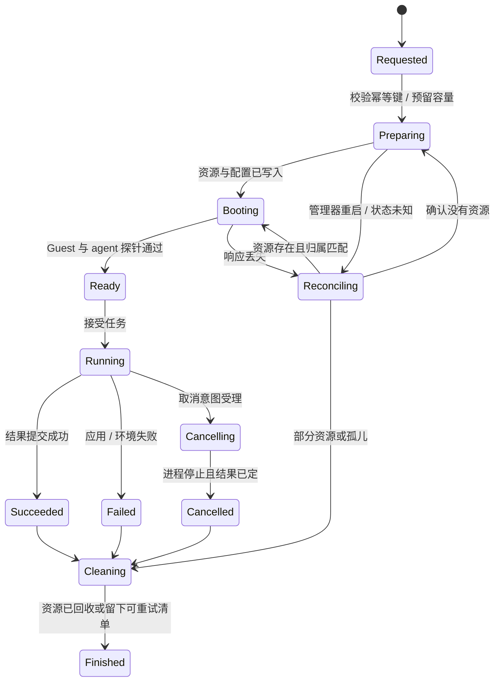
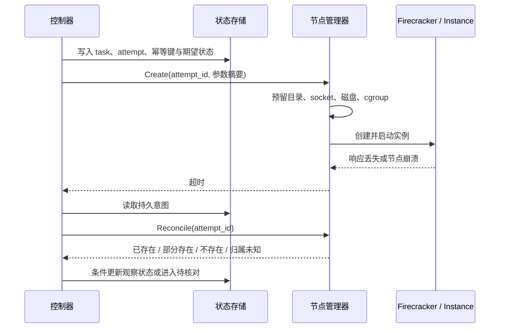
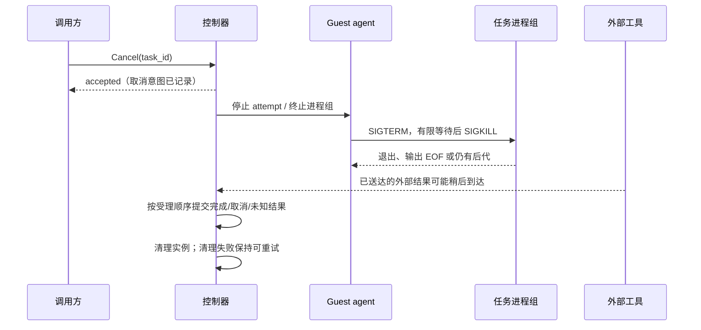
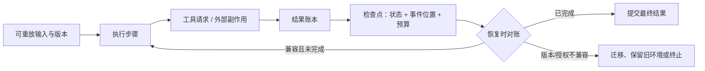
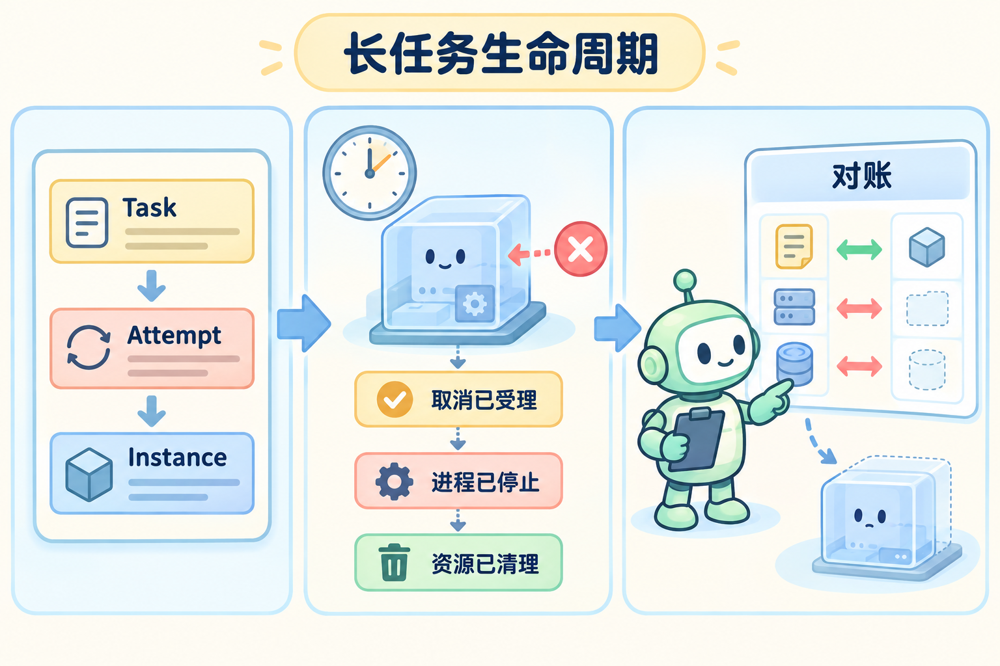

# Firecracker 生命周期、取消与长任务

把一项需要运行二十分钟的分析任务放进 microVM：它在 Guest 中读数据、调用工具并写结果。客户端可能在第五分钟断线，控制器可能在第十分钟重启，用户也可能在第十五分钟取消。一个可恢复的运行时必须始终回答三件事：任务实际跑到了哪里，哪些外部副作用已经发生，哪些资源可以安全回收。

本文将沿着一次任务从创建到清理的路径展开。核心原则是：状态不是数据库里的一个字符串，而是由**事实来源、合法转移和补偿动作**组成的证据链。`running` 只能表示控制面当前的期望或最近一次观察；Guest 进程、Firecracker 进程、磁盘和工具调用是否存在，要分别核对。

### 1. 用核心对象描述一次执行

同一用户任务可能经历多次执行尝试；一次尝试可能先绑定一台实例，失败后又在另一台实例重试。把这些对象混成一个 ID，会让重试、计费和副作用去重都失去依据。

| 对象 | 代表什么 | 生命周期与关键字段 |
| --- | --- | --- |
| Task | 用户希望完成的业务任务 | 稳定的 `task_id`、幂等键、租户、输入摘要、总预算和最终结果 |
| Attempt | Task 的一次执行机会 | `attempt_id`、执行代次、策略/镜像版本、开始和结束原因；重试产生新 Attempt |
| Instance | 承载 Attempt 的一台 microVM 或容器环境 | 实例 ID、节点、VMM 进程身份、磁盘和网络资源；可以被回收或重新绑定 |
| Operation | 一次有副作用的管理或工具动作 | 调用 ID、参数摘要、受理状态、外部回执和幂等关系 |
| Lease | 某个控制器或节点暂时拥有的执行权 | 所有者、过期时间、fencing token；过期控制者不能继续提交新结果 |
| Result | 已确认的业务结果或不确定结果 | 退出原因、输出、产物、工具副作用、证据位置与提交代次 |

`task_id` 说明“用户要什么”，`attempt_id` 说明“哪一次执行”，`instance_id` 说明“在哪个运行环境”，三者不能互换。清理实例后仍应保留 Task、Attempt 和 Result 的账本；删除运行资源不等于删除业务记录。

### 2. 期望状态与观察状态要分开

下面这条状态机是平台的管理模型，不是 Firecracker 原生状态枚举。Firecracker API、节点进程和 Guest agent 只提供其中一部分证据。



每个状态至少记录两类值：

- **期望状态**：控制面希望达到的状态，例如“这个 Attempt 应继续运行”。它由用户请求、取消和策略更新产生。
- **观察状态**：节点实际看到的进程、socket、Guest 握手、工具回执和资源统计。例如“VMM 仍在，但 agent 探针超时”。

状态提交要带执行代次或条件版本。旧节点迟到的“成功”不能覆盖新 Attempt 已提交的失败；清理失败也不能把已经确认的业务结果改写成“未执行”。

### 3. 创建请求超时，不等于创建失败

一次创建至少有三个可能丢失响应的窗口：远程请求还没到节点、节点已经创建资源但还没写状态、节点已经完成并写了结果但确认消息丢失。重试前必须先查稳定身份和实际资源。



恢复流程可以按以下伪代码实现。`PID` 只是一项线索，不能单独证明所有权；实例专属目录、VMM 启动身份、cgroup、socket 和配置摘要要一起核对。

```text
intent = store.get(attempt_id)
observed = node.scan(owner=attempt_id, paths, cgroup, sockets)

if observed.is_complete and observed.identity_matches(intent):
    adopt_or_resume(attempt_id, observed)
elif observed.is_empty:
    create_once_with_same_idempotency_key(intent)
elif observed.is_partial:
    continue_or_compensate(intent, observed)
else:
    mark_needs_reconciliation(attempt_id, reason="ownership-unknown")
```

相同幂等键搭配不同参数必须报冲突，不能把新请求偷偷当作旧请求。若无法证明资源属于本 Attempt，宁可隔离并进入待核对，也不要直接杀掉可能属于另一个租户的进程。

### 4. 取消是一个过程，不是一个布尔值

“取消已受理”“任务进程已停止”“输出管道已排空”“结果已提交”“VM 已回收”是不同事实。取消请求到达时，应用可能已经完成，工具调用可能已经送出，或者子进程还持有 stdout 管道。



| 事实 | 可以承诺什么 | 不能从它推出什么 |
| --- | --- | --- |
| 取消已受理 | 控制面记录了取消意图，后续新派发应按取消规则拒绝 | 进程已经停止，外部请求已经撤回 |
| 进程已停止 | 该进程组不再运行，或实例已被终止 | 已发生的数据库写入、网络请求或云端副作用被撤销 |
| 结果已提交 | 可信结果账本已持久化并通过代次检查 | 所有临时文件都已删除 |
| 资源已清理 | 本 Attempt 的已知资源已回收 | 不明归属的孤儿已安全处理 |

取消与完成并发时，需要预先定义线性化点。例如结果提交已经通过代次检查后，取消只能表示“停止后续工作”；如果取消先被受理，则迟到的完成结果可能被记为“取消后收到结果”，具体名称由产品合同决定，但必须保留发生过的外部副作用。

### 5. 长任务要保存检查点，而不是只保存聊天文本

长任务跨越节点维护、镜像升级、权限撤销和工具 schema 变化。可恢复状态至少包括：已完成步骤、事件位置、工具调用与回执、剩余预算、Attempt/实例身份、镜像和技能版本、当前授权版本，以及本地工作区或快照引用。



快照或会话恢复只能带回它实际保存的状态。控制面已经提交的撤权、外部系统已经确认的写入和审计事件不能随旧检查点回滚；恢复后要创建新的执行代次，握手并拒绝旧代次继续写入。工具参数即使仍能被新 schema 解析，默认值或权限含义改变时也不一定语义兼容。

### 6. 对账与清理要允许重复执行

管理器可能在“发出停止信号”和“保存清理完成”之间崩溃。清理动作应按资源归属和当前证据设计为可重试：关闭 API socket、终止属于本 Attempt 的 VMM、卸载或释放网络、处理临时磁盘引用、回收 cgroup，并把每一步结果写入清单。已确认的结果不能因清理失败丢失；无法回收的资源进入孤儿队列，由下一轮对账继续处理。

对账器需要同时扫描两类差异：状态记录存在但节点没有实例，以及节点存在实例但状态记录缺失。前者可能是节点故障或资源已被清理，后者可能是创建后状态未写入；两者都不能直接用一条数据库更新解决。对账结果应带扫描时间、节点身份、实例证据和执行代次，避免把过期观察当成当前事实。

### 7. 用一张图看懂长任务的三个事实



左侧把业务任务、执行尝试和实际实例分开；中间把“取消已受理”“进程已停止”“资源已清理”排成三个阶段；右侧的对账把持久记录与节点观察逐项比较。图中的红色虚线表示未知或不匹配的资源不能直接接管或删除，必须进入待核对流程。

## 参考资料

- [生命周期专题](../references/api-and-lifecycle.md)
- [平台状态设计专题](../references/execution-platform-design.md)
- [Firecracker API](https://github.com/firecracker-microvm/firecracker/blob/30471852666564d980f330d0575115eda7d5ce8e/src/firecracker/swagger/firecracker.yaml)
- [E2B 生命周期架构](https://github.com/e2b-dev/runtime/blob/main/docs/ARCHITECTURE.md)
- [OpenHands 会话持久化](https://docs.openhands.dev/sdk/guides/convo-persistence)
- [Python 异步任务与取消](https://docs.python.org/3/library/asyncio-task.html)

## 源码入口与本地验证

用 E2B 追实例状态，用 OpenHands 追会话状态，再与本文的 `task / attempt / instance` 模型对照。

1. 从 E2B `packages/api` 的生命周期入口进入 `packages/orchestrator`，选创建、停止或暂停中的一条链，标出存储写入、远程请求、失败返回和资源清理的位置。
2. 从 OpenHands 的 Conversation 和持久化文档定位会话状态与事件保存；列出它们和 VM、工具进程、外部业务结果分别由谁负责。
3. 为一个取消路径记录信号发出、等待退出、结果提交、清理失败的顺序。Python 适配层阅读协程取消与清理语义，不能把异步任务被取消等同于外部进程已经停止。

### 本地实验

1. 定义 `task / attempt / instance` 身份，画正常、取消和失败状态机；在“实例已启动但状态未保存”后重启管理器，比较对账前后的资源清单。
2. 用本地 mock 推演审批等待期间撤权、版本升级和完成/取消竞态，记录检查点、结果提交的线性化点，以及外部副作用是否可重复。
3. 用固定动作 fixture 模拟会话恢复：让一次工具操作已经完成但确认丢失，验证恢复不会重复产生副作用，并把 mock 结论与所选项目版本的真实行为分开记录。

真实 Firecracker 运行需要 Linux/KVM；macOS 只用于源码阅读、绘图和本地 mock。所有实验只操作自有测试资源，未连接远程服务器。

## 关键题目解析

### 题目一：资源已创建，但“已启动”记录没有写入

先保存 Task、Attempt、幂等键、参数摘要和期望状态，再创建实例。恢复时扫描实例专属目录、VMM 进程启动身份、socket、cgroup 和配置摘要；全部匹配就接管，确认不存在才补建，部分资源继续或补偿，归属不明则进入待核对。PID 相同不能证明是同一个实例，因为 PID 可能被复用。

### 题目二：取消和完成同时到达

取消受理、进程停止、输出排空、结果提交和清理分别记录。用执行代次或条件更新定义结果提交的线性化点：已提交结果不能被迟到取消覆盖，已受理取消也不能抹掉已经发生的外部副作用。终止要覆盖进程组和受控后代；清理失败保持可重试，不改写确定的业务结果。

### 题目三：旧检查点恢复时权限和工具版本已经变化

恢复先对账事件位置、工具 schema、技能包、预算和当前权限。撤权和已确认的外部结果保持向前，不能随旧快照回滚；参数语义不兼容时使用旧执行环境、显式迁移或终止，不因为 JSON 还能解析就重放。恢复产生新的执行代次，旧代次不能继续提交。

## 发布前检查与自测

检查重复创建、取消和清理是否都有明确结果；每个资源是否有可验证的所有权；未知状态是否不会被报告为成功；至少保留一条源码状态链和一个可复现失败实验。对应实操 [E01](../expert-assessment/by-module/practical-exercises.md#e01)，面试题与参考答案见 [配套题库](../expert-assessment/by-module/03-lifecycle-and-long-tasks.md)。
