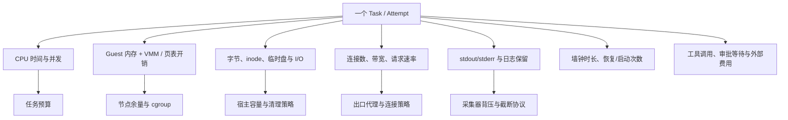
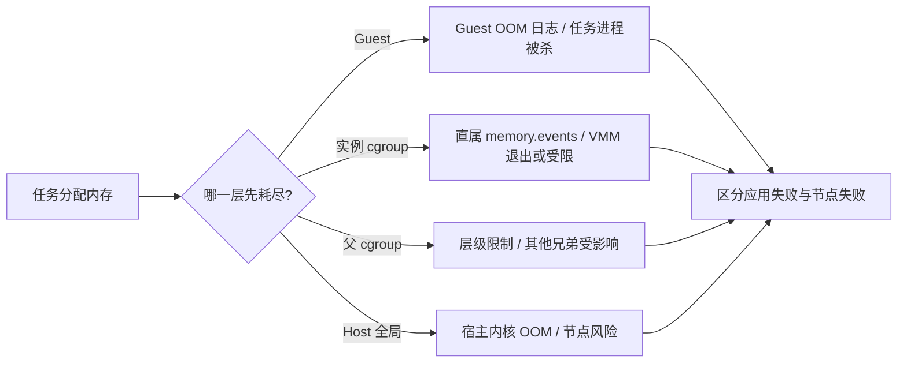
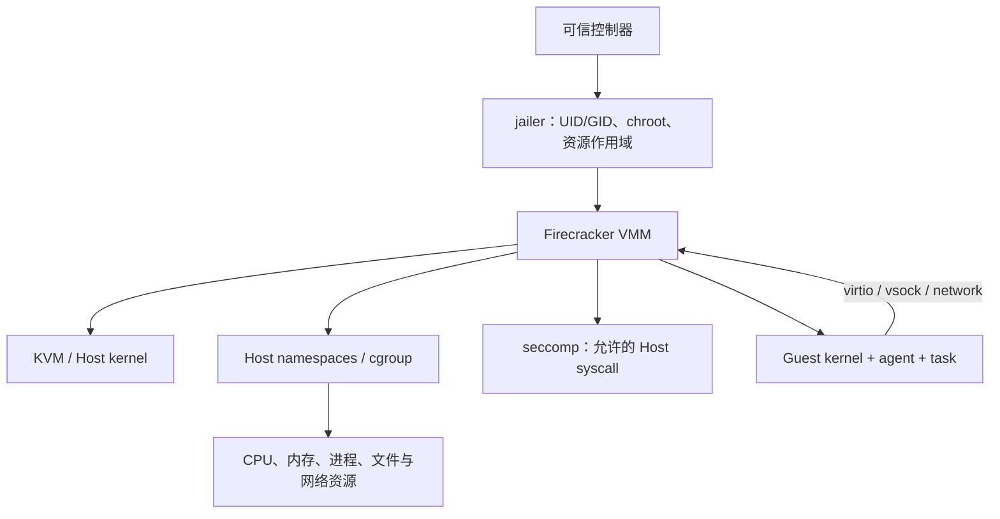
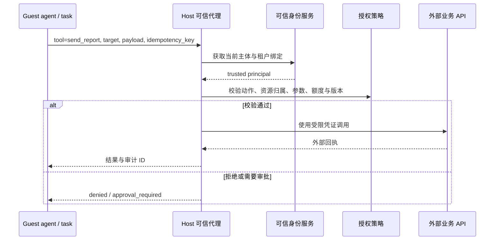
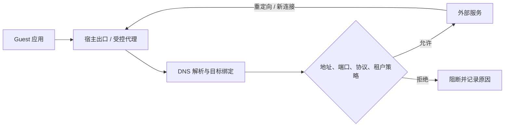
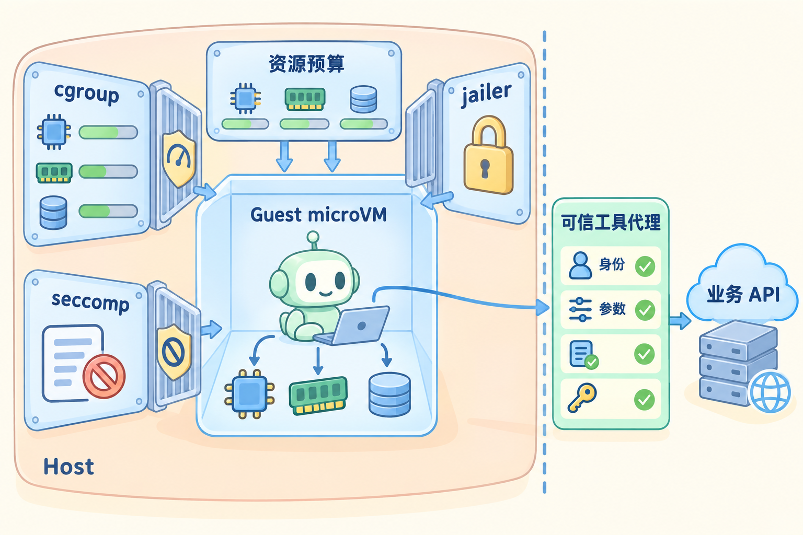

# Firecracker 资源隔离、工具权限与安全

## 先看结论：资源门与授权门

假设 Guest 读到一份恶意文档，然后通过平台允许的工具接口删除了另一个账户的文件。整个过程没有虚拟机逃逸，仍然是安全事故；反过来，一个无恶意的任务也可能因为无限输出、磁盘填满或 fork 风暴拖垮节点。

因此需要同时守住两道门：**资源隔离限制“能消耗多少”，能力与授权限制“能对谁做什么”。** microVM、jailer、namespace、cgroup 和 seccomp 约束的是执行边界；它们不会替业务代理判断目标资源是否属于当前租户。本文沿着“任务占用资源 → 请求外部工具 → 产生证据”的路径解释两组机制如何配合。

### 1. 先按信任边界分工
b
| 机制或组件 | 所在层 | 解决的主要问题 | 不应假定它解决什么 |
| --- | --- | --- | --- |
| KVM + microVM | Host 内核 / Guest 边界 | 将 Guest 内核、进程和虚拟设备与 Host 分开 | 业务授权、外部 API 的目标校验 |
| jailer / 降权 | Host 进程启动层 | 限制 Firecracker 的 UID/GID、根目录和资源作用域 | 自动生成完整网络策略或清理孤儿 |
| namespace | Host 内核资源视图 | 隔离进程号、挂载、网络等视图 | 单独提供完整的代码执行隔离 |
| cgroup v2 | Host 资源治理层 | 限制/统计 CPU、内存、进程数等 | 限制磁盘文件里的任意写入语义 |
| seccomp | Host 系统调用层 | 减少 VMM 线程可用的系统调用面 | 限制 Guest 内程序访问外部业务 |
| 宿主出口策略 | Host 网络层 | 控制 Guest 可连接的地址、端口和协议 | 检查业务资源归属或内容语义 |
| 可信工具代理 | 平台业务层 | 绑定主体、动作、资源、参数和当前授权 | 把 Guest 提交的 tenant ID 视为可信身份 |

Guest 的 `root` 只表示 Guest 内的身份；它不等于宿主 root。类似地，jailer 把 VMM 进程放进受限目录，不代表在目录中运行的业务工具自动获得或失去业务权限。

### 2. 资源预算要覆盖整条执行链

vCPU 数是 Guest 看到的虚拟处理器数量，不是宿主物理核独占保证。Guest 配置的 512 MiB 内存也不是宿主总成本：VMM、KVM 页表、设备映射、日志采集和辅助进程都需要空间。资源预算要把单请求、单 Attempt、单租户和节点四个层次区分开。

| 预算层 | 例子 | 超限后的可观察结果 |
| --- | --- | --- |
| 单次请求 | 最大输出 1 MiB、工具调用 20 次、墙钟 5 分钟 | `truncated`、`tool_budget_exhausted` 或超时，不能静默当成功 |
| Attempt | 总 CPU 时间、读写字节、临时盘容量、连接数 | 终止进程组或隔离实例，保留哪个预算被耗尽 |
| 租户 | 同时运行数、累计调用费用、出口带宽 | 排队、拒绝或按策略降级，不能无限接收后再排队 |
| 节点 | cgroup、磁盘水位、文件描述符、网络队列 | 准入停止、迁移/回收和告警；给宿主保留安全余量 |

只限制每条输出 1 MiB 仍可能被百万条请求打满；先读取完整输出再截断也可能在采集器中造成峰值内存。输出通道要同时限制帧大小、总字节、速率、队列长度和保存时长，并定义背压、丢弃或终止的协议结果。

### 3. cgroup 事件与 Guest OOM 不是一回事

当配置内存压力上升，至少有四种不同失败：Guest 内核在客户机中触发 OOM、Firecracker 所在 cgroup 达到 `memory.max`、更上层 cgroup 触发限制、宿主全局 OOM 杀进程。它们的日志位置、可回收对象和后续重试策略不同。

只把 `memory.max` 调大并不能绕过父 cgroup，也不能证明 Guest 不会 OOM。要把 Guest 日志、VMM 日志、进程退出原因、直属和父级 `memory.events`、宿主内核日志放到同一条时间线上。缺少某层日志只能说明证据不足，不能反推该层没有触发。

### 4. jailer、namespace、seccomp 与 cgroup 如何配合

可以把它们理解成不同的门：namespace 改变进程看到的世界，jailer 组织 VMM 的启动身份和目录，cgroup 限制消耗，seccomp 限制宿主系统调用。门之间仍要检查实际生效位置，不能只看配置文件。

实际验证要看 Firecracker 进程和其子线程所属的 UID/GID、根目录、namespace、cgroup 路径和 seccomp 状态。一个配置写入错误、继承到错误的父 cgroup 或启动时序不对，都可能使限制落在错误对象上。保持默认 seccomp 并按固定版本文档核对比“为了跑通而禁用过滤”更有意义。

### 5. 运行时隔离与工具授权必须串联

工具请求经过 Guest、vsock/网络和宿主代理时，代理不能只检查“工具名在白名单”。可信执行端至少要绑定主体、动作、目标资源、具体参数、额度、授权版本和幂等键；任务携带的 tenant ID、文档中的指令和模型生成的理由都是不可信输入。

动作确认可以让用户确认高影响操作，但它不能替代服务端的业务授权。确认之后如果目标账户、参数或权限版本变化，实际执行端仍要重新判定。执行检查和派发之间存在竞态时，需要定义授权版本的受理点；已送到外部系统的请求是否可撤回取决于对方 API，不能靠本地布尔值保证。

### 6. 出站控制要检查实际连接，而不只检查 URL 文本

允许 `packages.example` 不等于允许它把请求重定向到内网，也不等于允许它替平台转发任意目标。DNS 返回变化、IPv4/IPv6 双栈、HTTP 重定向、代理隧道、长连接复用和元数据地址都要纳入策略。

宿主强制路径负责防止 Guest 旁路；应用代理可以补充请求方法、路径、重定向和内容规则。两者都不应把域名文本当作唯一可信证据。策略更新后，存量连接、连接池和 DNS 缓存也要有明确处理方式。

### 7. 观测结果要能证明约束实际生效

“配置了 512 MiB”不是资源限制证据，“工具返回拒绝”也不等于没有产生外部副作用。验证报告应记录配置版本、实际执行身份、cgroup 路径、Guest/VMM/宿主事件、超限时间线、出口目标和工具审计 ID。对每层约束都回答三件事：**配置在哪里、执行点在哪里、失败时出现什么证据**。

### 8. 用一张图看懂资源门与授权门

左侧的 cgroup、jailer 和 seccomp 约束的是 Host 上 VMM 能消耗什么、能调用什么；Guest 内的 CPU、内存和磁盘图标表示任务仍可能耗尽分配给自己的预算。右侧的可信工具代理单独检查身份和参数后才连接业务 API。两组门分别回答“能耗多少”和“能对谁做什么”，不能互相替代。

## 参考资料

- [隔离与配额专题](../references/isolation-and-resources.md)
- [生产宿主机建议](https://github.com/firecracker-microvm/firecracker/blob/30471852666564d980f330d0575115eda7d5ce8e/docs/prod-host-setup.md)
- [MMDS](https://github.com/firecracker-microvm/firecracker/blob/30471852666564d980f330d0575115eda7d5ce8e/docs/mmds/mmds-user-guide.md)
- [cgroup v2](https://docs.kernel.org/admin-guide/cgroup-v2.html)
- [runc 配置与实现](https://github.com/opencontainers/runc)
- [gVisor 隔离边界](https://gvisor.dev/docs/architecture_guide/intro/)
- [E2B Runtime](https://github.com/e2b-dev/runtime)
- [OpenHands 安全与动作确认](https://docs.openhands.dev/sdk/guides/security)

## 源码入口与本地验证

用项目实现核对资源、宿主隔离、动作确认与业务授权的边界；重点是找到“配置在哪里生效”，而不是罗列组件名称。

1. 在 runc 的 OCI 配置处理和 Firecracker/jailer 配置中各找出一项资源约束；说明限制对象和配置实际生效位置。
2. 读 gVisor 的安全模型说明，与 Firecracker 的信任边界对照。对需要的系统调用与设备能力做兼容性检查，不从几条成功用例推导全面安全结论。
3. 在 E2B 中定位出站策略相关实现，在 OpenHands 中定位动作确认入口；检查执行时使用的主体、参数和策略版本。将网络许可、风险提示与业务资源授权分别记录。

### 本地实验

1. 在自有测试实例上运行有界压力，分别记录 CPU 限流、内存事件、输出上限、文件描述符和连接数；把 Guest OOM 与直属/父级 cgroup 事件放到同一时间线上。
2. 用本地 mock 代理覆盖允许、拒绝、改参数、撤权和伪造主体路径；让高层动作确认已通过而实际业务授权失败，验证可信代理仍然拒绝执行。
3. 画出 Guest、宿主出口和工具代理的完整流量，注入 DNS 变化、重定向和内网目标，检查是否存在旁路。Linux 上再用同一小型负载比较普通容器、gVisor 与 Firecracker；未实测时只报告设计和待验证项。

真实 Firecracker 运行需要 Linux/KVM；macOS 只用于阅读、绘图和本地 mock。所有实验只操作自有测试资源，未连接远程服务器。

## 关键题目解析

### 题目一：客户机和宿主都报告 OOM

把 Guest OOM、实例直属 cgroup、父 cgroup 和宿主全局 OOM 分开取证。对齐 Guest 日志、VMM 退出、`memory.events`、父级限制、宿主内核日志和时间线；提高一个 `memory.max` 不能绕过父级或减少 VMM/页表成本。证据不完整时报告“原因未知”，不把所有进程消失都归因于 Guest。

### 题目二：工具名允许，但目标资源变化

授权绑定可信主体、动作、资源归属、具体参数、额度和权限版本。相同的 `send_report` 如果收件账户或租户变化，应重新判定；模型确认和文档内容都不能替代执行端检查。执行检查与派发之间要定义授权版本的受理点，已送达外部系统的请求按对方能力处理，不能假定本地撤权可以撤回。

### 题目三：允许域名重定向到内网

在可信出口检查实际解析结果、IPv4/IPv6、端口、协议、每次重定向和代理隧道，阻止 Guest 旁路。域名白名单只是一项输入，不能授权任意转发 API；策略更新还要规定存量连接和连接池如何处理。验证用受控 DNS/HTTP mock 注入解析变化、重定向和内网地址。

## 发布前检查与自测

对每项约束都能给出“配置 → 执行点 → 失败证据”，并能区分运行时隔离、资源配额和业务授权。检查 Guest 是否存在绕过宿主出口的路径，工具代理是否绑定可信主体、目标资源和授权版本。对应实操 [E03](../expert-assessment/by-module/practical-exercises.md#e03)，面试题与参考答案见 [配套题库](../expert-assessment/by-module/04-isolation-and-capabilities.md)。
