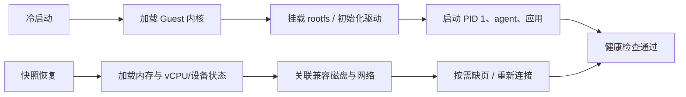
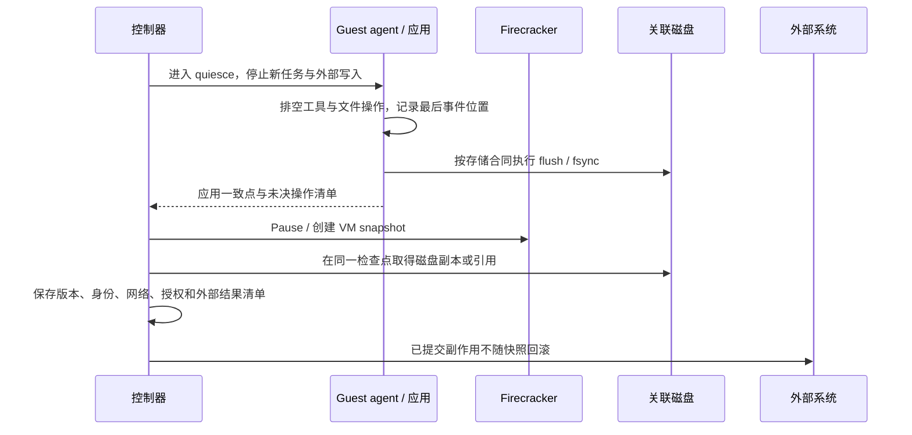
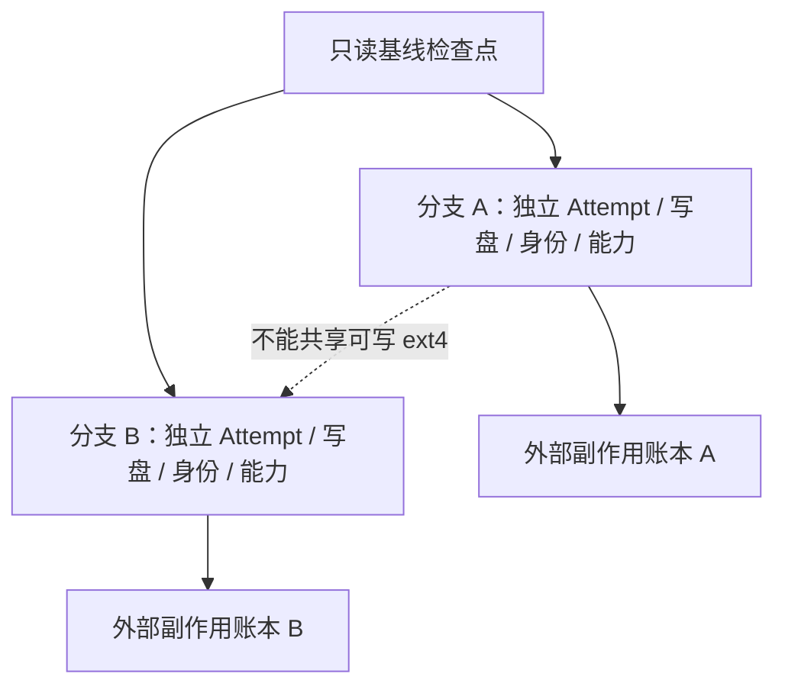
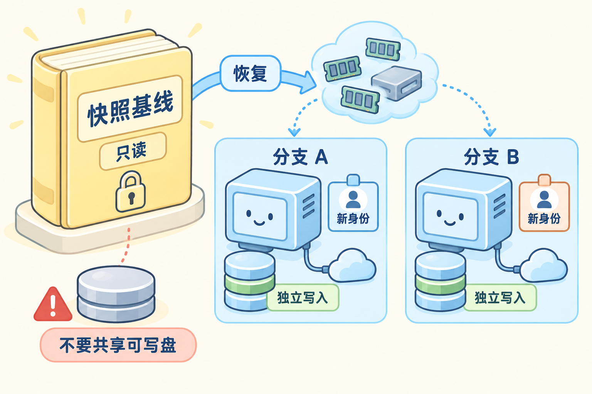

# Firecracker 快照、恢复与 fork

## 先建立问题模型

一台已经装好 Python、依赖和常用工具的 Guest，每次冷启动都要重复初始化。保存“已经启动到可接任务”的检查点，可以缩短恢复时间并从同一基线创建多个尝试；但恢复后的内存、磁盘、网络、随机数和外部业务状态并不天然处于同一个时间点。

快照回答“保存并恢复哪一部分执行状态”，fork 回答“如何从同一检查点产生互不串扰的分支”。二者都需要平台定义一致性、身份、可写层、授权和回收合同；Firecracker 的快照 API 本身不是完整的会话分支系统。本文沿着“创建检查点 → 恢复 → 重新建立唯一性 → 回收”这条链路说明边界。

### 1. 先分清快照、恢复、克隆与 fork

| 名字 | 先这样理解 | 不包含的保证 |
| --- | --- | --- |
| VM snapshot | Guest 内存、vCPU 和虚拟设备状态的一份检查点 | 不自动包含一致的磁盘副本、外部数据库或业务授权 |
| Restore | 在兼容条件下把检查点加载到新的 VMM/实例 | API 返回成功不等于应用已就绪或网络已重连 |
| Clone | 从同一检查点创建一个或多个运行实例 | 不自动生成唯一身份、独立写盘和新的随机流 |
| Fork | 平台定义的父检查点到子 Attempt 的分支合同 | 不等于宿主进程 `fork()`，也不自动复制所有 Agent 状态 |
| CoW / 写时复制 | 未修改数据共享，首次写入时分离 | 依赖宿主存储或 Guest 层能力，需计算空间与回收成本 |
| 基线 | 被多个分支引用的不可变版本 | 不能原地修改；更新要生成新版本 |

Firecracker 保存的是客户机运行所需的一部分状态；磁盘文件和网络资源由集成者管理。一个“恢复完成”的事实至少要拆成：内存/设备加载完成、磁盘引用就绪、Guest agent 握手、应用探针通过、网络连接重新建立。

### 2. 冷启动和快照恢复省掉的是不同工作

冷启动从内核入口开始，重新初始化 Guest 内核、rootfs、agent 和应用；快照恢复接续某个已保存的 CPU、内存和设备状态。恢复 API 较快，可能只是把内存文件映射进来，首次访问未驻留页仍会产生缺页读取。



比较性能时要分别记录 API 恢复完成和首次成功请求。恢复速度提升可能来自内存页按需加载、宿主页缓存变热或初始化工作被提前做完；不能只用“恢复 API 的响应时间”宣称应用启动更快。

### 3. 一致性来自暂停、应用协作和外部清单

暂停 vCPU 能停止新的客户机指令，但不自动把应用缓冲、数据库事务、Guest 文件系统和宿主后端同步到业务一致点。若任务正在写 `result.json`、发送工具请求或维护网络连接，快照可能捕获中间状态。



应用 quiesce 是平台与 Guest agent 的协作合同，不等于 Firecracker API 自动提供的事务。若不能取得应用一致点，就应把快照标成可能含有在途 I/O 的恢复材料，限制可恢复范围，而不是声称可以无损继续所有工作。

### 4. 内存状态、磁盘状态与外部副作用要分开记账

快照内存中可能有已经写入但尚未落盘的文件缓存；关联磁盘副本可能来自另一个时刻；外部 API 可能已经返回成功。恢复后看到旧文件并不意味着外部写入没有发生，看到新文件也不意味着它属于当前分支。

平台快照清单至少应包含：Firecracker 与快照格式版本、Host/Guest 架构、内核和 rootfs 摘要、内存与状态文件、磁盘版本/引用、应用一致点、事件位置、网络配置、随机数重建动作、授权版本和外部操作账本。缺少任何关键项时，恢复只能作为“实验性/需核对”的状态。

### 5. 克隆必须重新建立唯一性

从同一检查点恢复多个 Guest 可能复制 hostname、实例 ID、用户态随机数状态、临时令牌、网络标识和连接序号。新实例应在恢复握手阶段生成唯一身份，刷新需要刷新的随机源，重建 vsock/网络连接，并拒绝旧实例代次继续提交结果。



“换一个宿主进程 PID”不能解决随机状态或业务身份复制。父分支已经提交的工具调用要在子分支中保持只读历史；子分支的新调用必须带自己的 `attempt_id`、授权版本和幂等关系。

### 6. 兼容性与成本要用矩阵验证

恢复通常先在同一架构、同一 Firecracker/快照格式和兼容 Host 条件下验证。跨 CPU、跨 VMM 版本、跨 Host 内核或跨设备配置时，需要明确支持矩阵和实际测试；不能因为文件格式能读就推断 vCPU、设备和 Guest 行为兼容。

成本也分为多项：创建快照的暂停时间、内存文件容量、磁盘副本或引用占用、恢复后的缺页 I/O、私有页增长、分支写放大、模板引用与回收扫描。共享基线越多，回收和引用计数越重要；“恢复 API 很快”不等于每个并发分支的总成本很低。

### 7. 用 fork 合同定义父子边界

可以把教学接口写成：

```text
Fork(checkpoint_id, branch_spec) -> child_attempt_id
```

`branch_spec` 至少声明：独立的 Attempt/实例身份、可写磁盘或写层、网络资源、授权范围、随机流、预算、工具账本策略和回收期限。父基线保持不可变；子分支取消、失败或完成只影响自己的资源与结果。

获胜分支的产物可以作为新的基线版本，但不能通用地合并两个分支已经发生的外部副作用。对于不可查询、不可幂等或不可补偿的操作，平台应在分支前禁止、隔离或要求显式审批。

### 8. 用一张图看懂恢复与分支



左侧的“快照基线”是共享的只读材料；恢复后，分支 A 和 B 各自拥有写盘、网络连接和新身份。上方的内存页表示恢复可能按需加载，左下的警告表示不能把同一份普通可写 ext4 后端同时交给两个 Guest。快照不会替外部业务副作用自动回滚。

## 参考资料

- [快照与恢复专题](../references/snapshots-and-recovery.md)
- [Snapshot Support](https://github.com/firecracker-microvm/firecracker/blob/30471852666564d980f330d0575115eda7d5ce8e/docs/snapshotting/snapshot-support.md)
- [快照版本](https://github.com/firecracker-microvm/firecracker/blob/30471852666564d980f330d0575115eda7d5ce8e/docs/snapshotting/versioning.md)
- [克隆随机状态](https://github.com/firecracker-microvm/firecracker/blob/30471852666564d980f330d0575115eda7d5ce8e/docs/snapshotting/random-for-clones.md)
- [E2B 快照、恢复与 fork](https://github.com/e2b-dev/runtime)
- [E2B 组件与状态流](https://github.com/e2b-dev/runtime/blob/main/docs/ARCHITECTURE.md)

## 源码入口与本地验证

对照 Firecracker 的原生快照接口与 E2B 平台实现，追踪一次恢复或分支创建；重点记录哪些状态由 VMM 保存，哪些状态由平台补齐。

1. 在 E2B `packages/orchestrator` 中按所选版本寻找快照、恢复与 fork 入口，记录其调用 Firecracker 的位置，以及内存、磁盘和身份信息的来源。
2. 对照平台的按需内存恢复、可写磁盘层和缓存设计，标出共享数据、私有数据、引用与回收责任。通过源码或实验核实共享程度，不能从 fork 名称推断复制成本。
3. 列出 VM 快照之外的会话、工具、授权与评分状态。复用平台的 VM fork 后，仍需由上层定义 Agent 分支与外部副作用合同。

### 本地实验

1. 在同一兼容 Linux 环境创建检查点，记录内存、状态、磁盘和版本清单；分别测“恢复 API 完成”和“首次应用就绪”，不要把两者混为一个延迟。
2. 从同一检查点恢复两个实例，给它们分配新的身份、私有写盘和 mock 权限；取消一个实例，检查另一个分支和父模板是否保持不变。
3. 将实验抽象成 `Fork(checkpoint, branch_spec)`，让两个分支写入不同内容并取消其中一个，记录模板引用、磁盘占用和可观测内存变化。该接口由平台实现，不是 Firecracker 原生 API；真实 E2B 后端未运行时只报告阅读结论。

真实 Firecracker 运行需要 Linux/KVM；macOS 只用于阅读、绘图和本地 mock。所有实验只操作自有测试资源，未连接远程服务器。

## 关键题目解析

### 题目一：快照恢复 API 成功，但应用请求失败

把“状态文件加载完成、关联磁盘可用、Guest agent 握手、应用就绪、网络重连”分别记录。检查快照与 Host/Guest 架构、Firecracker 版本、设备配置和磁盘清单是否兼容；首次请求可能触发缺页或连接重建。API 成功只能证明其中一段，不等于应用已恢复。

### 题目二：两个分支写入同一个路径

父快照保持只读，A/B 使用独立可写磁盘或写层，并拥有不同的 Attempt、网络和授权身份。普通可写 ext4 后端不能同时被两个 Guest 当独立磁盘使用；共享只读数据不等于共享可写状态。每个分支单独记录产物、取消和回收，外部副作用按幂等账本处理。

### 题目三：克隆继承了相同的随机数和连接

恢复握手时生成新的实例/Attempt 身份，刷新需要刷新的随机流，重新建立网络和 vsock 连接，并拒绝父代次继续提交。模板中已经提交的外部结果保持历史，子分支的新调用使用自己的幂等键；不能用新的宿主 PID 代替唯一性处理。

## 发布前检查与自测

检查两个分支是否拥有独立的身份、可写盘、网络和授权；是否能分别回收；是否明确记录快照外部状态、兼容条件和成本。文中所有“快速恢复”都应同时给出首次应用就绪证据。对应实操 [E02](../expert-assessment/by-module/practical-exercises.md#e02)，面试题与参考答案见 [配套题库](../expert-assessment/by-module/05-snapshots-and-fork.md)。
