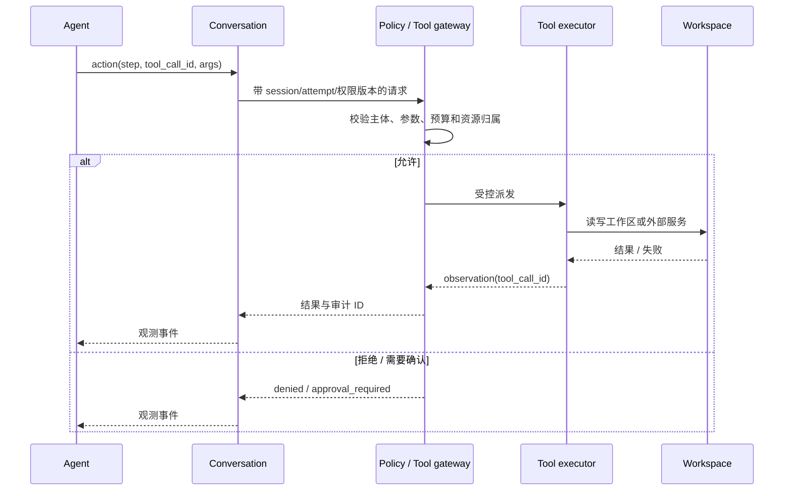
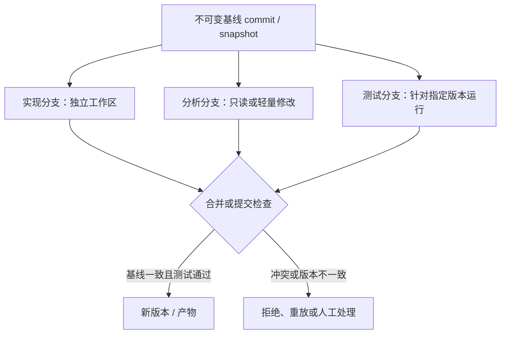
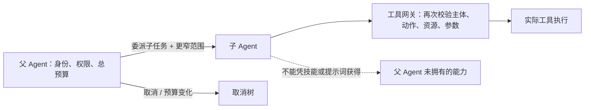
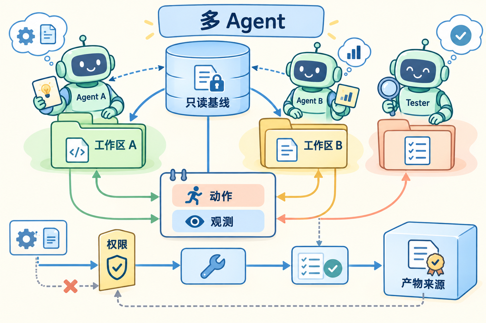

# Agent 状态、协作与产物：从会话到工作区

## 先定义问题：协作不只是多开几个进程

假设三个 Agent 分工修改一个代码仓库：一个分析问题，一个实现改动，一个运行测试并生成报告。它们可以共享只读依赖，却必须拥有独立草稿、不同工具权限和可追溯的提交关系。只把三个 Agent 放进三个进程，仍然回答不了三个关键问题：**谁改了什么、测试针对哪个版本、这条记忆是否属于当前租户。**

这篇文章沿着一次“分析 → 修改 → 测试 → 交付”的动作链，说明怎样给对话、工作区、技能、记忆、工具执行和产物分别定义**归属、版本、作用域与提交规则**。先看状态怎样落账，再看权限、路径和协作分支如何避免串扰；最后用源码入口和本地 mock 验证这些边界。Agent 进程只是执行者，不能替平台保存这些事实。

## 基础知识

### 1. 先分清 Agent、会话、尝试和工作区

| 对象 | 作用 | 必须绑定的身份或版本 |
| --- | --- | --- |
| Agent | 做出下一步动作的执行主体 | agent ID、父子关系、权限交集、预算和模型版本 |
| Conversation / Session | 保存一条交互与事件历史 | 会话 ID、租户、事件序号、恢复代次 |
| Attempt | 一次可计量的执行尝试 | 任务、分支、环境、策略/技能版本和结束原因 |
| Workspace | 文件、仓库和临时数据的可写视图 | workspace ID、基线提交、挂载位置、所有权和回收策略 |
| Memory | 可跨轮次复用的事实或摘要 | 来源、作用域、版本、过期时间和写入主体 |
| Skill | 提示、流程、工具需求或代码包 | 版本、依赖、允许范围；声明需求不等于获得授权 |
| Artifact | 代码、日志、补丁、报告或模型输出 | 来源 Attempt、内容摘要、媒体类型、大小和可见性 |

同一个用户问题可以产生多个 Attempt；同一个 Conversation 也可能在不同 Workspace 上恢复。把所有内容只保存成一段聊天文本，会丢失工作区版本、工具回执、权限变化和产物来源。

### 2. 一次动作往返要保留因果链

Agent 的“调用工具”不是一个瞬间事件。它至少包含提出动作、授权/参数检查、实际派发、工具执行、观测返回和会话提交六个边界。



事件至少带 `event_id`、来源、schema 版本、`session_id`、`attempt_id`、`step`、`tool_call_id` 和父事件/因果关系。工具返回迟到或重复时，不能只按接收时间把它写进当前会话；要检查执行代次和调用身份。

### 3. 协作分支需要基线、版本和冲突语义

共享代码的安全起点是不可变基线。每个分支记录父提交/快照、修改列表、测试所用版本和合并结果；“文件内容看起来一样”不能替代提交摘要与测试基线。



测试结论必须绑定实际被测提交、依赖、配置和命令。一个 Agent 在旧基线上跑绿的测试，不能直接证明另一个 Agent 的新修改通过；如果工作区被并发修改，报告要标记基线不一致。

### 4. 父子 Agent 的权限只能收缩，不能借委派扩大

父 Agent 可以把一个子任务交给子 Agent，但子 Agent 的能力应是父能力、任务范围和平台预算的交集。父子取消要形成树：父任务结束或预算耗尽时，未完成子任务应被取消、隔离或进入明确的恢复状态。



技能包中写“需要访问某 API”只是配置需求，不是授权结果。工具网关要在每次实际执行时检查当前权限版本、目标资源、参数和额度；审批或模型输出不能替代可信主体绑定。父任务取消后，已送到外部系统的操作是否可撤销要按外部 API 的语义记录，不能把子进程终止写成副作用回滚。

### 5. 记忆、上下文和技能的作用域不同

短期上下文可以服务一次会话，长期记忆可能跨会话保存，检索库可能按租户共享，技能包通常按版本分发。每类内容都要记录来源与可见范围，尤其不能把另一个租户的摘要、工具结果或凭证写入公共记忆。

| 状态 | 可共享的部分 | 必须隔离或重新校验的部分 |
| --- | --- | --- |
| Prompt/技能 | 已审核的只读版本、依赖摘要 | 当前授权、租户数据、动态密钥和路径 |
| 检索资料 | 明确标注为公共的文档 | 私有文档、用户输入、未清洗工具输出 |
| 会话历史 | 同一会话的不可变事件 | 其他会话的动作、审批和未决调用 |
| 工作区 | 只读基础依赖 | 可写代码、构建产物、临时文件与凭证 |
| 工具记忆 | 去重键和已确认回执 | 未确认副作用、过期权限和可重放秘密 |

恢复会话时，旧技能/工具 schema 是否兼容要单独判断。新版本增加高影响默认参数时，即使旧 JSON 能解析，也可能需要迁移、重新审批或保留旧执行环境。

### 6. 产物服务必须防止路径、归属和来源混淆

Agent 产生的路径和内容都是不可信输入。可信端要把逻辑对象 ID 与宿主路径分开，规范化路径并阻止 `..`、符号链接穿越和设备文件访问；限制文件类型、大小、数量和解压后的总容量，并把内容按不可信数据展示。

```text
请求下载 artifact_id
  → 查询 artifact 所属 task/attempt/workspace
  → 由服务端拼接受控根目录，不直接信任 guest 路径
  → openat/openat2 等受限打开并检查符号链接、类型、大小
  → 校验内容摘要和版本
  → 返回有限流的文件或报告，并记录访问审计
```

逻辑不可访问与物理清除是不同承诺。删除临时工作区后，快照、宿主缓存、备份和日志中可能仍有数据；若合同要求介质清除，要由存储系统提供相应证据，不能只报告 `unlink()` 成功。

### 7. 对照 OpenHands 时要分清项目能力与课程合同

可以沿 Agent、Conversation、Event、Tool、Workspace 和 Agent Server 追一条动作/观测路径。具体工具可能与 Agent 处于同一进程，也可能由 Workspace 或服务端执行；不能因为组件名称就假定所有调用都经过远程 RPC。课程要求的父子权限交集、版本基线、产物来源和回放字段需要结合项目实际接口补齐，不能把框架存在当作这些保证已经成立。

### 8. 用一张图看懂协作状态的归属



图中央的只读基线可以被多个 Agent 读取，但工作区 A、工作区 B 和测试工作区分别保存自己的修改。动作与观测进入事件记录，权限门位于真实工具之前，最后产物要带来源和版本。它表达的是“可共享的基线 + 私有的写入 + 可追溯的事件”，不是把所有 Agent 放进同一个可写目录。

## 源码入口与本地验证

源码阅读围绕一个问题展开：**一次工具调用从 Agent 发出，到工作区改变，再回到会话，哪些组件真正持有状态？**

- 先看 [OpenHands SDK 源码与包边界](https://github.com/OpenHands/software-agent-sdk) 和 [架构说明](https://docs.openhands.dev/sdk/arch/overview)，在 `openhands-sdk` 定位 Agent、Conversation、Event、Tool；选一个工具追踪动作进入执行器、观测回到会话的路径。
- 再对照 [Workspace 与 Agent Server](https://docs.openhands.dev/sdk/arch/overview)，标出文件、凭证和工具实际所在进程。不要因为组件名叫 Workspace 就假定每次调用都是远程 RPC。
- 结合 [持久化说明](https://docs.openhands.dev/sdk/guides/convo-persistence)、[工作区与存储专题](../references/storage-and-images.md)、[平台接口专题](../references/execution-platform-design.md)，把会话事件、技能版本、长期记忆和工作区写入分开记录。路径下载边界可用 [`openat2`](https://man7.org/linux/man-pages/man2/openat2.2.html) 的约束语义核对。

本地验证只需一个测试仓库、固定模型响应和虚构工具：

1. 从不可变基线复制分析、实现和测试三个工作区；故意让测试针对旧提交，汇总时应报告基线不一致。
2. 让父 Agent 委派一个更窄的子任务，尝试调用父级没有的工具；网关应拒绝，并记录权限版本、参数和预算。
3. 对产物服务注入 `../../`、符号链接、超大文件和错误版本；服务端按 `artifact_id` 查归属、在受控根目录打开并校验摘要。

这些 mock 只验证事件归属、权限交集、路径处理和版本判断；真实 OpenHands 集成、Linux 运行时隔离与外部副作用仍需在相应环境单独核对。所有材料保存在本地。

## 读完后应能坚持的三个结论

1. **测试结果不能脱离基线合并。**结果必须绑定实际提交、依赖、命令和 Attempt；旧版本跑绿不代表新修改通过。
2. **委派不能扩大权限。**子 Agent 的主体、资源、工具和预算是父权限与任务范围的交集；技能描述需求，不产生授权。
3. **产物 ID 才是访问入口。**服务端不能信任 Guest 路径或符号链接；逻辑删除也不等于备份和快照已被物理清除。

进一步自测可打开[本模块面试题与答案](../expert-assessment/by-module/06-agent-state-and-collaboration.md)。
