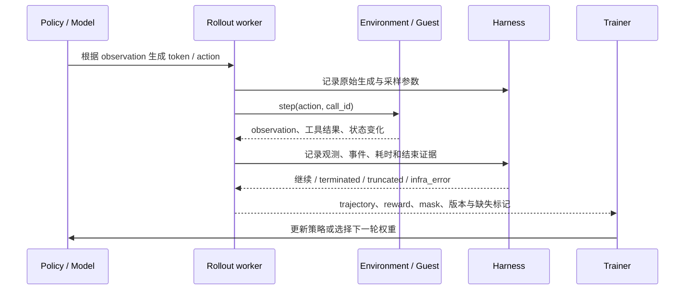
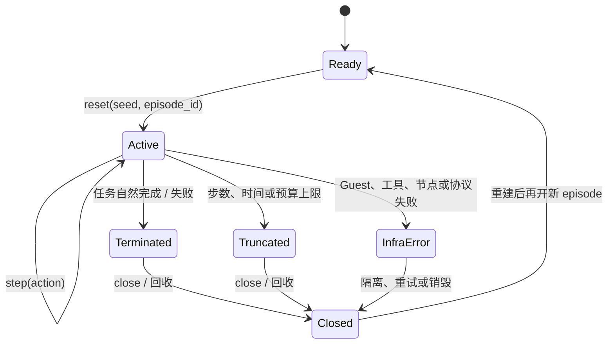
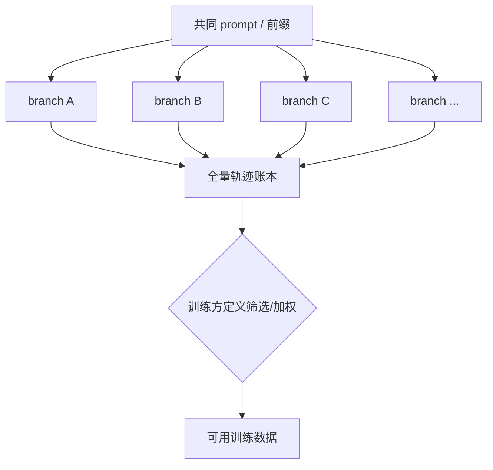
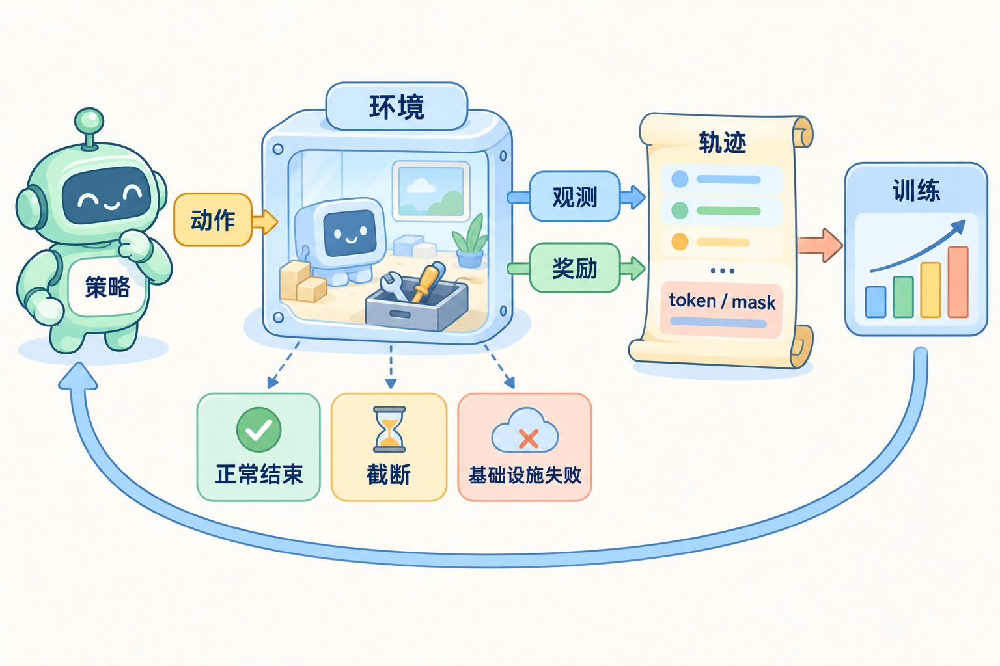

# RL Rollout：从环境交互到训练数据契约

## 先定义问题：一条分数如何变成可信训练样本

假设 Agent 在 Guest 中完成一个多步任务：读文件、调用工具、根据观测继续生成，最后提交答案。训练器不能只看“最终得了几分”，还要知道每次生成对应的观测、工具结果、token、mask、策略版本和结束原因。否则基础设施故障可能被当成策略失败，或一段被筛选过的轨迹被误当成独立采样。

本文把 RL rollout 当成一份**执行数据合同**：策略提出动作，环境执行并返回观测，Harness 保存不可变事件，训练器再决定哪些轨迹进入更新。阅读时始终沿着 `reset → step → observation → next step → close` 这条链走；每遇到重试、截断或分支筛选，就问“它是否仍是同一条策略轨迹”。

## 基础知识

### 1. 先分清 episode、step、attempt 和 trajectory

| 对象 | 含义 | 需要记录什么 |
| --- | --- | --- |
| Policy | 根据观测生成动作的模型/策略版本 | 模型摘要、权重或服务版本、采样参数与随机流 |
| Environment | 持有任务状态并执行动作的环境 | 环境/镜像版本、资源、reset/step 结果和失败原因 |
| Episode | 从 `reset` 到终止或截断的一次交互 | episode ID、任务、分支、累计奖励、结束分类 |
| Step | 一次观测 → 动作 → 下一观测的交互 | step 序号、动作、工具调用、观测和时间/预算 |
| Attempt | 基础设施或调度层的一次执行机会 | 节点、实例、重试、取消、租约和执行代次 |
| Trajectory | 供训练或分析使用的有序记录 | 原始生成、观测边界、mask、奖励来源、版本和缺失 |

一个 episode 可能经历多个 attempt；attempt 重试后，不能把两次不同环境的事件无缝拼成一条正常策略轨迹。`episode_id` 表示任务交互，`attempt_id` 表示运行机会，`step` 表示交互顺序，三者要同时存在。

### 2. RL 闭环不是只返回一个 reward



`reward` 只是反馈的一部分。训练方通常还需要动作 token、工具观测的插入位置、哪些 token 参与损失的 mask、每轮使用的策略和采样参数，以及环境产生结果的版本。先保存原始事件，再生成训练格式；只保存一段格式化聊天记录，无法可靠重建 token 边界和工具观测。

### 3. reset、step、close 要有可观察的结束语义

Gymnasium 风格环境将 `reset()` 建立新 episode，`step(action)` 返回下一观测、奖励、`terminated` 和 `truncated`。课程的 worker 可以映射同样的语义，但具体 verl 版本的接口字段要以源码为准。



自然终止说明任务按定义结束；截断说明策略可能还没有完成任务但环境停止了；基础设施失败说明执行条件不可信。三者是否进入训练、怎样赋予奖励、是否重试，要由训练方和任务定义约定，不能由 worker 静默归一为 `reward=0`。

### 4. token、工具观测和 mask 必须对齐

一个两轮 rollout 可以抽象为：

```text
prompt tokens:        [p0 p1]
generation round 1:   [a0 a1 <tool_call>]
tool observation:     [o0 o1]
generation round 2:   [b0 b1 <final>]
loss mask:            [ 0  0   1         0  0   1  1 ]  （示意）
```

这里的 `mask` 只是示意，实际算法可能只训练模型生成 token、也可能对特殊 token 有单独规则。关键是保留“哪个 token 属于哪次生成、工具观测从哪里开始、哪一策略版本产生了它”。把工具结果重新拼进自然语言后再分词，可能改变 token 边界、特殊标记和训练 mask，不能声称与原始生成等价。

若同一 episode 两轮生成使用不同策略权重，轨迹要在轮次或片段级记录策略版本、采样参数和随机流。训练方可以拒绝混合版本、做重要性修正或采用自己的算法；rollout 服务不能把最后一个版本写成整条轨迹的来源。

### 5. 失败分类决定数据如何解释

| 结束原因 | 发生了什么 | 数据处理的关键问题 |
| --- | --- | --- |
| `terminated` | 任务按环境定义完成或失败 | 奖励和最终观测通常可用于训练，但要保留任务结果 |
| `truncated` | 时间、步数、输出或资源预算先到 | 不能当作自然失败；记录剩余状态和截断原因 |
| `tool_error` | 工具拒绝、参数错或业务返回错误 | 可能是策略可学习的反馈，也可能是权限/环境问题 |
| `infra_error` | Guest、节点、网络、协议或服务故障 | 需区分重试与样本丢弃，不能静默归零 |
| `cancelled` | 用户或调度器取消 | 保留取消时的动作和已发生副作用，按任务合同处理 |
| `unknown` | 连接断开且无法确认执行结果 | 标记证据不足，避免重复副作用或伪造终态 |

重试要生成新的 `attempt_id`，并在轨迹中关联父尝试。若工具请求可能已经执行，重试需使用幂等键或先查询结果；不能把每次重试都当作独立、无成本的策略动作。

### 6. 分支采样与筛选会改变数据分布

从同一 prompt 生成 32 个分支时，它们共享前缀，彼此相关。只保留最快或最高分分支会改变样本分布，也会丢失未完成、超时和基础设施失败的信息。



必须记录父前缀、分支 ID、策略/环境版本、预算、结束原因、评分器版本、筛选规则和未完成分支。`best-of-N` 可以是有意的产品或训练策略，但加上标签不会把选择后的样本变回独立原始采样。

### 7. 版本和原始记录构成可追溯合同

一条可复核轨迹至少要能回答：哪个任务和分支、哪份环境/镜像、哪个策略和技能、用什么采样参数、哪些工具结果来自真实执行、奖励由哪个评分器计算、发生过几次重试、哪些字段缺失。建议把原始记录视为不可变事件，训练格式作为带转换版本的派生物。

没有 GPU 时可以使用固定生成 fixture 验证字段对齐、mask、重试和结束分类；它不能证明真实模型收敛、吞吐或策略质量。真实训练需要单独记录硬件、批大小、并行度和优化器配置。

### 8. 用一张图看懂 rollout 闭环



左侧策略产生动作，中间环境返回观测和奖励，右侧轨迹把原始生成与 `token / mask` 保存后交给训练。环境下方把正常结束、截断和基础设施失败分开，提醒我们不能把三种原因压成一个分数；训练更新后才进入下一轮策略，而不是直接修改已经记录的轨迹。

## 源码入口与本地验证

把源码阅读限定在一条可复核链路上：**模型生成一轮 token → 发起一次工具调用 → 环境返回观测 → worker 产出轨迹**。

- 从 [verl Agent Loop](https://verl.readthedocs.io/en/latest/advance/agent_loop.html) 进入所选版本的 [verl 源码](https://github.com/verl-project/verl)，定位 `AgentLoopBase`、输出对象和 Manager/Worker（名称随版本变化），记录 token、工具结果和轨迹在哪个边界被拼装。
- 对照 [Gymnasium 环境契约](https://gymnasium.farama.org/api/env/) 的 `reset/step` 语义，标出项目接口如何表达自然终止、预算截断和基础设施错误；教学接口不是 verl 的原生 API。
- 需要理解协程取消或重复响应时，参考 [Python asyncio 任务](https://docs.python.org/3/library/asyncio-task.html) 和[本地执行器专题](../references/execution-platform-design.md)，重点看执行代次与幂等键，而不是先读完整训练算法。

本地 mock 可以在没有 GPU 的 Mac 上完成：

1. 用固定生成 fixture 产生两轮 token，中间插入一次 mock 工具调用；原样保存 prompt、每轮生成、观测区间、mask、策略版本和采样参数。
2. 注入工具超时、重复响应、`reset` 失败和步数上限；确保 `terminated`、`truncated`、`infra_error` 分开落账，迟到结果不能进入新 episode。
3. 从同一前缀生成多个虚构分支，保存全部分支、未完成原因、评分器版本和筛选规则；只保留最高分时仍能还原选择偏差。

mock 只验证字段对齐、结束分类、重试和筛选记录，不能证明真实模型收敛、GPU 吞吐或策略质量。真实 rollout 需要在 Linux/目标训练环境补充硬件、并行度和优化器证据。

## 三个容易误判的结论

1. **`reset` 不只是清空目录。**旧进程、连接、缓存和工具账本都要关闭；无法证明环境干净时应隔离或销毁，迟到响应只进审计。
2. **训练格式不能替代原始事件。**工具结果重建成聊天文本可能改变 token 边界与 mask；训练数据必须保留每轮策略、采样条件和观测区间。
3. **best-of-N 不是独立采样。**共享前缀、筛选规则和被丢弃分支都要记录；最高分标签不能消除选择偏差。

进一步自测可打开[本模块面试题与答案](../expert-assessment/by-module/07-rl-rollout-contracts.md)。
