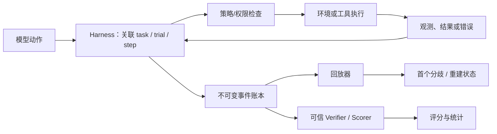
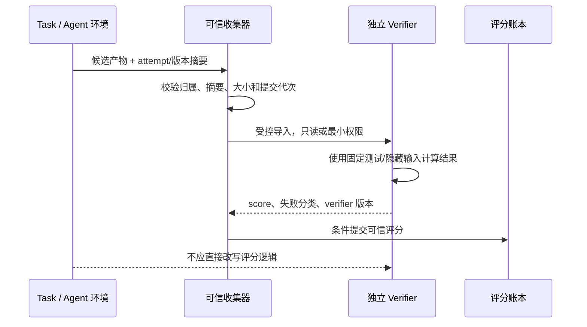
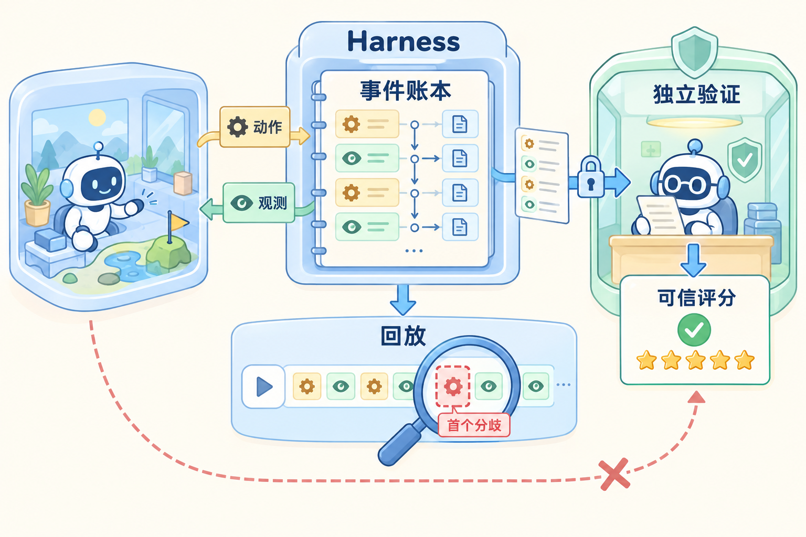

# Harness、确定性与可信评测

## 先定义问题：一个更高的分数是否真的更好

假设 benchmark 的成功率从 62% 上升到 75%，但新版本同时修改了沙箱镜像、重试次数和评分脚本，而且任务代码还能读取评分文件。这个数字可能来自更强的模型，也可能只是重试更多、评分器被篡改或基础设施失败被漏记。

本文把 Harness 理解成一条**可核查的执行链**：它连接模型、环境、工具、事件账本、回放器和评分器，记录谁在什么版本、什么条件下做了什么。文章主线是“动作 → 事件 → 状态 → 回放 → 评分”：先定义事件和状态的归属，再讨论确定性，最后建立独立可信的评测边界。固定 seed 只是其中一个输入，不能代替这条链。

## 基础知识

### 1. 先分清 Harness、事件、回放和评测

| 名字 | 作用 | 需要回答的问题 |
| --- | --- | --- |
| Harness | 编排一次任务/rollout，连接模型、环境、工具和评分 | 谁在何时以什么版本执行了什么 |
| Event | 描述动作、观测、状态变化和结果的不可变记录 | 来源、因果、顺序和是否重复 |
| Record | 保存真实执行输入与返回，供诊断或回放使用 | 哪些内容是原始事实，哪些是派生字段 |
| Replay | 用录制结果或受控输入重建执行路径 | 第一个分歧是什么，是否再次产生副作用 |
| Trial / Attempt | 一个任务在一组条件下的一次执行 | 版本、预算、重试、环境和结束原因 |
| Verifier / Scorer | 在可信边界内判定任务结果 | 评分输入来自哪里，任务能否篡改它 |
| Determinism | 在声明的粒度上重复得到同一结果 | 固定了哪些变量，哪些外部状态仍会变化 |

`task_id`、`trial_id`、`attempt_id` 和 `event_id` 不能用一个字段替代。评分结果也要绑定任务、试验、评分器版本、输入产物和异常统计；只存一个最终分数，无法判断失败是任务、环境还是评分器问题。

### 2. 一条事件先经过哪里，再由谁决定状态



事件要同时表达“发生了什么”和“谁有权让任务状态改变”。模型动作、工具返回、评分结果和清理事件可能来自不同进程，接收时间不能作为全局因果顺序。事件账本保留重复/迟到事实，可信状态机再决定是否接纳它改变终态。

### 3. 事件 schema 要能处理乱序、重复和缺失

推荐的最小字段包括：

```json
{
  "event_id": "evt-123",
  "kind": "tool_result",
  "schema_version": "1",
  "source": "tool-gateway",
  "task_id": "task-7",
  "trial_id": "trial-2",
  "attempt_id": "attempt-4",
  "branch_id": "branch-a",
  "step": 3,
  "tool_call_id": "call-9",
  "parent_event_ids": ["evt-122"],
  "execution_generation": 8,
  "observed_at": "monotonic-or-wall-clock-metadata",
  "payload_ref": "local-record-ref"
}
```

`event_id` 用于记录去重，`parent_event_ids` 或等价关系表达因果，`step` 表达任务内顺序，执行代次防止旧控制者覆盖新 Attempt。墙上时钟只用于观测延迟和排障，不能单独决定合法终态。大段用户文本、凭证和高基数调用详情应放受控 trace/审计存储，指标只保留必要聚合字段。

处理事件时按三层区分：

1. 已知且重复的 `event_id`：不重复推进状态，但保留采集重复的审计信息。
2. 迟到的旧代次事件：可以写入事实账本，不能覆盖当前 Attempt 的终态。
3. 缺少前驱或无法确认来源的事件：标记不完整、等待补齐或进入人工/补偿流程，不按时间戳猜测因果。

### 4. 确定性要声明粒度和模式

固定 seed 只能固定某些随机选择，不能固定网络返回、墙钟、文件系统目录顺序、线程调度、GPU 算子或外部业务状态。至少区分三种模式：

| 模式 | 工具是否再次执行 | 能复现什么 | 主要限制 |
| --- | --- | --- | --- |
| 真实重跑 | 是 | 在相近条件下观察真实行为 | 网络、时间、依赖、并发和服务状态会变化 |
| 结果回放 | 否，返回录制结果 | 受控输入序列、事件处理和评分逻辑 | 不能证明当前工具仍可用或重新产生副作用 |
| 模型重采样 | 模型再次生成 | 评估新策略或采样条件 | 输出、token、工具路径和成本都可能改变 |

回放必须比较请求、参数、版本和必要的环境摘要；修改一个工具参数或 schema 后，应报告首个分歧，而不是无条件返回旧成功。如果允许语义等价匹配，要把规范化规则和版本写进回放合同。

### 5. 可信评测需要独立的结果来源

任务代码可以生成候选产物，但不应直接修改可信奖励。评分器要明确输入从哪个工作区/产物 ID 导入、是否会读取隐藏测试、使用什么凭证、写入结果的路径和版本；独立验证环境可以降低篡改风险，但仍需核对挂载、来源和网络权限。



“在同一 VM 换个目录”不自动构成独立验证边界；如果任务能够修改测试脚本、环境变量或结果文件，就要把它视为可篡改。评分器异常、任务失败、基础设施失败和缺失样本应分别统计，不能只报告成功样本。

### 6. 版本对照要固定条件并保留失败分母

比较两个 Harness 或沙箱版本时，至少固定任务集、镜像/环境、策略和采样参数、预算、评分器、重试合同与数据切分。报告每个原始任务的全部 Attempt、结束原因、成本和是否纳入统计；多次重试后的最终成功率不能直接冒充单次执行能力。

可以把一次结果分成：模型行为、环境能力、基础设施、评分器异常和未观测五类。若新版本成功率上升但超时和重试也上升，需要同时报告有效轨迹吞吐、每任务成本和尾延迟，而不是只看一个平均分。

### 7. 回放要能定位第一个分歧

回放器从指定的事件、版本和初始状态开始，按事件因果逐步核对：动作是否相同、参数是否相同、工具返回是否来自录制、环境状态是否兼容、评分输入是否同一版本。首次分歧后可以停止并报告上下文；不要继续用旧结果覆盖后续差异。

```text
读取录制头：task/trial/attempt、schema、代码与环境摘要
  → 验证版本与输入兼容
  → 按 parent_event / step 取下一事件
  → 对比动作、参数、工具回执和状态转换
  → 命中首个分歧：输出事件 ID、字段、规则版本和上下文
  → 未分歧完成：报告回放终态与哪些副作用被禁止重做
```

录制工具结果后回放不应再次调用真实后端；如果需要真实重跑，应显式进入另一种模式，重新生成 attempt 和副作用幂等关系。Harness 的回放正确不等于模型策略或外部业务一定可复现。

### 8. 用一张图看懂记录、回放与可信评分



左侧环境产生动作和观测，中间 Harness 把它们写进事件账本；回放器在下方定位“首个分歧”，不会因为参数变化而无条件返回旧成功。右侧独立验证读取受控产物后生成可信评分，任务环境没有一条直接改写评分的路径。

## 源码入口与本地验证

源码阅读只追踪两个角色：OpenHands 负责“动作和观测如何落成事件”，Harbor 负责“任务、试验和评分如何产生结果”。

- 沿 [OpenHands 架构与事件](https://docs.openhands.dev/sdk/arch/overview) 和持久会话记录，标注事件来源、因果关系、执行代次、缺失与恢复位置；用 `task_id/trial_id/attempt_id/event_id` 关联跨组件记录。
- 阅读 [Harbor 任务结构](https://docs.harborframework.com/core-concepts/tasks/overview)、[Verifier](https://docs.harborframework.com/core-concepts/tasks/verifier) 与[独立验证环境](https://docs.harborframework.com/core-concepts/tasks/separate-verifier)，区分任务输入、参考解、候选产物和评分逻辑。独立环境仍要核对挂载、凭证、写权限和版本。
- 用[观察与测量专题](../references/observability-and-performance.md)、[verl 多轮轨迹接口](https://verl.readthedocs.io/en/latest/advance/agent_loop.html) 和 [Gymnasium 结束语义](https://gymnasium.farama.org/api/env/) 对照事件、轨迹与评测的边界。

本地 mock 验证可以分三步完成：

1. 录制 mock 工具的动作、参数、观测和事件；回放禁止再次调用后端，改一个参数或版本时报告首个分歧。
2. 注入重复、乱序、迟到和旧执行代次事件；账本保留事实，但可信状态机不能让旧事件覆盖当前终态。
3. 创建三个本地小任务：确定成功、确定任务失败和基础设施错误。在独立授权边界运行评分器，尝试修改评分文件或伪造产物来源，验证可信评分链能拒绝它们。

Mac 只验证事件、回放和权限边界；真实 Harbor/Firecracker 运行仍需 Linux。所有任务、录制和结果保存在本地。

## 三个容易误判的结论

1. **相同 seed 不等于相同结果。**先声明复现粒度，再区分真实重跑、结果回放和模型重采样；工具返回、时间、并发和版本都要记录。
2. **最终成功率不是完整指标。**固定任务集、策略、环境、预算、评分器和重试合同，保留每个 Attempt、结束原因、成本与缺失样本，拆开模型成功、环境能力、基础设施失败和评分异常。
3. **事件账本与可信状态不是一回事。**账本保留重复和迟到事实，状态机根据来源、执行代次和合法转换接纳状态；`event_id` 去重也不保证外部工具恰好执行一次。

进一步自测可打开[本模块面试题与答案](../expert-assessment/by-module/08-harness-and-evaluation.md)，回放部分还对应 [E04](../expert-assessment/by-module/practical-exercises.md#e04)。
