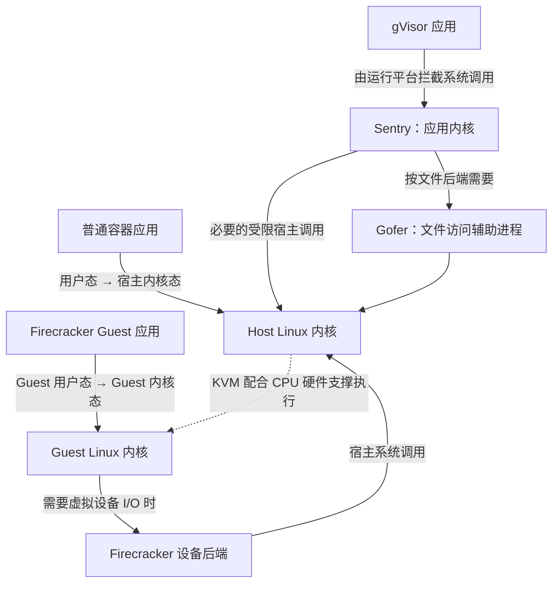

# 模块 01 源码分析：从容器启动到 microVM 执行

[返回模块 01：运行时基础与架构边界](../modules/01-runtime-foundations.md) · [课程总目录](../README.md)

这四项沿着同一条主线展开：**配置怎样变成进程，限制怎样生效，系统调用由谁处理，虚拟机怎样开始执行。**

源码固定为 containerd `v2.0.0 / 207ad711`、runc `v1.2.0 / 0b9fa21b`、gVisor `47042224`；Firecracker 使用本地提交 `30471852666564d980f330d0575115eda7d5ce8e`。外部源码链接固定到完整提交。以下是源码核对结果，未在 Linux 服务器运行实验。

- [1. containerd/runc：从配置到真正执行程序](#containerd-runc)
- [2. 进程限制：namespace、cgroup、seccomp](#process-restrictions)
- [3. gVisor：应用系统调用进入了另一套内核实现](#gvisor)
- [4. Firecracker：从管理请求追到 KVM_RUN](#firecracker)

<a id="containerd-runc"></a>

## 1. containerd/runc：从配置到真正执行程序

理解这条路径的价值，是能区分“镜像准备失败”“隔离环境创建失败”和“应用启动失败”。它们对应不同的代码和排查证据。

### 1.1 镜像、Container 和 Task 的边界

| 对象 | 实际含义 | 是否已经运行用户程序 |
| --- | --- | --- |
| 镜像 | 程序、依赖、文件系统层及相关配置 | 否 |
| 文件系统快照 | 为实例准备的文件系统视图，可包含可写层 | 否 |
| Container | containerd 保存的配置、镜像和运行时等元数据 | 否 |
| Task | 与运行时进程对应的生命周期对象 | 创建后仍需启动 |

源码中，`Client.NewContainer()` 最终调用 `ContainerService().Create()` 保存容器记录。若指定 `WithNewSnapshot()`，还会调用 snapshotter 的 `Prepare()` 准备文件系统。

`container.NewTask()` 则从 snapshotter 获取挂载信息，再调用 `TaskService().Create()` 创建运行时任务。这里的 snapshotter 管理的是文件系统，不包含进程内存和 CPU 状态。[Container 创建](https://github.com/containerd/containerd/blob/207ad711eabd375a01713109a8a197d197ff6542/client/client.go#L287) · [文件系统准备](https://github.com/containerd/containerd/blob/207ad711eabd375a01713109a8a197d197ff6542/client/container_opts.go#L237) · [Task 创建](https://github.com/containerd/containerd/blob/207ad711eabd375a01713109a8a197d197ff6542/client/container.go#L224)

### 1.2 从 Task 创建追到 runc

选择 `io.containerd.runc.v2` 运行时后，关键路径如下，省略中间的 RPC 转发：

```text
containerd 的 Task Create 请求
  → shim 的 service.Create()
  → shim 内的 runc.NewContainer()
  → process.Init.Create()
  → go-runc 的 Runc.Create()
  → 执行 runc create --bundle <目录> <容器ID>
```

这里有一个容易混淆的名称：**shim 中的 `runc.NewContainer()` 是 containerd 自己的封装函数**，随后才通过 go-runc 调用独立的 runc 可执行文件。

shim 是常驻的衔接与监督进程；go-runc 是调用 runc 命令的 Go 封装。[shim 入口](https://github.com/containerd/containerd/blob/207ad711eabd375a01713109a8a197d197ff6542/cmd/containerd-shim-runc-v2/task/service.go#L224) · [容器与初始进程组装](https://github.com/containerd/containerd/blob/207ad711eabd375a01713109a8a197d197ff6542/cmd/containerd-shim-runc-v2/runc/container.go#L124) · [创建初始进程](https://github.com/containerd/containerd/blob/207ad711eabd375a01713109a8a197d197ff6542/cmd/containerd-shim-runc-v2/process/init.go#L110) · [构造 runc 命令](https://github.com/containerd/containerd/blob/207ad711eabd375a01713109a8a197d197ff6542/vendor/github.com/containerd/go-runc/runc.go#L180)

### 1.3 OCI 配置怎样进入 runc

runc 接收的关键输入是 OCI bundle。OCI 是容器运行配置和生命周期的一套标准；bundle 是包含 `config.json` 及其配置指向的根文件系统的目录。根文件系统通常简称 rootfs。

| 配置 | 决定什么 |
| --- | --- |
| `process.args / env / cwd` | 执行什么程序、环境变量、工作目录 |
| `process.user / capabilities / noNewPrivileges` | 用户身份、能力，以及执行新程序时能否获得额外权限 |
| `root.path / mounts` | 根文件系统和额外挂载 |
| `linux.namespaces` | 新建或加入哪些资源隔离空间 |
| `linux.resources / cgroupsPath` | 资源限制和 cgroup 位置 |
| `linux.seccomp` | 系统调用过滤策略 |

`runc create` 的内部路径是：

```text
create.go
  → startContainer(..., CT_ACT_CREATE, ...)
  → setupSpec()：读取 config.json
  → createContainer()
      → specconv.CreateLibcontainerConfig()：转换 OCI 配置
      → libcontainer.Create()：建立容器管理对象
  → runner.run()
      → Container.Start(process)
      → 创建初始化进程、设置环境
      → 初始化进程等待 exec.fifo
```

`specconv` 可以理解为“配置翻译器”：把 OCI 标准中的字段转换成 runc 内部使用的结构。[create 入口](https://github.com/opencontainers/runc/blob/0b9fa21be2bcba45f6d9d748b4bcf70cfbffbc19/create.go#L59) · [配置读取](https://github.com/opencontainers/runc/blob/0b9fa21be2bcba45f6d9d748b4bcf70cfbffbc19/utils.go#L71) · [配置转换与启动分支](https://github.com/opencontainers/runc/blob/0b9fa21be2bcba45f6d9d748b4bcf70cfbffbc19/utils_linux.go#L169)

### 1.4 create 与 start：用户程序在哪一步执行

**内部方法叫 `Start()`，不代表用户程序已经执行。**该方法用于建立初始化进程。这个进程完成必要设置后，会停在 `exec.fifo`——一条用于同步启动的命名管道上。

随后执行：

```text
runc start <容器ID>
  → start.go 检查状态为 Created
  → Container.Exec()
  → 打开并读取 exec.fifo
  → 等待中的初始化进程继续运行
  → 执行启动钩子
  → 通过 execve 类操作进入用户程序
```

`execve` 的作用是把当前进程的程序内容替换为目标程序。这里的 `Container.Exec()` 是内部方法，与 CLI 的 `runc exec`——给已有容器增加一个进程——含义不同。[start 入口](https://github.com/opencontainers/runc/blob/0b9fa21be2bcba45f6d9d748b4bcf70cfbffbc19/start.go#L21) · [FIFO 同步实现](https://github.com/opencontainers/runc/blob/0b9fa21be2bcba45f6d9d748b4bcf70cfbffbc19/libcontainer/container_linux.go#L226)

这个拆分让平台可以先建立环境，再决定什么时候放行程序。程序运行后，系统调用由宿主内核处理；runc 无须常驻转发，shim 继续处理监督和退出事件。[containerd Runtime v2 架构](https://github.com/containerd/containerd/blob/207ad711eabd375a01713109a8a197d197ff6542/core/runtime/v2/README.md)

### 1.5 失败分支：配置了 Python，但 rootfs 中没有 Python

在所选版本的 `standard_init_linux.go` 中，初始化进程会在等待 FIFO 前调用 `exec.LookPath()` 检查目标程序。

因此，缺少可执行文件可能直接表现为 **create 阶段失败**。此时首先检查 `process.args[0]`、rootfs 内文件和 `PATH`，而不是查 Python 业务代码。[目标程序检查与执行位置](https://github.com/opencontainers/runc/blob/0b9fa21be2bcba45f6d9d748b4bcf70cfbffbc19/libcontainer/standard_init_linux.go#L210)

<a id="process-restrictions"></a>

## 2. 进程限制：namespace、cgroup、seccomp 在哪里真正生效

这三者分别约束**资源视图、资源用量、系统调用**。runc 负责设置，Linux 内核负责持续执行约束。

下面的 cgroup 分析选用 **cgroup v2 的 fs2 管理器路径**；启用 systemd cgroup 管理器时，会进入另一套实现。

### 2.1 namespace：配置最终变成 setns 或 unshare

```text
linux.namespaces
  → CreateLibcontainerConfig()
  → config.Namespaces
  → CloneFlags() 与待加入的 namespace 路径
  → nsexec.c
      有现成路径：setns()，加入已有 namespace
      需要新建：unshare()，建立新的 namespace
```

`CloneFlags()` 会跳过已经指定路径的项目；这些项目走加入已有 namespace 的路径。

这意味着“配置了 network namespace”还不够，必须继续确认：**它是新建的，还是与别的任务共享的。**某类 namespace 未配置时，也不能自动认定它已经隔离。[配置转换](https://github.com/opencontainers/runc/blob/0b9fa21be2bcba45f6d9d748b4bcf70cfbffbc19/libcontainer/specconv/spec_linux.go#L408) · [新建与共享的判断](https://github.com/opencontainers/runc/blob/0b9fa21be2bcba45f6d9d748b4bcf70cfbffbc19/libcontainer/configs/namespaces_syscall.go#L24)

| namespace | 隔离的主要视图 | 没有自动解决的事 |
| --- | --- | --- |
| PID | 进程编号和进程可见范围 | CPU、内存配额 |
| Mount | 挂载点视图 | 已经挂进来的敏感目录权限 |
| Network | 网卡、路由、端口等 | 出站目标白名单 |
| User | 用户 ID 映射和相关权限范围 | 所有内核攻击面 |

`nsexec.c` 还有一个值得理解的细节：建立或加入 PID namespace 后，要再创建子进程，让子进程真正进入目标 PID namespace。因为这类操作不会直接改变调用进程自己的 PID namespace。[namespace 建立过程](https://github.com/opencontainers/runc/blob/0b9fa21be2bcba45f6d9d748b4bcf70cfbffbc19/libcontainer/nsenter/nsexec.c#L851)

### 2.2 cgroup：先把进程放进去，再落实资源参数

关键位置在 `initProcess.start()`：

- `p.manager.Apply(p.pid())`：把初始化进程加入 cgroup。
- 收到 `procHooks` 同步消息时，调用 `p.manager.Set(...)`：写入资源配置。

源码特意在继续与子进程同步前执行 `Apply()`，目的是让后续创建的子进程继承正确的 cgroup 归属，避免先放行程序、再补限制的窗口。[进程归组与资源设置](https://github.com/opencontainers/runc/blob/0b9fa21be2bcba45f6d9d748b4bcf70cfbffbc19/libcontainer/process_linux.go#L519)

在 fs2 管理器中：

```text
Apply(pid)
  → 建立 cgroup 路径
  → 把 PID 写入 cgroup.procs

Set(resources)
  → setMemory() → 写 memory.max 等文件
  → setCpu()    → 写 cpu.max 等文件
```

例如：

```text
memory.max = 536870912
    表示 512 MiB 内存硬上限

cpu.max = 50000 100000
    表示每 100ms 最多获得 50ms CPU 时间
    相当于总计 0.5 核的 CPU 时间配额
```

CPU 配额限制的是累计执行时间，线程并行时同样共同消耗这份额度。[fs2 管理器](https://github.com/opencontainers/runc/blob/0b9fa21be2bcba45f6d9d748b4bcf70cfbffbc19/libcontainer/cgroups/fs2/fs2.go#L65) · [内存参数写入](https://github.com/opencontainers/runc/blob/0b9fa21be2bcba45f6d9d748b4bcf70cfbffbc19/libcontainer/cgroups/fs2/memory.go#L67) · [CPU 参数写入](https://github.com/opencontainers/runc/blob/0b9fa21be2bcba45f6d9d748b4bcf70cfbffbc19/libcontainer/cgroups/fs2/cpu.go#L55)

如果写入 cgroup 配置失败，用户程序可能还没有开始执行。下一步应检查实际 cgroup 路径、控制器是否启用、写入权限和原始错误。

### 2.3 seccomp：把过滤程序安装到宿主内核

```text
linux.seccomp
  → SetupSeccomp()：转换配置
  → 初始化进程调用 InitSeccomp()
  → 构造系统调用规则
  → PatchAndLoad()
  → 通过 prctl 或 seccomp 系统调用安装过滤器
```

它通常可以根据系统调用号和整数参数决定允许、拒绝或采取其他动作。**普通 seccomp BPF 不能直接读取指针指向的路径字符串**，因此不适合直接表达“只能打开 `/work` 下的文件”。BPF 在这里指内核执行的过滤程序。这类文件访问限制需要结合挂载、文件权限或其他安全机制。[seccomp 构造](https://github.com/opencontainers/runc/blob/0b9fa21be2bcba45f6d9d748b4bcf70cfbffbc19/libcontainer/seccomp/seccomp_linux.go#L32) · [加载到内核](https://github.com/opencontainers/runc/blob/0b9fa21be2bcba45f6d9d748b4bcf70cfbffbc19/libcontainer/seccomp/patchbpf/enosys_linux.go#L671) · [内核过滤器说明](https://docs.kernel.org/userspace-api/seccomp_filter.html)

安装时机受 `noNewPrivileges` 影响：

- 未启用它时，安装过滤器可能需要特权，必须在相关权限被移除前完成。
- 启用它时，runc 尽量晚安装过滤器，减少初始化过程对允许调用集合的需求。

还有一个重要的默认行为：`linux.seccomp` 为空时，这条路径不会凭空为容器安装一套默认策略；外层已经继承的限制则另算。具体容器平台提供的默认 profile，即过滤规则集合，不能直接归为 runc 自己的默认行为。[安装条件与时机](https://github.com/opencontainers/runc/blob/0b9fa21be2bcba45f6d9d748b4bcf70cfbffbc19/libcontainer/standard_init_linux.go#L180)

<a id="gvisor"></a>

## 3. gVisor：应用系统调用进入了另一套内核实现

gVisor 的主要价值，是让不可信应用先接触 **Sentry——gVisor 实现的应用内核**，再由这套受约束的实现使用宿主资源。

### 3.1 三种方案的系统调用路径

下面把三条路径放在一张图里。实线表示系统调用或 I/O 路径，虚线表示虚拟化执行支撑：



Host 是承载沙箱的宿主系统；Guest 是虚拟机内部的客户机系统。Sentry、Gofer 和 Firecracker 属于宿主侧组件；Guest Linux 内核运行在虚拟机内部。图中省略了平台拦截和文件后端的实现差异。[gVisor 架构](https://gvisor.dev/docs/architecture_guide/intro/)

### 3.2 用一次 read 看实际源码

Sentry 的任务运行循环在 `task_run.go` 中调用平台的 `Switch()`，让应用执行；当平台返回系统调用事件时，进入：

```text
Task.doSyscall()
  → 从寄存器中提取系统调用号和参数
  → doSyscallInvoke()
  → executeSyscall()
  → SyscallTable.Lookup(调用号)
  → 调用 Sentry 对应的实现函数
```

在所选提交的 amd64 调用表中，调用号 `0` 对应 `Read`。这里的 amd64 就是常见的 x86-64 架构。[应用执行与切换入口](https://github.com/google/gvisor/blob/47042224577f2e14de2412a3318822cbdeba4d28/pkg/sentry/kernel/task_run.go#L239) · [系统调用分派](https://github.com/google/gvisor/blob/47042224577f2e14de2412a3318822cbdeba4d28/pkg/sentry/kernel/task_syscall.go#L84) · [amd64 调用表](https://github.com/google/gvisor/blob/47042224577f2e14de2412a3318822cbdeba4d28/pkg/sentry/syscalls/linux/linux64.go#L30)

`Read()` 继续做：

```text
提取 fd、目标地址、长度
  → 在 Sentry 的文件描述符表中查找文件
  → 检查长度并构造应用内存访问对象
  → 调用 Sentry 的文件对象 Read()
  → 处理完成、错误或等待
```

fd 是文件描述符，即程序用来引用已打开文件等资源的编号。这里的文件对象属于 gVisor 的 VFS，即“虚拟文件系统抽象”。后续怎样访问实际数据，取决于具体文件后端。

**这段代码证明：gVisor 自己处理文件描述符、参数和阻塞语义，并非把应用的 `read()` 原样转发给宿主。**[Read 实现](https://github.com/google/gvisor/blob/47042224577f2e14de2412a3318822cbdeba4d28/pkg/sentry/syscalls/linux/sys_read_write.go#L37)

### 3.3 兼容性和信任组件

兼容性问题也能找到具体位置。例如，这个提交的 amd64 调用表中，`userfaultfd` 被映射为返回 `ENOSYS`，也就是“未实现该系统调用”。`userfaultfd` 用于让用户态程序参与处理某些缺页事件。

因此，宿主 Linux 支持这个接口，并不能保证 gVisor 中的应用也能使用它。是否可运行，还取决于应用能否接受失败或采用替代路径。[该提交的 userfaultfd 条目](https://github.com/google/gvisor/blob/47042224577f2e14de2412a3318822cbdeba4d28/pkg/sentry/syscalls/linux/linux64.go#L358)

| 方案 | 主要隔离依赖 | 兼容性重点 |
| --- | --- | --- |
| 普通容器 | 宿主 Linux 内核及隔离配置 | 宿主内核能力、权限和过滤策略 |
| gVisor | Sentry、所选平台、Gofer 与宿主限制 | Sentry 是否实现所需接口及完整语义 |
| Firecracker | KVM、VMM、硬件虚拟化及宿主限制 | Guest 内核配置、虚拟设备和应用依赖 |

这里的隔离依赖以保护宿主和其他任务为目标。Guest 内核属于沙箱内部，即使被任务控制，也不应因此直接获得宿主权限；同一 Guest 内部的应用隔离仍依赖 Guest 内核。

gVisor 可以选择不同运行平台。例如 systrap 利用 seccomp 的 trap 机制拦截系统调用；KVM 平台利用硬件虚拟化，但仍由 Sentry 承担应用内核职责，并不是启动一个普通 Linux Guest 来处理这些调用。[平台差异](https://gvisor.dev/docs/architecture_guide/platforms/)

<a id="firecracker"></a>

## 4. Firecracker：从管理请求追到 KVM_RUN

Firecracker 的作用，是把 KVM 提供的底层接口和虚拟设备组织成一台可运行的 microVM。microVM 是设备和管理功能经过精简的虚拟机；VMM 指创建、管理虚拟机并提供设备模型的程序。

### 4.1 组件所在层次

| 层次 | 组件与职责 |
| --- | --- |
| 平台管理层 | 外部控制器分配任务、准备镜像和宿主资源、调用 Firecracker |
| 宿主用户态 | Firecracker 的 API、VMM 和 vCPU 线程 |
| 宿主内核态 | KVM，以及文件、网络、调度等服务 |
| Guest | 自己的 Linux 内核和任务程序 |

源码中的 `PrebootApiController` 是 **Firecracker 内部的启动前请求处理器**，与平台上负责多租户任务调度的控制器不是同一个组件。

### 4.2 Host Integration：宿主资源先准备好

架构文档说明：

- Guest 的块设备由宿主文件作为后端。
- 网络设备通过宿主 TAP 接口接入网络；TAP 可以理解为宿主上的虚拟二层网络接口。
- 外部平台负责准备这些资源，并配置 microVM。
- 一个 Firecracker 进程承载一台 microVM。

这些职责见本仓库 [Host Integration 与 Internal Architecture](https://github.com/firecracker-microvm/firecracker/blob/30471852666564d980f330d0575115eda7d5ce8e/docs/design.md)。

### 4.3 管理请求怎样进入 VMM

以启动请求为例：

```text
PUT /actions
{"action_type": "InstanceStart"}

  → parse_put_actions()
  → 转换为 VmmAction::StartMicroVm
  → ApiServer::serve_vmm_action_request()
      channel：传递请求对象
      eventfd：发送事件通知
  → PrebootApiController::handle_preboot_request()
  → start_microvm()
  → build_and_boot_microvm()
```

channel 是线程间消息通道；eventfd 是 Linux 提供的事件通知机制。

这意味着 HTTP 解析和 VM 操作通过消息衔接，而应用运行时的系统调用不会经过这条管理路径。[请求解析：actions.rs](https://github.com/firecracker-microvm/firecracker/blob/30471852666564d980f330d0575115eda7d5ce8e/src/firecracker/src/api_server/request/actions.rs) · [请求传递：api_server/mod.rs](https://github.com/firecracker-microvm/firecracker/blob/30471852666564d980f330d0575115eda7d5ce8e/src/firecracker/src/api_server/mod.rs) · [启动动作处理：rpc_interface.rs](https://github.com/firecracker-microvm/firecracker/blob/30471852666564d980f330d0575115eda7d5ce8e/src/vmm/src/rpc_interface.rs)

### 4.4 VMM 怎样建立执行环境

`build_microvm_for_boot()` 的主要步骤是：

```text
检查 Guest 内核配置
  → 分配 Guest 内存
  → Kvm::new()：打开 KVM、检查 API 与必需能力
  → KvmVm::new()：创建 VM
  → create_vcpus()：创建虚拟 CPU
  → register_dram_memory_regions()：注册 Guest 内存区域
  → 加载 Guest 内核
  → 配置虚拟设备和启动状态
  → 创建 vCPU 线程，初始状态为 Paused
```

注册内存区域，是让 KVM 知道 Guest 的物理地址区域对应宿主进程中的哪些内存。vCPU 是虚拟 CPU，在这里由宿主线程驱动运行。

`build_and_boot_microvm()` 随后调用 `resume_vm()`，放行 vCPU。**建立 VM 和准备执行状态，与真正让 Guest 开始运行，是两个阶段。**[构建与启动：builder.rs](https://github.com/firecracker-microvm/firecracker/blob/30471852666564d980f330d0575115eda7d5ce8e/src/vmm/src/builder.rs) · [KVM 初始化：kvm.rs](https://github.com/firecracker-microvm/firecracker/blob/30471852666564d980f330d0575115eda7d5ce8e/src/vmm/src/vstate/kvm.rs) · [恢复执行：lib.rs](https://github.com/firecracker-microvm/firecracker/blob/30471852666564d980f330d0575115eda7d5ce8e/src/vmm/src/lib.rs)

### 4.5 真正执行 Guest 的位置

每个 vCPU 有一个宿主线程，其主要执行链是：

```text
Vcpu::run()
  → Running 状态
  → run_emulation()
  → self.kvm_vcpu.fd.run()
  → KVM_RUN
  → CPU 执行 Guest 指令
```

`KVM_RUN` 是让虚拟 CPU 开始或继续运行的 KVM 接口，通过 `ioctl` 系统调用调用；`ioctl` 用来向内核接口发送控制请求。

需要返回用户态处理时，代码进入 `handle_kvm_exit()`。例如 MMIO 读写会交给对应设备处理；MMIO 是通过特定内存地址访问设备寄存器的方式。

KVM 能在内核中处理部分事件。**Guest 的普通系统调用首先进入 Guest 内核，并不意味着每次都返回 Firecracker 用户态。**[vCPU 执行与退出处理：vcpu.rs](https://github.com/firecracker-microvm/firecracker/blob/30471852666564d980f330d0575115eda7d5ce8e/src/vmm/src/vstate/vcpu.rs) · [KVM API](https://docs.kernel.org/virt/kvm/api.html)

### 4.6 Sandboxing：限制宿主上的 Firecracker 进程

这里有两条具体源码路径。第一条由 jailer 建立进程运行环境：

```text
jailer
  → 按配置加入网络 namespace
  → 设置资源限制与 cgroup
  → 建立隔离的文件系统环境
  → 设置 UID/GID
  → exec 进入 Firecracker
```

UID/GID 是用户和用户组编号。其中，文件系统隔离实现使用新的 mount namespace 和 `pivot_root` 等机制；`pivot_root` 用于切换进程所见的根文件系统。网络 namespace 则是按参数加入，并非自动替平台设计网络策略。[jailer 主路径：env.rs](https://github.com/firecracker-microvm/firecracker/blob/30471852666564d980f330d0575115eda7d5ce8e/src/jailer/src/env.rs) · [文件系统隔离：chroot.rs](https://github.com/firecracker-microvm/firecracker/blob/30471852666564d980f330d0575115eda7d5ce8e/src/jailer/src/chroot.rs)

第二条由 Firecracker 自己按线程安装 seccomp：

| 线程 | 本地源码中的安装位置 |
| --- | --- |
| API | `ApiServer::run()`，开始服务前 |
| vCPU | `Vcpu::run()`，进入 Guest 执行循环前 |
| VMM | VM 构建后、进入设备事件循环前 |

底层 `apply_filter()` 设置 `no_new_privs`，再调用 `seccomp(SECCOMP_SET_MODE_FILTER, ...)` 安装过滤器。[过滤器安装：seccomp.rs](https://github.com/firecracker-microvm/firecracker/blob/30471852666564d980f330d0575115eda7d5ce8e/src/vmm/src/seccomp.rs) · [API 线程安装时机](https://github.com/firecracker-microvm/firecracker/blob/30471852666564d980f330d0575115eda7d5ce8e/src/firecracker/src/api_server/mod.rs) · [vCPU 线程安装时机](https://github.com/firecracker-microvm/firecracker/blob/30471852666564d980f330d0575115eda7d5ce8e/src/vmm/src/vstate/vcpu.rs) · [VMM 安装时机：api_server_adapter.rs](https://github.com/firecracker-microvm/firecracker/blob/30471852666564d980f330d0575115eda7d5ce8e/src/firecracker/src/api_server_adapter.rs)

这些过滤器约束的是 **Firecracker 宿主线程能够调用哪些宿主系统调用**。Guest 程序允许访问哪些业务文件、能否删除云端数据，仍需要 Guest 内权限和平台工具授权分别控制。

### 4.7 失败分支：缺失内核配置

`build_microvm_for_boot()` 在创建 KVM 对象之前就会检查内核配置，缺失时返回 `MissingKernelConfig`。

如果错误来自这里，应该补查启动配置；只有失败已经进入 `Kvm::new()` 或 VM 创建路径，才继续查 `/dev/kvm`、能力检查和对应内核错误。**错误在哪个函数产生，决定下一步该找哪类证据。**[缺失配置检查：builder.rs](https://github.com/firecracker-microvm/firecracker/blob/30471852666564d980f330d0575115eda7d5ce8e/src/vmm/src/builder.rs)
