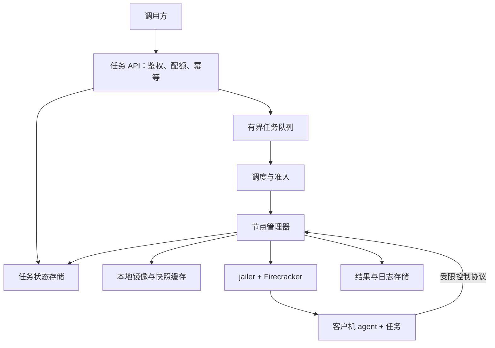

# 专题：从 microVM 到任务执行平台

[统一课程](../README.md) · [面试题与答案](../expert-assessment/by-module/README.md)

这是按主题组织的阅读与实验资料；课程模块及考核以总目录为准。

前置：理解运行时、生命周期、隔离、快照和性能；源码专题帮助深入解释底层瓶颈。目标：把 Firecracker 的能力组合成有明确失败语义的服务。

## 1. 先学基础

**控制面与执行面。**控制面接收任务、校验身份与配额、分配资源并记录状态；节点执行面管理具体进程、磁盘、网络和客户机。Firecracker 是执行面的一部分，不自带完整的集群调度、租户系统或任务队列。

**期望状态与观察状态。**数据库写下“应该运行”不代表 VM 已经启动；节点进程存在也不代表应用已经就绪。把两种状态分开，使用对账推进系统。

**租约与 fencing。**租约用于判断执行权是否仍有效；递增的执行代次（fencing token）用于让接收方拒绝过期执行者的写入。网络超时无法区分节点宕机与暂时失联；如果结果存储或外部系统不验证代次，单靠租约不能消除重复执行副作用。

**背压与公平性。**当到达速度超过完成速度，队列会增长。平台需要队列上限、租户并发限制、超时或拒绝策略，不能无限接收后再宣称满足低延迟目标。

## 2. 资料阅读

- 复习：[Design](https://github.com/firecracker-microvm/firecracker/blob/30471852666564d980f330d0575115eda7d5ce8e/docs/design.md)、[API](https://github.com/firecracker-microvm/firecracker/blob/30471852666564d980f330d0575115eda7d5ce8e/src/firecracker/swagger/firecracker.yaml)、[生产宿主机建议](https://github.com/firecracker-microvm/firecracker/blob/30471852666564d980f330d0575115eda7d5ce8e/docs/prod-host-setup.md)。
- 复习：[Snapshot Support](https://github.com/firecracker-microvm/firecracker/blob/30471852666564d980f330d0575115eda7d5ce8e/docs/snapshotting/snapshot-support.md)、[CPU templates](https://github.com/firecracker-microvm/firecracker/blob/30471852666564d980f330d0575115eda7d5ce8e/docs/cpu_templates/cpu-templates.md)：了解可复用和可迁移状态的边界。
- 对照：[测试说明](https://github.com/firecracker-microvm/firecracker/blob/30471852666564d980f330d0575115eda7d5ce8e/tests/README.md)，用已有功能和性能测试理解 VMM 提供的行为保证。

本课的任务 API、调度器、租约、数据表和策略是教学设计；官方文档提供底层能力依据，不意味着这些平台功能由 Firecracker 自动完成。

## 3. 先做单机，再设计多机

单服务器阶段可以把这些组件放在少量进程里，先明确接口和持久化语义。多机扩展时再拆分部署，避免先引入大量组件却没有可恢复的生命周期。

## 4. 定义接口与关键记录

以下是平台示例接口，不是 Firecracker 原生 API：

| 接口 | 语义 |
| --- | --- |
| `SubmitTask` | 租户、幂等键、任务描述、资源与超时；返回稳定任务 ID |
| `GetTask` | 返回排队、准备、执行、结束及结果位置，不把“已接受”当作“运行中” |
| `CancelTask` | 表达取消意图；响应与实际进程结束可能存在时间差 |
| `GetResult` | 返回退出码、有限输出、截断标记与失败原因 |

记录可分为：`Task`（业务请求）、`Attempt`（一次执行）、`Instance`（VM 与资源）、`Image`（不可变版本）、`Node`（容量和健康）、`Result`（已提交结果）。任务 ID、尝试 ID 和实例 ID 不能混为一个概念。

## 5. 设计关键流程

1. **提交：**校验请求与租户预算，保存任务与幂等关系，可靠地进入队列。数据库和队列是两个系统时需要事务 outbox 或等价机制，处理“已保存但未入队”。
2. **启动：**领取执行权，预留容量，准备网络与磁盘，启动或恢复 VM，等待客户机 agent 和应用就绪。
3. **执行：**宿主绑定任务与实例身份，传入任务，限制执行时间、输出、网络和资源；不信任客户机自报的租户归属。
4. **完成：**先持久化结果并校验执行代次，再完成任务状态和队列确认，然后回收 VM 与临时资源。结果丢失与清理失败有不同重试策略。
5. **失败：**区分用户代码失败、环境准备失败、任务超时和节点失联。只有符合重试策略的任务才创建新 attempt，设置重试预算。
6. **对账：**节点重启后核对已有 VM、任务租约和资源清单；控制面定期核对“状态存在但节点没有实例”与“实例存在但状态丢失”。

## 6. 实验：单机闭环与桌面故障推演

在 Linux 上把前面实验组合为最小闭环：固定可信任务 → 启动 → 就绪 → 执行 → 有限输出与退出码 → 终止 → 清理。不要求在本课部署生产平台。

至少验证：正常任务、应用失败、执行超时、管理器重启、输出达到上限。检查正常或失败任务结束后资源是否可回收，结果是否仍可读取。

在 Mac 画图并推演：节点失联但 VM 仍运行、保存结果后确认消息丢失、快照不兼容、磁盘耗尽、同一任务重复入队。对每个案例写出“谁检测、谁决策、依据什么状态、如何避免扩大影响”。单台服务器可模拟部分组件故障，但不能据此证明跨主机容错有效。

## 7. 验收

交付架构图、状态机、资源容量估算、五个故障场景及权衡说明。说明哪些组件属于 Firecracker，哪些是你自己设计的平台能力。
