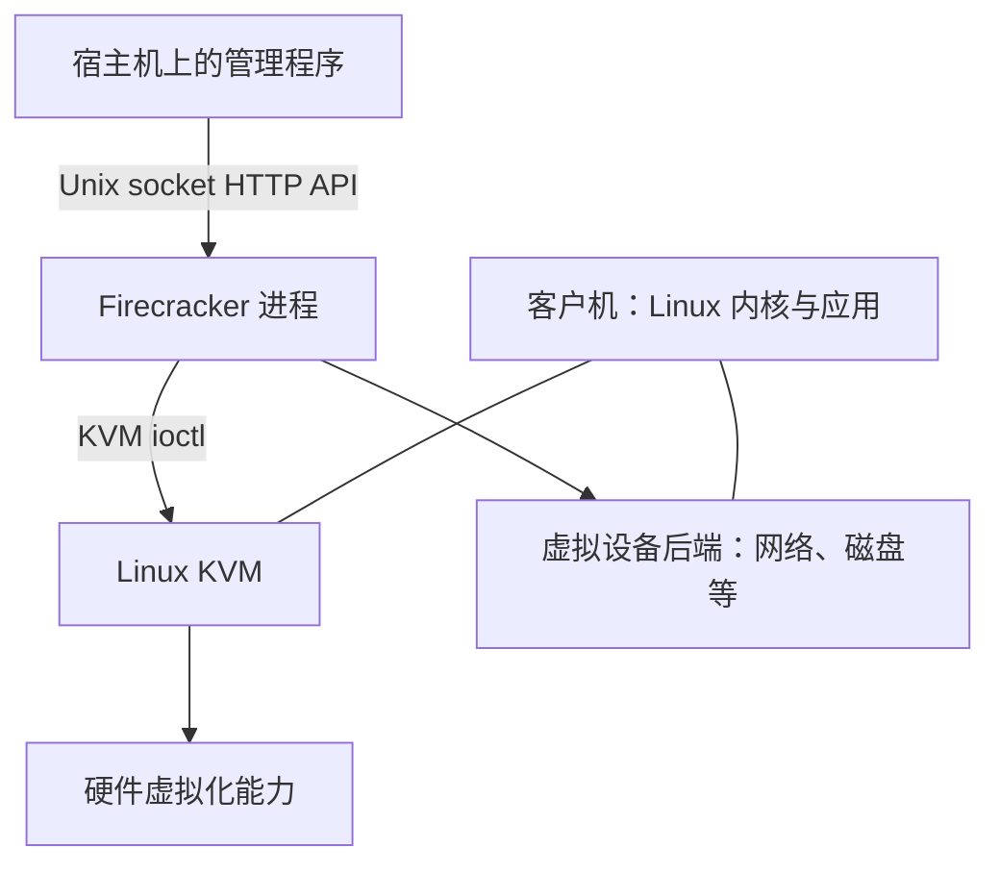

# 专题：虚拟化、KVM 与实验环境

[统一课程](../README.md) · [面试题与答案](../expert-assessment/by-module/README.md)

这是按主题组织的阅读与实验资料；课程模块及考核以总目录为准。


目标：解释 Firecracker 的职责，并确认 Linux 服务器是否具备运行条件。

## 1. 先学基础

**进程与虚拟机。**普通进程由宿主机内核管理。虚拟机内部还有一个客户机内核，它认为自己拥有 CPU、内存和设备。宿主机（host）是运行 Firecracker 的 Linux；客户机（guest）是 microVM 内部的 Linux。

**容器与 microVM。**通常的 Linux 容器通过 namespace 等机制隔离进程视图，并共享宿主机内核。microVM 有自己的客户机内核，利用硬件虚拟化与 KVM 建立隔离边界。两者都依赖正确的宿主机配置，选择时需要同时考虑兼容性、隔离需求、启动时间和运维成本。

**KVM 与 VMM。**KVM 提供创建虚拟机、配置客户机内存、创建 vCPU 和运行客户机的内核接口。VMM 是用户态管理程序，组合这些接口并实现所需设备。Firecracker 是 VMM 的一种实现，一个进程对应一个 microVM。[KVM 官方 API 文档](https://docs.kernel.org/virt/kvm/api.html) 与 [Firecracker 架构](../../../docs/design.md) 分别描述这两层。

**架构与嵌套虚拟化。**x86_64 和 aarch64 是不同的指令集架构。客户机内核、用户态程序和 Firecracker 二进制必须适配运行环境。如果 Linux 服务器本身也是虚拟机，上层虚拟化平台需要提供合适的嵌套虚拟化能力；仅知道“它是 Linux”还不够。

## 2. 资料阅读

| 顺序 | 资料 | 本课只需回答 |
| --- | --- | --- |
| 必读 | [Getting Started：Prerequisites](../../../docs/getting-started.md) | 为什么需要 `/dev/kvm` 的读写权限？ |
| 必读 | [Design：Host Integration / Internal Architecture](../../../docs/design.md) | API、VMM、vCPU 线程各负责什么？ |
| 必读 | [内核支持策略](../../../docs/kernel-policy.md) | 能运行与被该版本官方验证有什么区别？ |
| 选读 | [KVM API：General description](https://docs.kernel.org/virt/kvm/api.html) | VM fd 和 vCPU fd 分别代表什么？ |

## 3. 把组件连起来



这个图表达职责关系，不是实际数据包的逐跳路径。macOS 在本课程中作为阅读和开发工作机；运行实验的位置是 Linux 服务器。[官方运行前提](https://github.com/firecracker-microvm/firecracker/blob/main/docs/getting-started.md) 是 Linux、适配的 CPU 架构与可用 KVM。

## 4. 实验：只读环境检查

以下命令由你在 **Linux 服务器终端**执行。它们读取信息，不安装软件、不调整权限、不改网络。

```bash
uname -srm
cat /etc/os-release
lscpu
id
ls -l /dev/kvm
test -r /dev/kvm && test -w /dev/kvm && echo 'KVM_RW_OK'
free -h
df -h
stat -fc %T /sys/fs/cgroup
```

有 `systemd-detect-virt` 时再运行它，辅助判断宿主环境。缺少某个工具不等于 KVM 不可用。`/dev/kvm` 不存在时检查硬件能力、内核配置与嵌套虚拟化；存在但不可读写时检查用户组、ACL 等权限。不要直接把它设置成所有用户可读写。

`KVM_RW_OK` 只证明当前用户具有设备文件的访问权限，不能证明所有必需的 KVM 能力都存在；镜像与启动模块实际创建和启动 microVM 才是下一层验证。

记录：CPU 架构、发行版、内核版本、是否虚拟机、KVM 权限、内存与磁盘余量、cgroup 模式。选择一个明确版本的 Firecracker，核对该版本支持条件。本课不要求安装或升级服务器系统。

## 5. 验收

- 不看资料，解释宿主机内核、客户机内核、KVM、Firecracker 的关系。
- 判断应选择 x86_64 还是 aarch64 实验资源，并给出依据。
- 把环境检查结论分为“已验证”“仍未知”“阻塞项”，不凭 `/dev/kvm` 存在就宣称环境完全可用。
